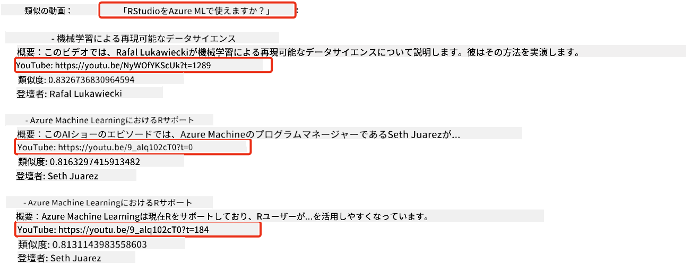
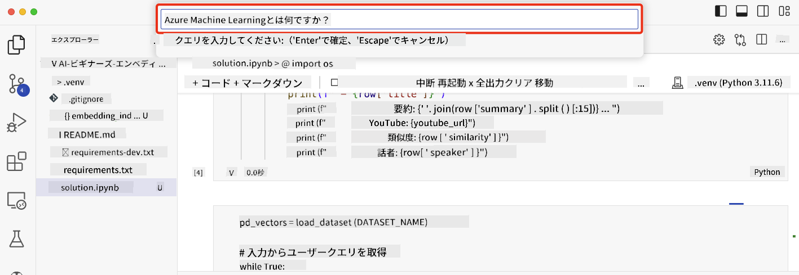

<!--
CO_OP_TRANSLATOR_METADATA:
{
  "original_hash": "58953c08b8ba7073b836d4270ea0fe86",
  "translation_date": "2025-10-17T23:50:04+00:00",
  "source_file": "08-building-search-applications/README.md",
  "language_code": "ja"
}
-->
# 検索アプリケーションの構築

[](https://youtu.be/W0-nzXjOjr0?si=GcsqiTTvd7RKbo7V)

> > _上の画像をクリックして、このレッスンのビデオをご覧ください_

LLM（大規模言語モデル）はチャットボットやテキスト生成だけではありません。埋め込みを使用して検索アプリケーションを構築することも可能です。埋め込みはデータの数値表現であり、ベクトルとも呼ばれ、データの意味検索に使用できます。

このレッスンでは、私たちの教育系スタートアップのための検索アプリケーションを構築します。このスタートアップは、発展途上国の学生に無料の教育を提供する非営利団体です。スタートアップは、学生が質問を入力することでYouTube動画を検索できるアプリケーションを構築したいと考えています。

例えば、学生が「Jupyter Notebookとは何ですか？」や「Azure MLとは何ですか？」と入力すると、検索アプリケーションはその質問に関連するYouTube動画のリストを返します。さらに、検索アプリケーションは質問の答えが含まれる動画の場所へのリンクも返します。

## はじめに

このレッスンでは以下を学びます：

- セマンティック検索とキーワード検索の違い
- テキスト埋め込みとは何か
- テキスト埋め込みインデックスの作成方法
- テキスト埋め込みインデックスの検索方法

## 学習目標

このレッスンを完了すると、以下ができるようになります：

- セマンティック検索とキーワード検索の違いを説明する
- テキスト埋め込みが何であるかを説明する
- 埋め込みを使用してデータを検索するアプリケーションを作成する

## なぜ検索アプリケーションを構築するのか？

検索アプリケーションを作成することで、埋め込みを使用してデータを検索する方法を理解することができます。また、学生が情報を迅速に見つけるために使用できる検索アプリケーションを構築する方法を学ぶことができます。

このレッスンには、Microsoft [AI Show](https://www.youtube.com/playlist?list=PLlrxD0HtieHi0mwteKBOfEeOYf0LJU4O1) YouTubeチャンネルのYouTubeトランスクリプトの埋め込みインデックスが含まれています。AI ShowはAIと機械学習について学べるYouTubeチャンネルです。埋め込みインデックスには、2023年10月までのYouTubeトランスクリプトの埋め込みが含まれています。この埋め込みインデックスを使用して、スタートアップの検索アプリケーションを構築します。検索アプリケーションは、質問の答えが含まれる動画の場所へのリンクを返します。これにより、学生は必要な情報を迅速に見つけることができます。

以下は、「Azure MLでrstudioを使用できますか？」という質問に対するセマンティッククエリの例です。YouTubeのURLを確認すると、質問の答えが含まれる動画の場所に移動するタイムスタンプが含まれていることがわかります。



## セマンティック検索とは？

さて、セマンティック検索とは何か疑問に思うかもしれません。セマンティック検索は、クエリ内の単語の意味を利用して関連する結果を返す検索技術です。

セマンティック検索の例を挙げます。例えば、車を購入したい場合、「私の夢の車」と検索するかもしれません。セマンティック検索は、あなたが車について「夢を見ている」のではなく、理想的な車を購入したいという意図を理解します。セマンティック検索はあなたの意図を理解し、関連する結果を返します。一方、キーワード検索は車についての夢を文字通り検索し、しばしば関連性の低い結果を返します。

## テキスト埋め込みとは？

[テキスト埋め込み](https://en.wikipedia.org/wiki/Word_embedding?WT.mc_id=academic-105485-koreyst)は、[自然言語処理](https://en.wikipedia.org/wiki/Natural_language_processing?WT.mc_id=academic-105485-koreyst)で使用されるテキスト表現技術です。テキスト埋め込みは、テキストの意味を数値で表現したものです。埋め込みは、データを機械が理解しやすい形で表現するために使用されます。テキスト埋め込みを構築するためのモデルは多数ありますが、このレッスンではOpenAI埋め込みモデルを使用して埋め込みを生成することに焦点を当てます。

例を挙げます。以下のテキストがAI Show YouTubeチャンネルのエピソードのトランスクリプトに含まれているとします：

```text
Today we are going to learn about Azure Machine Learning.
```

このテキストをOpenAI埋め込みAPIに渡すと、1536個の数値（ベクトル）からなる埋め込みが返されます。ベクトル内の各数値はテキストの異なる側面を表しています。簡潔にするため、ベクトル内の最初の10個の数値を以下に示します。

```python
[-0.006655829958617687, 0.0026128944009542465, 0.008792596869170666, -0.02446001023054123, -0.008540431968867779, 0.022071078419685364, -0.010703742504119873, 0.003311325330287218, -0.011632772162556648, -0.02187200076878071, ...]
```

## 埋め込みインデックスはどのように作成されるのか？

このレッスンの埋め込みインデックスは、一連のPythonスクリプトを使用して作成されました。スクリプトと手順は、レッスンの「scripts」フォルダ内の[README](./scripts/README.md?WT.mc_id=academic-105485-koreyst)にあります。このレッスンを完了するためにこれらのスクリプトを実行する必要はありません。埋め込みインデックスはすでに提供されています。

スクリプトは以下の操作を実行します：

1. [AI Show](https://www.youtube.com/playlist?list=PLlrxD0HtieHi0mwteKBOfEeOYf0LJU4O1)プレイリスト内の各YouTube動画のトランスクリプトをダウンロードします。
2. [OpenAI Functions](https://learn.microsoft.com/azure/ai-services/openai/how-to/function-calling?WT.mc_id=academic-105485-koreyst)を使用して、YouTubeトランスクリプトの最初の3分間から話者名を抽出しようとします。各動画の話者名は`embedding_index_3m.json`という埋め込みインデックスに保存されます。
3. トランスクリプトテキストは**3分間のテキストセグメント**に分割されます。セグメントには次のセグメントから約20語が重複して含まれ、セグメントの埋め込みが途切れないようにし、より良い検索コンテキストを提供します。
4. 各テキストセグメントはOpenAI Chat APIに渡され、60語に要約されます。この要約も埋め込みインデックス`embedding_index_3m.json`に保存されます。
5. 最後に、セグメントテキストはOpenAI埋め込みAPIに渡されます。埋め込みAPIは、セグメントの意味を表す1536個の数値からなるベクトルを返します。セグメントとOpenAI埋め込みベクトルは埋め込みインデックス`embedding_index_3m.json`に保存されます。

### ベクトルデータベース

レッスンの簡略化のため、埋め込みインデックスは`embedding_index_3m.json`というJSONファイルに保存され、Pandas DataFrameにロードされます。しかし、実際の運用では、埋め込みインデックスは[Azure Cognitive Search](https://learn.microsoft.com/training/modules/improve-search-results-vector-search?WT.mc_id=academic-105485-koreyst)、[Redis](https://cookbook.openai.com/examples/vector_databases/redis/readme?WT.mc_id=academic-105485-koreyst)、[Pinecone](https://cookbook.openai.com/examples/vector_databases/pinecone/readme?WT.mc_id=academic-105485-koreyst)、[Weaviate](https://cookbook.openai.com/examples/vector_databases/weaviate/readme?WT.mc_id=academic-105485-koreyst)などのベクトルデータベースに保存されます。

## コサイン類似度の理解

テキスト埋め込みについて学びましたので、次はテキスト埋め込みを使用してデータを検索し、特にコサイン類似度を使用して特定のクエリに最も類似した埋め込みを見つける方法を学びます。

### コサイン類似度とは？

コサイン類似度は、2つのベクトル間の類似度を測定する方法で、`最近傍検索`とも呼ばれます。コサイン類似度検索を実行するには、OpenAI埋め込みAPIを使用してクエリテキストをベクトル化する必要があります。その後、クエリベクトルと埋め込みインデックス内の各ベクトル間のコサイン類似度を計算します。埋め込みインデックスには、各YouTubeトランスクリプトテキストセグメントのベクトルが含まれています。最後に、コサイン類似度で結果をソートし、最も類似度が高いテキストセグメントがクエリに最も類似しているものとなります。

数学的な観点から見ると、コサイン類似度は多次元空間に投影された2つのベクトル間の角度のコサインを測定します。この測定は有益であり、ユークリッド距離で離れている2つの文書がサイズのために遠く離れていても、それらの間の角度が小さい場合、コサイン類似度が高くなる可能性があります。コサイン類似度の方程式に関する詳細は、[コサイン類似度](https://en.wikipedia.org/wiki/Cosine_similarity?WT.mc_id=academic-105485-koreyst)をご覧ください。

## 初めての検索アプリケーションの構築

次に、埋め込みを使用して検索アプリケーションを構築する方法を学びます。この検索アプリケーションでは、学生が質問を入力することで動画を検索できます。検索アプリケーションは質問に関連する動画のリストを返します。また、質問の答えが含まれる動画の場所へのリンクも返します。

このソリューションは、Windows 11、macOS、Ubuntu 22.04でPython 3.10以降を使用して構築およびテストされました。Pythonは[python.org](https://www.python.org/downloads/?WT.mc_id=academic-105485-koreyst)からダウンロードできます。

## 課題 - 学生が利用できる検索アプリケーションの構築

このレッスンの冒頭でスタートアップについて紹介しました。今度は学生が評価のために検索アプリケーションを構築できるようにします。

この課題では、検索アプリケーションを構築するために使用するAzure OpenAI Servicesを作成します。以下のAzure OpenAI Servicesを作成します。この課題を完了するにはAzureサブスクリプションが必要です。

### Azure Cloud Shellの開始

1. [Azureポータル](https://portal.azure.com/?WT.mc_id=academic-105485-koreyst)にサインインします。
2. Azureポータルの右上にあるCloud Shellアイコンを選択します。
3. 環境タイプとして**Bash**を選択します。

#### リソースグループの作成

> これらの手順では、East USにある「semantic-video-search」という名前のリソースグループを使用しています。
> リソースグループの名前を変更することはできますが、リソースの場所を変更する際には、
> [モデルの利用可能性表](https://aka.ms/oai/models?WT.mc_id=academic-105485-koreyst)を確認してください。

```shell
az group create --name semantic-video-search --location eastus
```

#### Azure OpenAI Serviceリソースの作成

Azure Cloud Shellから以下のコマンドを実行してAzure OpenAI Serviceリソースを作成します。

```shell
az cognitiveservices account create --name semantic-video-openai --resource-group semantic-video-search \
    --location eastus --kind OpenAI --sku s0
```

#### このアプリケーションで使用するエンドポイントとキーの取得

Azure Cloud Shellから以下のコマンドを実行してAzure OpenAI Serviceリソースのエンドポイントとキーを取得します。

```shell
az cognitiveservices account show --name semantic-video-openai \
   --resource-group  semantic-video-search | jq -r .properties.endpoint
az cognitiveservices account keys list --name semantic-video-openai \
   --resource-group semantic-video-search | jq -r .key1
```

#### OpenAI埋め込みモデルのデプロイ

Azure Cloud Shellから以下のコマンドを実行してOpenAI埋め込みモデルをデプロイします。

```shell
az cognitiveservices account deployment create \
    --name semantic-video-openai \
    --resource-group  semantic-video-search \
    --deployment-name text-embedding-ada-002 \
    --model-name text-embedding-ada-002 \
    --model-version "2"  \
    --model-format OpenAI \
    --sku-capacity 100 --sku-name "Standard"
```

## ソリューション

GitHub Codespacesで[ソリューションノートブック](./python/aoai-solution.ipynb?WT.mc_id=academic-105485-koreyst)を開き、Jupyter Notebookの指示に従ってください。

ノートブックを実行すると、クエリを入力するよう求められます。入力ボックスは以下のように表示されます：



## 素晴らしい仕事！学習を続けましょう

このレッスンを完了した後は、[生成AI学習コレクション](https://aka.ms/genai-collection?WT.mc_id=academic-105485-koreyst)をチェックして、生成AIの知識をさらに深めてください！

次のレッスン9では、[画像生成アプリケーションの構築](../09-building-image-applications/README.md?WT.mc_id=academic-105485-koreyst)について学びます！

---

**免責事項**:  
この文書はAI翻訳サービス[Co-op Translator](https://github.com/Azure/co-op-translator)を使用して翻訳されています。正確性を追求しておりますが、自動翻訳には誤りや不正確な部分が含まれる可能性があります。元の言語で記載された文書を正式な情報源としてご参照ください。重要な情報については、専門の人間による翻訳を推奨します。この翻訳の利用に起因する誤解や誤認について、当方は一切の責任を負いません。