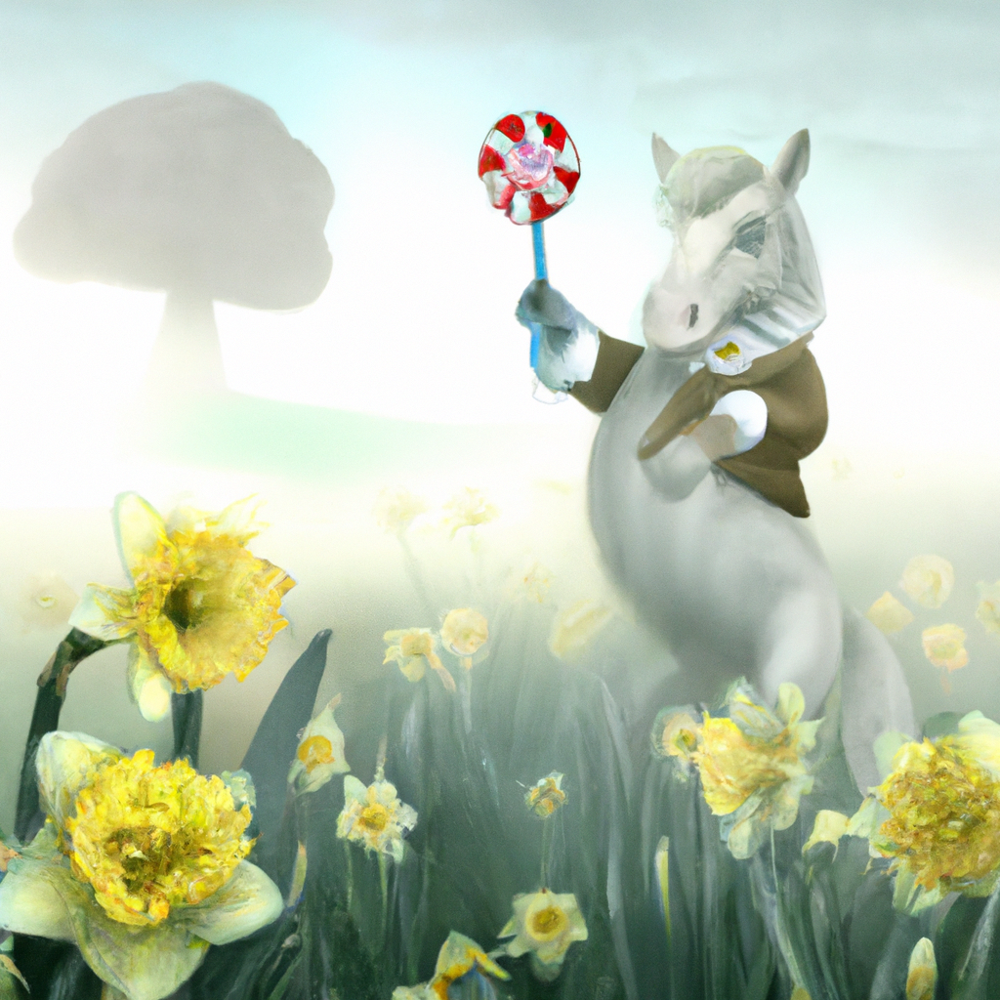

<!--
CO_OP_TRANSLATOR_METADATA:
{
  "original_hash": "1a7fd0f95f9eb673b79da47c0814f4d4",
  "translation_date": "2025-07-09T13:19:10+00:00",
  "source_file": "09-building-image-applications/README.md",
  "language_code": "ja"
}
-->
# 画像生成アプリケーションの構築

[](https://aka.ms/gen-ai-lesson9-gh?WT.mc_id=academic-105485-koreyst)

LLMはテキスト生成だけではありません。テキストの説明から画像を生成することも可能です。画像をモダリティとして扱うことは、MedTech、建築、観光、ゲーム開発など多くの分野で非常に役立ちます。この章では、最も人気のある画像生成モデルであるDALL-EとMidjourneyについて見ていきます。

## はじめに

このレッスンでは以下を扱います：

- 画像生成とは何か、そしてその有用性。
- DALL-EとMidjourneyとは何か、それらの仕組み。
- 画像生成アプリケーションの作り方。

## 学習目標

このレッスンを終えた後、あなたは以下ができるようになります：

- 画像生成アプリケーションを構築する。
- メタプロンプトを使ってアプリケーションの境界を定義する。
- DALL-EとMidjourneyを使いこなす。

## なぜ画像生成アプリケーションを作るのか？

画像生成アプリケーションは、生成AIの能力を探求するのに最適な方法です。例えば以下の用途があります：

- **画像編集と合成**。画像編集や画像合成など、さまざまな用途に画像を生成できます。

- **多様な業界への応用**。MedTech、観光、ゲーム開発など、多くの業界で画像生成が活用されています。

## シナリオ：Edu4All

このレッスンの一環として、スタートアップのEdu4Allと引き続き取り組みます。学生たちは評価のために画像を作成します。どんな画像にするかは学生次第ですが、自分たちの童話のイラストを描いたり、物語の新しいキャラクターを作ったり、アイデアやコンセプトの視覚化に役立てたりできます。

例えば、Edu4Allの学生が授業で記念碑について学んでいる場合、以下のような画像を生成できます：


プロンプト例：

> 「早朝の陽光の中、エッフェル塔の隣にいる犬」

## DALL-EとMidjourneyとは？

[DALL-E](https://openai.com/dall-e-2?WT.mc_id=academic-105485-koreyst)と[Midjourney](https://www.midjourney.com/?WT.mc_id=academic-105485-koreyst)は、最も人気のある画像生成モデルの2つで、プロンプトを使って画像を生成できます。

### DALL-E

まずDALL-Eから始めましょう。DALL-Eはテキストの説明から画像を生成する生成AIモデルです。

> [DALL-EはCLIPとdiffused attentionという2つのモデルの組み合わせです](https://towardsdatascience.com/openais-dall-e-and-clip-101-a-brief-introduction-3a4367280d4e?WT.mc_id=academic-105485-koreyst)。

- **CLIP**は、画像とテキストからデータの数値表現（埋め込み）を生成するモデルです。

- **Diffused attention**は、その埋め込みから画像を生成するモデルです。DALL-Eは画像とテキストのデータセットで訓練されており、テキストの説明から画像を生成できます。例えば、帽子をかぶった猫やモヒカンの犬の画像を生成できます。

### Midjourney

MidjourneyもDALL-Eと同様に、テキストプロンプトから画像を生成します。Midjourneyは「帽子をかぶった猫」や「モヒカンの犬」といったプロンプトで画像を生成できます。

  
_画像提供：Wikipedia、Midjourneyによる生成画像_

## DALL-EとMidjourneyの仕組み

まず[DALL-E](https://arxiv.org/pdf/2102.12092.pdf?WT.mc_id=academic-105485-koreyst)について。DALL-Eはトランスフォーマーアーキテクチャに基づく生成AIモデルで、_自己回帰型トランスフォーマー_を採用しています。

_自己回帰型トランスフォーマー_は、テキストの説明から画像を生成する方法を定義しており、1ピクセルずつ生成し、生成したピクセルを使って次のピクセルを生成します。ニューラルネットワークの複数の層を通過しながら画像が完成します。

このプロセスにより、DALL-Eは生成する画像の属性やオブジェクト、特徴などを制御できます。ただし、DALL-E 2や3では生成画像の制御がさらに強化されています。

## 最初の画像生成アプリケーションを作る

画像生成アプリケーションを作るには何が必要でしょうか？以下のライブラリが必要です：

- **python-dotenv**：秘密情報をコードから分離して_.env_ファイルに保存するために推奨されます。
- **openai**：OpenAI APIとやり取りするためのライブラリです。
- **pillow**：Pythonで画像を扱うためのライブラリです。
- **requests**：HTTPリクエストを送るのに役立ちます。

1. _.env_ファイルを作成し、以下の内容を記述します：

   ```text
   AZURE_OPENAI_ENDPOINT=<your endpoint>
   AZURE_OPENAI_API_KEY=<your key>
   ```

   Azureポータルの「Keys and Endpoint」セクションでこの情報を確認してください。

1. 上記のライブラリを_requirements.txt_ファイルにまとめます：

   ```text
   python-dotenv
   openai
   pillow
   requests
   ```

1. 次に、仮想環境を作成し、ライブラリをインストールします：

   ```bash
   python3 -m venv venv
   source venv/bin/activate
   pip install -r requirements.txt
   ```

   Windowsの場合は以下のコマンドで仮想環境を作成・有効化します：

   ```bash
   python3 -m venv venv
   venv\Scripts\activate.bat
   ```

1. _app.py_というファイルに以下のコードを追加します：

   ```python
   import openai
   import os
   import requests
   from PIL import Image
   import dotenv

   # import dotenv
   dotenv.load_dotenv()

   # Get endpoint and key from environment variables
   openai.api_base = os.environ['AZURE_OPENAI_ENDPOINT']
   openai.api_key = os.environ['AZURE_OPENAI_API_KEY']

   # Assign the API version (DALL-E is currently supported for the 2023-06-01-preview API version only)
   openai.api_version = '2023-06-01-preview'
   openai.api_type = 'azure'


   try:
       # Create an image by using the image generation API
       generation_response = openai.Image.create(
           prompt='Bunny on horse, holding a lollipop, on a foggy meadow where it grows daffodils',    # Enter your prompt text here
           size='1024x1024',
           n=2,
           temperature=0,
       )
       # Set the directory for the stored image
       image_dir = os.path.join(os.curdir, 'images')

       # If the directory doesn't exist, create it
       if not os.path.isdir(image_dir):
           os.mkdir(image_dir)

       # Initialize the image path (note the filetype should be png)
       image_path = os.path.join(image_dir, 'generated-image.png')

       # Retrieve the generated image
       image_url = generation_response["data"][0]["url"]  # extract image URL from response
       generated_image = requests.get(image_url).content  # download the image
       with open(image_path, "wb") as image_file:
           image_file.write(generated_image)

       # Display the image in the default image viewer
       image = Image.open(image_path)
       image.show()

   # catch exceptions
   except openai.InvalidRequestError as err:
       print(err)

   ```

このコードを説明します：

- まず、必要なライブラリをインポートします。OpenAIライブラリ、dotenvライブラリ、requestsライブラリ、Pillowライブラリを含みます。

  ```python
  import openai
  import os
  import requests
  from PIL import Image
  import dotenv
  ```

- 次に、_.env_ファイルから環境変数を読み込みます。

  ```python
  # import dotenv
  dotenv.load_dotenv()
  ```

- その後、OpenAI APIのエンドポイント、キー、バージョン、タイプを設定します。

  ```python
  # Get endpoint and key from environment variables
  openai.api_base = os.environ['AZURE_OPENAI_ENDPOINT']
  openai.api_key = os.environ['AZURE_OPENAI_API_KEY']

  # add version and type, Azure specific
  openai.api_version = '2023-06-01-preview'
  openai.api_type = 'azure'
  ```

- 次に、画像を生成します：

  ```python
  # Create an image by using the image generation API
  generation_response = openai.Image.create(
      prompt='Bunny on horse, holding a lollipop, on a foggy meadow where it grows daffodils',    # Enter your prompt text here
      size='1024x1024',
      n=2,
      temperature=0,
  )
  ```

  上記のコードは生成された画像のURLを含むJSONオブジェクトを返します。このURLを使って画像をダウンロードし、ファイルに保存できます。

- 最後に、画像を開いて標準の画像ビューアで表示します：

  ```python
  image = Image.open(image_path)
  image.show()
  ```

### 画像生成の詳細

画像を生成するコードを詳しく見てみましょう：

```python
generation_response = openai.Image.create(
        prompt='Bunny on horse, holding a lollipop, on a foggy meadow where it grows daffodils',    # Enter your prompt text here
        size='1024x1024',
        n=2,
        temperature=0,
    )
```

- **prompt** は画像生成に使うテキストプロンプトです。ここでは「霧のかかった水仙の咲く草原で、ロリポップを持った馬の上のウサギ」を使っています。
- **size** は生成する画像のサイズです。ここでは1024x1024ピクセルの画像を生成します。
- **n** は生成する画像の枚数です。ここでは2枚生成します。
- **temperature** は生成AIモデルの出力のランダム性を制御するパラメーターです。0から1の値で、0は決定的な出力、1はランダムな出力を意味します。デフォルトは0.7です。

次のセクションで、画像に関してさらにできることを紹介します。

## 画像生成の追加機能

これまでPythonの数行で画像を生成できることを見てきましたが、画像に関してはさらに多くのことが可能です。

以下のこともできます：

- **編集を行う**。既存の画像にマスクとプロンプトを与えることで、画像を変更できます。例えば、画像の一部に何かを追加できます。先ほどのウサギの画像に帽子をかぶせることができます。方法は、画像、変更部分を示すマスク、そして何をするかを示すテキストプロンプトを提供することです。

  ```python
  response = openai.Image.create_edit(
    image=open("base_image.png", "rb"),
    mask=open("mask.png", "rb"),
    prompt="An image of a rabbit with a hat on its head.",
    n=1,
    size="1024x1024"
  )
  image_url = response['data'][0]['url']
  ```

  元の画像はウサギだけですが、最終的な画像にはウサギに帽子がかぶせられています。

- **バリエーションを作成する**。既存の画像を使ってバリエーションを作成できます。バリエーションを作るには、画像とテキストプロンプトを提供し、以下のようにコードを書きます：

  ```python
  response = openai.Image.create_variation(
    image=open("bunny-lollipop.png", "rb"),
    n=1,
    size="1024x1024"
  )
  image_url = response['data'][0]['url']
  ```

  > 注意：これはOpenAIでのみサポートされています。

## Temperature（温度）について

Temperatureは生成AIモデルの出力のランダム性を制御するパラメーターです。0から1の値で、0は決定的な出力、1はランダムな出力を意味します。デフォルトは0.7です。

Temperatureの動作例として、以下のプロンプトを2回実行してみましょう：

> プロンプト：「霧のかかった水仙の咲く草原で、ロリポップを持った馬の上のウサギ」


同じプロンプトをもう一度実行して、同じ画像が生成されないことを確認します：



ご覧の通り、画像は似ていますが同じではありません。次にtemperatureの値を0.1に変えてみましょう：

```python
 generation_response = openai.Image.create(
        prompt='Bunny on horse, holding a lollipop, on a foggy meadow where it grows daffodils',    # Enter your prompt text here
        size='1024x1024',
        n=2
    )
```

### Temperatureの変更

より決定的な応答にしたい場合、先ほど生成した2枚の画像を見て、1枚目にはウサギがいて2枚目には馬がいるなど、画像が大きく異なることがわかります。

そこで、temperatureを0に設定してみましょう：

```python
generation_response = openai.Image.create(
        prompt='Bunny on horse, holding a lollipop, on a foggy meadow where it grows daffodils',    # Enter your prompt text here
        size='1024x1024',
        n=2,
        temperature=0
    )
```

このコードを実行すると、以下の2枚の画像が得られます：

- 
- 

ここでは画像同士の類似度が明らかに高くなっているのがわかります。

## メタプロンプトでアプリケーションの境界を定義する方法

デモではすでにクライアント向けに画像を生成できますが、アプリケーションの境界を設定する必要があります。

例えば、不適切な画像や子どもにふさわしくない画像を生成したくありません。

これを実現するのが_メタプロンプト_です。メタプロンプトは生成AIモデルの出力を制御するためのテキストプロンプトです。例えば、生成される画像が安全であることや子どもに適していることを保証するために使えます。

### 仕組みは？

メタプロンプトは生成AIモデルの出力を制御するためのテキストプロンプトで、通常のテキストプロンプトの前に配置されます。モデルの出力を制御し、アプリケーションに組み込まれて使われます。プロンプト入力とメタプロンプト入力を1つのテキストプロンプトにまとめる形です。

メタプロンプトの例は以下の通りです：

```text
You are an assistant designer that creates images for children.

The image needs to be safe for work and appropriate for children.

The image needs to be in color.

The image needs to be in landscape orientation.

The image needs to be in a 16:9 aspect ratio.

Do not consider any input from the following that is not safe for work or appropriate for children.

(Input)

```

では、デモでメタプロンプトをどのように使うか見てみましょう。

```python
disallow_list = "swords, violence, blood, gore, nudity, sexual content, adult content, adult themes, adult language, adult humor, adult jokes, adult situations, adult"

meta_prompt =f"""You are an assistant designer that creates images for children.

The image needs to be safe for work and appropriate for children.

The image needs to be in color.

The image needs to be in landscape orientation.

The image needs to be in a 16:9 aspect ratio.

Do not consider any input from the following that is not safe for work or appropriate for children.
{disallow_list}
"""

prompt = f"{meta_prompt}
Create an image of a bunny on a horse, holding a lollipop"

# TODO add request to generate image
```

上記のプロンプトから、生成されるすべての画像がメタプロンプトを考慮していることがわかります。

## 課題 - 学生に画像生成を体験させよう

このレッスンの冒頭で紹介したEdu4Allに戻ります。今度は学生たちが評価のために画像を生成できるようにします。

学生たちは記念碑を含む画像を作成します。どの記念碑にするかは学生の自由です。学生たちは創造力を発揮して、これらの記念碑をさまざまな文脈に置くことが求められます。

## 解答例

以下は一例です：

```python
import openai
import os
import requests
from PIL import Image
import dotenv

# import dotenv
dotenv.load_dotenv()

# Get endpoint and key from environment variables
openai.api_base = "<replace with endpoint>"
openai.api_key = "<replace with api key>"

# Assign the API version (DALL-E is currently supported for the 2023-06-01-preview API version only)
openai.api_version = '2023-06-01-preview'
openai.api_type = 'azure'

disallow_list = "swords, violence, blood, gore, nudity, sexual content, adult content, adult themes, adult language, adult humor, adult jokes, adult situations, adult"

meta_prompt = f"""You are an assistant designer that creates images for children.

The image needs to be safe for work and appropriate for children.

The image needs to be in color.

The image needs to be in landscape orientation.

The image needs to be in a 16:9 aspect ratio.

Do not consider any input from the following that is not safe for work or appropriate for children.
{disallow_list}"""

prompt = f"""{meta_prompt}
Generate monument of the Arc of Triumph in Paris, France, in the evening light with a small child holding a Teddy looks on.
""""

try:
    # Create an image by using the image generation API
    generation_response = openai.Image.create(
        prompt=prompt,    # Enter your prompt text here
        size='1024x1024',
        n=2,
        temperature=0,
    )
    # Set the directory for the stored image
    image_dir = os.path.join(os.curdir, 'images')

    # If the directory doesn't exist, create it
    if not os.path.isdir(image_dir):
        os.mkdir(image_dir)

    # Initialize the image path (note the filetype should be png)
    image_path = os.path.join(image_dir, 'generated-image.png')

    # Retrieve the generated image
    image_url = generation_response["data"][0]["url"]  # extract image URL from response
    generated_image = requests.get(image_url).content  # download the image
    with open(image_path, "wb") as image_file:
        image_file.write(generated_image)

    # Display the image in the default image viewer
    image = Image.open(image_path)
    image.show()

# catch exceptions
except openai.InvalidRequestError as err:
    print(err)
```

## よくできました！学習を続けましょう

このレッスンを終えたら、[Generative AI Learning collection](https://aka.ms/genai-collection?WT.mc_id=academic-105485-koreyst)で生成AIの知識をさらに深めましょう！

次のレッスン10では、[ローコードでAIアプリケーションを構築する方法](../10-building-low-code-ai-applications/README.md?WT.mc_id=academic-105485-koreyst)を学びます。

**免責事項**：  
本書類はAI翻訳サービス「[Co-op Translator](https://github.com/Azure/co-op-translator)」を使用して翻訳されました。正確性の向上に努めておりますが、自動翻訳には誤りや不正確な部分が含まれる可能性があります。原文の言語による文書が正式な情報源とみなされるべきです。重要な情報については、専門の人間による翻訳を推奨します。本翻訳の利用により生じたいかなる誤解や誤訳についても、当方は責任を負いかねます。