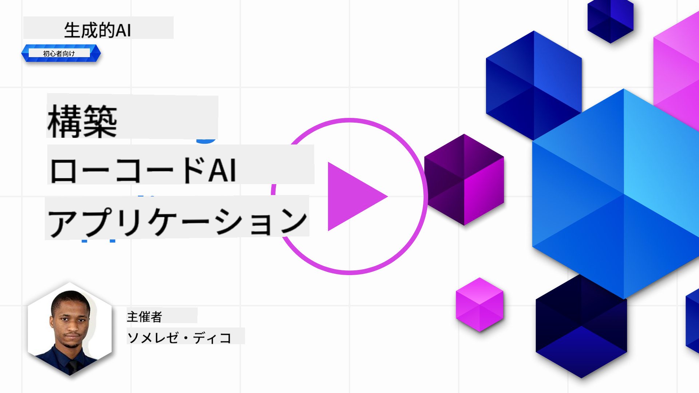
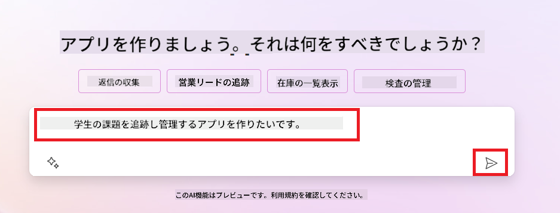
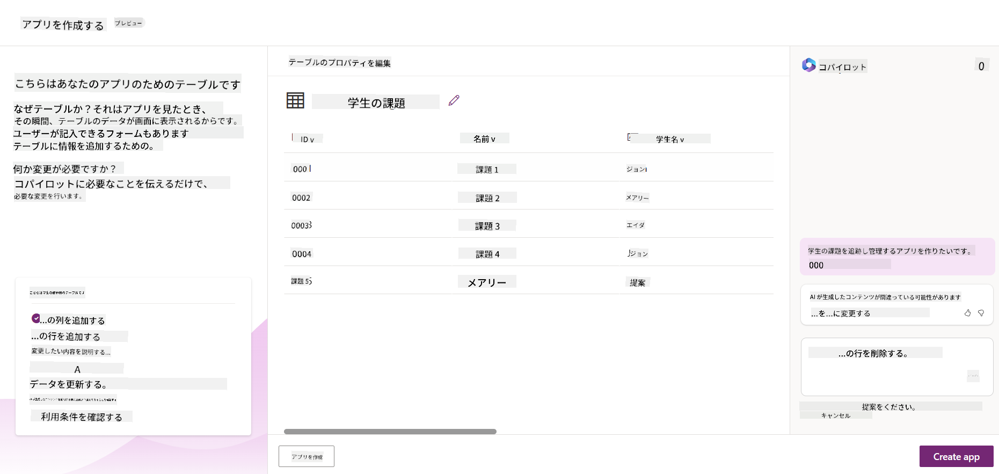
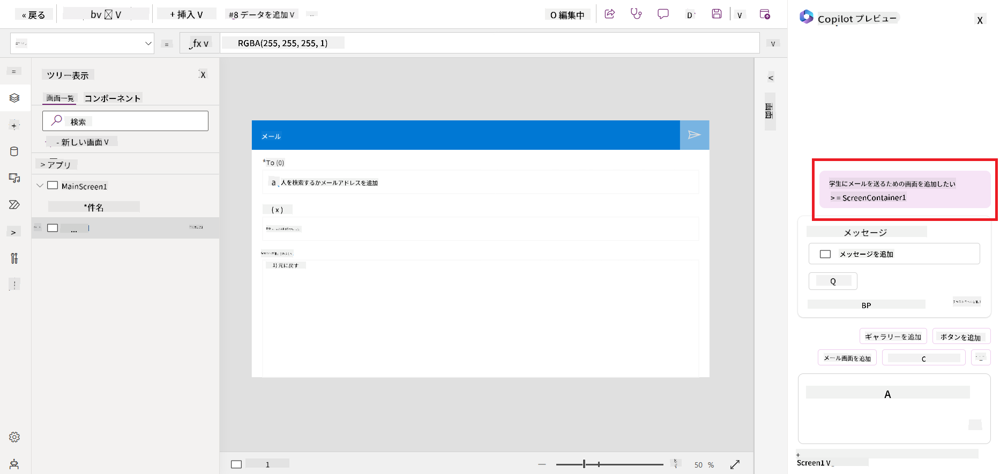
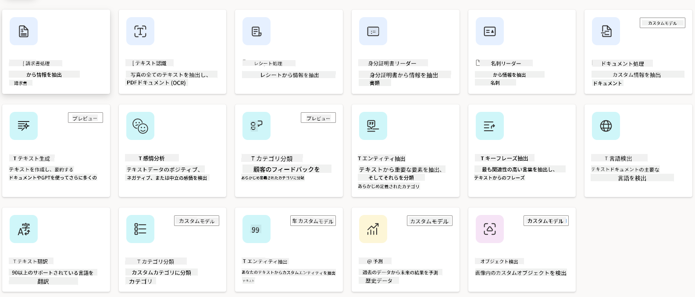
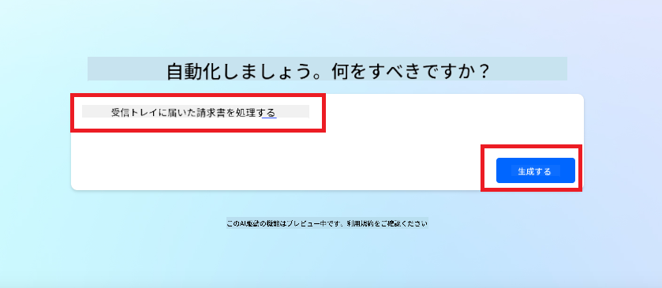
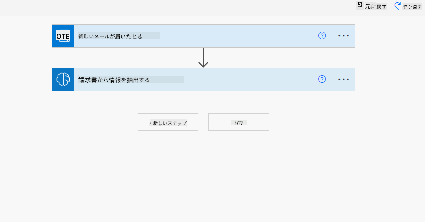
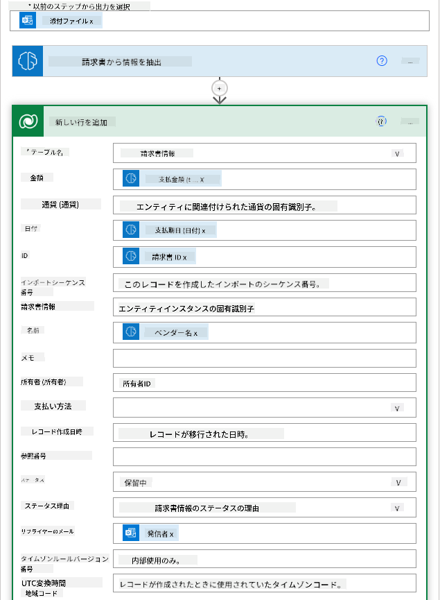
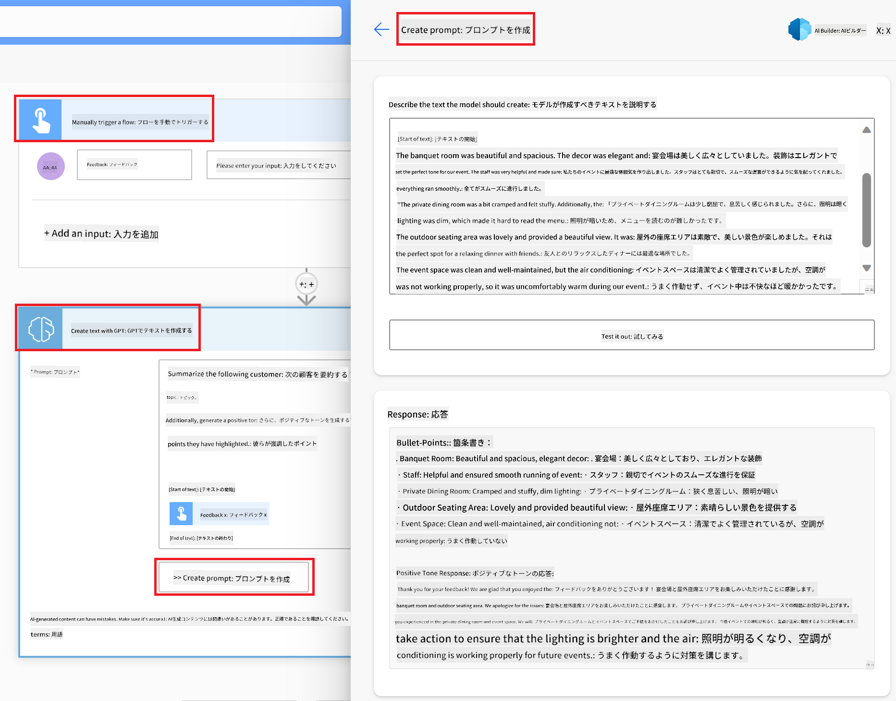

<!--
CO_OP_TRANSLATOR_METADATA:
{
  "original_hash": "f5ff3b6204a695a117d6f452403c95f7",
  "translation_date": "2025-06-25T18:13:05+00:00",
  "source_file": "10-building-low-code-ai-applications/README.md",
  "language_code": "ja"
}
-->
# ローコードAIアプリケーションの構築

> _(上の画像をクリックして、このレッスンのビデオをご覧ください)_

## はじめに

画像生成アプリケーションの構築方法を学んだところで、ローコードについて話しましょう。生成AIはローコードを含むさまざまな領域で利用できますが、ローコードとは何で、どうやってAIを追加できるのでしょうか？

ローコード開発プラットフォームの利用により、従来の開発者や非開発者でもアプリやソリューションの構築が容易になりました。ローコード開発プラットフォームは、ほとんどコードを書かずにアプリやソリューションを構築できる環境を提供します。これにより、視覚的な開発環境を提供し、コンポーネントをドラッグ＆ドロップしてアプリやソリューションを構築できます。これにより、アプリやソリューションを迅速に構築し、リソースを節約できます。このレッスンでは、ローコードの使用方法と、Power Platformを使用してAIでローコード開発を強化する方法について詳しく説明します。

Power Platformは、直感的なローコードまたはノーコード環境を通じて、チームが独自のソリューションを構築する力を与える機会を提供します。この環境は、ソリューションの構築プロセスを簡素化します。Power Platformを使用すると、ソリューションは数日や数週間で構築でき、数ヶ月や数年かかることはありません。Power Platformは、Power Apps、Power Automate、Power BI、Power Pages、Copilot Studioの5つの主要な製品で構成されています。

このレッスンでは以下を取り上げます：

- Power Platformにおける生成AIの紹介
- Copilotの紹介とその使用方法
- Power Platformで生成AIを使用してアプリやフローを構築する方法
- AI Builderを使用してPower PlatformのAIモデルを理解する

## 学習目標

このレッスンの終わりまでに、次のことができるようになります：

- Power PlatformでのCopilotの動作を理解する。

- 教育系スタートアップ向けの学生課題トラッカーアプリを構築する。

- 請求書から情報を抽出するAIを使用した請求書処理フローを構築する。

- GPT AIモデルでテキストを作成する際のベストプラクティスを適用する。

このレッスンで使用するツールと技術は次のとおりです：

- **Power Apps**: 学生課題トラッカーアプリ用で、データを追跡、管理、操作するためのアプリを構築するためのローコード開発環境を提供します。

- **Dataverse**: 学生課題トラッカーアプリのデータを保存するために使用され、アプリのデータを保存するためのローコードデータプラットフォームを提供します。

- **Power Automate**: 請求書処理フロー用で、請求書処理プロセスを自動化するためのワークフローを構築するためのローコード開発環境を提供します。

- **AI Builder**: スタートアップの請求書を処理するための事前構築されたAIモデルを使用します。

## Power Platformにおける生成AI

生成AIを用いてローコード開発とアプリケーションを強化することは、Power Platformの重要な焦点領域です。データサイエンスの専門知識を必要とせずに、AI駆動のアプリ、サイト、ダッシュボードを構築し、プロセスを自動化できるようにすることが目標です。この目標は、CopilotとAI Builderの形でPower Platformのローコード開発体験に生成AIを統合することで達成されます。

### これはどのように機能するのか？

Copilotは、自然言語を使用した一連の対話的なステップで要件を説明することにより、Power Platformソリューションを構築するAIアシスタントです。例えば、アプリで使用するフィールドを指定すると、それに基づいてアプリと基盤となるデータモデルを作成したり、Power Automateでフローを設定する方法を指定することができます。

Copilot駆動の機能をアプリ画面の機能として使用し、ユーザーが対話的なインタラクションを通じてインサイトを発見できるようにします。

AI Builderは、プロセスを自動化し結果を予測するためにAIモデルを使用することができるPower PlatformのローコードAI機能です。AI Builderを使用すると、DataverseやSharePoint、OneDrive、Azureなどのさまざまなクラウドデータソースに接続するアプリやフローにAIを組み込むことができます。

Copilotは、Power Platformのすべての製品で利用可能です：Power Apps、Power Automate、Power BI、Power Pages、Power Virtual Agents。AI Builderは、Power AppsとPower Automateで利用可能です。このレッスンでは、教育系スタートアップのソリューションを構築するために、Power AppsとPower AutomateでCopilotとAI Builderを使用する方法に焦点を当てます。

### Power AppsにおけるCopilot

Power Platformの一部として、Power Appsはデータを追跡、管理、操作するためのアプリを構築するためのローコード開発環境を提供します。スケーラブルなデータプラットフォームとクラウドサービスやオンプレミスデータへの接続能力を備えたアプリ開発サービスのスイートです。Power Appsを使用すると、ブラウザ、タブレット、スマートフォンで動作するアプリを構築し、同僚と共有することができます。Power Appsはシンプルなインターフェースでユーザーをアプリ開発に導き、ビジネスユーザーやプロ開発者がカスタムアプリを構築できるようにします。アプリ開発体験はCopilotによる生成AIで強化されます。

Power AppsのCopilot AIアシスタント機能を使用すると、必要なアプリの種類やアプリが追跡、収集、表示したい情報を説明できます。Copilotはその説明に基づいてレスポンシブなキャンバスアプリを生成します。その後、ニーズに合わせてアプリをカスタマイズできます。AI Copilotは、追跡したいデータを保存するために必要なフィールドを含むDataverseテーブルを生成し、サンプルデータも提供します。このレッスンでは、Dataverseとは何か、Power Appsでどのように使用できるかについて後ほど説明します。その後、会話型ステップを通じてAI Copilotアシスタント機能を使用してテーブルをカスタマイズできます。この機能はPower Appsのホーム画面から簡単に利用できます。

### Power AutomateにおけるCopilot

Power Platformの一部として、Power Automateはアプリケーションとサービス間の自動化ワークフローを作成することができます。コミュニケーション、データ収集、承認などの反復的なビジネスプロセスを自動化するのに役立ちます。簡単なインターフェースにより、初心者から経験豊富な開発者まで、あらゆる技術スキルを持つユーザーが業務タスクを自動化できます。ワークフロー開発体験はCopilotによる生成AIで強化されます。

Power AutomateのCopilot AIアシスタント機能を使用すると、必要なフローの種類やフローが実行するアクションを説明できます。Copilotはその説明に基づいてフローを生成します。その後、ニーズに合わせてフローをカスタマイズできます。AI Copilotは、自動化したいタスクを実行するために必要なアクションを生成し提案します。このレッスンでは、フローとは何か、Power Automateでどのように使用できるかについて後ほど説明します。その後、会話型ステップを通じてAI Copilotアシスタント機能を使用してアクションをカスタマイズできます。この機能はPower Automateのホーム画面から簡単に利用できます。

## 課題：Copilotを使用してスタートアップの学生課題と請求書を管理する

私たちのスタートアップは学生にオンラインコースを提供しています。スタートアップは急速に成長し、コースの需要に追いつくのが難しくなっています。スタートアップはPower Platform開発者としてあなたを雇い、学生の課題と請求書を管理するためのローコードソリューションを構築する手助けを求めています。彼らのソリューションは、アプリを通じて学生の課題を追跡し管理し、ワークフローを通じて請求書処理プロセスを自動化できる必要があります。あなたは生成AIを使用してソリューションを開発するよう求められています。

Copilotの使用を始める際には、[Power Platform Copilot Prompt Library](https://github.com/pnp/powerplatform-prompts?WT.mc_id=academic-109639-somelezediko)を利用してプロンプトを始めることができます。このライブラリには、Copilotを使用してアプリやフローを構築するためのプロンプトのリストが含まれています。ライブラリのプロンプトを使用して、Copilotに対する要件の説明方法を学ぶこともできます。

### スタートアップのための学生課題トラッカーアプリを構築する

スタートアップの教育者は学生課題の追跡に苦労しています。彼らはスプレッドシートを使用して課題を追跡していましたが、学生の数が増えるにつれて管理が難しくなっています。彼らは課題を追跡し管理するためのアプリを構築するよう求めています。アプリは新しい課題の追加、課題の表示、課題の更新、課題の削除を可能にし、教育者と学生が評価済みの課題と未評価の課題を表示できるようにする必要があります。

以下の手順でPower AppsのCopilotを使用してアプリを構築します：

1. [Power Apps](https://make.powerapps.com?WT.mc_id=academic-105485-koreyst)のホーム画面に移動します。

1. ホーム画面のテキストエリアを使用して構築したいアプリを説明します。例えば、**_学生課題を追跡し管理するアプリを構築したい_**。プロンプトをAI Copilotに送信するには、**送信**ボタンをクリックします。

1. AI Copilotは、追跡したいデータを保存するために必要なフィールドを含むDataverseテーブルとサンプルデータを提案します。その後、会話型ステップを通じてAI Copilotアシスタント機能を使用してテーブルをカスタマイズできます。

   > **重要**: DataverseはPower Platformの基盤となるデータプラットフォームです。アプリのデータを保存するためのローコードデータプラットフォームです。Microsoft Cloud内でデータを安全に保存する完全管理サービスであり、Power Platform環境内でプロビジョニングされます。データ分類、データ系統、きめ細かいアクセス制御などの組み込みのデータガバナンス機能を備えています。Dataverseについて詳しくは[こちら](https://docs.microsoft.com/powerapps/maker/data-platform/data-platform-intro?WT.mc_id=academic-109639-somelezediko)をご覧ください。

   

1. 教育者は課題を提出した学生にメールを送信し、課題の進捗状況を更新したいと考えています。Copilotを使用してテーブルに新しいフィールドを追加し、学生のメールを保存することができます。例えば、次のプロンプトを使用してテーブルに新しいフィールドを追加できます：**_学生のメールを保存する列を追加したい_**。プロンプトをAI Copilotに送信するには、**送信**ボタンをクリックします。

1. AI Copilotは新しいフィールドを生成し、その後ニーズに合わせてフィールドをカスタマイズできます。

1. テーブルが完成したら、**アプリを作成**ボタンをクリックしてアプリを作成します。

1. AI Copilotは説明に基づいてレスポンシブなキャンバスアプリを生成します。その後、ニーズに合わせてアプリをカスタマイズできます。

1. 教育者が学生にメールを送信するために、Copilotを使用してアプリに新しい画面を追加できます。例えば、次のプロンプトを使用してアプリに新しい画面を追加できます：**_学生にメールを送信する画面を追加したい_**。プロンプトをAI Copilotに送信するには、**送信**ボタンをクリックします。

1. AI Copilotは新しい画面を生成し、その後ニーズに合わせて画面をカスタマイズできます。

1. アプリが完成したら、**保存**ボタンをクリックしてアプリを保存します。

1. アプリを教育者と共有するには、**共有**ボタンをクリックし、もう一度**共有**ボタンをクリックします。教育者のメールアドレスを入力してアプリを共有できます。

> **宿題**: あなたが構築したアプリは良いスタートですが、改善の余地があります。メール機能では、教育者がメールを手動で入力して学生に送信する必要があります。Copilotを使用して、学生が課題を提出したときに教育者が自動的にメールを送信できるようにする自動化を構築できますか？ヒントとして、適切なプロンプトを使用してPower AutomateのCopilotを利用できます。

### スタートアップの請求書情報テーブルを構築する

スタートアップの財務チームは請求書の追跡に苦労しています。彼らはスプレッドシートを使用して請求書を追跡していましたが、請求書の数が増えるにつれて管理が難しくなっています。彼らは受け取った請求書の情報を保存、追跡、管理するためのテーブルを構築するよう求めています。テーブルはすべての請求書情報を抽出してテーブルに保存するための自動化を構築するために使用されます。テーブルは財務チームが支払済みの請求書と未支払の請求書を表示できるようにする必要があります。

Power Platformには、Dataverseという基盤となるデータプラットフォームがあり、アプリやソリューションのデータを保存することができます。Dataverseはアプリのデータを保存するためのローコードデータプラットフォームを提供します。Microsoft Cloud内でデータを安全に保存する完全管理サービスであり、Power Platform環境内でプロビジョニングされます。データ分類、データ系統、きめ細かいアクセス制御などの組み込みのデータガバナンス機能を備えています。Dataverseについて詳しくは[こちら](https://docs.microsoft.com/powerapps/maker/data-platform/data-platform-intro?WT.mc_id=academic-109639-somelezediko)をご覧ください。

なぜスタートアップでDataverseを使用するべきなのか？Dataverseの標準テーブルとカスタムテーブルは、データの安全でクラウドベースのストレージオプションを提供します。テーブルを使用して、単一のExcelワークブックで複数のワークシートを使用するのと同様に、さまざまなタイプのデータを保存できます。テーブルを使用して、組織やビジネスのニーズに特化したデータを保存できます。Dataverseを使用することで、スタートアップが得られる利点は以下の通りですが、これに限りません：

- **管理が容易**: メタデータとデータはクラウドに保存されるため、保存方法や管理の詳細を気にする必要はありません
テキスト。 - **感情分析**: このモデルはテキストの中でポジティブ、ネガティブ、中立、または混合の感情を検出します。 - **名刺リーダー**: このモデルは名刺から情報を抽出します。 - **テキスト認識**: このモデルは画像からテキストを抽出します。 - **物体検出**: このモデルは画像から物体を検出して抽出します。 - **文書処理**: このモデルはフォームから情報を抽出します。 - **請求書処理**: このモデルは請求書から情報を抽出します。 カスタムAIモデルを使用すると、自分のモデルをAI Builderに導入し、任意のAI Builderカスタムモデルのように機能させることができ、独自のデータを使ってモデルを訓練できます。これらのモデルを使用して、Power AppsとPower Automateの両方でプロセスを自動化し、結果を予測することができます。独自のモデルを使用する場合、適用される制限があります。これらの[制限事項](https://learn.microsoft.com/ai-builder/byo-model#limitations?WT.mc_id=academic-105485-koreyst)について詳しくはこちらをご覧ください。  

## 課題 #2 - スタートアップのための請求書処理フローを構築する

財務チームは請求書の処理に苦労しています。請求書を追跡するためにスプレッドシートを使用していましたが、請求書の数が増えるにつれて管理が難しくなっています。彼らはAIを使用して請求書を処理するワークフローを作成するようにあなたに依頼しました。このワークフローは、請求書から情報を抽出し、その情報をDataverseテーブルに保存することを可能にする必要があります。また、抽出された情報を財務チームにメールで送信することも可能にする必要があります。 AI Builderが何であり、なぜそれを使用するべきかを理解した今、AI Builderの請求書処理AIモデルを使用して、財務チームが請求書を処理するのを助けるワークフローをどのように構築できるかを見てみましょう。AI Builderの請求書処理AIモデルを使用して、財務チームが請求書を処理するのを助けるワークフローを構築するには、以下の手順に従ってください: 

1. [Power Automate](https://make.powerautomate.com?WT.mc_id=academic-105485-koreyst) のホーム画面に移動します。 
2. ホーム画面のテキストエリアを使用して、作成したいワークフローを説明します。例えば、**_メールボックスに請求書が届いたら処理する_**。プロンプトをAI Copilotに送信するには、**送信**ボタンをクリックします。  
3. AI Copilotは、あなたが自動化したいタスクを実行するために必要なアクションを提案します。次のステップに進むには、**次へ**ボタンをクリックします。 
4. 次のステップでは、Power Automateがフローに必要な接続を設定するように促します。完了したら、**フローを作成**ボタンをクリックしてフローを作成します。 
5. AI Copilotはフローを生成し、その後、ニーズに合わせてフローをカスタマイズできます。 
6. フローのトリガーを更新し、請求書が保存されるフォルダーを**フォルダー**に設定します。例えば、フォルダーを**受信トレイ**に設定できます。**詳細オプションを表示**をクリックし、**添付ファイルのみ**を**はい**に設定します。これにより、フォルダーに添付ファイル付きのメールが届いたときにのみフローが実行されるようになります。 
7. フローから次のアクションを削除します: **HTMLからテキスト**、**作成**、**作成 2**、**作成 3**、**作成 4**。これらは使用しません。 
8. フローから**条件**アクションを削除します。これも使用しません。以下のスクリーンショットのように見えるはずです:  
9. **アクションを追加**ボタンをクリックし、**Dataverse**を検索します。**新しい行を追加**アクションを選択します。 
10. **請求書から情報を抽出**アクションで、**請求書ファイル**をメールの**添付コンテンツ**を指すように更新します。これにより、フローが請求書の添付ファイルから情報を抽出するようになります。 
11. 先ほど作成した**テーブル**を選択します。例えば、**請求書情報**テーブルを選択できます。前のアクションから動的コンテンツを選択して、次のフィールドを入力します: 
    - ID 
    - 金額 
    - 日付 
    - 名前 
    - 状態 
    - **状態**を**保留中**に設定します。 
    - サプライヤーのメール 
    - **新しいメールが届いたとき**のトリガーから**送信者**の動的コンテンツを使用します。  
12. フローが完了したら、**保存**ボタンをクリックしてフローを保存します。指定したトリガーのフォルダーに請求書を含むメールを送信することで、フローをテストできます。 > **宿題**: 今作成したフローは良いスタートですが、次に財務チームがサプライヤーに請求書の現在の状態を知らせるためにメールを送信できるようにする自動化をどのように構築するか考えてみてください。ヒント: フローは請求書の状態が変わったときに実行される必要があります。

## Power Automateでテキスト生成AIモデルを使用する

AI BuilderのGPT AIモデルでテキストを生成する機能は、Microsoft Azure OpenAIサービスによって提供されています。この機能を使えば、GPT（Generative Pre-Trained Transformer）技術をアプリやフローに組み込むことで、さまざまな自動化フローや洞察に満ちたアプリケーションを構築できます。

GPTモデルは膨大なデータで訓練されており、プロンプトを与えられたときに人間の言語に近いテキストを生成することができます。ワークフローの自動化と統合することで、GPTのようなAIモデルは幅広いタスクの効率化と自動化に利用できます。

例えば、メールの下書きや製品説明など、さまざまなユースケースのために自動でテキストを生成するフローを構築できます。また、チャットボットやカスタマーサービスアプリなど、顧客サービス担当者が顧客の問い合わせに効果的かつ効率的に対応できるようにするアプリのためにテキストを生成するためにモデルを使用することもできます。

このAIモデルをPower Automateで使用する方法を学ぶには、[AI BuilderとGPTでインテリジェンスを追加する](https://learn.microsoft.com/training/modules/ai-builder-text-generation/?WT.mc_id=academic-109639-somelezediko)モジュールを参照してください。

## 素晴らしい仕事！学習を続けましょう

このレッスンを完了した後は、[Generative AI Learning collection](https://aka.ms/genai-collection?WT.mc_id=academic-105485-koreyst)をチェックして、Generative AIの知識をさらに向上させましょう！

レッスン11に進んで、[関数呼び出しとの統合](../11-integrating-with-function-calling/README.md?WT.mc_id=academic-105485-koreyst)を学びましょう！

**免責事項**:  
この文書はAI翻訳サービス[Co-op Translator](https://github.com/Azure/co-op-translator)を使用して翻訳されています。正確性を追求しておりますが、自動翻訳には誤りや不正確な部分が含まれる可能性があることをご了承ください。元の言語での文書が権威ある情報源とみなされるべきです。重要な情報については、プロの人間による翻訳をお勧めします。この翻訳の使用に起因する誤解や誤った解釈について、当社は責任を負いません。