# ローコードAIアプリケーションの構築

> _(上記の画像をクリックすると、このレッスンのビデオが見られます)_

## はじめに

画像生成アプリケーションの作り方を学んだので、今度はローコードについて話しましょう。生成AIはローコードを含むさまざまな分野で使用できますが、ローコードとは何で、それにAIをどのように追加できるのでしょうか？

従来の開発者や非開発者にとっても、ローコード開発プラットフォームの利用によりアプリやソリューションの構築が簡単になりました。ローコード開発プラットフォームは、ほとんどコードを書かずにアプリやソリューションを構築できる環境を提供します。これは、コンポーネントをドラッグアンドドロップで組み立てるビジュアル開発環境によって実現されます。これにより、より早く、少ないリソースでアプリやソリューションを作成できます。本レッスンでは、ローコードの使い方とPower Platformを用いてAIでローコード開発を強化する方法を詳細に解説します。

Power Platformは、組織がチームに直感的なローコードまたはノーコード環境を提供し、自らソリューションを構築できる機会をもたらします。この環境はソリューション構築のプロセスを簡素化します。Power Platformを使えば、ソリューションを月単位や年単位ではなく、数日または数週間で構築できます。Power Platformは、Power Apps、Power Automate、Power BI、Power Pages、Copilot Studioの5つの主要製品で構成されています。

本レッスンの内容は以下の通りです：

- Power Platformにおける生成AIの紹介
- Copilotの紹介と使い方
- 生成AIを利用したPower Platformでのアプリとフローの構築
- AI Builderを利用したPower PlatformのAIモデルの理解
- Microsoft Copilot Studioを使ったインテリジェントエージェントの構築

## 学習目標

このレッスンの終了時には、次のことができるようになります：

- Power PlatformでCopilotがどのように機能するか理解する。

- 教育スタートアップ向けに学生課題管理アプリを構築する。

- インボイスから情報を抽出するAIを使った請求書処理フローを構築する。

- GPTのテキスト生成AIモデル利用時のベストプラクティスを適用する。

- Microsoft Copilot Studioとは何か、そしてそれを使ってインテリジェントエージェントを構築する方法を理解する。

本レッスンで使用するツールと技術：

- **Power Apps**：学生課題管理アプリ用のローコード開発環境で、データの追跡、管理、操作のためのアプリ構築に利用。

- **Dataverse**：学生課題管理アプリのデータ保存用で、アプリのデータを格納するローコードデータプラットフォーム。

- **Power Automate**：請求書処理フロー用のローコード開発環境で、請求書処理のワークフロー自動化に利用。

- **AI Builder**：請求書処理AIモデル用で、スタートアップの請求書処理にプリビルトAIモデルを活用。

## Power Platformの生成AI

生成AIによるローコード開発とアプリケーションの強化は、Power Platformの重要な焦点です。目標は、データサイエンスの専門知識なしに、誰もがAI搭載のアプリ、サイト、ダッシュボードの構築やAIによるプロセスの自動化を可能にすることです。この目標は、Power Platformのローコード開発体験に、CopilotとAI Builderという形で生成AIを統合することで達成されます。

### どのように機能するのか？

CopilotはAIアシスタントで、自然言語による一連の対話形式で要件を説明することで、Power Platformソリューションを構築できます。例えば、アプリ内で使うフィールドを指定すれば、アプリとその基となるデータモデルの両方を作成し、またはPower Automateでのフローの設定方法を指定できます。

Copilot駆動の機能をアプリ画面に搭載することで、ユーザーが会話形式で洞察を発見するのを可能にできます。

AI BuilderはPower Platformで利用可能なローコードAI機能で、AIモデルを利用してプロセスの自動化や結果予測を支援します。AI Builderにより、DataverseやSharePoint、OneDrive、Azureなどのクラウドデータソースに接続するアプリやフローにAIを導入できます。

CopilotはPower Apps、Power Automate、Power BI、Power Pages、Copilot Studio（旧Power Virtual Agents）すべてで利用可能です。AI BuilderはPower AppsとPower Automateで利用可能です。本レッスンでは、教育スタートアップ向けソリューション構築に関して、Power AppsおよびPower AutomateでのCopilotとAI Builderの使い方に焦点を当てます。

### Power AppsのCopilot

Power Platformの一環であるPower Appsは、データの追跡、管理、操作のためのアプリを構築するローコード開発環境を提供します。スケーラブルなデータプラットフォームとクラウドサービスやオンプレミスデータへの接続機能を備えたアプリ開発サービスのスイートです。Power Appsでは、ブラウザ、タブレット、携帯電話で動作するアプリを構築し、同僚と共有できます。シンプルなインターフェースにより、ビジネスユーザーやプロ開発者がカスタムアプリを構築しやすくなっています。生成AIによるCopilotを使用してアプリ開発体験が強化されています。

Power Apps内のCopilot AIアシスタント機能を使うと、どのようなアプリが必要で、追跡・収集・表示したい情報を記述するだけで、応答性の高いCanvasアプリを生成します。その後、アプリをカスタマイズして要件に合わせられます。AI Copilotは、追跡するデータを保存するために必要なフィールドを持つDataverseテーブルとサンプルデータも生成・提案します。本レッスンの後半でDataverseの説明とPower Appsでの利用方法を学びます。対話形式でAI Copilotアシスタント機能を使ってテーブルをカスタマイズできます。この機能はPower Appsのホーム画面からすぐに利用可能です。

### Power AutomateのCopilot

Power Platformの一部であるPower Automateは、アプリやサービス間で自動化ワークフローを作成できます。コミュニケーション、データ収集、決裁承認などの繰り返しビジネスプロセスの自動化を支援します。初心者から経験豊富な開発者まで全技術レベルのユーザー向けにシンプルなインターフェースを提供し、作業を自動化できます。ワークフロー開発も生成AIのCopilotで強化されています。

Power Automate内のCopilot AIアシスタント機能を使うと、どのようなフローが必要で、実行したいアクションを記述するだけで、フローを生成します。その後、カスタマイズして要件に合わせられます。AI Copilotは自動化したいタスクを実行するのに必要なアクションも生成・提案します。本レッスンの後半でフローの説明とPower Automateでの使い方を学びます。対話形式のAI Copilotアシスタント機能を使ってアクションをカスタマイズできます。この機能はPower Automateのホーム画面からすぐに利用可能です。

## Microsoft Copilot Studioを使ったインテリジェントエージェントの構築

[Microsoft Copilot Studio](https://learn.microsoft.com/microsoft-copilot-studio/fundamentals-what-is-copilot-studio?WT.mc_id=academic-105485-koreyst)（旧Power Virtual Agents）は、Power Platformのローコードメンバーで、**AIエージェント** — 会話型コパイロットを構築できます。これらはユーザーに代わって質問に答え、操作を行い、タスクを自動化します。Power Platformの他の製品と同様、視覚的かつ自然言語優先の体験でエージェントを構築します：エージェントにやってほしいことを記述すると、Copilot Studioが指示、知識、操作の足場を支援します。

教育スタートアップ向けには、コードを書かずにコースに関する学生の質問に答え、課題の締切を確認し、さらには講師へメール送信ができるエージェントを構築できます。

Copilot Studioの強力な最新機能のいくつか：

- <strong>知識から生成される回答</strong>。すべての会話を手動で作成する代わりに、<strong>知識ソース</strong> — 公共ウェブサイト、SharePoint、OneDrive、Dataverse、アップロードしたファイル、あるいはコネクター経由の企業データ — に接続して、そこから根拠のある回答を生成します。

- <strong>生成的オーケストレーション</strong>。厳格なトリガーフレーズに依存せず、リクエストをAIが理解し、知識、トピック、アクションを動的に組み合わせて実行し、複数ステップの連鎖も可能です。

- <strong>アクションとコネクター</strong>。エージェントはチャットだけでなく「操作」も行えます。Power Platformの1,500以上のプリビルトコネクター、Power Automateフロー、カスタムREST API、プロンプト、あるいは<strong>モデルコンテキストプロトコル(MCP)</strong>サーバーによって動作するアクションを与えられます。

- <strong>自律エージェント</strong>。エージェントはチャットウィンドウに限定されず、新しいメール、新規Dataverseレコード、ファイルアップロードなどのイベントでトリガーされ、バックグラウンドでタスクを完遂する<strong>自律エージェント</strong>を構築できます。

- <strong>マルチエージェントオーケストレーション</strong>。エージェント同士が呼び出し合えます。Copilot StudioのエージェントはMicrosoft 365 Copilotに公開された他のエージェントやMicrosoft Foundryで構築されたエージェントに引き継ぎ・拡張できます。

- <strong>モデル選択</strong>。組み込みモデルを超え、Microsoft Foundryのモデルカタログからモデルを持ち込み、エージェントの推論や応答をカスタマイズ可能です。

- <strong>あらゆる場所への公開</strong>。構築したエージェントはMicrosoft Teams、Microsoft 365 Copilot、ウェブサイトやカスタムアプリなど複数のチャネルに公開でき、Power Platform管理エクスペリエンスでセキュリティ、認証、分析を管理します。

最初のエージェントは [copilotstudio.microsoft.com](https://copilotstudio.microsoft.com?WT.mc_id=academic-105485-koreyst) で構築開始でき、詳細は [Microsoft Copilot Studio ドキュメント](https://learn.microsoft.com/microsoft-copilot-studio/?WT.mc_id=academic-105485-koreyst) を参照してください。

## 課題：Copilotを使って学生の課題と請求書を管理するスタートアップ用ソリューション構築

当社のスタートアップはオンラインコースを学生に提供しています。急成長によりコースの需要に追いつけなくなっており、Power Platform開発者としてあなたに学生課題と請求書管理のためのローコードソリューション構築を依頼しました。アプリで学生課題の追跡・管理を支援し、ワークフローで請求書処理を自動化する必要があります。生成AIを活用してソリューション開発を行うことが求められています。

Copilotの使い始めには、[Power Platform Copilot Prompt Library](https://github.com/pnp/powerplatform-prompts?WT.mc_id=academic-109639-somelezediko)を活用してプロンプトを入手できます。このライブラリはCopilotでアプリやフロー構築に使えるプロンプトのリストを含み、要件をCopilotに説明する方法の参考にもなります。

### スタートアップ向け学生課題管理アプリを構築する

スタートアップの教育者は学生課題の管理に苦労しており、これまでスプレッドシートで追跡してきましたが、学生数の増加により扱いが困難になっています。課題の追加、表示、更新、削除ができるアプリを作ってほしいとの依頼です。また、教育者と学生が評価済みの課題と未評価の課題を確認できるようにします。

Power AppsのCopilotを使い、以下の手順でアプリを構築します：

1. [Power Apps](https://make.powerapps.com?WT.mc_id=academic-105485-koreyst) のホーム画面に移動します。

1. ホーム画面のテキストエリアに、作りたいアプリを説明します。例：**_学生課題の追跡と管理を行うアプリを作りたい_**。<strong>送信</strong>ボタンをクリックして、プロンプトをAI Copilotに送ります。

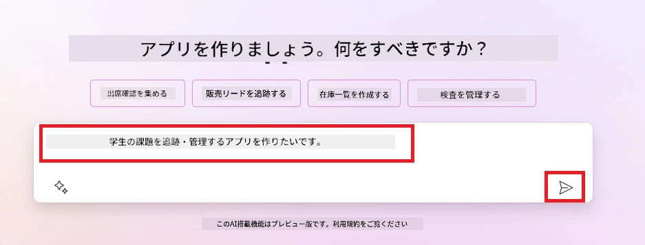

1. AI Copilotは追跡したいデータを保存するために必要なフィールドを持つDataverseテーブルとサンプルデータを提案します。対話形式のAI Copilotアシスタント機能を使ってテーブルをカスタマイズ可能です。

   > <strong>重要</strong>：DataverseはPower Platformの基盤となるデータプラットフォームです。アプリのデータ保存用のローコードデータプラットフォームであり、Microsoftクラウドに安全にデータを保存する完全マネージドサービスで、Power Platform環境内にプロビジョニングされます。データ分類、データ系統、詳細アクセス制御などの組み込みデータガバナンス機能を備えています。詳細は[こちら](https://docs.microsoft.com/powerapps/maker/data-platform/data-platform-intro?WT.mc_id=academic-109639-somelezediko)を参照してください。

   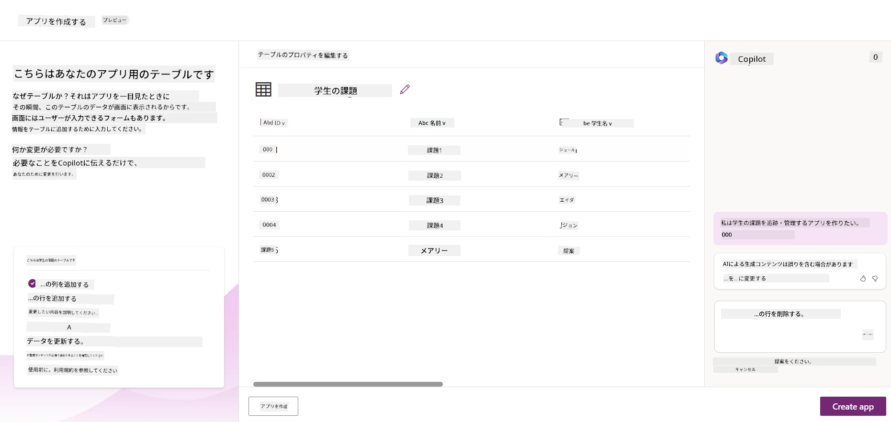

1. 教育者は課題を提出した学生にメールを送って進捗を知らせたいと考えています。Copilotを使って学生のメールを保存するための新しいフィールドをテーブルに追加できます。例：<strong>_学生メールを保存するための列を追加したい_</strong>というプロンプトを送ってください。<strong>送信</strong>ボタンをクリックしてAI Copilotに送ります。

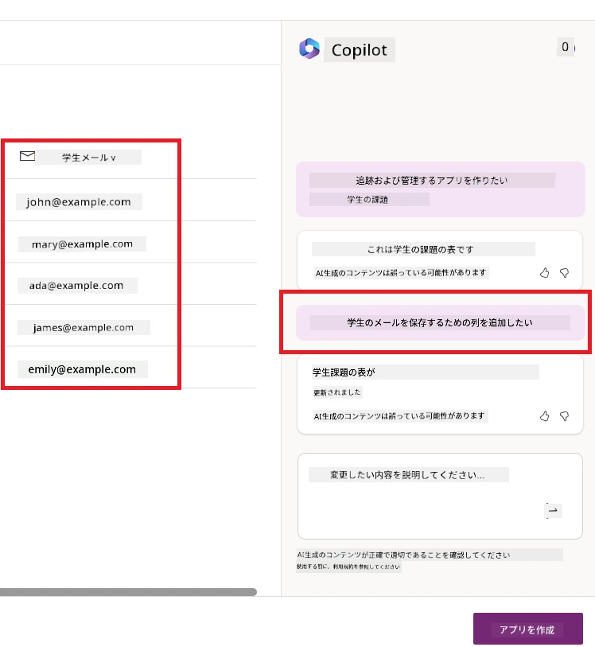

1. AI Copilotが新しいフィールドを生成し、その後ニーズに合わせてフィールドをカスタマイズできます。

1. テーブルの作成が完了したら、<strong>アプリの作成</strong>ボタンをクリックしてアプリを作成します。

1. AI Copilot があなたの説明に基づいてレスポンシブな Canvas アプリを生成します。その後、ニーズに応じてアプリをカスタマイズできます。

1. 教育者が学生にメールを送るために、Copilot を使ってアプリに新しい画面を追加できます。例えば、次のプロンプトを使ってアプリに新しい画面を追加できます：**_学生にメールを送るための画面を追加したい_**。<strong>送信</strong>ボタンをクリックしてプロンプトを AI Copilot に送信します。

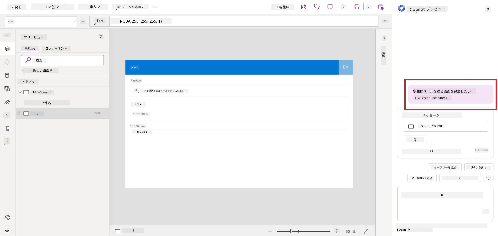

1. AI Copilot が新しい画面を生成し、その後ニーズに応じて画面をカスタマイズできます。

1. アプリの作成が完了したら、<strong>保存</strong>ボタンをクリックしてアプリを保存します。

1. 教育者とアプリを共有するには、<strong>共有</strong>ボタンをクリックしてからもう一度<strong>共有</strong>ボタンをクリックします。教育者のメールアドレスを入力してアプリを共有できます。

> <strong>宿題</strong>: いま作成したアプリは良いスタートですが、改善の余地があります。メール機能では、教育者は学生にメールアドレスを手動で入力して送信するしかありません。Copilot を使って、教育者が課題を提出したときに自動で学生にメールを送信できる自動化を作成できますか？ヒントとして、適切なプロンプトを使えば、Power Automate の Copilot でこれを構築できます。

### 当社スタートアップ向けの請求書情報テーブルの構築

当社スタートアップの財務チームは請求書の管理に苦労しています。請求書の追跡にスプレッドシートを使っていますが、請求書の数が増えるにつれて管理が困難になってきました。彼らは、受け取った請求書の情報を格納、追跡、管理できるテーブルを作成するよう依頼しました。このテーブルは、全ての請求書情報を抽出してテーブルに保存する自動化を構築するために使用されるべきです。また、財務チームが支払済みと未払いの請求書を確認できるようにする必要があります。

Power Platform には Dataverse と呼ばれる基盤データプラットフォームがあり、アプリやソリューションのデータを保存できます。Dataverse は低コードのデータプラットフォームを提供し、Microsoft Cloud 内で安全にデータを保存し、Power Platform 環境内で利用可能です。データ分類、データラインエージ、細かなアクセス制御などのデータガバナンス機能が組み込まれています。[こちらで Dataverse の詳細を学べます](https://docs.microsoft.com/powerapps/maker/data-platform/data-platform-intro?WT.mc_id=academic-109639-somelezediko)。

なぜ当社スタートアップで Dataverse を使うべきでしょうか？Dataverse の標準テーブルとカスタムテーブルは、安全かつクラウドベースのデータ格納手段を提供します。テーブルは、単一の Excel ワークブックで複数のワークシートを使い分けるように、異なる種類のデータを保存できます。組織やビジネスのニーズに特化したデータを保存するためにテーブルを使用できます。当社スタートアップが Dataverse を利用する主な利点は次のとおりです（以下に挙げる以外にもあります）：

- <strong>管理が簡単</strong>：メタデータとデータはクラウドに保存されるため、保存方法や管理方法を気にする必要はありません。アプリやソリューションの構築に集中できます。

- <strong>安全</strong>：Dataverse はデータを安全にクラウド保存し、テーブル内のデータへのアクセスをロールベースのセキュリティで制御できます。

- <strong>豊富なメタデータ</strong>：データ型やリレーションシップが Power Apps 内で直接使用されます。

- <strong>ロジックと検証</strong>：ビジネスルール、計算フィールド、検証ルールを用いてビジネスロジックを適用し、データの正確性を保てます。

Dataverse とは何か、なぜ使うべきかが分かったところで、次に Copilot を使って財務チームの要件に合う Dataverse テーブルを作成する方法を見てみましょう。

> <strong>注意</strong>：このテーブルは次のセクションで、全ての請求書情報を抽出してテーブルに保存する自動化を構築する際に使用します。

Copilot を使って Dataverse にテーブルを作成するには、以下の手順を実行します：

1. [Power Apps](https://make.powerapps.com?WT.mc_id=academic-105485-koreyst) のホーム画面にアクセスします。

2. 左側のナビゲーションバーで <strong>テーブル</strong> を選択し、次に <strong>新しいテーブルを説明する</strong> をクリックします。

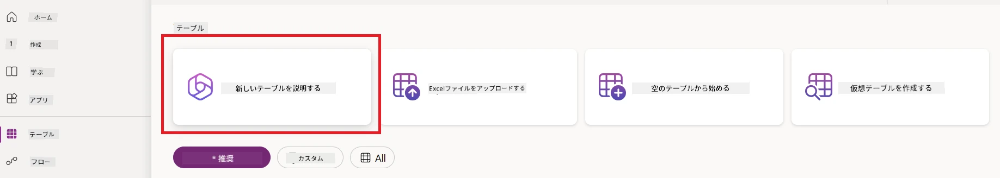

1. <strong>新しいテーブルを説明する</strong> 画面で、テーブルにしたい内容をテキストエリアに記述します。例えば、**_請求書情報を保存するテーブルを作成したい_** です。<strong>送信</strong>ボタンをクリックしてプロンプトを AI Copilot に送信します。

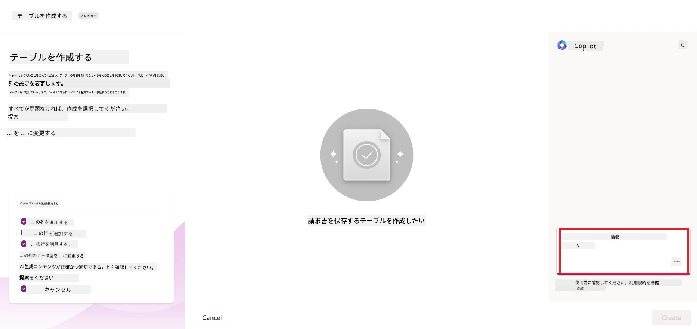

1. AI Copilot が、追跡したいデータを保存するために必要なフィールドとサンプルデータを備えた Dataverse テーブルを提案します。その後、会話形式で AI Copilot アシスタントを使ってテーブルをカスタマイズできます。

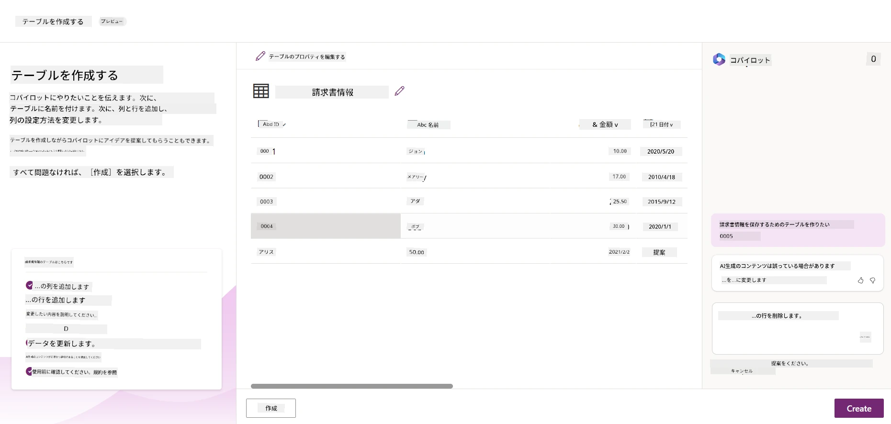

1. 財務チームは、請求書の現在の状況を業者にメールで通知したいと考えています。Copilot を使ってテーブルに業者メールを保存する新しいフィールドを追加できます。例えば、次のプロンプトを使えます：**_業者メールを保存する列を追加したい_**。<strong>送信</strong>ボタンをクリックしてプロンプトを AI Copilot に送信します。

1. AI Copilot が新しいフィールドを生成し、その後ニーズに応じてフィールドをカスタマイズできます。

1. テーブルの作成が完了したら、<strong>作成</strong>ボタンをクリックしてテーブルを作成します。

## Power Platform の AI Builder における AI モデル

AI Builder は Power Platform に搭載されたローコードの AI 機能で、AI モデルを使ってプロセスの自動化や結果の予測が可能です。AI Builder を使えば、Dataverse や SharePoint、OneDrive、Azure などのクラウドデータソースに接続されたアプリやフローに AI を組み込めます。

## 事前構築済み AI モデルとカスタム AI モデルの違い

AI Builder は二種類の AI モデルを提供しています：事前構築済み AI モデルとカスタム AI モデルです。事前構築済み AI モデルは、Microsoft によってトレーニングされ、Power Platform で利用可能な使い捨て可能な AI モデルです。これによってデータを集めて独自モデルを構築・トレーニング・公開することなく、アプリやフローにインテリジェンスを追加可能です。プロセスの自動化や結果予測に使えます。

Power Platform で利用できる事前構築済み AI モデルの例は：

- <strong>キーフレーズ抽出</strong>：テキストからキーフレーズを抽出します。
- <strong>言語検出</strong>：テキストの言語を検出します。
- <strong>感情分析</strong>：テキストに含まれる肯定的、否定的、中立的、混合的な感情を検出します。
- <strong>名刺リーダー</strong>：名刺から情報を抽出します。
- <strong>テキスト認識</strong>：画像からテキストを抽出します。
- <strong>物体検出</strong>：画像から物体を検出・抽出します。
- <strong>ドキュメント処理</strong>：フォームから情報を抽出します。
- <strong>請求書処理</strong>：請求書から情報を抽出します。

カスタム AI モデルでは、自分のモデルを AI Builder に持ち込んで任意の AI Builder カスタムモデルのように機能させられ、独自データを使ってトレーニング可能です。これらのモデルは Power Apps と Power Automate の両方でプロセスの自動化や結果予測に使用できます。独自モデルの利用には制限があります。詳細は[こちらの制限事項](https://learn.microsoft.com/ai-builder/byo-model#limitations?WT.mc_id=academic-105485-koreyst)をご覧ください。

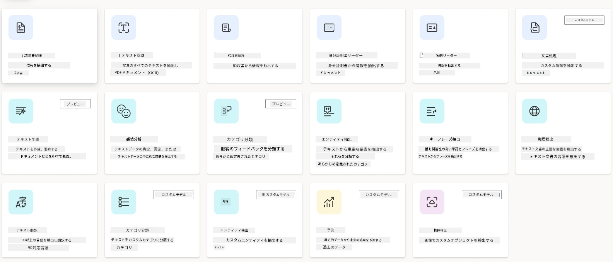

## 課題 #2 - 当社スタートアップ向け請求書処理フローの構築

財務チームは請求書の処理に苦労しています。請求書の追跡にスプレッドシートを使っていますが、請求書の数が増えるにつれて管理が困難になりました。彼らは、AI を使って請求書を処理するワークフローを構築するよう依頼しました。このワークフローは請求書から情報を抽出して Dataverse のテーブルに保存し、抽出した情報を含むメールを財務チームに送信できる必要があります。

AI Builder とは何か、なぜ使うべきかが分かったところで、先に紹介した請求書処理 AI モデルを使って、財務チームの請求書処理を支援するワークフローを作成する方法を見てみましょう。

請求書処理 AI モデルを使って財務チームを支援するワークフローを構築するには、以下の手順に従います：

1. [Power Automate](https://make.powerautomate.com?WT.mc_id=academic-105485-koreyst) のホーム画面にアクセスします。

2. ホーム画面のテキストエリアに構築したいワークフローの説明を入力します。例えば、<strong>_自分の受信トレイに請求書が届いたら処理する_</strong>です。<strong>送信</strong>ボタンをクリックしてプロンプトを AI Copilot に送信します。

   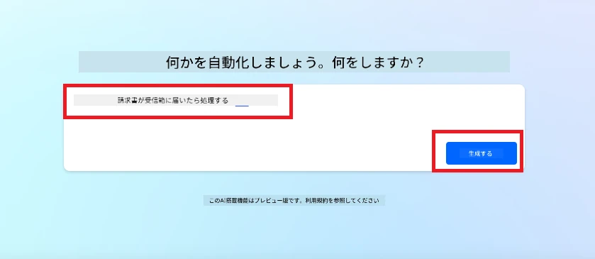

3. AI Copilot が自動化するために必要なアクションを提案します。<strong>次へ</strong>ボタンをクリックして次のステップに進みます。

4. 次のステップで、Power Automate がフローの接続設定を促します。設定が終わったら、<strong>フローを作成</strong>ボタンをクリックしてフローを作成します。

5. AI Copilot がフローを生成し、その後ニーズに応じてフローをカスタマイズできます。

6. フローのトリガーを更新し、請求書が保存されるフォルダを <strong>フォルダー</strong> に設定します。例えば、<strong>受信トレイ</strong> に設定します。<strong>詳細オプションを表示</strong>をクリックし、<strong>添付ファイルのみ</strong> を <strong>はい</strong> に設定します。これにより、添付ファイル付きのメールが受信トレイに届いたときのみフローが実行されます。

7. 次のアクションをフローから削除します：**HTMLをテキストに変換**、**Compose**、**Compose 2**、**Compose 3**、**Compose 4**。これらは使用しないためです。

8. <strong>条件</strong>アクションもフローから削除します。次のスクリーンショットのようになります：

   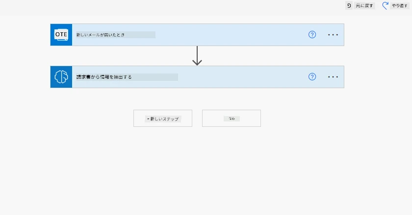

9. <strong>アクションの追加</strong>ボタンをクリックし、**Dataverse** を検索します。<strong>新しい行を追加</strong>アクションを選択します。

10. <strong>請求書から情報を抽出する</strong>アクションで、<strong>請求書ファイル</strong> をメールの <strong>添付ファイルの内容</strong> に設定します。これにより、添付された請求書から情報が抽出されます。

11. 先ほど作成した <strong>テーブル</strong> を選択します。例えば、<strong>請求書情報</strong> テーブルを選択します。前のアクションから動的コンテンツを選択して、次のフィールドを入力します：

    - ID
    - 金額
    - 日付
    - 名前
    - ステータス - <strong>ステータス</strong> を <strong>保留中</strong> に設定します。
    - 業者メール - <strong>新しいメールが届いたとき</strong> トリガーの <strong>差出人</strong> の動的コンテンツを使用します。

    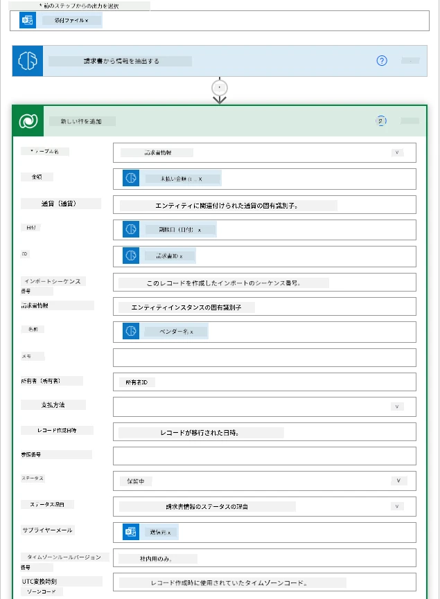

12. フローの作成が完了したら、<strong>保存</strong>ボタンをクリックしてフローを保存します。トリガーで指定したフォルダに請求書付きのメールを送信してフローをテストできます。

> <strong>宿題</strong>: いま作成したフローは良いスタートですが、次は財務チームが業者に請求書の現在状況をメールで更新できる自動化を作成してください。ヒント：請求書のステータスが変わったときにフローが実行される必要があります。

## Power Automate でのテキスト生成 AI モデルの使用

AI Builder の GPT テキスト生成 AI モデルは、プロンプトに基づいてテキストを生成でき、Microsoft Azure OpenAI サービスにより動作します。この機能を使えば、GPT（Generative Pre-Trained Transformer）技術をアプリやフローに組み込み、多様な自動化フローや高度なアプリケーションを構築できるようになります。

GPT モデルは大量のデータで広範な学習を行っており、プロンプトを与えると人間の言語に非常に近いテキストを生成できます。ワークフローの自動化に統合すると、GPT のような AI モデルは多様なタスクを効率化し自動化するために活用可能です。

例えば、メールの下書きや商品説明など多様なケースで自動テキスト生成フローを構築できます。また、チャットボットやカスタマーサービスアプリなど、問い合わせに効率的に対応する顧客サービス向けアプリにテキスト生成モデルを活用できます。

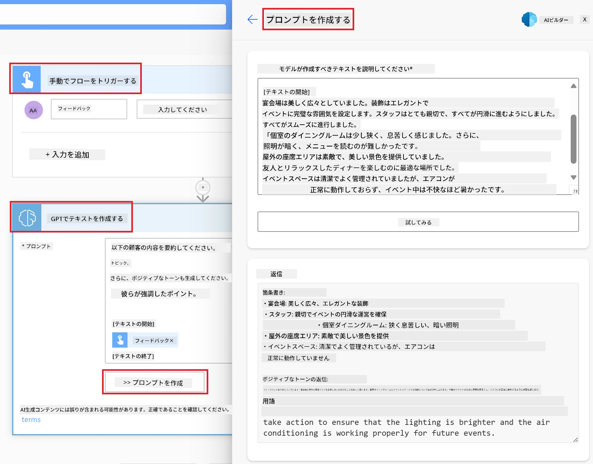

Power Automate でこの AI モデルの使い方を学ぶには、[Add intelligence with AI Builder and GPT](https://learn.microsoft.com/training/modules/ai-builder-text-generation/?WT.mc_id=academic-109639-somelezediko) モジュールを参照してください。

## 素晴らしい！学習を続けましょう

このレッスンを終えたら、[Generative AI Learning collection](https://aka.ms/genai-collection?WT.mc_id=academic-105485-koreyst) をチェックして、生成 AI の知識をさらにレベルアップさせましょう！

Copilot をカスタマイズしてもっと活用したいですか？コミュニティが貢献する指示、エージェント、スキル、設定のコレクションである [Awesome Copilot](https://github.com/github/awesome-copilot?WT.mc_id=academic-105485-koreyst) を探検して、GitHub Copilot を最大限に活用しましょう。

第11レッスンでは、[Generative AI を Function Calling と統合する方法](../11-integrating-with-function-calling/README.md?WT.mc_id=academic-105485-koreyst) を見ていきます！

---

<!-- CO-OP TRANSLATOR DISCLAIMER START -->
**免責事項**：
本書類は AI 翻訳サービス [Co-op Translator](https://github.com/Azure/co-op-translator) を使用して翻訳されています。正確性を期していますが、自動翻訳には誤りや不正確な部分が含まれる可能性があることをご承知おきください。原文の原語版が正式な情報源とみなされるべきです。重要な情報については、専門の人間による翻訳を推奨します。本翻訳の利用により生じたいかなる誤解や解釈違いについても、当方は責任を負いかねます。
<!-- CO-OP TRANSLATOR DISCLAIMER END -->