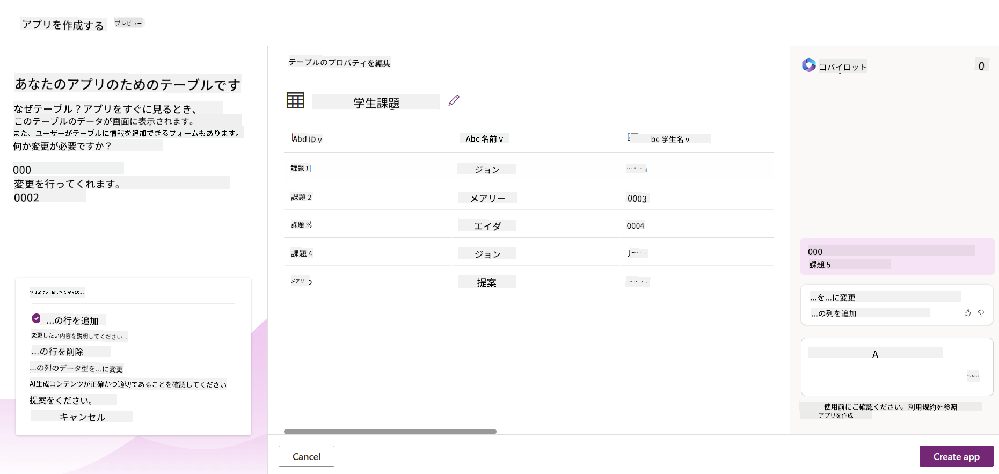
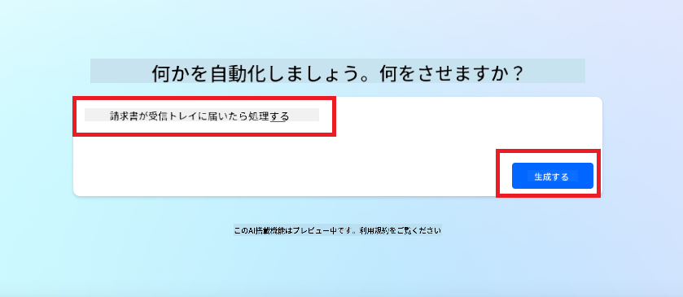
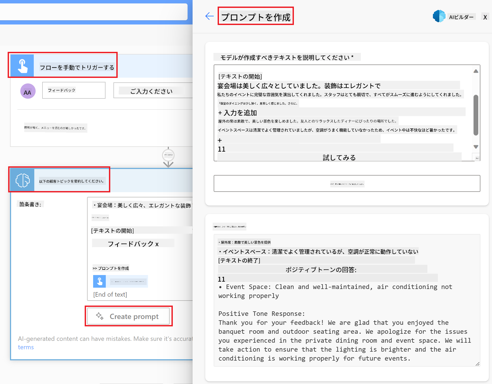

<!--
CO_OP_TRANSLATOR_METADATA:
{
  "original_hash": "f5ff3b6204a695a117d6f452403c95f7",
  "translation_date": "2025-07-09T13:47:28+00:00",
  "source_file": "10-building-low-code-ai-applications/README.md",
  "language_code": "ja"
}
-->
# ローコードAIアプリケーションの構築

> _(上の画像をクリックすると、このレッスンの動画が視聴できます)_

## はじめに

画像生成アプリケーションの作り方を学んだところで、次はローコードについて話しましょう。生成AIはローコードを含むさまざまな分野で活用できますが、そもそもローコードとは何で、どのようにAIを組み込めるのでしょうか？

ローコード開発プラットフォームを使うことで、従来の開発者だけでなく非開発者でもアプリやソリューションの構築が簡単になりました。ローコード開発プラットフォームは、ほとんどコードを書かずにアプリやソリューションを作成できる環境を提供します。これは、ドラッグ＆ドロップでコンポーネントを配置しながら開発できるビジュアル開発環境によって実現されています。これにより、より速く、少ないリソースでアプリやソリューションを構築可能です。本レッスンでは、ローコードの使い方と、Power Platformを使ってAIでローコード開発を強化する方法を詳しく見ていきます。

Power Platformは、直感的なローコードまたはノーコード環境を通じて、組織のチームが自分たちでソリューションを構築できるように支援します。この環境はソリューション構築のプロセスを簡素化します。Power Platformを使えば、ソリューションは数か月や数年ではなく、数日や数週間で構築可能です。Power Platformは、Power Apps、Power Automate、Power BI、Power Pages、Copilot Studioの5つの主要製品で構成されています。

このレッスンで扱う内容は以下の通りです：

- Power Platformにおける生成AIの紹介
- Copilotの紹介と使い方
- 生成AIを使ったPower Platformでのアプリとフローの構築
- AI Builderを使ったPower PlatformのAIモデルの理解

## 学習目標

このレッスンの終了時には、以下ができるようになります：

- Power PlatformでのCopilotの仕組みを理解する。

- 教育系スタートアップ向けの学生課題管理アプリを構築する。

- 請求書から情報を抽出するAIを使った請求書処理フローを構築する。

- GPT AIモデルを使ったテキスト作成時のベストプラクティスを適用する。

このレッスンで使用するツールと技術は以下の通りです：

- **Power Apps**：学生課題管理アプリ用。データの追跡、管理、操作を行うアプリをローコードで開発できる環境。

- **Dataverse**：学生課題管理アプリのデータ保存用。アプリのデータを保存するローコードのデータプラットフォーム。

- **Power Automate**：請求書処理フロー用。請求書処理を自動化するワークフローをローコードで構築可能。

- **AI Builder**：請求書処理AIモデル用。スタートアップの請求書処理に使う事前構築済みAIモデル。

## Power Platformにおける生成AI

生成AIを活用してローコード開発やアプリケーションを強化することは、Power Platformの重要なテーマです。目標は、誰もがデータサイエンスの専門知識なしにAI搭載のアプリ、サイト、ダッシュボードを作成し、AIでプロセスを自動化できるようにすることです。この目標は、CopilotやAI Builderという形で生成AIをPower Platformのローコード開発体験に統合することで実現されています。

### 仕組みは？

CopilotはAIアシスタントで、自然言語による対話形式で要件を伝えるだけでPower Platformのソリューションを構築できます。例えば、アプリで使うフィールドを指示すると、アプリとその基盤となるデータモデルの両方を作成したり、Power Automateでのフローの設定方法を指定したりできます。

Copilotは、アプリ画面の機能としても利用でき、ユーザーが対話を通じて洞察を得られるようにします。

AI BuilderはPower Platformで利用できるローコードAI機能で、AIモデルを使ってプロセスの自動化や結果の予測を支援します。AI Builderを使えば、DataverseやSharePoint、OneDrive、Azureなどのクラウドデータソースに接続したアプリやフローにAIを組み込めます。

CopilotはPower Apps、Power Automate、Power BI、Power Pages、Power Virtual Agentsのすべてで利用可能です。AI BuilderはPower AppsとPower Automateで利用できます。本レッスンでは、教育系スタートアップ向けのソリューション構築において、Power AppsとPower AutomateでのCopilotとAI Builderの使い方に焦点を当てます。

### Power AppsにおけるCopilot

Power Platformの一部であるPower Appsは、データの追跡、管理、操作を行うアプリをローコードで構築できる環境を提供します。スケーラブルなデータプラットフォームとクラウドサービスやオンプレミスデータへの接続機能を備えたアプリ開発サービスのスイートです。Power Appsで作成したアプリはブラウザ、タブレット、スマートフォンで動作し、同僚と共有可能です。シンプルなインターフェースにより、ビジネスユーザーやプロの開発者がカスタムアプリを作成しやすくなっています。さらに、Copilotによる生成AIでアプリ開発体験が強化されています。

Power AppsのCopilot AIアシスタント機能では、どんなアプリが必要か、どんな情報を追跡・収集・表示したいかを説明すると、その説明に基づいてレスポンシブなCanvasアプリを生成します。その後、ニーズに合わせてアプリをカスタマイズ可能です。AI Copilotは、追跡したいデータを保存するためのフィールドを持つDataverseテーブルとサンプルデータも生成・提案します。Dataverseとは何か、Power Appsでの使い方はこのレッスンの後半で詳しく説明します。会話形式のステップでAI Copilotアシスタントを使い、テーブルをカスタマイズすることもできます。この機能はPower Appsのホーム画面からすぐに利用可能です。

### Power AutomateにおけるCopilot

Power Platformの一部であるPower Automateは、アプリやサービス間の自動化ワークフローを作成できます。コミュニケーション、データ収集、承認などの繰り返し業務を自動化するのに役立ちます。初心者から経験豊富な開発者まで、あらゆる技術レベルのユーザーが使いやすいシンプルなインターフェースを備えています。生成AIによるCopilotでワークフロー開発体験も強化されています。

Power AutomateのCopilot AIアシスタント機能では、どんなフローが必要か、どんなアクションを実行したいかを説明すると、その説明に基づいてフローを生成します。その後、ニーズに合わせてフローをカスタマイズ可能です。AI Copilotは、タスクを自動化するために必要なアクションも生成・提案します。フローとは何か、Power Automateでの使い方はこのレッスンの後半で詳しく説明します。会話形式のステップでAI Copilotアシスタントを使い、アクションをカスタマイズすることもできます。この機能はPower Automateのホーム画面からすぐに利用可能です。

## 課題：Copilotを使ってスタートアップの学生課題と請求書を管理する

私たちのスタートアップはオンラインコースを学生に提供しています。急速に成長しており、コースの需要に対応しきれていません。そこで、Power Platform開発者として、学生課題と請求書を管理するローコードソリューションの構築を依頼されました。このソリューションは、学生課題をアプリで追跡・管理し、請求書処理をワークフローで自動化できる必要があります。生成AIを使って開発することが求められています。

Copilotの使い始めには、[Power Platform Copilot Prompt Library](https://github.com/pnp/powerplatform-prompts?WT.mc_id=academic-109639-somelezediko)を活用すると良いでしょう。このライブラリには、Copilotでアプリやフローを作るためのプロンプト例が多数収録されています。要件をCopilotに伝える際の参考にもなります。

### スタートアップ向け学生課題管理アプリの構築

スタートアップの教育担当者は学生課題の管理に苦労しています。これまではスプレッドシートで管理していましたが、学生数の増加で管理が難しくなっています。そこで、課題の追加、閲覧、更新、削除ができるアプリの構築を依頼されました。また、教育担当者と学生が採点済みの課題と未採点の課題を確認できる機能も必要です。

以下の手順でPower AppsのCopilotを使ってアプリを作成します：

1. [Power Apps](https://make.powerapps.com?WT.mc_id=academic-105485-koreyst)のホーム画面にアクセスします。

1. ホーム画面のテキストエリアに作りたいアプリの説明を入力します。例：**_学生課題を追跡・管理するアプリを作りたい_**。**送信**ボタンをクリックしてAI Copilotにプロンプトを送ります。

1. AI Copilotが、追跡したいデータを保存するためのフィールドを持つDataverseテーブルとサンプルデータを提案します。会話形式のステップでAI Copilotアシスタントを使い、テーブルをニーズに合わせてカスタマイズできます。

   > **重要**：DataverseはPower Platformの基盤となるデータプラットフォームです。アプリのデータを保存するローコードのデータプラットフォームで、Microsoftクラウド上に安全にデータを保存し、Power Platform環境内でプロビジョニングされます。データ分類、データ系統、細かなアクセス制御などの組み込みのデータガバナンス機能も備えています。Dataverseの詳細は[こちら](https://docs.microsoft.com/powerapps/maker/data-platform/data-platform-intro?WT.mc_id=academic-109639-somelezediko)をご覧ください。

   

1. 教育担当者は、課題を提出した学生に進捗を知らせるためメールを送りたいと考えています。Copilotを使って学生のメールアドレスを保存する新しいフィールドをテーブルに追加できます。例えば、**_学生のメールアドレスを保存する列を追加したい_**というプロンプトを入力し、**送信**ボタンをクリックします。

1. AI Copilotが新しいフィールドを生成し、ニーズに合わせてカスタマイズ可能です。

1. テーブルの編集が終わったら、**アプリの作成**ボタンをクリックしてアプリを作成します。

1. AI Copilotが説明に基づいたレスポンシブなCanvasアプリを生成します。ニーズに合わせてカスタマイズ可能です。

1. 教育担当者が学生にメールを送るための画面を追加したい場合、Copilotに**_学生にメールを送る画面を追加したい_**と指示し、**送信**ボタンをクリックします。

1. AI Copilotが新しい画面を生成し、ニーズに合わせてカスタマイズ可能です。

1. アプリの編集が終わったら、**保存**ボタンをクリックしてアプリを保存します。

1. 教育担当者とアプリを共有するには、**共有**ボタンをクリックし、再度**共有**ボタンをクリックします。メールアドレスを入力して共有できます。

> **宿題**：今作成したアプリは良いスタートですが、改善の余地があります。メール機能では教育担当者が学生のメールアドレスを手入力して手動でメールを送る必要があります。Copilotを使って、学生が課題を提出した際に自動でメールを送信する自動化を作成できますか？ヒントは、適切なプロンプトを使ってPower AutomateのCopilotで構築できることです。

### スタートアップ向け請求書情報テーブルの構築

スタートアップの経理チームは請求書の管理に苦労しています。これまではスプレッドシートで管理していましたが、請求書の数が増え管理が難しくなっています。そこで、受け取った請求書の情報を保存・追跡・管理できるテーブルの構築を依頼されました。このテーブルは、請求書の情報を抽出して保存する自動化の基盤として使います。また、経理チームが支払い済みの請求書と未払いの請求書を確認できる機能も必要です。

Power PlatformにはDataverseという基盤データプラットフォームがあり、アプリやソリューションのデータ保存に使えます。Dataverseはローコードのデータプラットフォームで、Microsoftクラウド上に安全にデータを保存し、Power Platform環境内でプロビジョニングされます。データ分類、データ系統、細かなアクセス制御などの組み込みのデータガバナンス機能も備えています。Dataverseの詳細は[こちら](https://docs.microsoft.com/powerapps/maker/data-platform/data-platform-intro?WT.mc_id=academic-109639-somelezediko)をご覧ください。

なぜスタートアップでDataverseを使うべきでしょうか？Dataverseの標準およびカスタムテーブルは、データの安全でクラウドベースの保存オプションを提供します。テーブルは、Excelの複数のワークシートのように、さまざまな種類のデータを保存できます。組織やビジネスのニーズに合わせたデータ保存に使えます。スタートアップがDataverseを使うことで得られる利点には、以下のようなものがありますが、これらに限定されません：
- **管理が簡単**: メタデータとデータの両方がクラウドに保存されるため、保存や管理の詳細を気にする必要はありません。アプリやソリューションの構築に集中できます。

- **安全**: Dataverseは安全でクラウドベースのデータ保存オプションを提供します。ロールベースのセキュリティを使って、テーブル内のデータへのアクセス権やアクセス方法を制御できます。

- **豊富なメタデータ**: データ型やリレーションシップがPower Apps内で直接利用されます。

- **ロジックと検証**: ビジネスルール、計算フィールド、検証ルールを使ってビジネスロジックを適用し、データの正確性を保てます。

Dataverseとは何か、なぜ使うべきかがわかったところで、次はCopilotを使って財務チームの要件に合ったテーブルをDataverseに作成する方法を見ていきましょう。

> **Note** : 次のセクションでこのテーブルを使って、請求書の情報を抽出しテーブルに保存する自動化を作成します。

Copilotを使ってDataverseにテーブルを作成するには、以下の手順に従ってください。

1. [Power Apps](https://make.powerapps.com?WT.mc_id=academic-105485-koreyst)のホーム画面に移動します。

2. 左のナビゲーションバーで**Tables**を選択し、次に**Describe the new Table**をクリックします。

3. **Describe the new Table**画面で、作成したいテーブルの説明をテキストエリアに入力します。例えば、**_請求書情報を保存するテーブルを作成したい_**と入力します。**Send**ボタンをクリックして、プロンプトをAI Copilotに送信します。

4. AI Copilotは、追跡したいデータを保存するために必要なフィールドとサンプルデータを含むDataverseテーブルを提案します。その後、会話形式のステップでAI Copilotアシスタント機能を使い、テーブルをカスタマイズできます。

5. 財務チームは請求書の現在の状況をサプライヤーにメールで通知したいと考えています。Copilotを使って、サプライヤーのメールアドレスを保存する新しいフィールドをテーブルに追加できます。例えば、**_サプライヤーのメールアドレスを保存する列を追加したい_**というプロンプトを使います。**Send**ボタンをクリックしてAI Copilotに送信してください。

6. AI Copilotが新しいフィールドを生成し、その後ニーズに合わせてフィールドをカスタマイズできます。

7. テーブルの作成が完了したら、**Create**ボタンをクリックしてテーブルを作成します。

## Power PlatformのAIモデルとAI Builder

AI BuilderはPower Platformで利用できるローコードのAI機能で、AIモデルを使ってプロセスの自動化や結果の予測を支援します。AI Builderを使うことで、DataverseやSharePoint、OneDrive、Azureなどのさまざまなクラウドデータソースに接続したアプリやフローにAIを組み込めます。

## 既成AIモデルとカスタムAIモデルの違い

AI Builderには、既成AIモデルとカスタムAIモデルの2種類があります。既成AIモデルはMicrosoftがトレーニング済みで、Power Platformでそのまま使えるモデルです。これにより、データ収集やモデルの構築、トレーニング、公開を行わずに、アプリやフローにインテリジェンスを追加できます。これらのモデルはプロセスの自動化や結果の予測に役立ちます。

Power Platformで利用可能な既成AIモデルの例：

- **Key Phrase Extraction**: テキストから重要なフレーズを抽出します。
- **Language Detection**: テキストの言語を検出します。
- **Sentiment Analysis**: テキストの感情（肯定的、否定的、中立、混合）を検出します。
- **Business Card Reader**: 名刺から情報を抽出します。
- **Text Recognition**: 画像からテキストを抽出します。
- **Object Detection**: 画像からオブジェクトを検出・抽出します。
- **Document processing**: フォームから情報を抽出します。
- **Invoice Processing**: 請求書から情報を抽出します。

カスタムAIモデルでは、自分のモデルをAI Builderに持ち込み、AI Builderのカスタムモデルとして機能させることができます。自分のデータを使ってモデルをトレーニングし、Power AppsやPower Automateでプロセスの自動化や結果の予測に利用可能です。ただし、自分のモデルを使う場合はいくつかの制限があります。詳細は[こちら](https://learn.microsoft.com/ai-builder/byo-model#limitations?WT.mc_id=academic-105485-koreyst)をご覧ください。

## 課題 #2 - スタートアップ向け請求書処理フローの構築

財務チームは請求書の処理に苦労しています。請求書を管理するためにスプレッドシートを使っていましたが、請求書の数が増えたため管理が難しくなっています。AIを使って請求書を処理するワークフローの構築を依頼されました。このワークフローは請求書から情報を抽出し、Dataverseのテーブルに保存できるようにする必要があります。また、抽出した情報を財務チームにメールで送信する機能も必要です。

AI Builderとは何か、なぜ使うべきかがわかったところで、先ほど紹介したInvoice Processing AIモデルを使って、財務チームの請求書処理を支援するワークフローを作成する方法を見ていきましょう。

Invoice Processing AIモデルを使って財務チームの請求書処理を支援するワークフローを作成するには、以下の手順に従ってください。

1. [Power Automate](https://make.powerautomate.com?WT.mc_id=academic-105485-koreyst)のホーム画面に移動します。

2. ホーム画面のテキストエリアに作成したいワークフローの説明を入力します。例えば、**_メールボックスに請求書が届いたら処理する_**と入力します。**Send**ボタンをクリックしてプロンプトをAI Copilotに送信します。

   

3. AI Copilotが自動化したいタスクを実行するために必要なアクションを提案します。**Next**ボタンをクリックして次のステップに進みます。

4. 次のステップで、Power Automateがフローに必要な接続の設定を促します。設定が完了したら、**Create flow**ボタンをクリックしてフローを作成します。

5. AI Copilotがフローを生成し、その後ニーズに合わせてカスタマイズできます。

6. フローのトリガーを更新し、請求書が保存されるフォルダーを**Folder**に設定します。例えば、**Inbox**に設定します。**Show advanced options**をクリックし、**Only with Attachments**を**Yes**に設定します。これにより、添付ファイル付きのメールが届いたときのみフローが実行されます。

7. フローから以下のアクションを削除します：**HTML to text**、**Compose**、**Compose 2**、**Compose 3**、**Compose 4**。これらは使用しません。

8. フローから**Condition**アクションも削除します。以下のスクリーンショットのようになります。

   

9. **Add an action**ボタンをクリックし、**Dataverse**を検索します。**Add a new row**アクションを選択します。

10. **Extract Information from invoices**アクションで、**Invoice File**をメールの**Attachment Content**に設定します。これにより、請求書の添付ファイルから情報が抽出されます。

11. 先ほど作成した**Table**を選択します。例えば、**Invoice Information**テーブルを選択します。前のアクションの動的コンテンツを使って以下のフィールドを埋めます：

    - ID
    - Amount
    - Date
    - Name
    - Status - **Status**は**Pending**に設定します。
    - Supplier Email - **When a new email arrives**トリガーの**From**動的コンテンツを使用します。

    

12. フローの作成が完了したら、**Save**ボタンをクリックして保存します。指定したフォルダーに請求書付きのメールを送信して、フローをテストできます。

> **Your homework**: 今作成したフローは良いスタートです。次は、請求書のステータスが変わったときにフローが実行され、財務チームがサプライヤーに請求書の現在の状況をメールで通知できる自動化を考えてみてください。ヒント：フローは請求書のステータス変更時に実行される必要があります。

## Power Automateでテキスト生成AIモデルを使う

AI BuilderのCreate Text with GPT AIモデルは、プロンプトに基づいてテキストを生成する機能で、Microsoft Azure OpenAI Serviceによって動作しています。この機能を使うことで、GPT（Generative Pre-Trained Transformer）技術をアプリやフローに組み込み、さまざまな自動化フローやインサイトアプリケーションを構築できます。

GPTモデルは大量のデータでトレーニングされており、プロンプトを与えると人間の言語に近いテキストを生成します。ワークフローの自動化と組み合わせることで、GPTのようなAIモデルを活用して多様なタスクを効率化・自動化できます。

例えば、メールの下書きや商品説明など、さまざまな用途のテキストを自動生成するフローを作成できます。また、チャットボットやカスタマーサービスアプリなど、顧客対応を効率的に行うためのテキスト生成にも利用可能です。

Power AutomateでこのAIモデルの使い方を学ぶには、[Add intelligence with AI Builder and GPT](https://learn.microsoft.com/training/modules/ai-builder-text-generation/?WT.mc_id=academic-109639-somelezediko)モジュールを参照してください。

## よくできました！学習を続けましょう

このレッスンを終えたら、[Generative AI Learning collection](https://aka.ms/genai-collection?WT.mc_id=academic-105485-koreyst)でジェネレーティブAIの知識をさらに深めましょう！

次のレッスン11では、[Function CallingとジェネレーティブAIの統合](../11-integrating-with-function-calling/README.md?WT.mc_id=academic-105485-koreyst)について学びます！

**免責事項**：  
本書類はAI翻訳サービス「[Co-op Translator](https://github.com/Azure/co-op-translator)」を使用して翻訳されました。正確性の向上に努めておりますが、自動翻訳には誤りや不正確な部分が含まれる可能性があります。原文の言語によるオリジナル文書が正式な情報源とみなされるべきです。重要な情報については、専門の人間による翻訳を推奨します。本翻訳の利用により生じたいかなる誤解や誤訳についても、当方は責任を負いかねます。