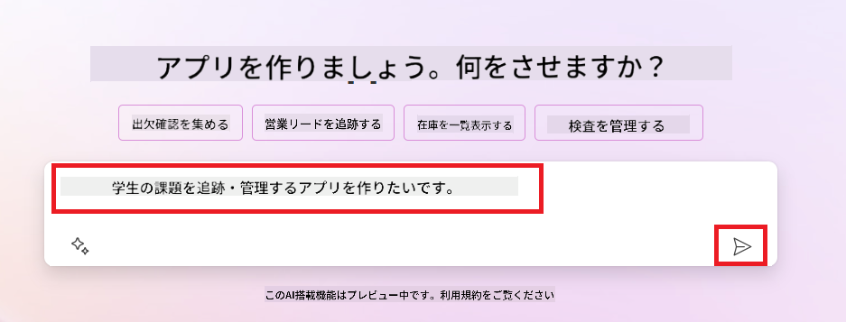
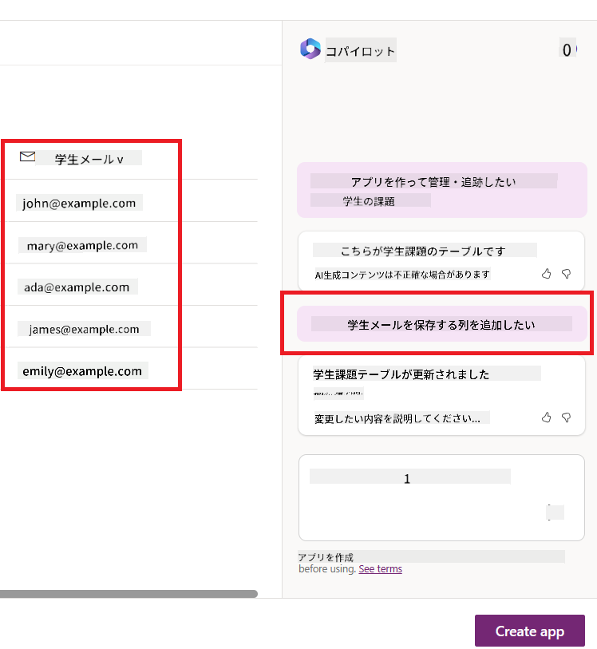
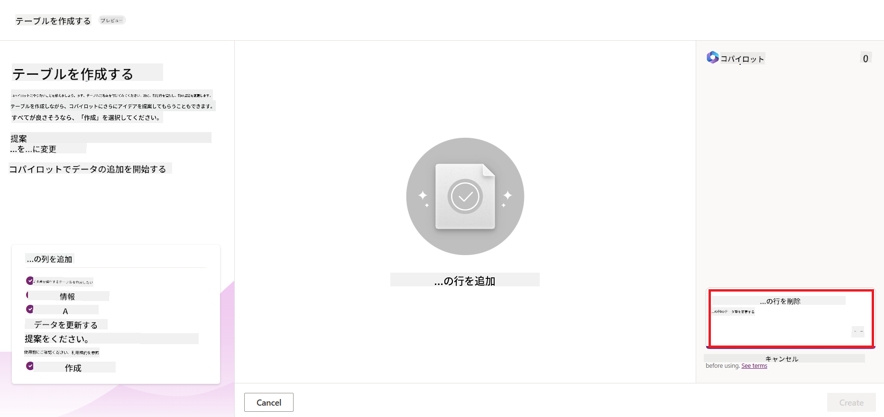
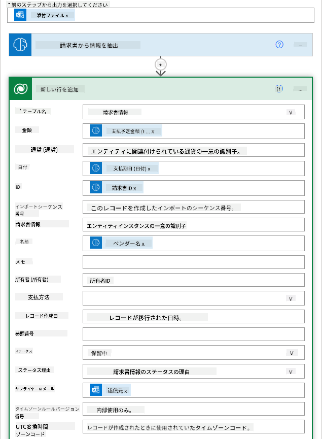

<!--
CO_OP_TRANSLATOR_METADATA:
{
  "original_hash": "846ac8e3b7dcfb697d3309fec05f0fea",
  "translation_date": "2025-10-17T23:53:39+00:00",
  "source_file": "10-building-low-code-ai-applications/README.md",
  "language_code": "ja"
}
-->
# ローコードAIアプリケーションの構築

> _(上の画像をクリックして、このレッスンのビデオをご覧ください)_

## はじめに

これまで画像生成アプリケーションの構築方法を学んできましたが、次はローコードについて話しましょう。生成AIはローコードを含むさまざまな分野で活用できますが、ローコードとは何であり、どのようにAIを追加できるのでしょうか？

ローコード開発プラットフォームを使用することで、従来の開発者や非開発者がアプリやソリューションを簡単に構築できるようになりました。ローコード開発プラットフォームは、アプリやソリューションをほとんどコードを書かずに構築できる環境を提供します。これにより、コンポーネントをドラッグ＆ドロップしてアプリやソリューションを構築することが可能になります。これにより、より迅速かつ少ないリソースでアプリやソリューションを構築できるようになります。このレッスンでは、ローコードの使用方法と、Power Platformを使用してAIを活用したローコード開発を強化する方法について詳しく説明します。

Power Platformは、直感的なローコードまたはノーコード環境を通じて、チームが独自のソリューションを構築できるようにする機会を提供します。この環境は、ソリューション構築プロセスを簡素化します。Power Platformを使用すると、ソリューションは数か月や数年ではなく、数日または数週間で構築できます。Power Platformは、Power Apps、Power Automate、Power BI、Power Pages、Copilot Studioの5つの主要製品で構成されています。

このレッスンでは以下を学びます：

- Power Platformにおける生成AIの概要
- Copilotの概要とその使用方法
- Power Platformで生成AIを使用してアプリやフローを構築する方法
- AI Builderを使用したPower PlatformのAIモデルの理解

## 学習目標

このレッスンの終わりまでに、以下を理解できるようになります：

- Power PlatformでのCopilotの動作を理解する。

- 教育系スタートアップ向けの学生課題管理アプリを構築する。

- 請求書から情報を抽出するAIを使用した請求書処理フローを構築する。

- GPT AIモデルを使用してテキストを作成する際のベストプラクティスを適用する。

このレッスンで使用するツールと技術は以下の通りです：

- **Power Apps**: 学生課題管理アプリを構築するためのローコード開発環境で、データを追跡、管理、操作するアプリを構築します。

- **Dataverse**: 学生課題管理アプリのデータを保存するためのローコードデータプラットフォーム。

- **Power Automate**: 請求書処理フローを構築するためのローコード開発環境で、請求書処理プロセスを自動化するワークフローを構築します。

- **AI Builder**: 請求書処理AIモデルを構築するためのツールで、事前構築されたAIモデルを使用してスタートアップの請求書を処理します。

## Power Platformにおける生成AI

ローコード開発とアプリケーションを生成AIで強化することは、Power Platformの重要な焦点領域です。目標は、データサイエンスの専門知識を必要とせずに、AIを活用したアプリ、サイト、ダッシュボードを構築し、プロセスを自動化できるようにすることです。この目標は、CopilotやAI Builderの形で生成AIをPower Platformのローコード開発体験に統合することで達成されます。

### どのように機能するのか？

Copilotは、自然言語を使用した一連の会話ステップで要件を説明することで、Power Platformソリューションを構築できるAIアシスタントです。例えば、アプリで使用するフィールドを指定すると、アプリと基盤となるデータモデルを作成したり、Power Automateでフローの設定方法を指定したりすることができます。

Copilotをアプリ画面の機能として使用することで、ユーザーが会話型のインタラクションを通じて洞察を得ることができます。

AI Builderは、Power Platformで利用可能なローコードAI機能で、AIモデルを使用してプロセスを自動化し、結果を予測するのに役立ちます。AI Builderを使用すると、DataverseやSharePoint、OneDrive、Azureなどのさまざまなクラウドデータソースに接続するアプリやフローにAIを組み込むことができます。

Copilotは、Power Platformのすべての製品（Power Apps、Power Automate、Power BI、Power Pages、Power Virtual Agents）で利用可能です。AI Builderは、Power AppsとPower Automateで利用可能です。このレッスンでは、教育系スタートアップ向けのソリューションを構築するために、Power AppsとPower AutomateでのCopilotとAI Builderの使用方法に焦点を当てます。

### Power AppsにおけるCopilot

Power Platformの一部であるPower Appsは、データを追跡、管理、操作するアプリを構築するためのローコード開発環境を提供します。これは、スケーラブルなデータプラットフォームとクラウドサービスやオンプレミスデータへの接続機能を備えたアプリ開発サービスのスイートです。Power Appsを使用すると、ブラウザ、タブレット、スマートフォンで動作するアプリを構築し、同僚と共有することができます。Power Appsはシンプルなインターフェースを提供し、すべてのビジネスユーザーやプロの開発者がカスタムアプリを構築できるようにします。さらに、Copilotを通じて生成AIによるアプリ開発体験が向上します。

Power AppsのCopilot AIアシスタント機能を使用すると、必要なアプリの種類やアプリで追跡、収集、表示したい情報を説明するだけで、Copilotがその説明に基づいてレスポンシブなCanvasアプリを生成します。その後、ニーズに合わせてアプリをカスタマイズできます。また、AI Copilotは、追跡したいデータを保存するために必要なフィールドを含むDataverseテーブルを生成し、サンプルデータを提案します。このレッスンの後半でDataverseの詳細とPower Appsでの使用方法を説明します。会話型のステップを通じて、AI Copilotアシスタント機能を使用してテーブルをカスタマイズすることもできます。この機能は、Power Appsのホーム画面からすぐに利用可能です。

### Power AutomateにおけるCopilot

Power Platformの一部であるPower Automateは、アプリケーションやサービス間で自動化されたワークフローを作成することができます。これにより、コミュニケーション、データ収集、承認プロセスなどの繰り返しのビジネスプロセスを自動化することができます。シンプルなインターフェースにより、初心者から熟練した開発者まで、あらゆる技術レベルのユーザーが作業タスクを自動化することが可能です。さらに、Copilotを通じて生成AIによるワークフロー開発体験が向上します。

Power AutomateのCopilot AIアシスタント機能を使用すると、必要なフローの種類やフローで実行したいアクションを説明するだけで、Copilotがその説明に基づいてフローを生成します。その後、ニーズに合わせてフローをカスタマイズできます。また、AI Copilotは、実行したいタスクを自動化するために必要なアクションを生成し、提案します。このレッスンの後半でフローの詳細とPower Automateでの使用方法を説明します。会話型のステップを通じて、AI Copilotアシスタント機能を使用してアクションをカスタマイズすることもできます。この機能は、Power Automateのホーム画面からすぐに利用可能です。

## 課題: Copilotを使用してスタートアップの学生課題と請求書を管理する

私たちのスタートアップは学生にオンラインコースを提供しています。このスタートアップは急速に成長しており、コースの需要に対応するのが難しくなっています。スタートアップは、学生の課題と請求書を管理するためのローコードソリューションを構築するために、Power Platformの開発者としてあなたを雇いました。このソリューションは、アプリを通じて学生の課題を追跡・管理し、ワークフローを通じて請求書処理プロセスを自動化するのに役立つ必要があります。生成AIを使用してソリューションを開発するよう求められています。

Copilotの使用を開始する際には、[Power Platform Copilot Prompt Library](https://github.com/pnp/powerplatform-prompts?WT.mc_id=academic-109639-somelezediko)を使用してプロンプトを始めることができます。このライブラリには、Copilotを使用してアプリやフローを構築するためのプロンプトのリストが含まれています。また、ライブラリ内のプロンプトを使用して、Copilotに要件を説明する方法のアイデアを得ることもできます。

### スタートアップ向けの学生課題管理アプリを構築する

私たちのスタートアップの教育者たちは、学生の課題を追跡するのに苦労しています。これまではスプレッドシートを使用して課題を管理していましたが、学生数が増加するにつれて管理が難しくなってきました。教育者たちは、学生の課題を追跡・管理するためのアプリを構築するよう依頼しました。このアプリは、新しい課題の追加、課題の表示、課題の更新、課題の削除を可能にする必要があります。また、教育者と学生が採点済みの課題と未採点の課題を確認できるようにする必要があります。

以下の手順に従って、Power AppsのCopilotを使用してアプリを構築します：

1. [Power Apps](https://make.powerapps.com?WT.mc_id=academic-105485-koreyst)のホーム画面に移動します。

1. ホーム画面のテキストエリアを使用して、構築したいアプリを説明します。例えば、**_学生の課題を追跡・管理するアプリを構築したい_**と入力します。**送信**ボタンをクリックして、プロンプトをAI Copilotに送信します。

1. AI Copilotは、追跡したいデータを保存するために必要なフィールドを含むDataverseテーブルとサンプルデータを提案します。その後、会話型のステップを通じてAI Copilotアシスタント機能を使用してテーブルをカスタマイズできます。

   > **重要**: DataverseはPower Platformの基盤となるデータプラットフォームです。これは、アプリのデータを保存するためのローコードデータプラットフォームであり、Microsoft Cloud内で安全にデータを保存する完全管理型サービスです。データ分類、データの系統、きめ細かいアクセス制御などの組み込みのデータガバナンス機能を備えています。Dataverseの詳細については[こちら](https://docs.microsoft.com/powerapps/maker/data-platform/data-platform-intro?WT.mc_id=academic-109639-somelezediko)をご覧ください。

   

1. 教育者は、課題を提出した学生に進捗状況を知らせるためにメールを送信したいと考えています。テーブルに学生のメールアドレスを保存する新しいフィールドを追加するためにCopilotを使用できます。例えば、次のプロンプトを使用してテーブルに新しいフィールドを追加できます：**_学生のメールアドレスを保存する列を追加したい_**。**送信**ボタンをクリックして、プロンプトをAI Copilotに送信します。

1. AI Copilotは新しいフィールドを生成し、その後ニーズに合わせてフィールドをカスタマイズできます。

1. テーブルの作成が完了したら、**アプリを作成**ボタンをクリックしてアプリを作成します。

1. AI Copilotは、説明に基づいてレスポンシブなCanvasアプリを生成します。その後、ニーズに合わせてアプリをカスタマイズできます。

1. 教育者が学生にメールを送信できるようにするために、Copilotを使用してアプリに新しい画面を追加できます。例えば、次のプロンプトを使用してアプリに新しい画面を追加できます：**_学生にメールを送信する画面を追加したい_**。**送信**ボタンをクリックして、プロンプトをAI Copilotに送信します。

1. AI Copilotは新しい画面を生成し、その後ニーズに合わせて画面をカスタマイズできます。

1. アプリの作成が完了したら、**保存**ボタンをクリックしてアプリを保存します。

1. 教育者とアプリを共有するには、**共有**ボタンをクリックし、再度**共有**ボタンをクリックします。その後、教育者のメールアドレスを入力してアプリを共有できます。

> **宿題**: 今作成したアプリは良いスタートですが、改善の余地があります。メール機能では、教育者が学生のメールを手動で入力して送信する必要があります。Copilotを使用して、学生が課題を提出した際に教育者が自動的にメールを送信できるようにする自動化を構築できますか？ヒントとして、適切なプロンプトを使用すれば、Power AutomateのCopilotを使用してこれを構築できます。

### スタートアップ向けの請求書情報テーブルを構築する

私たちのスタートアップの財務チームは、請求書の追跡に苦労しています。これまではスプレッドシートを使用して請求書を管理していましたが、請求書の数が増加するにつれて管理が難しくなってきました。財務チームは、受け取った請求書の情報を保存、追跡、管理するためのテーブルを構築するよう依頼しました。このテーブルは、すべての請求書情報を抽出してテーブルに保存する自動化を構築するために使用されるべきです。また、財務チームが支払済みの請求書と未払いの請求書を確認できるようにする必要があります。

Power Platformには、アプリやソリューションのデータを保存するための基盤となるデータプラットフォームであるDataverseがあります。Dataverseは、アプリのデータを保存するためのローコードデータプラットフォームを提供します。これは、Microsoft Cloud内で安全にデータを保存する完全管理型サービスであり、Power Platform環境内でプロビジョニングされます。データ分類、データの系統、きめ細かいアクセス制御などの組み込みのデータガバナンス機能を備えています。Dataverseの詳細については[こちら](https://docs.microsoft.com/powerapps/maker/data-platform/data-platform-intro?WT.mc_id=academic-109639-somelezediko)をご覧ください。
なぜスタートアップにDataverseを使用するべきなのか？Dataverseの標準およびカスタムテーブルは、データを安全にクラウド上で保存するオプションを提供します。テーブルは、Excelのワークブック内で複数のワークシートを使用するように、異なる種類のデータを保存することができます。これらのテーブルを使用して、組織やビジネスのニーズに特化したデータを保存することができます。Dataverseを使用することで、スタートアップが得られる利点は以下の通りです：

- **管理が簡単**: メタデータとデータはクラウドに保存されるため、保存や管理の詳細について心配する必要はありません。アプリやソリューションの構築に集中できます。

- **安全性**: Dataverseは、データを安全にクラウド上で保存するオプションを提供します。ロールベースのセキュリティを使用して、テーブル内のデータへのアクセス権を制御できます。

- **豊富なメタデータ**: データ型や関係性がPower Apps内で直接使用されます。

- **ロジックと検証**: ビジネスルール、計算フィールド、検証ルールを使用してビジネスロジックを適用し、データの正確性を維持できます。

Dataverseの概要とその利点を理解したところで、次にCopilotを使用して、財務チームの要件を満たすテーブルをDataverseで作成する方法を見ていきましょう。

> **Note** : このテーブルは次のセクションで、請求書情報を抽出してテーブルに保存する自動化を構築する際に使用します。

Copilotを使用してDataverseでテーブルを作成するには、以下の手順に従ってください：

1. [Power Apps](https://make.powerapps.com?WT.mc_id=academic-105485-koreyst)のホーム画面に移動します。

2. 左側のナビゲーションバーで**Tables**を選択し、**Describe the new Table**をクリックします。

3. **Describe the new Table**画面で、作成したいテーブルを説明するテキストを入力します。例えば、**_請求書情報を保存するテーブルを作成したい_**と入力します。**Send**ボタンをクリックして、AI Copilotにプロンプトを送信します。

4. AI Copilotは、追跡したいデータを保存するために必要なフィールドを含むDataverseテーブルを提案し、サンプルデータも提供します。その後、会話形式のステップを通じてAI Copilotアシスタント機能を使用してテーブルをカスタマイズできます。

5. 財務チームは、請求書の現在の状況をサプライヤーに更新するためのメールを送信したいと考えています。Copilotを使用して、サプライヤーのメールアドレスを保存する新しいフィールドをテーブルに追加できます。例えば、次のプロンプトを使用してテーブルに新しいフィールドを追加できます：**_サプライヤーのメールアドレスを保存する列を追加したい_**。**Send**ボタンをクリックして、AI Copilotにプロンプトを送信します。

6. AI Copilotは新しいフィールドを生成し、その後フィールドをニーズに合わせてカスタマイズできます。

7. テーブルの作成が完了したら、**Create**ボタンをクリックしてテーブルを作成します。

## Power PlatformのAI BuilderにおけるAIモデル

AI Builderは、Power Platformで利用可能なローコードAI機能であり、プロセスの自動化や結果の予測を支援するAIモデルを使用できます。AI Builderを使用すると、DataverseやSharePoint、OneDrive、Azureなどのさまざまなクラウドデータソースに接続するアプリやフローにAIを組み込むことができます。

## 事前構築AIモデルとカスタムAIモデル

AI Builderは、事前構築AIモデルとカスタムAIモデルの2種類のAIモデルを提供します。事前構築AIモデルは、Microsoftによってトレーニングされ、Power Platformで利用可能なすぐに使用できるAIモデルです。これにより、データを収集して独自のモデルを構築、トレーニング、公開する必要なく、アプリやフローにインテリジェンスを追加できます。これらのモデルを使用してプロセスを自動化し、結果を予測できます。

Power Platformで利用可能な事前構築AIモデルには以下のものがあります：

- **キーフレーズ抽出**: テキストからキーフレーズを抽出します。
- **言語検出**: テキストの言語を検出します。
- **感情分析**: テキストの感情（ポジティブ、ネガティブ、中立、混合）を検出します。
- **名刺リーダー**: 名刺から情報を抽出します。
- **テキスト認識**: 画像からテキストを抽出します。
- **オブジェクト検出**: 画像からオブジェクトを検出して抽出します。
- **文書処理**: フォームから情報を抽出します。
- **請求書処理**: 請求書から情報を抽出します。

カスタムAIモデルを使用すると、独自のモデルをAI Builderに持ち込むことができ、AI Builderのカスタムモデルとして機能します。これにより、独自のデータを使用してモデルをトレーニングできます。これらのモデルを使用して、Power AppsやPower Automateでプロセスを自動化し、結果を予測できます。ただし、独自のモデルを使用する際には制限が適用されます。これらの[制限](https://learn.microsoft.com/ai-builder/byo-model#limitations?WT.mc_id=academic-105485-koreyst)について詳しく読むことができます。

## 課題 #2 - スタートアップのための請求書処理フローを構築する

財務チームは請求書の処理に苦労しています。これまでスプレッドシートを使用して請求書を追跡していましたが、請求書の数が増えるにつれて管理が困難になっています。彼らはAIを使用して請求書を処理するワークフローを構築するよう依頼しました。このワークフローは、請求書から情報を抽出し、その情報をDataverseテーブルに保存する機能を持つ必要があります。また、抽出した情報を財務チームにメールで送信する機能も必要です。

AI Builderとは何か、そしてなぜそれを使用するべきなのかを理解したところで、前述の請求書処理AIモデルを使用して財務チームが請求書を処理するのを支援するワークフローを構築する方法を見ていきましょう。

請求書処理AIモデルを使用して財務チームが請求書を処理するのを支援するワークフローを構築するには、以下の手順に従ってください：

1. [Power Automate](https://make.powerautomate.com?WT.mc_id=academic-105485-koreyst)のホーム画面に移動します。

2. ホーム画面のテキストエリアを使用して、構築したいワークフローを説明します。例えば、**_メールボックスに請求書が届いたら処理する_**と入力します。**Send**ボタンをクリックして、AI Copilotにプロンプトを送信します。

   

3. AI Copilotは、あなたが自動化したいタスクを実行するために必要なアクションを提案します。**Next**ボタンをクリックして次のステップに進みます。

4. 次のステップでは、Power Automateがフローに必要な接続を設定するよう促します。設定が完了したら、**Create flow**ボタンをクリックしてフローを作成します。

5. AI Copilotはフローを生成し、その後フローをニーズに合わせてカスタマイズできます。

6. フローのトリガーを更新し、**Folder**を請求書が保存されるフォルダに設定します。例えば、フォルダを**Inbox**に設定します。**Show advanced options**をクリックし、**Only with Attachments**を**Yes**に設定します。これにより、フォルダに添付ファイル付きのメールが届いた場合のみフローが実行されます。

7. フローから以下のアクションを削除します：**HTML to text**、**Compose**、**Compose 2**、**Compose 3**、**Compose 4**。これらは使用しません。

8. フローから**Condition**アクションを削除します。フローは以下のスクリーンショットのようになります：

   

9. **Add an action**ボタンをクリックし、**Dataverse**を検索します。**Add a new row**アクションを選択します。

10. **Extract Information from invoices**アクションで、**Invoice File**をメールの**Attachment Content**に設定します。これにより、フローが請求書の添付ファイルから情報を抽出します。

11. 先ほど作成した**Table**を選択します。例えば、**Invoice Information**テーブルを選択します。前のアクションの動的コンテンツを使用して、以下のフィールドを入力します：

    - ID
    - Amount
    - Date
    - Name
    - Status - **Status**を**Pending**に設定します。
    - Supplier Email - **When a new email arrives**トリガーの**From**動的コンテンツを使用します。

    

12. フローが完成したら、**Save**ボタンをクリックしてフローを保存します。その後、指定したトリガーのフォルダに請求書付きのメールを送信してフローをテストできます。

> **宿題**: 今作成したフローは良いスタートですが、財務チームが請求書の状況を更新するためにサプライヤーにメールを送信できる自動化を構築する方法を考えてみてください。ヒント：フローは請求書の状況が変更されたときに実行される必要があります。

## Power Automateでのテキスト生成AIモデルの使用

AI BuilderのCreate Text with GPT AI Modelは、プロンプトに基づいてテキストを生成する機能を提供し、Microsoft Azure OpenAI Serviceによって支えられています。この機能を使用すると、GPT（Generative Pre-Trained Transformer）技術をアプリやフローに組み込んで、さまざまな自動化フローや洞察に満ちたアプリケーションを構築できます。

GPTモデルは膨大なデータで徹底的にトレーニングされており、プロンプトが与えられると人間の言語に非常に近いテキストを生成することができます。ワークフローの自動化と統合することで、GPTのようなAIモデルを活用して幅広いタスクを効率化し、自動化することが可能です。

例えば、以下のような用途でテキストを自動生成するフローを構築できます：メールの下書き、製品説明など。また、チャットボットやカスタマーサービスアプリなどのアプリでモデルを使用して、カスタマーサービス担当者が顧客の問い合わせに効果的かつ効率的に対応できるようにすることもできます。

このAIモデルをPower Automateで使用する方法については、[AI BuilderとGPTでインテリジェンスを追加する](https://learn.microsoft.com/training/modules/ai-builder-text-generation/?WT.mc_id=academic-109639-somelezediko)モジュールを参照してください。

## 素晴らしい仕事！学習を続けましょう

このレッスンを完了した後は、[生成AI学習コレクション](https://aka.ms/genai-collection?WT.mc_id=academic-105485-koreyst)をチェックして、生成AIの知識をさらに深めましょう！

次のレッスン11では、[関数呼び出しとの統合](../11-integrating-with-function-calling/README.md?WT.mc_id=academic-105485-koreyst)について学びます！

---

**免責事項**:  
この文書はAI翻訳サービス[Co-op Translator](https://github.com/Azure/co-op-translator)を使用して翻訳されています。正確性を追求しておりますが、自動翻訳には誤りや不正確な部分が含まれる可能性があります。元の言語で記載された文書を正式な情報源としてご参照ください。重要な情報については、専門の人間による翻訳を推奨します。この翻訳の使用に起因する誤解や誤認について、当社は一切の責任を負いません。