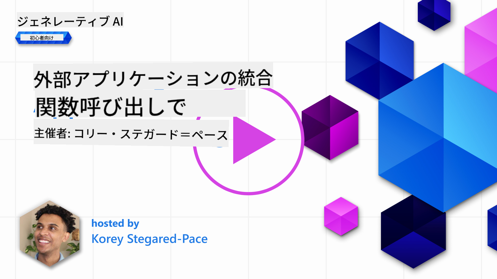
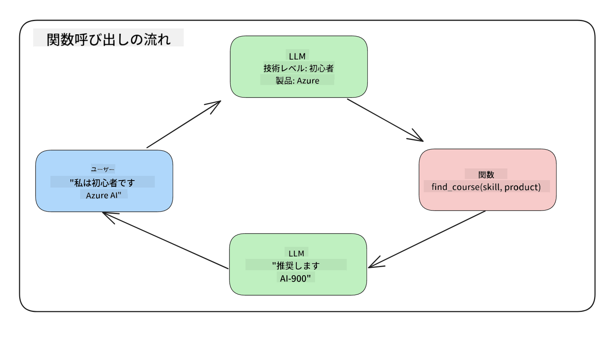
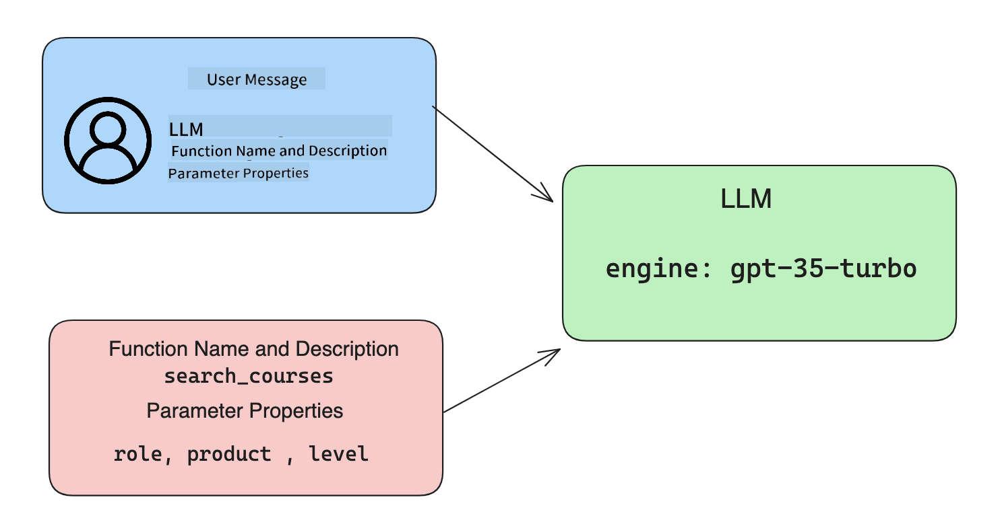

<!--
CO_OP_TRANSLATOR_METADATA:
{
  "original_hash": "77a48a201447be19aa7560706d6f93a0",
  "translation_date": "2025-05-19T21:23:04+00:00",
  "source_file": "11-integrating-with-function-calling/README.md",
  "language_code": "ja"
}
-->
# 関数呼び出しとの統合

[](https://aka.ms/gen-ai-lesson11-gh?WT.mc_id=academic-105485-koreyst)

これまでのレッスンでかなりのことを学びましたが、さらに改善できることがあります。対応できることの一つは、より一貫した応答形式を取得して、応答を下流で扱いやすくする方法です。また、他の情報源からデータを追加してアプリケーションをさらに豊かにしたい場合もあります。

この章では、上記の問題に対処することを目指しています。

## はじめに

このレッスンでは以下を扱います：

- 関数呼び出しとは何か、その使用例を説明する。
- Azure OpenAIを使用して関数呼び出しを作成する。
- アプリケーションに関数呼び出しを統合する方法。

## 学習目標

このレッスンの終わりまでに、以下ができるようになります：

- 関数呼び出しを使用する目的を説明する。
- Azure OpenAIサービスを使用して関数呼び出しを設定する。
- アプリケーションの使用例に合わせた効果的な関数呼び出しを設計する。

## シナリオ：チャットボットを関数で改善する

このレッスンでは、教育系スタートアップの機能を構築し、ユーザーがチャットボットを使って技術コースを見つけられるようにしたいと思います。ユーザーのスキルレベル、現在の役割、興味のある技術に合ったコースを推薦します。

このシナリオを完了するために、以下を組み合わせて使用します：

- `Azure OpenAI`を使用してユーザー向けのチャット体験を作成する。
- `Microsoft Learn Catalog API`を使用してユーザーのリクエストに基づいてコースを見つける手助けをする。
- `Function Calling`を使用してユーザーのクエリを関数に送信し、APIリクエストを行う。

まず、なぜ関数呼び出しを使用するのかを見てみましょう：

## なぜ関数呼び出しを使用するのか

関数呼び出しを使用する前は、LLMからの応答は構造化されておらず、一貫性がありませんでした。開発者は、応答の各バリエーションを処理できるようにするために複雑な検証コードを書く必要がありました。ユーザーは「ストックホルムの現在の天気は？」のような質問に答えることができませんでした。これは、モデルがデータのトレーニング時点に制限されていたためです。

Azure OpenAIサービスの機能呼び出しは、以下の制限を克服するための機能です：

- **一貫した応答形式**。応答形式をより良く制御できれば、応答を他のシステムに統合しやすくなります。
- **外部データ**。チャットコンテキストでアプリケーションの他の情報源からのデータを使用する能力。

## シナリオを通じて問題を説明する

> 以下のシナリオを実行したい場合は、[付属のノートブック](../../../11-integrating-with-function-calling/python/aoai-assignment.ipynb)を使用することをお勧めします。単に読み進めるだけでも、関数が問題の解決に役立つ状況を説明しようとしていることを理解できます。

応答形式の問題を説明する例を見てみましょう：

例えば、学生データのデータベースを作成して、適切なコースを提案したいとします。以下に、非常に似たデータを含む学生の説明が2つあります。

1. Azure OpenAIリソースへの接続を作成する：

   ```python
   import os
   import json
   from openai import AzureOpenAI
   from dotenv import load_dotenv
   load_dotenv()

   client = AzureOpenAI(
   api_key=os.environ['AZURE_OPENAI_API_KEY'],  # this is also the default, it can be omitted
   api_version = "2023-07-01-preview"
   )

   deployment=os.environ['AZURE_OPENAI_DEPLOYMENT']
   ```

   以下は、Azure OpenAIへの接続を設定するためのPythonコードで、`api_type`, `api_base`, `api_version` and `api_key`.

1. Creating two student descriptions using variables `student_1_description` and `student_2_description`を設定します。

   ```python
   student_1_description="Emily Johnson is a sophomore majoring in computer science at Duke University. She has a 3.7 GPA. Emily is an active member of the university's Chess Club and Debate Team. She hopes to pursue a career in software engineering after graduating."

   student_2_description = "Michael Lee is a sophomore majoring in computer science at Stanford University. He has a 3.8 GPA. Michael is known for his programming skills and is an active member of the university's Robotics Club. He hopes to pursue a career in artificial intelligence after finishing his studies."
   ```

   上記の学生の説明をLLMに送信してデータを解析します。このデータは後でアプリケーションで使用され、APIに送信したりデータベースに保存したりできます。

1. LLMに関心のある情報を指示する2つの同一のプロンプトを作成しましょう：

   ```python
   prompt1 = f'''
   Please extract the following information from the given text and return it as a JSON object:

   name
   major
   school
   grades
   club

   This is the body of text to extract the information from:
   {student_1_description}
   '''

   prompt2 = f'''
   Please extract the following information from the given text and return it as a JSON object:

   name
   major
   school
   grades
   club

   This is the body of text to extract the information from:
   {student_2_description}
   '''
   ```

   上記のプロンプトは、LLMに情報を抽出し、応答をJSON形式で返すように指示しています。

1. プロンプトとAzure OpenAIへの接続を設定した後、`openai.ChatCompletion`. We store the prompt in the `messages` variable and assign the role to `user`を使用してプロンプトをLLMに送信します。これはユーザーがチャットボットに書き込むメッセージを模倣するためです。

   ```python
   # response from prompt one
   openai_response1 = client.chat.completions.create(
   model=deployment,
   messages = [{'role': 'user', 'content': prompt1}]
   )
   openai_response1.choices[0].message.content

   # response from prompt two
   openai_response2 = client.chat.completions.create(
   model=deployment,
   messages = [{'role': 'user', 'content': prompt2}]
   )
   openai_response2.choices[0].message.content
   ```

これで、両方のリクエストをLLMに送信し、応答を受け取って`openai_response1['choices'][0]['message']['content']`.

1. Lastly, we can convert the response to JSON format by calling `json.loads`のように見つけることができます：

   ```python
   # Loading the response as a JSON object
   json_response1 = json.loads(openai_response1.choices[0].message.content)
   json_response1
   ```

   応答1：

   ```json
   {
     "name": "Emily Johnson",
     "major": "computer science",
     "school": "Duke University",
     "grades": "3.7",
     "club": "Chess Club"
   }
   ```

   応答2：

   ```json
   {
     "name": "Michael Lee",
     "major": "computer science",
     "school": "Stanford University",
     "grades": "3.8 GPA",
     "club": "Robotics Club"
   }
   ```

   プロンプトは同じで、説明も似ているにもかかわらず、`Grades` property formatted differently, as we can sometimes get the format `3.7` or `3.7 GPA` for example.

   This result is because the LLM takes unstructured data in the form of the written prompt and returns also unstructured data. We need to have a structured format so that we know what to expect when storing or using this data

So how do we solve the formatting problem then? By using functional calling, we can make sure that we receive structured data back. When using function calling, the LLM does not actually call or run any functions. Instead, we create a structure for the LLM to follow for its responses. We then use those structured responses to know what function to run in our applications.



We can then take what is returned from the function and send this back to the LLM. The LLM will then respond using natural language to answer the user's query.

## Use Cases for using function calls

There are many different use cases where function calls can improve your app like:

- **Calling External Tools**. Chatbots are great at providing answers to questions from users. By using function calling, the chatbots can use messages from users to complete certain tasks. For example, a student can ask the chatbot to "Send an email to my instructor saying I need more assistance with this subject". This can make a function call to `send_email(to: string, body: string)`

- **Create API or Database Queries**. Users can find information using natural language that gets converted into a formatted query or API request. An example of this could be a teacher who requests "Who are the students that completed the last assignment" which could call a function named `get_completed(student_name: string, assignment: int, current_status: string)`

- **Creating Structured Data**. Users can take a block of text or CSV and use the LLM to extract important information from it. For example, a student can convert a Wikipedia article about peace agreements to create AI flashcards. This can be done by using a function called `get_important_facts(agreement_name: string, date_signed: string, parties_involved: list)`

## Creating Your First Function Call

The process of creating a function call includes 3 main steps:

1. **Calling** the Chat Completions API with a list of your functions and a user message.
2. **Reading** the model's response to perform an action i.e. execute a function or API Call.
3. **Making** another call to Chat Completions API with the response from your function to use that information to create a response to the user.



### Step 1 - creating messages

The first step is to create a user message. This can be dynamically assigned by taking the value of a text input or you can assign a value here. If this is your first time working with the Chat Completions API, we need to define the `role` and the `content` of the message.

The `role` can be either `system` (creating rules), `assistant` (the model) or `user` (the end-user). For function calling, we will assign this as `user`の値と例の質問が異なることがわかります。

```python
messages= [ {"role": "user", "content": "Find me a good course for a beginner student to learn Azure."} ]
```

異なる役割を割り当てることで、LLMがシステムが何かを言っているのか、ユーザーが何かを言っているのかが明確になり、LLMが基づくことができる会話履歴を構築するのに役立ちます。

### ステップ2 - 関数の作成

次に、関数とそのパラメータを定義します。ここでは、`search_courses` but you can create multiple functions.

> **Important** : Functions are included in the system message to the LLM and will be included in the amount of available tokens you have available.

Below, we create the functions as an array of items. Each item is a function and has properties `name`, `description` and `parameters`という1つの関数だけを使用します：

```python
functions = [
   {
      "name":"search_courses",
      "description":"Retrieves courses from the search index based on the parameters provided",
      "parameters":{
         "type":"object",
         "properties":{
            "role":{
               "type":"string",
               "description":"The role of the learner (i.e. developer, data scientist, student, etc.)"
            },
            "product":{
               "type":"string",
               "description":"The product that the lesson is covering (i.e. Azure, Power BI, etc.)"
            },
            "level":{
               "type":"string",
               "description":"The level of experience the learner has prior to taking the course (i.e. beginner, intermediate, advanced)"
            }
         },
         "required":[
            "role"
         ]
      }
   }
]
```

以下に各関数インスタンスを詳しく説明します：

- `name` - The name of the function that we want to have called.
- `description` - This is the description of how the function works. Here it's important to be specific and clear.
- `parameters` - A list of values and format that you want the model to produce in its response. The parameters array consists of items where the items have the following properties:
  1.  `type` - The data type of the properties will be stored in.
  1.  `properties` - List of the specific values that the model will use for its response
      1. `name` - The key is the name of the property that the model will use in its formatted response, for example, `product`.
      1. `type` - The data type of this property, for example, `string`.
      1. `description` - Description of the specific property.

There's also an optional property `required` - required property for the function call to be completed.

### Step 3 - Making the function call

After defining a function, we now need to include it in the call to the Chat Completion API. We do this by adding `functions` to the request. In this case `functions=functions`.

There is also an option to set `function_call` to `auto`. This means we will let the LLM decide which function should be called based on the user message rather than assigning it ourselves.

Here's some code below where we call `ChatCompletion.create`, note how we set `functions=functions` and `function_call="auto"`を使用して、関数を呼び出すタイミングをLLMに選択させます：

```python
response = client.chat.completions.create(model=deployment,
                                        messages=messages,
                                        functions=functions,
                                        function_call="auto")

print(response.choices[0].message)
```

返ってくる応答は次のようになります：

```json
{
  "role": "assistant",
  "function_call": {
    "name": "search_courses",
    "arguments": "{\n  \"role\": \"student\",\n  \"product\": \"Azure\",\n  \"level\": \"beginner\"\n}"
  }
}
```

ここでは、関数`search_courses` was called and with what arguments, as listed in the `arguments` property in the JSON response.

The conclusion the LLM was able to find the data to fit the arguments of the function as it was extracting it from the value provided to the `messages` parameter in the chat completion call. Below is a reminder of the `messages`の値を確認できます：

```python
messages= [ {"role": "user", "content": "Find me a good course for a beginner student to learn Azure."} ]
```

ご覧のように、`student`, `Azure` and `beginner` was extracted from `messages` and set as input to the function. Using functions this way is a great way to extract information from a prompt but also to provide structure to the LLM and have reusable functionality.

Next, we need to see how we can use this in our app.

## Integrating Function Calls into an Application

After we have tested the formatted response from the LLM, we can now integrate this into an application.

### Managing the flow

To integrate this into our application, let's take the following steps:

1. First, let's make the call to the OpenAI services and store the message in a variable called `response_message`の値が表示されます。

   ```python
   response_message = response.choices[0].message
   ```

1. 次に、Microsoft Learn APIを呼び出してコースのリストを取得する関数を定義します：

   ```python
   import requests

   def search_courses(role, product, level):
     url = "https://learn.microsoft.com/api/catalog/"
     params = {
        "role": role,
        "product": product,
        "level": level
     }
     response = requests.get(url, params=params)
     modules = response.json()["modules"]
     results = []
     for module in modules[:5]:
        title = module["title"]
        url = module["url"]
        results.append({"title": title, "url": url})
     return str(results)
   ```

   ここで、`functions` variable. We're also making real external API calls to fetch the data we need. In this case, we go against the Microsoft Learn API to search for training modules.

Ok, so we created `functions` variables and a corresponding Python function, how do we tell the LLM how to map these two together so our Python function is called?

1. To see if we need to call a Python function, we need to look into the LLM response and see if `function_call`がその一部であり、指摘された関数を呼び出す実際のPython関数を作成します。以下に示すようにチェックを行う方法です：

   ```python
   # Check if the model wants to call a function
   if response_message.function_call.name:
    print("Recommended Function call:")
    print(response_message.function_call.name)
    print()

    # Call the function.
    function_name = response_message.function_call.name

    available_functions = {
            "search_courses": search_courses,
    }
    function_to_call = available_functions[function_name]

    function_args = json.loads(response_message.function_call.arguments)
    function_response = function_to_call(**function_args)

    print("Output of function call:")
    print(function_response)
    print(type(function_response))


    # Add the assistant response and function response to the messages
    messages.append( # adding assistant response to messages
        {
            "role": response_message.role,
            "function_call": {
                "name": function_name,
                "arguments": response_message.function_call.arguments,
            },
            "content": None
        }
    )
    messages.append( # adding function response to messages
        {
            "role": "function",
            "name": function_name,
            "content":function_response,
        }
    )
   ```

   これらの3行は、関数名、引数を抽出し、呼び出しを行うことを保証します：

   ```python
   function_to_call = available_functions[function_name]

   function_args = json.loads(response_message.function_call.arguments)
   function_response = function_to_call(**function_args)
   ```

   以下はコードを実行した結果です：

   **出力**

   ```Recommended Function call:
   {
     "name": "search_courses",
     "arguments": "{\n  \"role\": \"student\",\n  \"product\": \"Azure\",\n  \"level\": \"beginner\"\n}"
   }

   Output of function call:
   [{'title': 'Describe concepts of cryptography', 'url': 'https://learn.microsoft.com/training/modules/describe-concepts-of-cryptography/?
   WT.mc_id=api_CatalogApi'}, {'title': 'Introduction to audio classification with TensorFlow', 'url': 'https://learn.microsoft.com/en-
   us/training/modules/intro-audio-classification-tensorflow/?WT.mc_id=api_CatalogApi'}, {'title': 'Design a Performant Data Model in Azure SQL
   Database with Azure Data Studio', 'url': 'https://learn.microsoft.com/training/modules/design-a-data-model-with-ads/?
   WT.mc_id=api_CatalogApi'}, {'title': 'Getting started with the Microsoft Cloud Adoption Framework for Azure', 'url':
   'https://learn.microsoft.com/training/modules/cloud-adoption-framework-getting-started/?WT.mc_id=api_CatalogApi'}, {'title': 'Set up the
   Rust development environment', 'url': 'https://learn.microsoft.com/training/modules/rust-set-up-environment/?WT.mc_id=api_CatalogApi'}]
   <class 'str'>
   ```

1. 次に、更新されたメッセージ`messages`をLLMに送信し、API JSON形式の応答ではなく自然言語の応答を受け取ります。

   ```python
   print("Messages in next request:")
   print(messages)
   print()

   second_response = client.chat.completions.create(
      messages=messages,
      model=deployment,
      function_call="auto",
      functions=functions,
      temperature=0
         )  # get a new response from GPT where it can see the function response


   print(second_response.choices[0].message)
   ```

   **出力**

   ```python
   {
     "role": "assistant",
     "content": "I found some good courses for beginner students to learn Azure:\n\n1. [Describe concepts of cryptography] (https://learn.microsoft.com/training/modules/describe-concepts-of-cryptography/?WT.mc_id=api_CatalogApi)\n2. [Introduction to audio classification with TensorFlow](https://learn.microsoft.com/training/modules/intro-audio-classification-tensorflow/?WT.mc_id=api_CatalogApi)\n3. [Design a Performant Data Model in Azure SQL Database with Azure Data Studio](https://learn.microsoft.com/training/modules/design-a-data-model-with-ads/?WT.mc_id=api_CatalogApi)\n4. [Getting started with the Microsoft Cloud Adoption Framework for Azure](https://learn.microsoft.com/training/modules/cloud-adoption-framework-getting-started/?WT.mc_id=api_CatalogApi)\n5. [Set up the Rust development environment](https://learn.microsoft.com/training/modules/rust-set-up-environment/?WT.mc_id=api_CatalogApi)\n\nYou can click on the links to access the courses."
   }

   ```

## 課題

Azure OpenAI関数呼び出しの学習を続けるために、以下を構築できます：

- 学習者がより多くのコースを見つけるのに役立つ関数のより多くのパラメータ。
- 学習者の母国語のような情報を取得する別の関数呼び出しを作成する。
- 関数呼び出しやAPI呼び出しが適切なコースを返さない場合のエラー処理を作成する。

ヒント：[Learn APIリファレンスドキュメント](https://learn.microsoft.com/training/support/catalog-api-developer-reference?WT.mc_id=academic-105485-koreyst)ページを参照して、このデータがどのように、どこで利用可能かを確認してください。

## 素晴らしい仕事！旅を続けましょう

このレッスンを完了した後、[Generative AI Learning collection](https://aka.ms/genai-collection?WT.mc_id=academic-105485-koreyst)をチェックして、Generative AIの知識をさらに向上させましょう！

レッスン12に進み、AIアプリケーションのUX設計について学びましょう！[デザインUX for AI applications](../12-designing-ux-for-ai-applications/README.md?WT.mc_id=academic-105485-koreyst)

**免責事項**：
このドキュメントはAI翻訳サービス[Co-op Translator](https://github.com/Azure/co-op-translator)を使用して翻訳されています。正確性を期していますが、自動翻訳には誤りや不正確さが含まれる可能性があることをご承知ください。元の言語によるオリジナルのドキュメントが権威ある情報源とみなされるべきです。重要な情報については、プロの人間による翻訳をお勧めします。この翻訳の使用に起因する誤解や誤った解釈に関して、当方は責任を負いません。