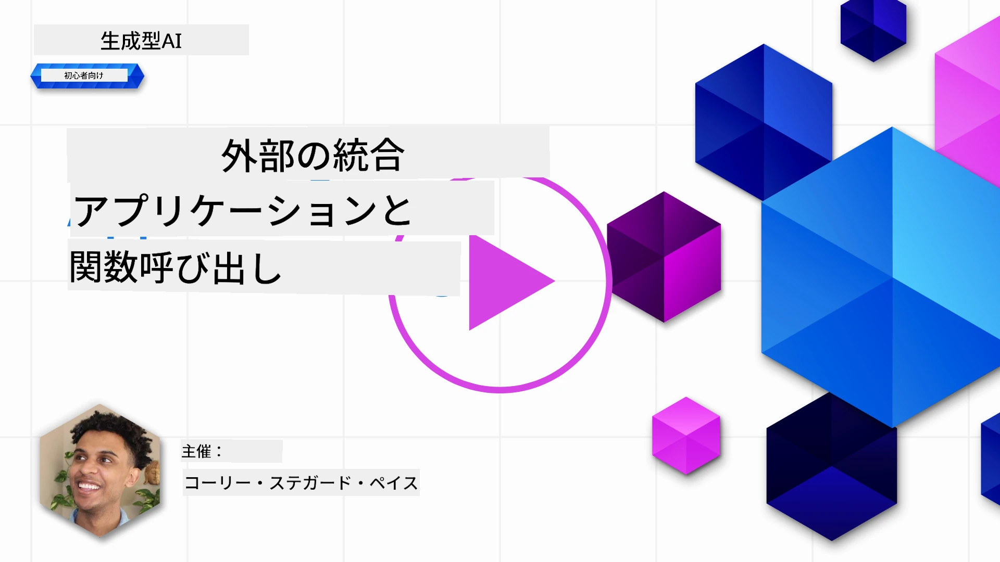
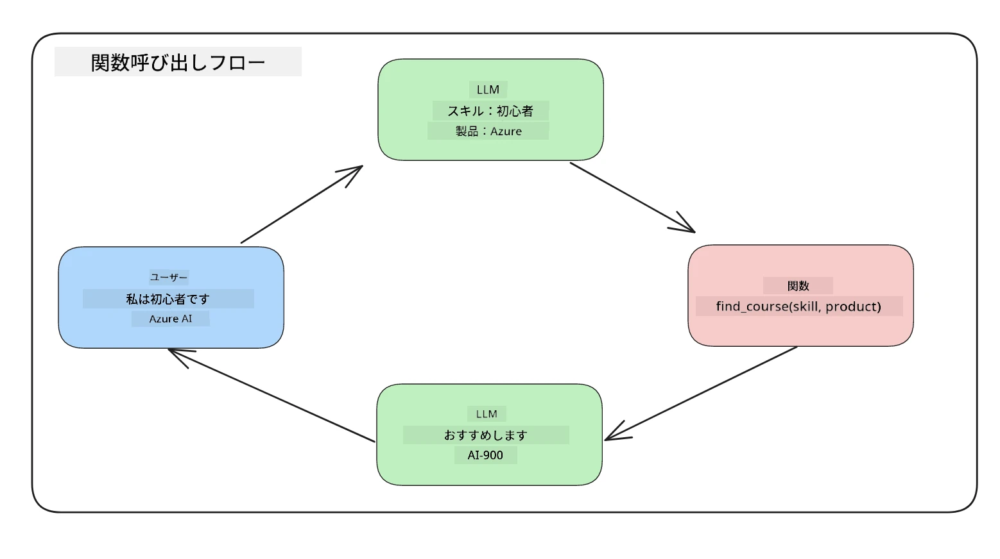
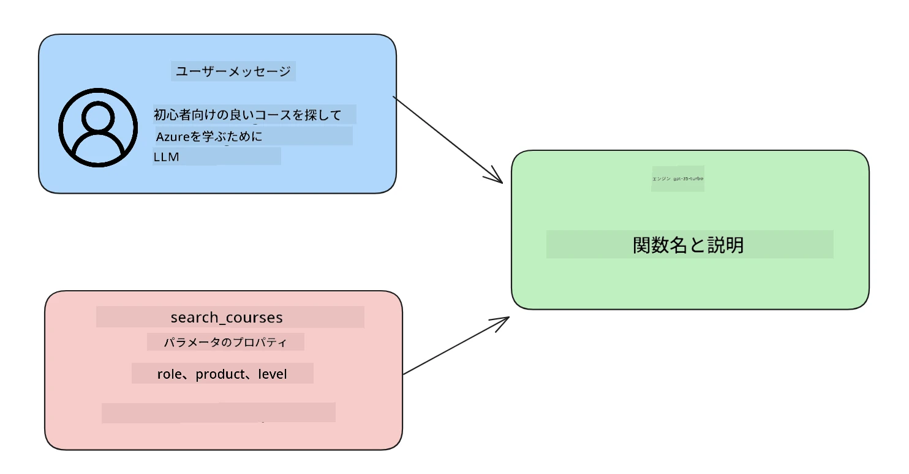

# 関数呼び出しとの統合

[](https://youtu.be/DgUdCLX8qYQ?si=f1ouQU5HQx6F8Gl2)

これまでのレッスンでかなりのことを学んできました。しかし、さらに改善の余地があります。対処すべき点としては、応答の下流処理をしやすくするために、より一貫した応答フォーマットを得る方法が挙げられます。また、他のソースからデータを追加してアプリケーションをさらに充実させたい場合もあるでしょう。

上記の問題がこの章で解決しようとする課題です。

## はじめに

このレッスンでは以下を扱います：

- 関数呼び出しとは何か、そのユースケースの説明。
- Azure OpenAI を使った関数呼び出しの作成。
- 関数呼び出しをアプリケーションに統合する方法。

## 学習目標

このレッスンの終了時には以下ができるようになります：

- 関数呼び出しを使う目的を説明できる。
- Azure OpenAI サービスで関数呼び出しを設定できる。
- アプリケーションのユースケースに適した効果的な関数呼び出しを設計できる。

## シナリオ：関数でチャットボットを改善する

このレッスンでは、技術コースを見つけられるチャットボット機能を教育系スタートアップ向けに構築します。ユーザーのスキルレベル、現在の役割、興味のある技術に合ったコースを推薦します。

このシナリオを完成させるために、以下を組み合わせて使用します：

- ユーザー向けチャット体験のための `Azure OpenAI`。
- ユーザーの要求に基づいてコースを見つけるための `Microsoft Learn Catalog API`。
- ユーザーのクエリを関数に送信し、API要求を行うための `Function Calling`。

まずは、なぜ関数呼び出しを使いたいのか見てみましょう：

## なぜ関数呼び出しを使うのか

関数呼び出し以前は、LLMの応答は非構造化で一貫性がありませんでした。開発者は応答のバリエーションごとに複雑な検証コードを書く必要がありました。ユーザーは「ストックホルムの現在の天気は？」のような質問に答えてもらえませんでした。これはモデルがデータを訓練した時点での制限があったためです。

関数呼び出しは Azure OpenAI サービスの機能であり、以下の制限を克服します：

- <strong>一貫した応答フォーマット</strong>。応答フォーマットをより制御できれば、下流の他のシステムへの統合が容易になります。
- <strong>外部データ</strong>。チャットコンテキストでアプリケーションの他のソースのデータを使う能力。

## シナリオによる問題の説明

> 下記のシナリオを実行したい場合は、[付属のノートブック](./python/aoai-assignment.ipynb?WT.mc_id=academic-105485-koreyst)の使用をお勧めします。問題を示すために関数がどのように役立つかを解説しているので、読み進めるだけでも構いません。

応答フォーマットの問題を示す例を見てみましょう：

学生データのデータベースを作成し、適切なコースを提案するとします。以下に、似た内容の学生記述が2つあります。

1. Azure OpenAI リソースへの接続を作成します：

   ```python
   import os
   import json
   from openai import OpenAI
   from dotenv import load_dotenv
   load_dotenv()

   # Responses API は Azure OpenAI (Microsoft Foundry) v1 エンドポイントから提供されます
   # そのため、OpenAI クライアントは <your-endpoint>/openai/v1/ を指すように設定します。
   endpoint = os.environ['AZURE_OPENAI_ENDPOINT']
   client = OpenAI(
   api_key=os.environ['AZURE_OPENAI_API_KEY'],
   base_url=f"{endpoint.rstrip('/')}/openai/v1/",
   )

   deployment=os.environ['AZURE_OPENAI_DEPLOYMENT']
   ```

   以下は Azure OpenAI への接続設定用の Python コードです。v1 エンドポイントを使うため、`api_key` と `base_url` のみ設定すればよく、`api_version` は不要です。

1. `student_1_description` と `student_2_description` 変数で2つの学生記述を作成します。

   ```python
   student_1_description="Emily Johnson is a sophomore majoring in computer science at Duke University. She has a 3.7 GPA. Emily is an active member of the university's Chess Club and Debate Team. She hopes to pursue a career in software engineering after graduating."

   student_2_description = "Michael Lee is a sophomore majoring in computer science at Stanford University. He has a 3.8 GPA. Michael is known for his programming skills and is an active member of the university's Robotics Club. He hopes to pursue a career in artificial intelligence after finishing his studies."
   ```

   上記の学生記述を LLM に送ってデータを解析させます。このデータは後でアプリケーションで使ったり、APIへ送信したり、データベースに保存したりします。

1. LLMに知りたい情報を指示するため、同じプロンプトを2つ作成します：

   ```python
   prompt1 = f'''
   Please extract the following information from the given text and return it as a JSON object:

   name
   major
   school
   grades
   club

   This is the body of text to extract the information from:
   {student_1_description}
   '''

   prompt2 = f'''
   Please extract the following information from the given text and return it as a JSON object:

   name
   major
   school
   grades
   club

   This is the body of text to extract the information from:
   {student_2_description}
   '''
   ```

   上記のプロンプトは LLM に情報を抽出し、JSON形式で応答するよう指示しています。

1. プロンプトと Azure OpenAI への接続設定をしたので、`client.responses.create` を使ってプロンプトを LLM に送信します。プロンプトは `input` 変数に格納し、ロールは `user` に割り当てます。これはユーザーがチャットボットに書き込むメッセージを模倣しています。

   ```python
   # プロンプト1からの応答
   openai_response1 = client.responses.create(
   model=deployment,
   input = [{'role': 'user', 'content': prompt1}],
   store=False,
   )
   openai_response1.output_text

   # プロンプト2からの応答
   openai_response2 = client.responses.create(
   model=deployment,
   input = [{'role': 'user', 'content': prompt2}],
   store=False,
   )
   openai_response2.output_text
   ```

両方のリクエストを LLM に送信し、`openai_response1.output_text` のように返答を調べます。

1. 最後に、`json.loads` を呼んで応答を JSON 形式に変換します：

   ```python
   # レスポンスをJSONオブジェクトとして読み込んでいます
   json_response1 = json.loads(openai_response1.output_text)
   json_response1
   ```

   応答1：

   ```json
   {
     "name": "Emily Johnson",
     "major": "computer science",
     "school": "Duke University",
     "grades": "3.7",
     "club": "Chess Club"
   }
   ```

   応答2：

   ```json
   {
     "name": "Michael Lee",
     "major": "computer science",
     "school": "Stanford University",
     "grades": "3.8 GPA",
     "club": "Robotics Club"
   }
   ```

   プロンプトは同じで記述も似ているのに、`Grades` プロパティの値は時に `3.7`、時に `3.7 GPA` のように異なるフォーマットがあります。

   これは、LLMが書かれたプロンプトを非構造化データとして受け取り、同じく非構造化の応答を返しているためです。データを保存または利用するときに、何を期待すべきか分かるよう、構造化形式が必要です。

それでは、フォーマット問題をどう解決するか？関数呼び出しを使うと、構造化データを確実に受け取れます。関数呼び出し時、LLMは実際に関数を呼んだり実行したりしません。代わりに、応答フォーマットに従う構造を作成します。その構造化された応答を使い、アプリケーションでどの関数を実行するか判断します。



関数から返されたものを取り、そのまま LLM に返します。LLM は続いて自然言語でユーザーの問いに答えます。

## 関数呼び出しのユースケース

関数呼び出しがアプリを改善するユースケースは多岐にわたります：

- <strong>外部ツールの呼び出し</strong>。チャットボットはユーザーの質問に答えるのが得意です。関数呼び出しを使うと、ユーザーのメッセージを基に特定のタスクを完了できます。例えば、学生が「この科目の助けがもっと必要なので先生にメールを送りたい」とチャットボットに頼むと、`send_email(to: string, body: string)` という関数呼び出しが実行されます。

- **APIやデータベースクエリの作成**。ユーザーは自然言語で情報を探し、それがフォーマット済みのクエリやAPIリクエストに変換されます。例として教師が「前回の課題を完了した学生は誰か？」と質問し、`get_completed(student_name: string, assignment: int, current_status: string)` という関数を呼ぶ場合があります。

- <strong>構造化データの作成</strong>。テキストやCSVのブロックから重要情報を抽出するのに LLM を使えます。例えば学生が平和協定についての Wikipedia 記事を AI フラッシュカード用に変換する場合、`get_important_facts(agreement_name: string, date_signed: string, parties_involved: list)` という関数を使います。

## 最初の関数呼び出しの作成

関数呼び出しを作成するプロセスは主に3ステップあります：

1. 関数（ツール）の一覧とユーザーメッセージを使い Responses API を呼び出す。
2. モデルの応答を読み取り、関数やAPIコールを実行するなどのアクションを決定する。
3. 関数の応答を使い、それを元にユーザーへの応答を作成するため再度 Responses API に呼び出す。



### ステップ1 - メッセージ作成

最初のステップはユーザーメッセージを作成することです。これはテキスト入力の値を動的に割り当てるか、ここで初期値を設定できます。Responses API 初利用の場合、メッセージの `role` と `content` を定義する必要があります。

`role` は `system`（ルール作成）、`assistant`（モデル）、`user`（エンドユーザー）のいずれかです。関数呼び出しでは、これを `user` とし例題質問を割り当てます。

```python
messages= [ {"role": "user", "content": "Find me a good course for a beginner student to learn Azure."} ]
```

役割を異なるものに割り当てることで、LLMは発言者がシステムなのかユーザーなのかを明確にし、会話履歴の構築に役立ちます。

### ステップ2 - 関数作成

次に関数と関数のパラメーターを定義します。ここでは `search_courses` という関数を1つだけ使いますが、複数の関数を作っても構いません。

> <strong>重要</strong> : 関数は LLM へのシステムメッセージに含まれ、使用可能なトークン数を消費します。

下記のように、関数を平坦な Responses API 形式のツール配列として作成します。各項目は `type`, `name`, `description`, `parameters` プロパティを持ちます：

```python
functions = [
   {
      "type":"function",
      "name":"search_courses",
      "description":"Retrieves courses from the search index based on the parameters provided",
      "parameters":{
         "type":"object",
         "properties":{
            "role":{
               "type":"string",
               "description":"The role of the learner (i.e. developer, data scientist, student, etc.)"
            },
            "product":{
               "type":"string",
               "description":"The product that the lesson is covering (i.e. Azure, Power BI, etc.)"
            },
            "level":{
               "type":"string",
               "description":"The level of experience the learner has prior to taking the course (i.e. beginner, intermediate, advanced)"
            }
         },
         "required":[
            "role"
         ]
      }
   }
]
```

各関数インスタンスの詳しい説明は以下です：

- `name` - 呼び出したい関数の名前。
- `description` - 関数の働きに関する説明。ここでは具体的かつ明確にすることが重要です。
- `parameters` - モデルが応答に含める値とフォーマットのリスト。パラメーター配列は、以下のプロパティを持つ項目から構成されます：
  1.  `type` - プロパティのデータ型。
  1.  `properties` - モデルが応答で使う具体的な値のリスト。
      1. `name` - モデルがフォーマットした応答で使うプロパティの名前（例：`product`）。
      1. `type` - このプロパティのデータ型（例：`string`）。
      1. `description` - そのプロパティの説明。

さらにオプションで `required` - 関数呼び出し完了に必須なプロパティがあります。

### ステップ3 - 関数呼び出しの実行

関数を定義した後、それを Responses API の呼び出しに含める必要があります。これはリクエストに `tools` を追加し、ここでは `tools=functions` とします。

またオプションで `tool_choice` を `auto` にできます。これはユーザーメッセージに基づき、どの関数を呼ぶかを LLM に決めさせる設定です。

以下のコードでは `client.responses.create` を呼び出し、`tools=functions` と `tool_choice="auto"` を設定して関数呼び出しを LLM に任せる様子を示します：

```python
response = client.responses.create(model=deployment,
                                        input=messages,
                                        tools=functions,
                                        tool_choice="auto",
                                        store=False)

print(response.output)
```

戻ってきた応答には `response.output` 内に `function_call` 項目があります。例は以下の通りです：

```json
{
  "type": "function_call",
  "name": "search_courses",
  "call_id": "call_abc123",
  "arguments": "{\n  \"role\": \"student\",\n  \"product\": \"Azure\",\n  \"level\": \"beginner\"\n}"
}
```

ここでは `search_courses` 関数が呼ばれ、JSON応答の `arguments` プロパティに引数が記載されています。

LLM は回答用に与えられた `input` パラメータの値から抽出したデータを関数の引数に合うよう見つけられた結論です。以下は `messages` の値の再確認です：

```python
messages= [ {"role": "user", "content": "Find me a good course for a beginner student to learn Azure."} ]
```

ご覧の通り、`student`、`Azure`、`beginner` が `messages` から抽出され関数の入力に設定されています。このように関数を使うのは、プロンプトから情報を抽出しながら、LLM に構造を与え再利用可能な機能を持たせる良い方法です。

次に、これをアプリでどう使うか見ていきます。

## アプリケーションへの関数呼び出しの統合

形式化された応答を LLM から得た後、これをアプリに統合します。

### フローの管理

アプリに統合するため以下のステップを行います：

1. まず、OpenAI サービスに呼び出しを行い、応答の `output` から関数呼び出し項目を抽出します。

   ```python
   response_items = response.output
   tool_calls = [item for item in response_items if item.type == "function_call"]
   ```

1. 次に、Microsoft Learn API を呼び出してコース一覧を取得する関数を定義します：

   ```python
   import requests

   def search_courses(role, product, level):
     url = "https://learn.microsoft.com/api/catalog/"
     params = {
        "role": role,
        "product": product,
        "level": level
     }
     response = requests.get(url, params=params)
     modules = response.json()["modules"]
     results = []
     for module in modules[:5]:
        title = module["title"]
        url = module["url"]
        results.append({"title": title, "url": url})
     return str(results)
   ```

   ここでは Python の関数を作成し、`functions` 変数で示した関数名にマッピングしています。また、必要な外部API呼び出しも実際に行っています。今回は Microsoft Learn API を使って研修モジュールを検索します。

さて、`functions` 変数と対応する Python 関数を作成しましたが、LLM にどのようにマッピングして Python 関数を呼ぶかを知らせるには？

1. Python 関数を呼ぶ必要があるかどうかは、LLM の応答に `function_call` 項目があるかを確認し、指定された関数を呼び出します。チェック例は以下です：

   ```python
   # モデルが関数を呼び出したいかどうかを確認します
   if tool_calls:
    for tool_call in tool_calls:
     print("Recommended Function call:")
     print(tool_call.name)
     print()

     # 関数を呼び出します。
     function_name = tool_call.name

     available_functions = {
             "search_courses": search_courses,
     }
     function_to_call = available_functions[function_name]

     function_args = json.loads(tool_call.arguments)
     function_response = function_to_call(**function_args)

     print("Output of function call:")
     print(function_response)
     print(type(function_response))

     # 関数の呼び出しとその結果を会話に戻します。
     # モデルのfunction_call項目は出力の前に追加する必要があります。
     messages.append(tool_call)  # アシスタントのfunction_call項目
     messages.append( # 関数の結果
         {
             "type": "function_call_output",
             "call_id": tool_call.call_id,
             "output": function_response,
         }
     )
   ```

   上記3行で関数名と引数を抽出し、関数を呼び出しています：

   ```python
   function_to_call = available_functions[function_name]

   function_args = json.loads(tool_call.arguments)
   function_response = function_to_call(**function_args)
   ```

   実行結果の出力例は以下です：

   <strong>出力</strong>

   ```Recommended Function call:
   {
     "name": "search_courses",
     "arguments": "{\n  \"role\": \"student\",\n  \"product\": \"Azure\",\n  \"level\": \"beginner\"\n}"
   }

   Output of function call:
   [{'title': 'Describe concepts of cryptography', 'url': 'https://learn.microsoft.com/training/modules/describe-concepts-of-cryptography/?
   WT.mc_id=api_CatalogApi'}, {'title': 'Introduction to audio classification with TensorFlow', 'url': 'https://learn.microsoft.com/en-
   us/training/modules/intro-audio-classification-tensorflow/?WT.mc_id=api_CatalogApi'}, {'title': 'Design a Performant Data Model in Azure SQL
   Database with Azure Data Studio', 'url': 'https://learn.microsoft.com/training/modules/design-a-data-model-with-ads/?
   WT.mc_id=api_CatalogApi'}, {'title': 'Getting started with the Microsoft Cloud Adoption Framework for Azure', 'url':
   'https://learn.microsoft.com/training/modules/cloud-adoption-framework-getting-started/?WT.mc_id=api_CatalogApi'}, {'title': 'Set up the
   Rust development environment', 'url': 'https://learn.microsoft.com/training/modules/rust-set-up-environment/?WT.mc_id=api_CatalogApi'}]
   <class 'str'>
   ```

1. 続いて更新したメッセージ `messages` を LLM に送信し、API JSON形式の応答ではなく自然言語の応答を受け取ります。

   ```python
   print("Messages in next request:")
   print(messages)
   print()

   second_response = client.responses.create(
      input=messages,
      model=deployment,
      tool_choice="auto",
      tools=functions,
      temperature=0,
      store=False,
         )  # 関数の応答を見ることができるモデルから新しい応答を取得する


   print(second_response.output_text)
   ```

   <strong>出力</strong>

   ```text
   I found some good courses for beginner students to learn Azure:

   1. [Describe concepts of cryptography](https://learn.microsoft.com/training/modules/describe-concepts-of-cryptography/?WT.mc_id=api_CatalogApi)
   2. [Introduction to audio classification with TensorFlow](https://learn.microsoft.com/training/modules/intro-audio-classification-tensorflow/?WT.mc_id=api_CatalogApi)
   3. [Design a Performant Data Model in Azure SQL Database with Azure Data Studio](https://learn.microsoft.com/training/modules/design-a-data-model-with-ads/?WT.mc_id=api_CatalogApi)
   4. [Getting started with the Microsoft Cloud Adoption Framework for Azure](https://learn.microsoft.com/training/modules/cloud-adoption-framework-getting-started/?WT.mc_id=api_CatalogApi)
   5. [Set up the Rust development environment](https://learn.microsoft.com/training/modules/rust-set-up-environment/?WT.mc_id=api_CatalogApi)

   You can click on the links to access the courses.
   ```

## 課題

Azure OpenAI の関数呼び出しの学習を続けるために以下を作成してください：

- 学習者がより多くのコースを探索できるように追加の関数パラメーター。

- 学習者の母国語など、より多くの情報を受け取る別の関数呼び出しを作成する
- 関数呼び出しおよび／またはAPI呼び出しが適切なコースを返さない場合のエラー処理を作成する

ヒント: このデータがどのようにどこで利用可能かを確認するには、[Learn API reference documentation](https://learn.microsoft.com/training/support/catalog-api-developer-reference?WT.mc_id=academic-105485-koreyst) ページを参照してください。

## 素晴らしい仕事です！次のステップへ進みましょう

このレッスンを終えたら、[Generative AI Learning collection](https://aka.ms/genai-collection?WT.mc_id=academic-105485-koreyst) をチェックして、生成AIの知識をさらに高めましょう！

レッスン12に進み、[AIアプリケーションのUXデザイン](../12-designing-ux-for-ai-applications/README.md?WT.mc_id=academic-105485-koreyst)について見ていきましょう！

---

<!-- CO-OP TRANSLATOR DISCLAIMER START -->
**免責事項**：
本書類は AI 翻訳サービス [Co-op Translator](https://github.com/Azure/co-op-translator) を使用して翻訳されています。正確性を期していますが、自動翻訳には誤りや不正確な部分が含まれる可能性があることをご承知おきください。原文の原語版が正式な情報源とみなされるべきです。重要な情報については、専門の人間による翻訳を推奨します。本翻訳の利用により生じたいかなる誤解や解釈違いについても、当方は責任を負いかねます。
<!-- CO-OP TRANSLATOR DISCLAIMER END -->