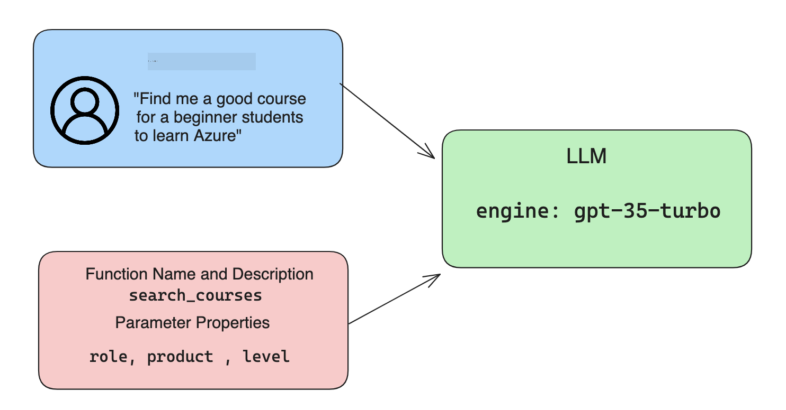

<!--
CO_OP_TRANSLATOR_METADATA:
{
  "original_hash": "77a48a201447be19aa7560706d6f93a0",
  "translation_date": "2025-07-09T14:26:51+00:00",
  "source_file": "11-integrating-with-function-calling/README.md",
  "language_code": "ja"
}
-->
# 関数呼び出しとの統合

[](https://aka.ms/gen-ai-lesson11-gh?WT.mc_id=academic-105485-koreyst)

これまでのレッスンでかなりのことを学びましたが、さらに改善の余地があります。特に、レスポンスの形式をより一貫性のあるものにして、後続の処理をしやすくする方法や、他のデータソースから情報を追加してアプリケーションをより充実させる方法について取り組みたいと思います。

これらの課題が本章で扱う内容です。

## はじめに

このレッスンでは以下を扱います：

- 関数呼び出しとは何か、その利用ケースの説明
- Azure OpenAIを使った関数呼び出しの作成
- 関数呼び出しをアプリケーションに統合する方法

## 学習目標

このレッスンを終える頃には、以下ができるようになります：

- 関数呼び出しを使う目的を説明できる
- Azure OpenAI Serviceで関数呼び出しを設定できる
- アプリケーションのユースケースに合わせた効果的な関数呼び出しを設計できる

## シナリオ：関数でチャットボットを改善する

このレッスンでは、教育系スタートアップ向けに、ユーザーがチャットボットを使って技術コースを探せる機能を作ります。ユーザーのスキルレベル、現在の役割、興味のある技術に合ったコースを推薦します。

このシナリオを実現するために、以下を組み合わせて使います：

- ユーザー向けのチャット体験を作るための `Azure OpenAI`
- ユーザーのリクエストに基づいてコースを探すための `Microsoft Learn Catalog API`
- ユーザーのクエリを関数に渡してAPIリクエストを行うための `Function Calling`

まずは、なぜ関数呼び出しを使いたいのかを見てみましょう。

## なぜ関数呼び出しか

関数呼び出しが登場する前は、LLMからのレスポンスは非構造的で一貫性がありませんでした。開発者はレスポンスのバリエーションに対応するために複雑なバリデーションコードを書く必要がありました。また、「ストックホルムの現在の天気は？」のような質問に答えることもできませんでした。これはモデルが学習時点のデータに制限されていたためです。

Function CallingはAzure OpenAI Serviceの機能で、以下の制約を克服します：

- **一貫したレスポンス形式**：レスポンス形式をより厳密に制御できれば、他のシステムへの統合が容易になります。
- **外部データの利用**：チャットの文脈でアプリケーションの他のデータソースを活用できます。

## シナリオで問題を説明する

> 下記のシナリオを実行したい場合は、[付属のノートブック](../../../11-integrating-with-function-calling/python/aoai-assignment.ipynb)の利用をおすすめします。ここでは関数が問題解決に役立つ例を示すため、読み進めるだけでも構いません。

レスポンス形式の問題を示す例を見てみましょう：

学生データのデータベースを作成し、適切なコースを提案したいとします。以下に、ほぼ同じ内容の2つの学生の説明があります。

1. Azure OpenAIリソースへの接続を作成します：

   ```python
   import os
   import json
   from openai import AzureOpenAI
   from dotenv import load_dotenv
   load_dotenv()

   client = AzureOpenAI(
   api_key=os.environ['AZURE_OPENAI_API_KEY'],  # this is also the default, it can be omitted
   api_version = "2023-07-01-preview"
   )

   deployment=os.environ['AZURE_OPENAI_DEPLOYMENT']
   ```

   これはPythonコードで、`api_type`、`api_base`、`api_version`、`api_key`を設定してAzure OpenAIへの接続を構成しています。

1. 変数 `student_1_description` と `student_2_description` を使って2つの学生説明を作成します。

   ```python
   student_1_description="Emily Johnson is a sophomore majoring in computer science at Duke University. She has a 3.7 GPA. Emily is an active member of the university's Chess Club and Debate Team. She hopes to pursue a career in software engineering after graduating."

   student_2_description = "Michael Lee is a sophomore majoring in computer science at Stanford University. He has a 3.8 GPA. Michael is known for his programming skills and is an active member of the university's Robotics Club. He hopes to pursue a career in artificial intelligence after finishing his studies."
   ```

   これらの学生説明をLLMに送り、データを解析してもらいます。このデータは後でアプリケーションで使ったり、APIに送ったり、データベースに保存したりできます。

1. LLMにどの情報を抽出してほしいか指示するため、同じ内容のプロンプトを2つ作成します：

   ```python
   prompt1 = f'''
   Please extract the following information from the given text and return it as a JSON object:

   name
   major
   school
   grades
   club

   This is the body of text to extract the information from:
   {student_1_description}
   '''

   prompt2 = f'''
   Please extract the following information from the given text and return it as a JSON object:

   name
   major
   school
   grades
   club

   This is the body of text to extract the information from:
   {student_2_description}
   '''
   ```

   これらのプロンプトは、LLMに情報を抽出しJSON形式で返すよう指示しています。

1. プロンプトとAzure OpenAIへの接続を設定したら、`openai.ChatCompletion`を使ってプロンプトをLLMに送信します。`messages`変数にプロンプトを格納し、役割を`user`に設定します。これはユーザーがチャットボットにメッセージを送る状況を模しています。

   ```python
   # response from prompt one
   openai_response1 = client.chat.completions.create(
   model=deployment,
   messages = [{'role': 'user', 'content': prompt1}]
   )
   openai_response1.choices[0].message.content

   # response from prompt two
   openai_response2 = client.chat.completions.create(
   model=deployment,
   messages = [{'role': 'user', 'content': prompt2}]
   )
   openai_response2.choices[0].message.content
   ```

両方のリクエストをLLMに送り、`openai_response1['choices'][0]['message']['content']`のようにレスポンスを確認します。

1. 最後に、`json.loads`を使ってレスポンスをJSON形式に変換します：

   ```python
   # Loading the response as a JSON object
   json_response1 = json.loads(openai_response1.choices[0].message.content)
   json_response1
   ```

   レスポンス1：

   ```json
   {
     "name": "Emily Johnson",
     "major": "computer science",
     "school": "Duke University",
     "grades": "3.7",
     "club": "Chess Club"
   }
   ```

   レスポンス2：

   ```json
   {
     "name": "Michael Lee",
     "major": "computer science",
     "school": "Stanford University",
     "grades": "3.8 GPA",
     "club": "Robotics Club"
   }
   ```

   プロンプトは同じで説明も似ているのに、`Grades`プロパティの値のフォーマットが異なります。例えば、`3.7`だったり`3.7 GPA`だったりします。

   これは、LLMが非構造的なプロンプトを受け取り、非構造的なデータを返しているためです。データを保存・利用する際に何を期待すべきか分かるよう、構造化された形式が必要です。

では、フォーマットの問題はどう解決するのでしょうか？関数呼び出しを使うことで、構造化されたデータを確実に受け取れます。関数呼び出しを使う場合、LLMは実際に関数を呼び出したり実行したりしません。代わりに、LLMがレスポンスで従うべき構造を作成します。その構造化されたレスポンスを使って、アプリケーションでどの関数を実行するか判断します。


関数から返された結果をLLMに送り返すこともできます。LLMは自然言語でユーザーの質問に答えます。

## 関数呼び出しの利用ケース

関数呼び出しがアプリを改善できるケースは多岐にわたります：

- **外部ツールの呼び出し**：チャットボットはユーザーの質問に答えるのが得意です。関数呼び出しを使うと、ユーザーのメッセージをもとに特定のタスクを実行できます。例えば、学生が「この科目についてもっと助けが必要だと先生にメールを送って」とチャットボットに頼むと、`send_email(to: string, body: string)`という関数呼び出しが行われます。

- **APIやデータベースクエリの作成**：ユーザーは自然言語で情報を探し、それがフォーマットされたクエリやAPIリクエストに変換されます。例えば、教師が「最後の課題を完了した学生は誰？」と尋ねると、`get_completed(student_name: string, assignment: int, current_status: string)`という関数が呼ばれます。

- **構造化データの作成**：ユーザーはテキストやCSVの塊から重要な情報をLLMに抽出させることができます。例えば、学生が平和協定に関するWikipedia記事をAIフラッシュカードに変換する場合、`get_important_facts(agreement_name: string, date_signed: string, parties_involved: list)`という関数を使います。

## 最初の関数呼び出しを作成する

関数呼び出しを作成するプロセスは主に3つのステップです：

1. 関数のリストとユーザーメッセージを使ってChat Completions APIを呼び出す
2. モデルのレスポンスを読み取り、関数やAPIコールを実行するなどのアクションを行う
3. 関数のレスポンスを使って、ユーザーへの返答を作成するためにChat Completions APIを再度呼び出す



### ステップ1 - メッセージの作成

最初のステップはユーザーメッセージを作成することです。これはテキスト入力の値を動的に割り当ててもよいですし、ここで直接値を設定しても構いません。Chat Completions APIを初めて使う場合は、`role`と`content`を定義する必要があります。

`role`は`system`（ルール作成）、`assistant`（モデル）、`user`（エンドユーザー）のいずれかです。関数呼び出しでは`user`を割り当て、例として質問を設定します。

```python
messages= [ {"role": "user", "content": "Find me a good course for a beginner student to learn Azure."} ]
```

異なる役割を割り当てることで、LLMはシステムが話しているのかユーザーが話しているのかを認識し、会話履歴を構築しやすくなります。

### ステップ2 - 関数の作成

次に関数とそのパラメーターを定義します。ここでは`search_courses`という1つの関数だけを使いますが、複数作成しても構いません。

> **重要** : 関数はシステムメッセージに含まれ、利用可能なトークン数にカウントされます。

以下のように、関数を配列として作成します。各要素は関数で、`name`、`description`、`parameters`のプロパティを持ちます：

```python
functions = [
   {
      "name":"search_courses",
      "description":"Retrieves courses from the search index based on the parameters provided",
      "parameters":{
         "type":"object",
         "properties":{
            "role":{
               "type":"string",
               "description":"The role of the learner (i.e. developer, data scientist, student, etc.)"
            },
            "product":{
               "type":"string",
               "description":"The product that the lesson is covering (i.e. Azure, Power BI, etc.)"
            },
            "level":{
               "type":"string",
               "description":"The level of experience the learner has prior to taking the course (i.e. beginner, intermediate, advanced)"
            }
         },
         "required":[
            "role"
         ]
      }
   }
]
```

各関数の詳細は以下の通りです：

- `name` - 呼び出したい関数の名前
- `description` - 関数の動作説明。具体的かつ明確に書くことが重要です。
- `parameters` - モデルがレスポンスで生成すべき値と形式のリスト。`parameters`配列の各要素は以下のプロパティを持ちます：
  1. `type` - プロパティのデータ型
  2. `properties` - モデルがレスポンスで使う具体的な値のリスト
     1. `name` - モデルがフォーマットされたレスポンスで使うキー名（例：`product`）
     2. `type` - このプロパティのデータ型（例：`string`）
     3. `description` - プロパティの説明

また、関数呼び出しを完了するために必須のプロパティを指定する`required`もあります（任意）。

### ステップ3 - 関数呼び出しの実行

関数を定義したら、Chat Completion APIの呼び出しに関数を含める必要があります。これはリクエストに`functions`を追加することで行います。ここでは`functions=functions`とします。

また、`function_call`を`auto`に設定するオプションもあります。これはユーザーメッセージに基づいてLLMにどの関数を呼び出すか判断させる設定です。

以下のコードは`ChatCompletion.create`を呼び出す例で、`functions=functions`と`function_call="auto"`を設定し、LLMに関数呼び出しのタイミングを任せています：

```python
response = client.chat.completions.create(model=deployment,
                                        messages=messages,
                                        functions=functions,
                                        function_call="auto")

print(response.choices[0].message)
```

返ってくるレスポンスは以下のようになります：

```json
{
  "role": "assistant",
  "function_call": {
    "name": "search_courses",
    "arguments": "{\n  \"role\": \"student\",\n  \"product\": \"Azure\",\n  \"level\": \"beginner\"\n}"
  }
}
```

ここでは`search_courses`関数が呼ばれ、`arguments`プロパティに引数がJSON形式で含まれているのが分かります。

LLMは`messages`パラメーターに渡された値から引数に合うデータを抽出できたということです。`messages`の値は以下の通りです：

```python
messages= [ {"role": "user", "content": "Find me a good course for a beginner student to learn Azure."} ]
```

ご覧の通り、`student`、`Azure`、`beginner`が`messages`から抽出され、関数の入力として設定されています。このように関数を使うことで、プロンプトから情報を抽出しつつ、LLMに構造を与え、再利用可能な機能を持たせることができます。

次に、これをアプリにどう活用するかを見ていきましょう。

## 関数呼び出しをアプリケーションに統合する

LLMからのフォーマットされたレスポンスをテストしたら、これをアプリケーションに統合します。

### フローの管理

アプリに統合するために、以下のステップを踏みます：

1. まずOpenAIサービスに呼び出しを行い、レスポンスメッセージを`response_message`という変数に保存します。

   ```python
   response_message = response.choices[0].message
   ```

1. 次に、Microsoft Learn APIを呼び出してコース一覧を取得する関数を定義します：

   ```python
   import requests

   def search_courses(role, product, level):
     url = "https://learn.microsoft.com/api/catalog/"
     params = {
        "role": role,
        "product": product,
        "level": level
     }
     response = requests.get(url, params=params)
     modules = response.json()["modules"]
     results = []
     for module in modules[:5]:
        title = module["title"]
        url = module["url"]
        results.append({"title": title, "url": url})
     return str(results)
   ```

   ここでは、`functions`変数で定義した関数名に対応するPython関数を実際に作成しています。また、必要なデータを取得するために外部APIを呼び出しています。この例ではMicrosoft Learn APIに対してトレーニングモジュールを検索しています。

さて、`functions`変数と対応するPython関数を作成しましたが、LLMにこれらをどう紐づけてPython関数を呼び出すかを伝えるには？

1. Python関数を呼び出す必要があるかどうかは、LLMのレスポンスに`function_call`が含まれているかを確認します。以下のコードでそのチェックを行います：

   ```python
   # Check if the model wants to call a function
   if response_message.function_call.name:
    print("Recommended Function call:")
    print(response_message.function_call.name)
    print()

    # Call the function.
    function_name = response_message.function_call.name

    available_functions = {
            "search_courses": search_courses,
    }
    function_to_call = available_functions[function_name]

    function_args = json.loads(response_message.function_call.arguments)
    function_response = function_to_call(**function_args)

    print("Output of function call:")
    print(function_response)
    print(type(function_response))


    # Add the assistant response and function response to the messages
    messages.append( # adding assistant response to messages
        {
            "role": response_message.role,
            "function_call": {
                "name": function_name,
                "arguments": response_message.function_call.arguments,
            },
            "content": None
        }
    )
    messages.append( # adding function response to messages
        {
            "role": "function",
            "name": function_name,
            "content":function_response,
        }
    )
   ```

   3行で関数名と引数を抽出し、関数を呼び出しています：

   ```python
   function_to_call = available_functions[function_name]

   function_args = json.loads(response_message.function_call.arguments)
   function_response = function_to_call(**function_args)
   ```

   以下はコード実行時の出力例です：

   **出力**

   ```Recommended Function call:
   {
     "name": "search_courses",
     "arguments": "{\n  \"role\": \"student\",\n  \"product\": \"Azure\",\n  \"level\": \"beginner\"\n}"
   }

   Output of function call:
   [{'title': 'Describe concepts of cryptography', 'url': 'https://learn.microsoft.com/training/modules/describe-concepts-of-cryptography/?
   WT.mc_id=api_CatalogApi'}, {'title': 'Introduction to audio classification with TensorFlow', 'url': 'https://learn.microsoft.com/en-
   us/training/modules/intro-audio-classification-tensorflow/?WT.mc_id=api_CatalogApi'}, {'title': 'Design a Performant Data Model in Azure SQL
   Database with Azure Data Studio', 'url': 'https://learn.microsoft.com/training/modules/design-a-data-model-with-ads/?
   WT.mc_id=api_CatalogApi'}, {'title': 'Getting started with the Microsoft Cloud Adoption Framework for Azure', 'url':
   'https://learn.microsoft.com/training/modules/cloud-adoption-framework-getting-started/?WT.mc_id=api_CatalogApi'}, {'title': 'Set up the
   Rust development environment', 'url': 'https://learn.microsoft.com/training/modules/rust-set-up-environment/?WT.mc_id=api_CatalogApi'}]
   <class 'str'>
   ```

1. 更新されたメッセージ`messages`をLLMに送り、APIのJSON形式のレスポンスではなく自然言語の返答を受け取ります。

   ```python
   print("Messages in next request:")
   print(messages)
   print()

   second_response = client.chat.completions.create(
      messages=messages,
      model=deployment,
      function_call="auto",
      functions=functions,
      temperature=0
         )  # get a new response from GPT where it can see the function response


   print(second_response.choices[0].message)
   ```

   **出力**

   ```python
   {
     "role": "assistant",
     "content": "I found some good courses for beginner students to learn Azure:\n\n1. [Describe concepts of cryptography] (https://learn.microsoft.com/training/modules/describe-concepts-of-cryptography/?WT.mc_id=api_CatalogApi)\n2. [Introduction to audio classification with TensorFlow](https://learn.microsoft.com/training/modules/intro-audio-classification-tensorflow/?WT.mc_id=api_CatalogApi)\n3. [Design a Performant Data Model in Azure SQL Database with Azure Data Studio](https://learn.microsoft.com/training/modules/design-a-data-model-with-ads/?WT.mc_id=api_CatalogApi)\n4. [Getting started with the Microsoft Cloud Adoption Framework for Azure](https://learn.microsoft.com/training/modules/cloud-adoption-framework-getting-started/?WT.mc_id=api_CatalogApi)\n5. [Set up the Rust development environment](https://learn.microsoft.com/training/modules/rust-set-up-environment/?WT.mc_id=api_CatalogApi)\n\nYou can click on the links to access the courses."
   }

   ```

## 課題

Azure OpenAI Function Callingの学習を続けるために、以下に取り組んでみてください：

- 学習者がより多くのコースを見つけやすくするための関数のパラメーターを増やす
- 学習者の母国語など、より多くの情報を受け取る別の関数呼び出しを作成する
- 関数呼び出しやAPI呼び出しが適切なコースを返さなかった場合のエラーハンドリングを作る
## 素晴らしい！旅を続けましょう

このレッスンを終えたら、[Generative AI Learning collection](https://aka.ms/genai-collection?WT.mc_id=academic-105485-koreyst) をチェックして、生成AIの知識をさらに深めましょう！

次はレッスン12へ進み、[AIアプリケーションのUX設計](../12-designing-ux-for-ai-applications/README.md?WT.mc_id=academic-105485-koreyst)について学びます！

**免責事項**：  
本書類はAI翻訳サービス「[Co-op Translator](https://github.com/Azure/co-op-translator)」を使用して翻訳されました。正確性を期しておりますが、自動翻訳には誤りや不正確な部分が含まれる可能性があります。原文の言語によるオリジナル文書が正式な情報源とみなされるべきです。重要な情報については、専門の人間による翻訳を推奨します。本翻訳の利用により生じたいかなる誤解や誤訳についても、当方は責任を負いかねます。