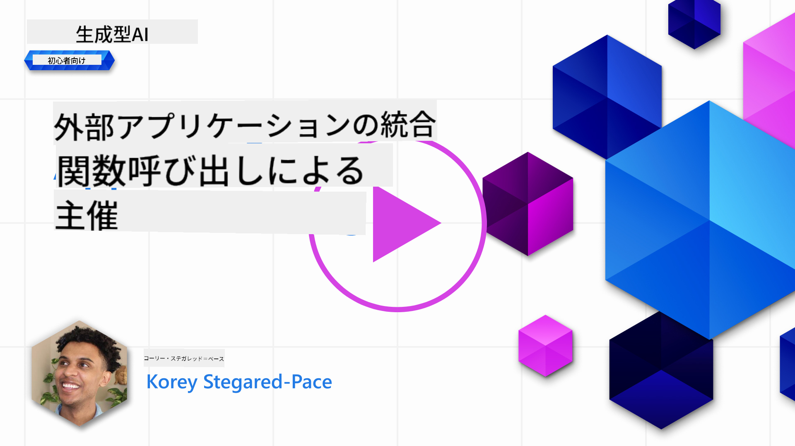

<!--
CO_OP_TRANSLATOR_METADATA:
{
  "original_hash": "f6f84f9ef2d066cd25850cab93580a50",
  "translation_date": "2025-10-17T23:50:28+00:00",
  "source_file": "11-integrating-with-function-calling/README.md",
  "language_code": "ja"
}
-->
# 関数呼び出しとの統合

[](https://youtu.be/DgUdCLX8qYQ?si=f1ouQU5HQx6F8Gl2)

これまでのレッスンでかなりのことを学んできましたが、さらに改善する余地があります。例えば、レスポンスのフォーマットをより一貫性のあるものにして、後続の処理がしやすくする方法や、他のソースからデータを追加してアプリケーションをさらに充実させる方法などです。

この章では、上記の問題に取り組む方法について説明します。

## はじめに

このレッスンでは以下を学びます：

- 関数呼び出しとは何か、その使用例について説明します。
- Azure OpenAIを使用して関数呼び出しを作成する方法。
- 関数呼び出しをアプリケーションに統合する方法。

## 学習目標

このレッスンの終わりまでに、以下ができるようになります：

- 関数呼び出しを使用する目的を説明する。
- Azure OpenAIサービスを使用して関数呼び出しを設定する。
- アプリケーションの使用例に合わせた効果的な関数呼び出しを設計する。

## シナリオ: チャットボットを関数で改善する

このレッスンでは、教育系スタートアップ向けに、ユーザーがチャットボットを使って技術コースを見つけられる機能を構築します。ユーザーのスキルレベル、現在の役割、興味のある技術に合ったコースを推薦します。

このシナリオを完成させるために以下を組み合わせて使用します：

- `Azure OpenAI` を使用してユーザー向けのチャット体験を作成。
- `Microsoft Learn Catalog API` を使用して、ユーザーのリクエストに基づいてコースを検索。
- `Function Calling` を使用して、ユーザーのクエリを関数に送信し、APIリクエストを実行。

まず、なぜ関数呼び出しを使用するのかについて見ていきましょう：

## 関数呼び出しの必要性

関数呼び出しが登場する前は、LLMからのレスポンスは非構造的で一貫性がありませんでした。開発者は、レスポンスのバリエーションを処理できるようにするために複雑な検証コードを書く必要がありました。また、ユーザーは「ストックホルムの現在の天気は？」のような質問に答えを得ることができませんでした。これは、モデルがトレーニングされた時点のデータに制限されていたためです。

Azure OpenAIサービスの機能である関数呼び出しは、以下の制限を克服するために設計されています：

- **一貫性のあるレスポンスフォーマット**。レスポンスフォーマットをよりよく制御できれば、後続のシステムへの統合が容易になります。
- **外部データ**。チャットコンテキストでアプリケーションの他のソースからのデータを使用する能力。

## シナリオを通じた問題の説明

> 以下のシナリオを実行したい場合は、[付属のノートブック](./python/aoai-assignment.ipynb?WT.mc_id=academic-105485-koreyst)を使用することをお勧めします。ただし、関数が問題解決に役立つ状況を説明するために、読み進めるだけでも構いません。

レスポンスフォーマットの問題を説明する例を見てみましょう：

学生データベースを作成して、適切なコースを提案したいとします。以下に、非常に似たデータを含む2つの学生の説明があります。

1. Azure OpenAIリソースへの接続を作成します：

   ```python
   import os
   import json
   from openai import AzureOpenAI
   from dotenv import load_dotenv
   load_dotenv()

   client = AzureOpenAI(
   api_key=os.environ['AZURE_OPENAI_API_KEY'],  # this is also the default, it can be omitted
   api_version = "2023-07-01-preview"
   )

   deployment=os.environ['AZURE_OPENAI_DEPLOYMENT']
   ```

   以下は、`api_type`、`api_base`、`api_version`、`api_key`を設定してAzure OpenAIへの接続を構成するPythonコードです。

1. 変数`student_1_description`と`student_2_description`を使用して、2つの学生の説明を作成します。

   ```python
   student_1_description="Emily Johnson is a sophomore majoring in computer science at Duke University. She has a 3.7 GPA. Emily is an active member of the university's Chess Club and Debate Team. She hopes to pursue a career in software engineering after graduating."

   student_2_description = "Michael Lee is a sophomore majoring in computer science at Stanford University. He has a 3.8 GPA. Michael is known for his programming skills and is an active member of the university's Robotics Club. He hopes to pursue a career in artificial intelligence after finishing his studies."
   ```

   上記の学生の説明をLLMに送信してデータを解析します。このデータは後でアプリケーションで使用され、APIに送信されたりデータベースに保存されたりします。

1. LLMにどの情報が必要かを指示する2つの同一のプロンプトを作成します：

   ```python
   prompt1 = f'''
   Please extract the following information from the given text and return it as a JSON object:

   name
   major
   school
   grades
   club

   This is the body of text to extract the information from:
   {student_1_description}
   '''

   prompt2 = f'''
   Please extract the following information from the given text and return it as a JSON object:

   name
   major
   school
   grades
   club

   This is the body of text to extract the information from:
   {student_2_description}
   '''
   ```

   上記のプロンプトは、LLMに情報を抽出し、JSON形式でレスポンスを返すよう指示します。

1. プロンプトとAzure OpenAIへの接続を設定した後、`openai.ChatCompletion`を使用してプロンプトをLLMに送信します。プロンプトは`messages`変数に保存され、`user`として役割を割り当てます。これは、チャットボットに書き込まれるユーザーからのメッセージを模倣するためです。

   ```python
   # response from prompt one
   openai_response1 = client.chat.completions.create(
   model=deployment,
   messages = [{'role': 'user', 'content': prompt1}]
   )
   openai_response1.choices[0].message.content

   # response from prompt two
   openai_response2 = client.chat.completions.create(
   model=deployment,
   messages = [{'role': 'user', 'content': prompt2}]
   )
   openai_response2.choices[0].message.content
   ```

これで、両方のリクエストをLLMに送信し、`openai_response1['choices'][0]['message']['content']`のようにレスポンスを確認できます。

1. 最後に、`json.loads`を呼び出してレスポンスをJSON形式に変換します：

   ```python
   # Loading the response as a JSON object
   json_response1 = json.loads(openai_response1.choices[0].message.content)
   json_response1
   ```

   レスポンス1：

   ```json
   {
     "name": "Emily Johnson",
     "major": "computer science",
     "school": "Duke University",
     "grades": "3.7",
     "club": "Chess Club"
   }
   ```

   レスポンス2：

   ```json
   {
     "name": "Michael Lee",
     "major": "computer science",
     "school": "Stanford University",
     "grades": "3.8 GPA",
     "club": "Robotics Club"
   }
   ```

   プロンプトが同じで説明が似ているにもかかわらず、`Grades`プロパティの値が異なる形式でフォーマットされていることがわかります。例えば、`3.7`や`3.7 GPA`の形式が得られることがあります。

   この結果は、LLMが非構造的なデータ（書かれたプロンプトの形）を受け取り、非構造的なデータを返すためです。このデータを保存したり使用したりする際に何を期待するかを知るためには、構造化されたフォーマットが必要です。

では、フォーマットの問題をどのように解決するのでしょうか？関数呼び出しを使用することで、構造化されたデータを確実に受け取ることができます。関数呼び出しを使用する際、LLMは実際に関数を呼び出したり実行したりするわけではありません。代わりに、LLMがレスポンスを生成するための構造を作成します。その後、その構造化されたレスポンスを使用して、アプリケーション内で実行する関数を決定します。


関数から返されたデータを取得し、それをLLMに送信します。LLMはその後、自然言語を使用してユーザーのクエリに回答します。

## 関数呼び出しを使用するユースケース

関数呼び出しがアプリを改善する多くのユースケースがあります：

- **外部ツールの呼び出し**。チャットボットは、ユーザーの質問に答えるのに優れています。関数呼び出しを使用することで、チャットボットはユーザーからのメッセージを使用して特定のタスクを完了できます。例えば、学生が「この科目についてもっと助けが必要だと先生にメールを送って」とチャットボットに頼むと、`send_email(to: string, body: string)`という関数呼び出しを行うことができます。

- **APIまたはデータベースクエリの作成**。ユーザーは自然言語を使用して情報を検索し、それがフォーマットされたクエリやAPIリクエストに変換されます。例えば、教師が「最後の課題を完了した学生は誰ですか」と尋ねると、`get_completed(student_name: string, assignment: int, current_status: string)`という関数を呼び出すことができます。

- **構造化データの作成**。ユーザーはテキストブロックやCSVを使用して、LLMを使って重要な情報を抽出できます。例えば、学生が平和協定に関するWikipediaの記事をAIフラッシュカードに変換することができます。これには、`get_important_facts(agreement_name: string, date_signed: string, parties_involved: list)`という関数を使用します。

## 初めての関数呼び出しを作成する

関数呼び出しを作成するプロセスは、以下の3つの主要なステップで構成されています：

1. **呼び出し** - 関数のリストとユーザーメッセージを使用してChat Completions APIを呼び出す。
2. **読み取り** - モデルのレスポンスを読み取り、アクション（関数やAPI呼び出しの実行）を実行する。
3. **再呼び出し** - 関数からのレスポンスを使用して、ユーザーへのレスポンスを作成するためにChat Completions APIを再度呼び出す。


### ステップ1 - メッセージの作成

最初のステップは、ユーザーメッセージを作成することです。これは、テキスト入力の値を動的に割り当てるか、ここで値を割り当てることができます。Chat Completions APIを初めて使用する場合、メッセージの`role`と`content`を定義する必要があります。

`role`は`system`（ルールの作成）、`assistant`（モデル）、または`user`（エンドユーザー）のいずれかに設定できます。関数呼び出しの場合、これを`user`として割り当て、例として質問を設定します。

```python
messages= [ {"role": "user", "content": "Find me a good course for a beginner student to learn Azure."} ]
```

異なる役割を割り当てることで、LLMにシステムが何かを言っているのか、ユーザーが何かを言っているのかを明確にし、LLMが基にする会話履歴を構築するのに役立ちます。

### ステップ2 - 関数の作成

次に、関数とそのパラメータを定義します。ここでは`search_courses`という1つの関数を使用しますが、複数の関数を作成することもできます。

> **重要** : 関数はLLMへのシステムメッセージに含まれ、利用可能なトークンの量に影響を与えます。

以下では、関数をアイテムの配列として作成します。各アイテムは関数であり、`name`、`description`、`parameters`というプロパティを持っています：

```python
functions = [
   {
      "name":"search_courses",
      "description":"Retrieves courses from the search index based on the parameters provided",
      "parameters":{
         "type":"object",
         "properties":{
            "role":{
               "type":"string",
               "description":"The role of the learner (i.e. developer, data scientist, student, etc.)"
            },
            "product":{
               "type":"string",
               "description":"The product that the lesson is covering (i.e. Azure, Power BI, etc.)"
            },
            "level":{
               "type":"string",
               "description":"The level of experience the learner has prior to taking the course (i.e. beginner, intermediate, advanced)"
            }
         },
         "required":[
            "role"
         ]
      }
   }
]
```

各関数インスタンスについて詳しく説明します：

- `name` - 呼び出したい関数の名前。
- `description` - 関数の動作の説明。具体的で明確であることが重要です。
- `parameters` - モデルがレスポンスで生成する値とフォーマットのリスト。parameters配列はアイテムで構成されており、アイテムには以下のプロパティがあります：
  1.  `type` - プロパティが格納されるデータ型。
  1.  `properties` - モデルがレスポンスで使用する具体的な値のリスト。
      1. `name` - モデルがフォーマットされたレスポンスで使用するプロパティの名前（例：`product`）。
      1. `type` - このプロパティのデータ型（例：`string`）。
      1. `description` - 特定のプロパティの説明。

また、オプションのプロパティ`required` - 関数呼び出しが完了するために必要なプロパティもあります。

### ステップ3 - 関数呼び出しの実行

関数を定義した後、Chat Completion APIへの呼び出しにそれを含める必要があります。これをリクエストに`functions`を追加することで行います。この場合、`functions=functions`とします。

また、`function_call`を`auto`に設定するオプションもあります。これにより、ユーザーメッセージに基づいてどの関数を呼び出すべきかをLLMに決定させることができます。

以下のコードでは`ChatCompletion.create`を呼び出し、`functions=functions`と`function_call="auto"`を設定して、LLMに関数を呼び出すタイミングを選ばせています：

```python
response = client.chat.completions.create(model=deployment,
                                        messages=messages,
                                        functions=functions,
                                        function_call="auto")

print(response.choices[0].message)
```

返ってくるレスポンスは以下のようになります：

```json
{
  "role": "assistant",
  "function_call": {
    "name": "search_courses",
    "arguments": "{\n  \"role\": \"student\",\n  \"product\": \"Azure\",\n  \"level\": \"beginner\"\n}"
  }
}
```

ここでは、`search_courses`関数が呼び出され、JSONレスポンスの`arguments`プロパティに記載されている引数で呼び出されたことがわかります。

LLMは、`messages`パラメータに提供された値からデータを抽出し、関数の引数に適合するデータを見つけることができました。以下は`messages`値のリマインダーです：

```python
messages= [ {"role": "user", "content": "Find me a good course for a beginner student to learn Azure."} ]
```

ご覧の通り、`student`、`Azure`、`beginner`が`messages`から抽出され、関数への入力として設定されています。このように関数を使用することで、プロンプトから情報を抽出するだけでなく、LLMに構造を提供し、再利用可能な機能を持たせることができます。

次に、これをアプリでどのように使用するかを見てみましょう。

## アプリケーションへの関数呼び出しの統合

LLMからのフォーマットされたレスポンスをテストした後、これをアプリケーションに統合することができます。

### フローの管理

これをアプリケーションに統合するために、以下の手順を実行します：

1. まず、OpenAIサービスへの呼び出しを行い、メッセージを`response_message`という変数に保存します。

   ```python
   response_message = response.choices[0].message
   ```

1. 次に、Microsoft Learn APIを呼び出してコースのリストを取得する関数を定義します：

   ```python
   import requests

   def search_courses(role, product, level):
     url = "https://learn.microsoft.com/api/catalog/"
     params = {
        "role": role,
        "product": product,
        "level": level
     }
     response = requests.get(url, params=params)
     modules = response.json()["modules"]
     results = []
     for module in modules[:5]:
        title = module["title"]
        url = module["url"]
        results.append({"title": title, "url": url})
     return str(results)
   ```

   ここでは、`functions`変数で導入した関数名に対応する実際のPython関数を作成しています。また、必要なデータを取得するために実際の外部API呼び出しを行っています。この場合、Microsoft Learn APIを使用してトレーニングモジュールを検索します。

さて、`functions`変数と対応するPython関数を作成しましたが、どのようにしてLLMにこれらを関連付け、Python関数が呼び出されるようにするのでしょうか？

1. Python関数を呼び出す必要があるかどうかを確認するために、LLMのレスポンスを調べ、`function_call`が含まれているかどうかを確認します。そして、指定された関数を呼び出します。以下にそのチェック方法を示します：

   ```python
   # Check if the model wants to call a function
   if response_message.function_call.name:
    print("Recommended Function call:")
    print(response_message.function_call.name)
    print()

    # Call the function.
    function_name = response_message.function_call.name

    available_functions = {
            "search_courses": search_courses,
    }
    function_to_call = available_functions[function_name]

    function_args = json.loads(response_message.function_call.arguments)
    function_response = function_to_call(**function_args)

    print("Output of function call:")
    print(function_response)
    print(type(function_response))


    # Add the assistant response and function response to the messages
    messages.append( # adding assistant response to messages
        {
            "role": response_message.role,
            "function_call": {
                "name": function_name,
                "arguments": response_message.function_call.arguments,
            },
            "content": None
        }
    )
    messages.append( # adding function response to messages
        {
            "role": "function",
            "name": function_name,
            "content":function_response,
        }
    )
   ```

   以下の3行は、関数名、引数を抽出し、呼び出しを行うことを保証します：

   ```python
   function_to_call = available_functions[function_name]

   function_args = json.loads(response_message.function_call.arguments)
   function_response = function_to_call(**function_args)
   ```

   以下はコードを実行した際の出力です：

   **出力**

   ```Recommended Function call:
   {
     "name": "search_courses",
     "arguments": "{\n  \"role\": \"student\",\n  \"product\": \"Azure\",\n  \"level\": \"beginner\"\n}"
   }

   Output of function call:
   [{'title': 'Describe concepts of cryptography', 'url': 'https://learn.microsoft.com/training/modules/describe-concepts-of-cryptography/?
   WT.mc_id=api_CatalogApi'}, {'title': 'Introduction to audio classification with TensorFlow', 'url': 'https://learn.microsoft.com/en-
   us/training/modules/intro-audio-classification-tensorflow/?WT.mc_id=api_CatalogApi'}, {'title': 'Design a Performant Data Model in Azure SQL
   Database with Azure Data Studio', 'url': 'https://learn.microsoft.com/training/modules/design-a-data-model-with-ads/?
   WT.mc_id=api_CatalogApi'}, {'title': 'Getting started with the Microsoft Cloud Adoption Framework for Azure', 'url':
   'https://learn.microsoft.com/training/modules/cloud-adoption-framework-getting-started/?WT.mc_id=api_CatalogApi'}, {'title': 'Set up the
   Rust development environment', 'url': 'https://learn.microsoft.com/training/modules/rust-set-up-environment/?WT.mc_id=api_CatalogApi'}]
   <class 'str'>
   ```

1. 次に、更新されたメッセージ`messages`をLLMに送信し、APIのJSON形式のレスポンスではなく、自然言語のレスポンスを受け取ります。

   ```python
   print("Messages in next request:")
   print(messages)
   print()

   second_response = client.chat.completions.create(
      messages=messages,
      model=deployment,
      function_call="auto",
      functions=functions,
      temperature=0
         )  # get a new response from GPT where it can see the function response


   print(second_response.choices[0].message)
   ```

   **出力**

   ```python
   {
     "role": "assistant",
     "content": "I found some good courses for beginner students to learn Azure:\n\n1. [Describe concepts of cryptography] (https://learn.microsoft.com/training/modules/describe-concepts-of-cryptography/?WT.mc_id=api_CatalogApi)\n2. [Introduction to audio classification with TensorFlow](https://learn.microsoft.com/training/modules/intro-audio-classification-tensorflow/?WT.mc_id=api_CatalogApi)\n3. [Design a Performant Data Model in Azure SQL Database with Azure Data Studio](https://learn.microsoft.com/training/modules/design-a-data-model-with-ads/?WT.mc_id=api_CatalogApi)\n4. [Getting started with the Microsoft Cloud Adoption Framework for Azure](https://learn.microsoft.com/training/modules/cloud-adoption-framework-getting-started/?WT.mc_id=api_CatalogApi)\n5. [Set up the Rust development environment](https://learn.microsoft.com/training/modules/rust-set-up-environment/?WT.mc_id=api_CatalogApi)\n\nYou can click on the links to access the courses."
   }

   ```

## 課題

Azure OpenAI Function Callingの学習を続けるために、以下を構築してみてください：

- 学習者がより多くのコースを見つけるのに役立つ関数のパラメータを追加する。
- 学習者の母国語など、より多くの情報を取得する別の関数呼び出しを作成する。
- 関数呼び出しやAPI呼び出しが適切なコースを返さない場合のエラー処理を作成してください

ヒント: データがどのように、どこで利用可能かを確認するために、[Learn APIリファレンスドキュメント](https://learn.microsoft.com/training/support/catalog-api-developer-reference?WT.mc_id=academic-105485-koreyst)ページを参照してください。

## 素晴らしい仕事です！旅を続けましょう

このレッスンを完了した後は、[生成AI学習コレクション](https://aka.ms/genai-collection?WT.mc_id=academic-105485-koreyst)をチェックして、生成AIの知識をさらに深めてください！

次はレッスン12に進み、[AIアプリケーションのUXを設計する方法](../12-designing-ux-for-ai-applications/README.md?WT.mc_id=academic-105485-koreyst)を学びましょう！

---

**免責事項**:  
この文書はAI翻訳サービス[Co-op Translator](https://github.com/Azure/co-op-translator)を使用して翻訳されています。正確性を追求しておりますが、自動翻訳には誤りや不正確な部分が含まれる可能性があります。元の言語で記載された文書を正式な情報源としてご参照ください。重要な情報については、専門の人間による翻訳を推奨します。この翻訳の使用に起因する誤解や誤認について、当方は一切の責任を負いません。