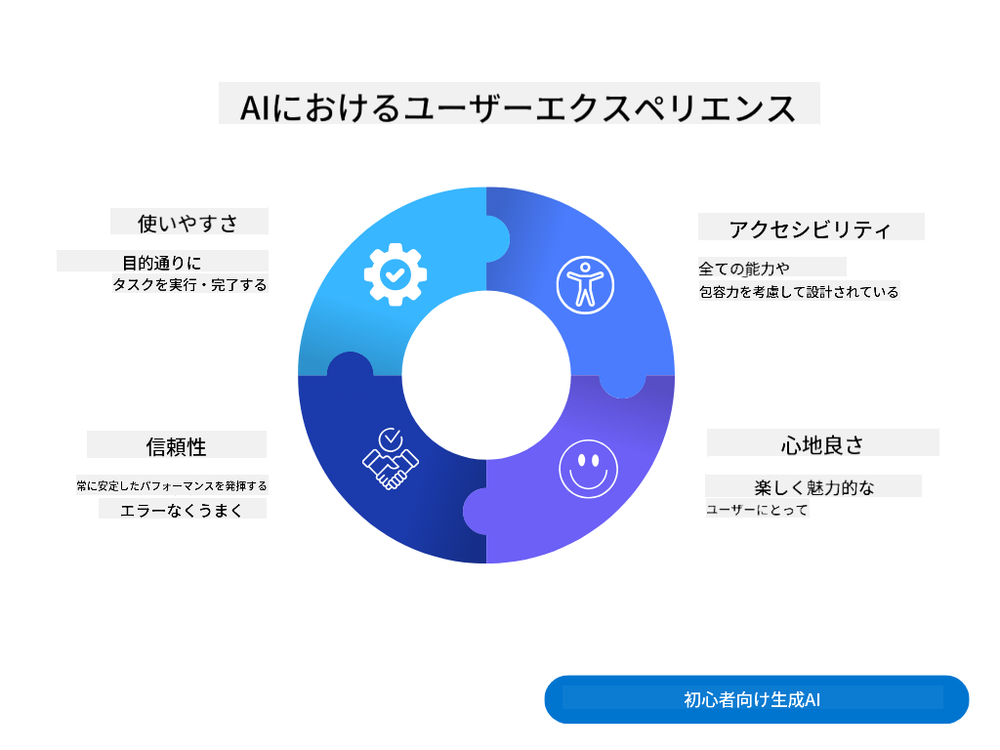
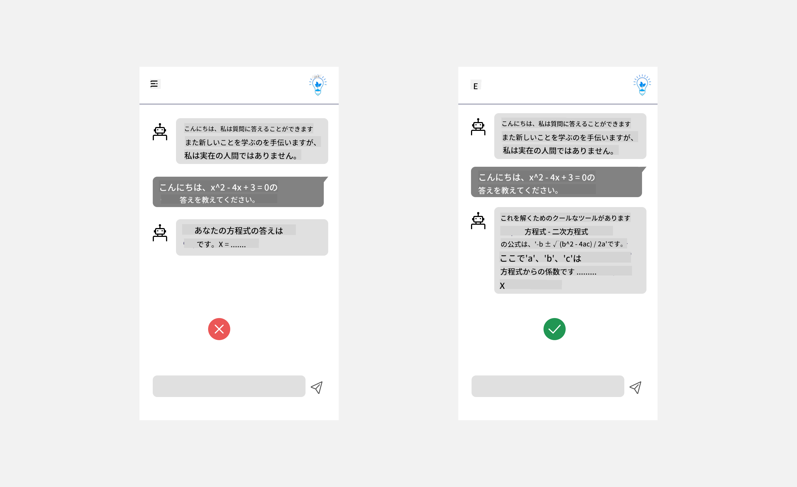
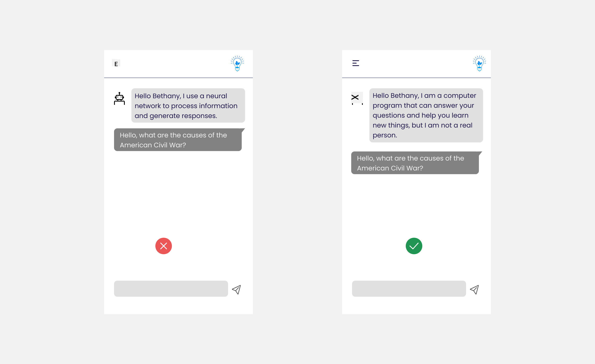
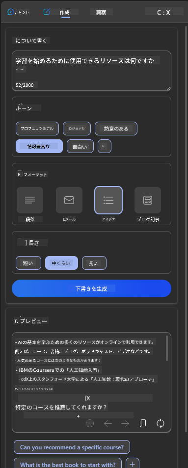
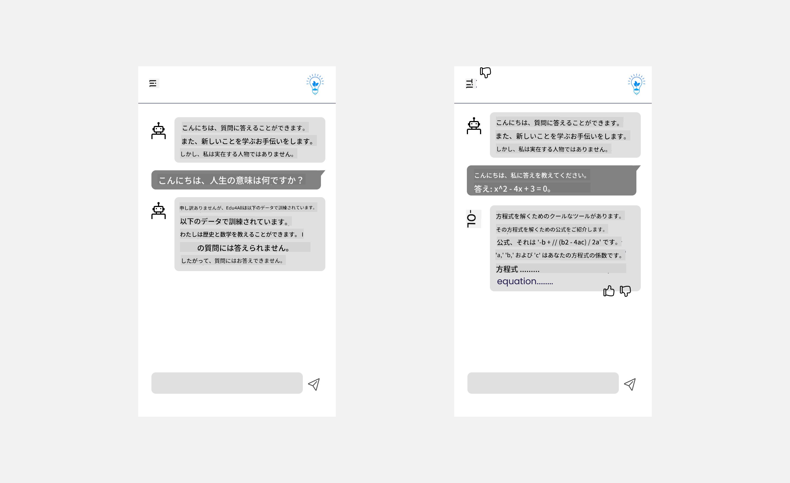

<!--
CO_OP_TRANSLATOR_METADATA:
{
  "original_hash": "ec385b41ee50579025d50cc03bfb3a25",
  "translation_date": "2025-05-19T21:47:07+00:00",
  "source_file": "12-designing-ux-for-ai-applications/README.md",
  "language_code": "ja"
}
-->
# AIアプリケーションのUX設計

> _(上の画像をクリックしてこのレッスンのビデオを視聴してください)_

ユーザーエクスペリエンスはアプリを構築する際に非常に重要な要素です。ユーザーが効率的にタスクを実行するためにアプリを使える必要があります。効率的であることは一つのことですが、すべての人が使えるように設計することも必要で、これを「アクセシブル」と言います。この章では、この領域に焦点を当て、最終的に人々が使いたくなるアプリを設計することを目指します。

## はじめに

ユーザーエクスペリエンスとは、ユーザーが特定の製品やサービスをどのように使用し、対話するかを指します。それがシステム、ツール、デザインであれ、AIアプリケーションを開発する際には、開発者はユーザーエクスペリエンスが効果的であるだけでなく倫理的であることにも焦点を当てます。このレッスンでは、ユーザーのニーズに応えるAIアプリケーションの構築方法を学びます。

このレッスンでは以下の領域をカバーします：

- ユーザーエクスペリエンスの紹介とユーザーのニーズの理解
- 信頼と透明性のためのAIアプリケーションの設計
- コラボレーションとフィードバックのためのAIアプリケーションの設計

## 学習目標

このレッスンを受けた後、あなたは以下のことができるようになります：

- ユーザーのニーズに応えるAIアプリケーションの構築方法を理解する。
- 信頼とコラボレーションを促進するAIアプリケーションを設計する。

### 前提条件

時間をかけて[ユーザーエクスペリエンスとデザイン思考](https://learn.microsoft.com/training/modules/ux-design?WT.mc_id=academic-105485-koreyst)についてもっと読んでください。

## ユーザーエクスペリエンスの紹介とユーザーのニーズの理解

私たちの架空の教育スタートアップでは、教師と学生という2つの主要なユーザーがいます。それぞれのユーザーには独自のニーズがあります。ユーザー中心のデザインは、ユーザーを優先し、製品がその意図された対象者にとって関連性があり有益であることを保証します。

アプリケーションは良いユーザーエクスペリエンスを提供するために、**有用で、信頼性があり、アクセス可能で、楽しい**ものであるべきです。

### ユーザビリティ

有用であることは、アプリケーションがその意図された目的に合った機能を持っていることを意味します。例えば、採点プロセスの自動化や復習用のフラッシュカードの生成などです。採点プロセスを自動化するアプリケーションは、事前に定義された基準に基づいて学生の作品に正確かつ効率的にスコアを割り当てることができるべきです。同様に、復習用フラッシュカードを生成するアプリケーションは、データに基づいて関連性のある多様な質問を作成できるべきです。

### 信頼性

信頼性があることは、アプリケーションがそのタスクを一貫してエラーなく実行できることを意味します。しかし、AIは人間と同様に完璧ではなく、エラーが発生する可能性があります。アプリケーションは、エラーや人間の介入や修正が必要な予期しない状況に遭遇することがあります。エラーをどのように処理しますか？このレッスンの最後のセクションでは、AIシステムとアプリケーションがコラボレーションとフィードバックのためにどのように設計されているかをカバーします。

### アクセシビリティ

アクセシブルであることは、ユーザーエクスペリエンスを様々な能力を持つユーザー、障害を持つ人を含めて拡張し、誰も取り残されないようにすることを意味します。アクセシビリティのガイドラインと原則に従うことで、AIソリューションはより包括的で、使いやすく、すべてのユーザーにとって有益になります。

### 楽しい

楽しいことは、アプリケーションが使っていて楽しいことを意味します。魅力的なユーザーエクスペリエンスは、ユーザーにアプリケーションに戻ってくることを促し、ビジネス収益を増加させる可能性があります。

すべての課題がAIで解決できるわけではありません。AIは、手動タスクの自動化やユーザーエクスペリエンスのパーソナライズなど、ユーザーエクスペリエンスを強化するために利用されます。

## 信頼と透明性のためのAIアプリケーションの設計

AIアプリケーションを設計する際には、信頼を築くことが重要です。信頼は、ユーザーがアプリケーションが仕事を完了し、結果を一貫して提供し、結果がユーザーのニーズに合っていることを確信することを保証します。この領域でのリスクは、不信と過信です。不信は、ユーザーがAIシステムにほとんどまたは全く信頼を持たない場合に発生し、これによりユーザーがあなたのアプリケーションを拒否することになります。過信は、ユーザーがAIシステムの能力を過大評価し、AIシステムを過信しすぎることを意味します。例えば、過信の場合には、自動採点システムが教師が一部の試験を確認せずに採点システムが正常に機能しているかを確認することができるかもしれません。これにより、学生に対する不公平または不正確な評価、フィードバックや改善の機会の欠如が生じる可能性があります。

信頼をデザインの中心に据えるための2つの方法は、説明可能性とコントロールです。

### 説明可能性

AIが将来の世代に知識を伝えるなどの決定を助ける場合、教師や親がAIの決定がどのように行われるかを理解することが重要です。これが説明可能性です。AIアプリケーションがどのように決定を行うかを理解することです。説明可能性を設計するには、AIアプリケーションが何をできるかの例を追加することが含まれます。例えば、「AI教師と始める」ではなく、「AIを使ってノートを要約し、復習を簡単にする」というようにシステムが使うことができます。

もう一つの例は、AIがユーザーと個人データをどのように使用するかです。例えば、学生のペルソナを持つユーザーは、そのペルソナに基づいて制限があるかもしれません。AIは質問の答えを明らかにすることができないかもしれませんが、問題を解決する方法を考えるようにユーザーを導く手助けをすることができます。

説明可能性の最後の重要な部分は、説明の簡素化です。学生や教師はAIの専門家ではないかもしれないため、アプリケーションができることとできないことの説明は簡素化され、理解しやすいものであるべきです。

### コントロール

生成AIは、AIとユーザーとの間にコラボレーションを生み出します。たとえば、ユーザーが異なる結果を得るためにプロンプトを修正することができます。さらに、出力が生成された後、ユーザーは結果を修正することができ、コントロールの感覚を得ることができます。例えば、Bingを使用すると、フォーマット、トーン、長さに基づいてプロンプトを調整することができます。さらに、出力に変更を加え、以下のように出力を修正することができます：

Bingのもう一つの特徴は、ユーザーがアプリケーションに対するコントロールを持つことを可能にするもので、AIが使用するデータにオプトインまたはオプトアウトする能力です。学校のアプリケーションでは、学生が自分のノートと教師のリソースを復習資料として使用したいかもしれません。

> AIアプリケーションを設計する際には、意図性が重要です。ユーザーがAIを過信し、能力に対する非現実的な期待を設定しないようにすることが重要です。これを行う方法の一つは、プロンプトと結果の間に摩擦を作り出すことです。ユーザーに、これはAIであり、仲間の人間ではないことを思い出させることです。

## コラボレーションとフィードバックのためのAIアプリケーションの設計

前述のように、生成AIはユーザーとAIの間にコラボレーションを生み出します。ほとんどのやり取りは、ユーザーがプロンプトを入力し、AIが出力を生成することです。出力が間違っていた場合はどうしますか？アプリケーションはエラーが発生した場合にどのように処理しますか？AIはユーザーを責めるのか、それともエラーを説明するのに時間をかけるのか？

AIアプリケーションはフィードバックを受け取り、提供するために構築されるべきです。これにより、AIシステムが改善されるだけでなく、ユーザーとの信頼も築かれます。フィードバックループをデザインに含めるべきです。例としては、出力に対する単純なサムズアップまたはダウンがあります。

これを処理するもう一つの方法は、システムの能力と制限を明確に伝えることです。ユーザーがAIの能力を超えた要求をする際には、これを処理する方法もあるべきです。以下のように示されています。

システムエラーは、ユーザーがAIの範囲外の情報を必要とする場合や、アプリケーションがユーザーが生成できる質問/科目の数に制限がある場合に一般的です。例えば、歴史と数学の限られた科目に関するデータで訓練されたAIアプリケーションは、地理に関する質問を処理できないかもしれません。これを軽減するために、AIシステムは以下のような応答を提供することができます：「申し訳ありませんが、私たちの製品は以下の科目に関するデータで訓練されています.....、あなたが尋ねた質問に回答することはできません。」

AIアプリケーションは完璧ではないため、ミスを犯す可能性があります。アプリケーションを設計する際には、ユーザーからのフィードバックとエラー処理の余地を作り、簡単で説明しやすい方法で行うことを確認してください。

## 課題

これまでに構築したAIアプリを取り上げ、以下のステップをアプリに実装することを検討してください：

- **楽しい:** アプリをより楽しくする方法を考えてください。説明をどこにでも追加していますか？ユーザーが探索することを奨励していますか？エラーメッセージの言い回しはどうですか？

- **ユーザビリティ:** ウェブアプリを構築しています。アプリがマウスとキーボードの両方でナビゲートできることを確認してください。

- **信頼と透明性:** AIとその出力を完全に信頼せず、プロセスに人間を追加して出力を確認する方法を考えてください。また、信頼と透明性を実現するための他の方法を検討し、実装してください。

- **コントロール:** ユーザーがアプリケーションに提供するデータをコントロールできるようにします。AIアプリケーションでデータ収集にオプトインおよびオプトアウトする方法を実装します。

## 学習を続けましょう！

このレッスンを完了した後は、[生成AI学習コレクション](https://aka.ms/genai-collection?WT.mc_id=academic-105485-koreyst)をチェックして、生成AIの知識をさらに向上させましょう！

次のレッスン13に進み、[AIアプリケーションのセキュリティ](../13-securing-ai-applications/README.md?WT.mc_id=academic-105485-koreyst)について見てみましょう！

**免責事項**:
この文書はAI翻訳サービス[Co-op Translator](https://github.com/Azure/co-op-translator)を使用して翻訳されています。正確性を追求していますが、自動翻訳には誤りや不正確さが含まれる可能性があることをご承知ください。元の言語での原文書が信頼できる情報源と見なされるべきです。重要な情報については、プロの人間による翻訳をお勧めします。この翻訳の使用に起因する誤解や誤った解釈について、当社は責任を負いません。