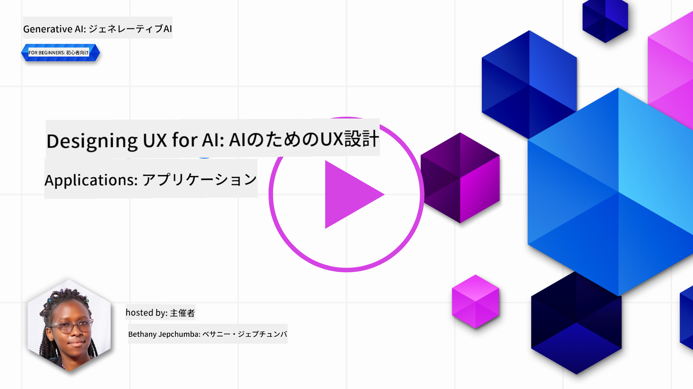
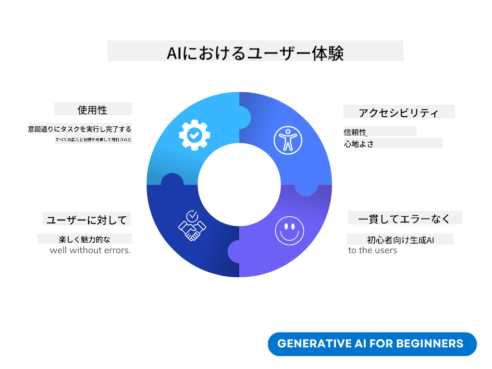
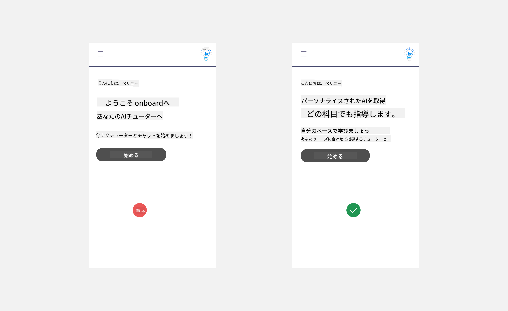
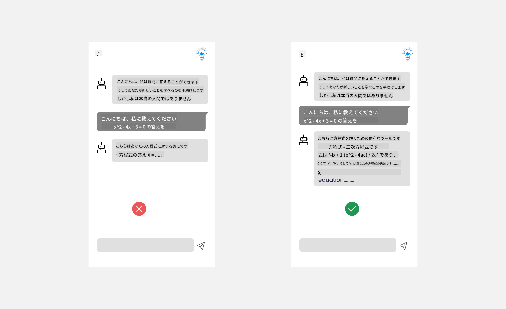
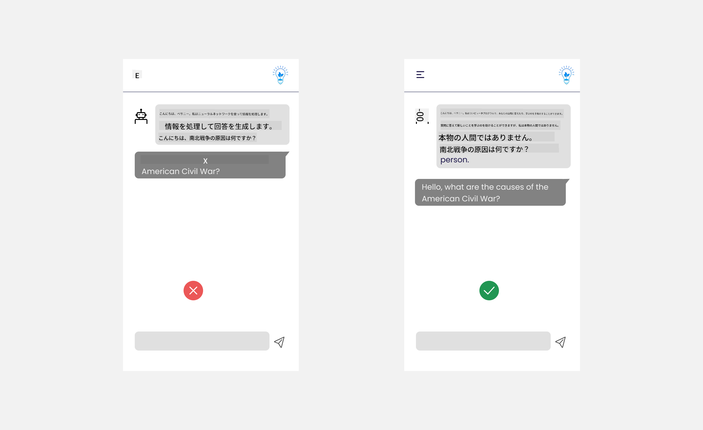
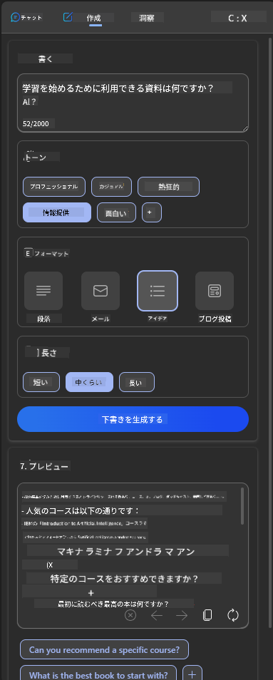
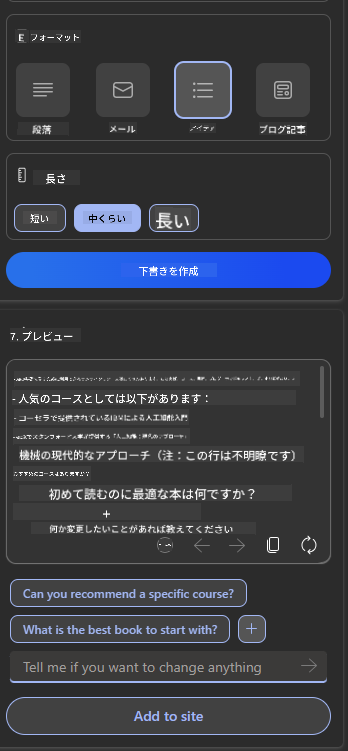
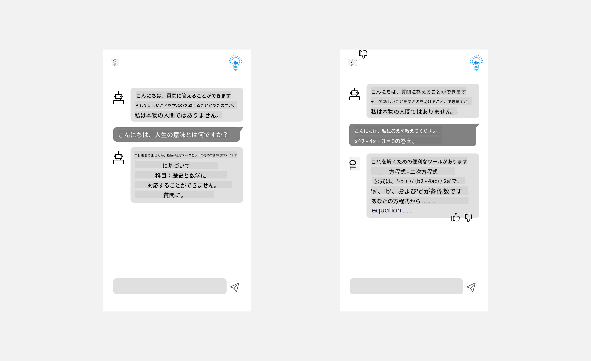

<!--
CO_OP_TRANSLATOR_METADATA:
{
  "original_hash": "ec385b41ee50579025d50cc03bfb3a25",
  "translation_date": "2025-06-25T20:14:10+00:00",
  "source_file": "12-designing-ux-for-ai-applications/README.md",
  "language_code": "ja"
}
-->
# AIアプリケーションのUX設計

> _(上の画像をクリックしてこのレッスンのビデオを視聴)_

ユーザーエクスペリエンスはアプリを構築する際の非常に重要な側面です。ユーザーは効率的にタスクを実行できる方法でアプリを使用できる必要があります。効率的であることは一つの要素ですが、アプリが誰でも使えるように設計し、_アクセシブル_にする必要もあります。この章ではこの領域に焦点を当て、人々が使いたいと思えるアプリを設計することを目指します。

## はじめに

ユーザーエクスペリエンスは、ユーザーが特定の製品やサービス、システム、ツール、デザインとどのように相互作用し、使用するかです。AIアプリケーションを開発する際、開発者はユーザーエクスペリエンスが効果的であるだけでなく、倫理的であることにも焦点を当てます。このレッスンでは、ユーザーのニーズに対応するAIアプリケーションの構築方法をカバーします。

レッスンでは以下の領域をカバーします：

- ユーザーエクスペリエンスの紹介とユーザーのニーズの理解
- 信頼性と透明性を考慮したAIアプリケーションの設計
- 協力とフィードバックを考慮したAIアプリケーションの設計

## 学習目標

このレッスンを受けた後、以下のことができるようになります：

- ユーザーのニーズを満たすAIアプリケーションの構築方法を理解する。
- 信頼と協力を促進するAIアプリケーションを設計する。

### 前提条件

少し時間をかけて、[ユーザーエクスペリエンスとデザイン思考について](https://learn.microsoft.com/training/modules/ux-design?WT.mc_id=academic-105485-koreyst)さらに読んでみてください。

## ユーザーエクスペリエンスの紹介とユーザーのニーズの理解

架空の教育スタートアップでは、教師と学生という2つの主要なユーザーがいます。それぞれのユーザーには独自のニーズがあります。ユーザー中心のデザインは、ユーザーを優先し、製品が対象となる人々にとって関連性があり、有益であることを保証します。

アプリケーションは**有用性、信頼性、アクセシビリティ、快適さ**を提供し、良好なユーザーエクスペリエンスを提供するべきです。

### 有用性

有用であることは、アプリケーションがその目的に合った機能を持っていることを意味します。例えば、採点プロセスの自動化や復習用のフラッシュカードの生成などです。採点プロセスを自動化するアプリケーションは、事前に定義された基準に基づいて学生の作品に正確かつ効率的にスコアを割り当てることができるべきです。同様に、復習用のフラッシュカードを生成するアプリケーションは、そのデータに基づいて関連性のある多様な質問を作成できるべきです。

### 信頼性

信頼性があるとは、アプリケーションが一貫してエラーなくタスクを遂行できることを意味します。しかし、AIは人間と同様に完璧ではなく、エラーが発生する可能性があります。アプリケーションはエラーや人間の介入が必要な予期しない状況に遭遇することがあります。エラーをどのように処理しますか？このレッスンの最後のセクションでは、AIシステムとアプリケーションが協力とフィードバックを考慮して設計される方法をカバーします。

### アクセシビリティ

アクセシビリティがあるとは、さまざまな能力を持つユーザー、障害を持つユーザーを含むすべての人に対してユーザーエクスペリエンスを拡張することを意味します。アクセシビリティのガイドラインと原則に従うことで、AIソリューションはより包括的で、使いやすく、すべてのユーザーにとって有益になります。

### 快適さ

快適さがあるとは、アプリケーションが使用して楽しいものであることを意味します。魅力的なユーザーエクスペリエンスは、ユーザーにアプリケーションに戻ってくるよう促し、ビジネス収益を増加させる可能性があります。

すべての課題がAIで解決できるわけではありません。AIは手作業を自動化したり、ユーザーエクスペリエンスを個別化したりすることで、ユーザーエクスペリエンスを補完します。

## 信頼性と透明性を考慮したAIアプリケーションの設計

AIアプリケーションを設計する際には、信頼を築くことが重要です。信頼は、ユーザーがアプリケーションが仕事を完了し、一貫して結果を提供し、結果がユーザーのニーズに合っていることを確信することを保証します。この領域のリスクは、不信と過信です。不信は、ユーザーがAIシステムにほとんどまたは全く信頼を持たない場合に発生し、ユーザーがアプリケーションを拒否する原因となります。過信は、ユーザーがAIシステムの能力を過大評価し、AIシステムを過度に信頼することを意味します。例えば、採点システムの過信の場合、教師がいくつかの論文を校正せずに採点システムが正常に機能するか確認することができます。これにより、学生に不公平または不正確な成績がつけられたり、フィードバックや改善の機会が失われたりする可能性があります。

信頼を設計の中心に据えるための2つの方法は、説明可能性と制御です。

### 説明可能性

AIが将来の世代に知識を伝えるような意思決定を支援する場合、教師や親がAIの意思決定方法を理解することが重要です。これが説明可能性です。AIアプリケーションが意思決定を行う方法を理解することです。説明可能性を考慮した設計には、AIアプリケーションが何をできるかの例を示す詳細を追加することが含まれます。例えば、「AI教師で始める」ではなく、「AIを使ってノートを要約し、復習を容易にする」などのシステムを使用できます。

もう一つの例は、AIがユーザーや個人データをどのように使用するかです。例えば、学生というペルソナを持つユーザーには、そのペルソナに基づいて制限があるかもしれません。AIは質問の回答を明らかにすることはできませんが、問題をどのように解決するかを考える手助けをすることはできます。

説明可能性のもう一つの重要な部分は、説明の簡素化です。学生や教師はAIの専門家ではないため、アプリケーションができることやできないことの説明は簡素化され、理解しやすいものであるべきです。

### 制御

生成AIはAIとユーザーの間の協力を生み出し、ユーザーが異なる結果を得るためにプロンプトを修正できるようにします。さらに、出力が生成された後、ユーザーは結果を修正でき、制御感を持つことができます。例えば、Bingを使用する際、形式、トーン、長さに基づいてプロンプトを調整することができます。さらに、出力に変更を加え、以下のように出力を修正することができます：

Bingでユーザーがアプリケーションを制御できるもう一つの機能は、AIが使用するデータへの参加と不参加のオプションです。学校のアプリケーションでは、学生が自分のノートや教師のリソースを復習資料として使用したいと思うかもしれません。

> AIアプリケーションを設計する際には、意図的にユーザーが過信しないようにし、AIの能力に対する非現実的な期待を設定しないようにすることが重要です。これを行う方法の一つは、プロンプトと結果の間に摩擦を生み出すことです。ユーザーに、これはAIであり、仲間の人間ではないことを思い出させることです。

## 協力とフィードバックを考慮したAIアプリケーションの設計

前述のように、生成AIはユーザーとAIの間の協力を生み出します。ほとんどの関与は、ユーザーがプロンプトを入力し、AIが出力を生成することです。もし出力が間違っていたらどうしますか？アプリケーションはエラーが発生した場合にどのように処理しますか？AIはユーザーを非難しますか、それともエラーを説明する時間を取りますか？

AIアプリケーションはフィードバックを受け取り、提供するように構築されるべきです。これにより、AIシステムが改善されるだけでなく、ユーザーとの信頼も築かれます。デザインにはフィードバックループが含まれるべきで、例として出力に対する簡単なサムズアップまたはダウンがあります。

もう一つの方法は、システムの能力と制限を明確に伝えることです。ユーザーがAIの能力を超えた要求をした場合、それを処理する方法もあるべきです。以下のように示されています。

システムエラーは、ユーザーがAIの範囲外の情報で支援を必要とする場合や、アプリケーションがユーザーが生成できる質問/科目の数に制限がある場合に一般的です。例えば、歴史と数学に関するデータで訓練されたAIアプリケーションは、地理に関する質問を処理できないかもしれません。これを軽減するために、AIシステムは次のような応答をすることができます：「申し訳ありませんが、私たちの製品は次の科目に関するデータで訓練されています.....、あなたが尋ねた質問に応答することはできません。」

AIアプリケーションは完璧ではありませんので、間違いを犯す可能性があります。アプリケーションを設計する際には、ユーザーからのフィードバックとエラー処理のための簡単で説明可能な方法を確保するべきです。

## 課題

これまでに構築したAIアプリを取り上げ、以下のステップをアプリに実装することを検討してください：

- **快適さ:** アプリをより快適にする方法を考えてみてください。説明を随所に追加していますか？ユーザーに探索を促していますか？エラーメッセージの言い回しはどうですか？

- **有用性:** Webアプリを構築します。マウスとキーボードの両方でアプリがナビゲート可能であることを確認してください。

- **信頼性と透明性:** AIとその出力を完全に信頼せず、プロセスに人間を追加して出力を検証する方法を考えてみてください。また、信頼性と透明性を実現するための他の方法を検討し、実装してください。

- **制御:** ユーザーにアプリケーションに提供するデータを制御させる。AIアプリケーションでのデータ収集への参加と不参加の方法を実装してください。

## 学習を続けましょう！

このレッスンを完了した後、[生成AI学習コレクション](https://aka.ms/genai-collection?WT.mc_id=academic-105485-koreyst)をチェックして、生成AIの知識をさらに向上させましょう！

レッスン13に進み、AIアプリケーションの[セキュリティ確保](../13-securing-ai-applications/README.md?WT.mc_id=academic-105485-koreyst)について見てみましょう！

**免責事項**：
この文書は、AI翻訳サービス[Co-op Translator](https://github.com/Azure/co-op-translator)を使用して翻訳されています。正確さを追求していますが、自動翻訳には誤りや不正確さが含まれる可能性があることにご注意ください。元の言語で書かれた文書を権威ある情報源と見なすべきです。重要な情報については、専門の人間による翻訳をお勧めします。この翻訳の使用に起因する誤解や誤解について、当社は責任を負いません。