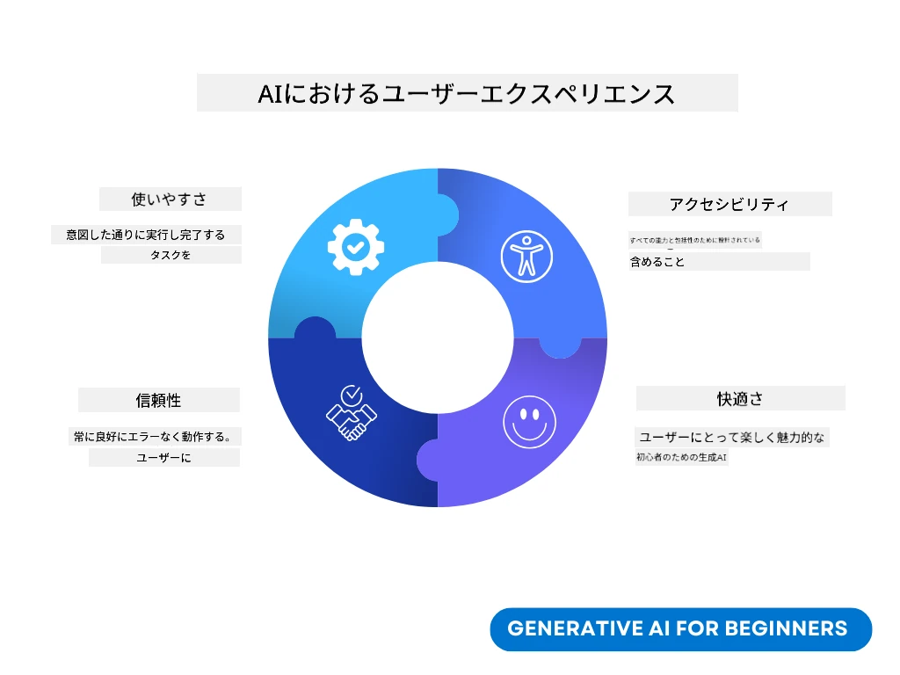
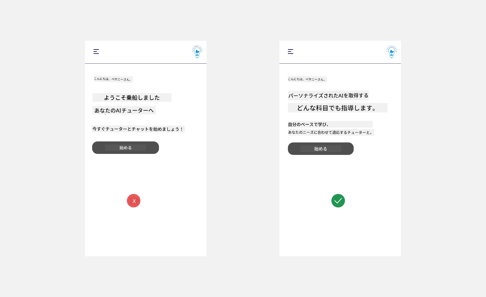
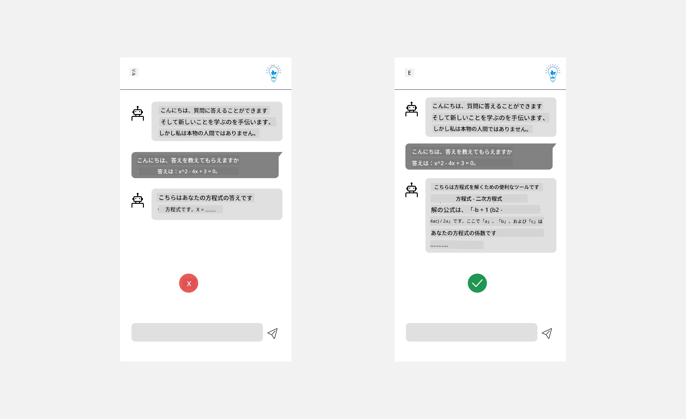
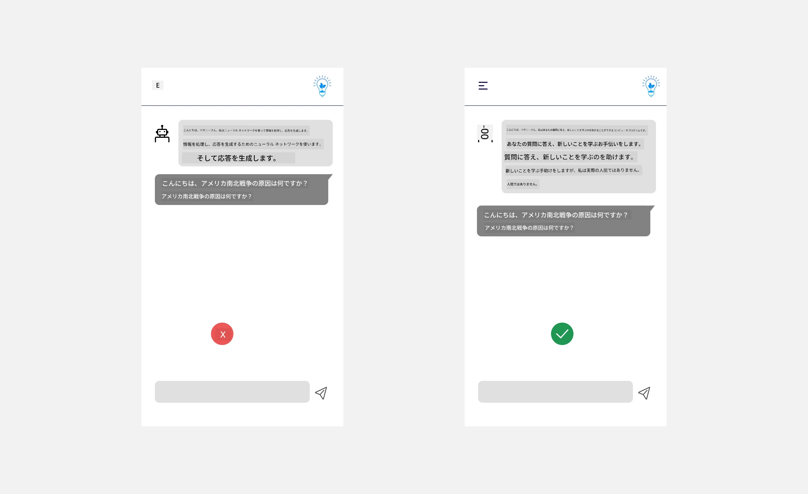
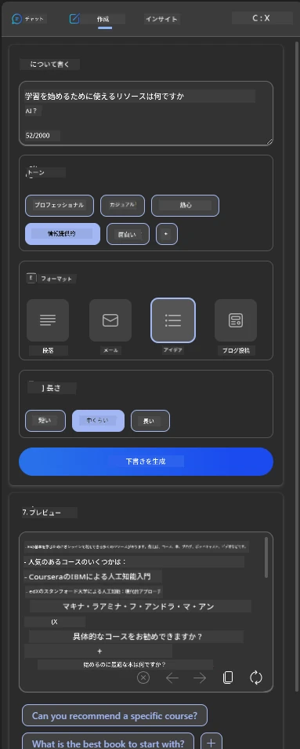
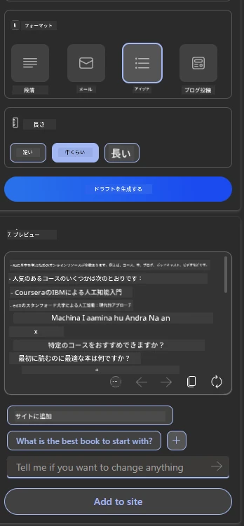
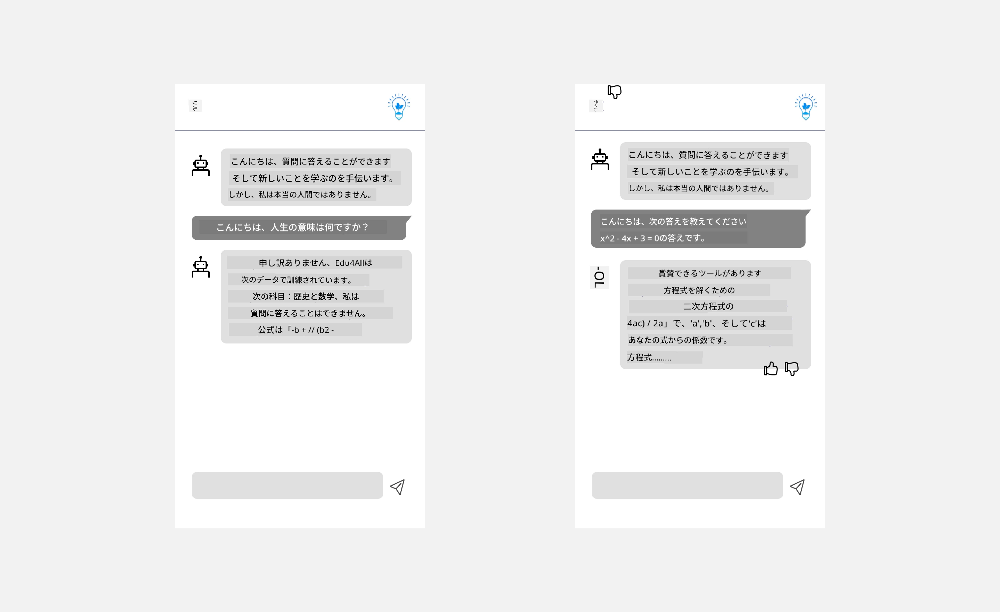

# AIアプリケーションのUX設計

> _(上の画像をクリックするとこのレッスンの動画が視聴できます)_

ユーザーエクスペリエンスはアプリ構築において非常に重要な側面です。ユーザーが効率的にタスクをこなせるようにアプリを使用できる必要があります。効率的であることも重要ですが、すべての人が使えるように、 _アクセシブル_ なアプリを設計することも必要です。この章ではこの分野に焦点を当て、誰もが使いたくなるアプリを設計できるようになることを目指します。

## はじめに

ユーザーエクスペリエンスとは、特定の製品やサービス（システム、ツール、デザインなど）とユーザーとのやり取りや利用方法のことです。AIアプリケーションの開発において、開発者はユーザーエクスペリエンスの効果だけでなく倫理性も重視します。このレッスンでは、ユーザーのニーズに応える人工知能（AI）アプリケーションの構築方法を取り上げます。

レッスンで扱う内容は以下の通りです：

- ユーザーエクスペリエンスの紹介とユーザーニーズの理解
- 信頼と透明性を重視したAIアプリケーション設計
- 協働とフィードバックのためのAIアプリケーション設計

## 学習目標

このレッスンを終えた後、あなたは以下のことができるようになります：

- ユーザーニーズを満たすAIアプリケーションの構築方法を理解する
- 信頼と協働を促進するAIアプリケーションの設計方法

### 前提条件

時間を取って [ユーザーエクスペリエンスとデザイン思考](https://learn.microsoft.com/training/modules/ux-design?WT.mc_id=academic-105485-koreyst) についてさらに学んでください。

## ユーザーエクスペリエンスの紹介とユーザーニーズの理解

私たちの架空の教育スタートアップでは、主要なユーザーは教師と学生の二者です。それぞれのユーザーには独自のニーズがあります。ユーザー中心設計は、ユーザーを最優先に考え、その製品が対象ユーザーにとって関連性があり有益であることを保証します。

アプリケーションは、良好なユーザーエクスペリエンスを提供するために、<strong>有用で信頼性があり、アクセシブルで快適</strong>でなければなりません。

### 使いやすさ

有用であるとは、アプリケーションが意図された目的に合った機能を備えていることを意味します。例えば採点プロセスの自動化や復習用のフラッシュカード作成などです。採点を自動化するアプリケーションは、事前に定義された基準に基づいて学生の作品に正確かつ効率的に評価を割り当てられる必要があります。同様に、復習用フラッシュカードを作成するアプリケーションは、関連性があり多様な質問をデータに基づいて生成できなければなりません。

### 信頼性

信頼性があるとは、アプリケーションが一貫してエラーなくタスクを実行できることを意味します。ただし、AIは人間と同様に完璧ではなく、エラーが発生することがあります。アプリケーションはエラーや予期しない状況に遭遇し、人間の介入や修正を必要とする場合があります。エラーをどのように処理しますか？このレッスンの最後のセクションでは、AIシステムとアプリケーションが協働とフィードバックを考慮して設計される方法について説明します。

### アクセシビリティ

アクセシブルであるとは、障害を持つ人も含め、様々な能力を持つユーザーが利用可能であり、誰も取り残されないことを意味します。アクセシビリティのガイドラインや原則に従うことで、AIソリューションはより包括的で使いやすく、すべてのユーザーにとって有益なものになります。

### 快適さ

快適であるとは、アプリケーションの使用が楽しいことを意味します。魅力的なユーザー体験は、ユーザーのアプリへの再訪を促し、ビジネスの収益増加につながることがあります。

すべての課題がAIで解決できるわけではありません。AIは手動タスクの自動化やユーザー体験のパーソナライズなど、ユーザーエクスペリエンスを補強する役割を担います。

## 信頼と透明性を重視したAIアプリケーション設計

AIアプリケーション設計において、信頼構築は非常に重要です。信頼は、アプリケーションが仕事を完遂し一貫して結果を提供し、その結果がユーザーのニーズに合っているとユーザーが確信することを意味します。この分野のリスクは、不信と過信です。不信はユーザーがAIシステムをほとんどまたはまったく信用しない場合に起こり、その結果アプリケーションが拒否されることになります。過信はユーザーがAIシステムの能力を過大評価しすぎる場合で、過信により教師が一部の試験用紙を確認せず、採点システムが正しく機能しているかどうかを保証しないことにつながるかもしれません。これにより、生徒に不公平・不正確な評価がなされたり、フィードバックや改善の機会が失われる可能性があります。

信頼を設計の中心に据えるための2つの方法は、説明責任とコントロールです。

### 説明責任

AIが意思決定を支援する場合、例えば次世代への知識の伝達において、教師や親がAIがどう意思決定をしているかを理解することが非常に重要です。これが説明責任（explainability）です。説明責任を考慮した設計には、AIがどのように出力にたどり着いたかを示す細部の追加が含まれます。利用者は出力が人間ではなくAIによって生成されたことを認識している必要があります。例えば「今すぐチューターとチャットを始めましょう」ではなく、「あなたのニーズに適応し、あなたのペースで学習を助けるAIチューターを使いましょう」と言うようにします。

もう一つの例は、AIがユーザーおよび個人データをどのように利用するかです。例えば、学生というペルソナのユーザーには制限があるかもしれません。AIは質問の答えを明かすことができないかもしれませんが、ユーザーが問題解決の考え方を導き出せるよう支援することができます。

説明責任のもう一つの重要な点は説明の簡素化です。学生や教師はAIの専門家ではないため、アプリができることやできないことの説明は、簡潔でわかりやすくあるべきです。

### コントロール

生成系AIはAIとユーザーの協働を生み出します。例えば、ユーザーが異なる結果を得るためにプロンプトを修正できることです。さらに、出力が生成された後、ユーザーは結果を修正できるべきであり、それによってコントロール感を得られます。例えばMicrosoft Copilot（旧Bing Chat）を使う場合、フォーマット、トーン、長さに応じてプロンプトを調整できます。また、結果に対して修正を加え、以下のように出力内容を変更できます。

Microsoft Copilotにおけるもう一つのユーザーコントロール機能は、AIが使用するデータをオプトイン・オプトアウトできることです。学校のアプリケーションでは、学生が自分のノートや教師の資料を復習資料として利用したい場合があります。

> AIアプリケーションを設計する際には、意図性が重要です。ユーザーがAIを過信して、その能力に対して非現実的な期待を持つことを防ぎます。これを行う方法の一つは、プロンプトと結果の間に摩擦を生むことです。ユーザーにこれはAIであり、人間ではないことを思い出させることです。

## 協働とフィードバックのためのAIアプリケーション設計

前述の通り、生成系AIはユーザーとAIの協働を生み出します。多くの場合、ユーザーがプロンプトを入力し、AIが出力を生成します。では、出力が間違っていたらどうしますか？エラーが起きた場合にアプリはどのように対応しますか？AIはユーザーを責めるか、それともエラーの説明に時間をかけますか？

AIアプリケーションはフィードバックの受信と提供を組み込んで設計されるべきです。これはAIシステムの改善に役立つだけでなく、ユーザーの信頼も構築します。設計にはフィードバックループを含めるべきで、例えば出力に対する親指を立てる・下げる簡単な評価などが考えられます。

もう一つの方法はシステムの能力と制限を明確に伝えることです。ユーザーがAIの能力を超える要求をした場合、その処理方法も必要です。以下に例を示します。

システムエラーはアプリケーションで一般的です。ユーザーがAIの範囲外の情報支援を必要としたり、生成できる質問・科目数に制限がある場合があります。例えば、限定された科目（歴史や数学）で訓練されたAIが地理に関する質問に答えられないことが考えられます。これを緩和するために、AIシステムは「申し訳ありませんが、当製品は以下の科目のデータで訓練されています……ご質問には対応できません」といった応答を返せます。

AIアプリケーションは完璧ではないため、間違いを犯すことが避けられません。アプリ設計時には、ユーザーからのフィードバックやシンプルかつわかりやすいエラー処理の余地を確保しましょう。

## 課題

これまでに作成したAIアプリを取り上げ、以下のステップをアプリに実装することを検討してください：

- **快適さ：** アプリをより快適にするにはどうしたら良いでしょうか？説明をあちこちに加えていますか？ユーザーに探求を促していますか？エラーメッセージの表現はどうですか？

- **使いやすさ：** Webアプリを作成している場合、マウスとキーボードの両方で操作可能であることを確認してください。

- **信頼と透明性：** AIやその出力を完全には信用しないでください。出力を検証するために人間を関与させる方法を検討し、その他の信頼・透明性を実現する方法も考え実装してください。

- **コントロール：** ユーザーがアプリケーションに提供するデータをコントロールできるようにしてください。AIアプリでのデータ収集のオプトイン・オプトアウトを実装してください。

<!-- ## [講義後クイズ](../../../12-designing-ux-for-ai-applications/quiz-url) -->

## 学習を続けましょう！

このレッスンを終えたら、[Generative AI Learning collection](https://aka.ms/genai-collection?WT.mc_id=academic-105485-koreyst) をチェックして、生成系AIの知識をさらに高めましょう！

次のレッスン13では、[AIアプリケーションのセキュリティ確保](../13-securing-ai-applications/README.md?WT.mc_id=academic-105485-koreyst)について見ていきます！

---

<!-- CO-OP TRANSLATOR DISCLAIMER START -->
**免責事項**：
本書類は AI 翻訳サービス [Co-op Translator](https://github.com/Azure/co-op-translator) を使用して翻訳されています。正確性を期していますが、自動翻訳には誤りや不正確な部分が含まれる可能性があることをご承知おきください。原文の原語版が正式な情報源とみなされるべきです。重要な情報については、専門の人間による翻訳を推奨します。本翻訳の利用により生じたいかなる誤解や解釈違いについても、当方は責任を負いかねます。
<!-- CO-OP TRANSLATOR DISCLAIMER END -->