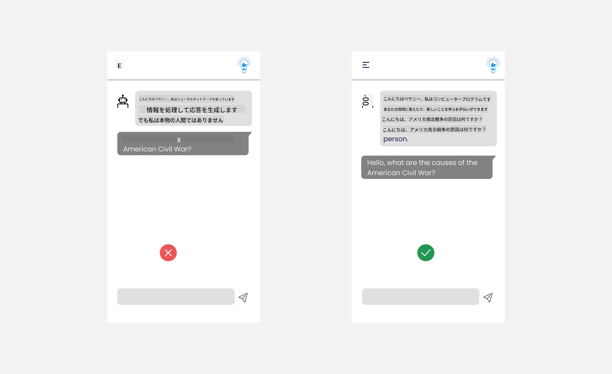

<!--
CO_OP_TRANSLATOR_METADATA:
{
  "original_hash": "747668e4c53d067369f06e9ec2e6313e",
  "translation_date": "2025-08-26T15:13:06+00:00",
  "source_file": "12-designing-ux-for-ai-applications/README.md",
  "language_code": "ja"
}
-->
# AIアプリケーションのUX設計

> _(上の画像をクリックすると、このレッスンの動画が見られます)_

ユーザーエクスペリエンス（UX）はアプリ開発において非常に重要な要素です。ユーザーが効率的にタスクをこなせるようにアプリを使えることが大切ですが、それだけでなく、誰もが使えるように設計し、_アクセシビリティ_を高めることも必要です。この章ではこの分野に焦点を当て、誰もが使いたくなる、使いやすいアプリを設計できるようになることを目指します。

## はじめに

ユーザーエクスペリエンスとは、ユーザーが特定の製品やサービス（システム、ツール、デザインなど）とどのように関わり、利用するかを指します。AIアプリケーションを開発する際、開発者はユーザーエクスペリエンスが効果的であることだけでなく、倫理的であることにも注目します。このレッスンでは、ユーザーのニーズに応えるAIアプリケーションの作り方を学びます。

このレッスンで扱う内容は以下の通りです：

- ユーザーエクスペリエンスの概要とユーザーニーズの理解
- 信頼性と透明性を重視したAIアプリケーション設計
- 協働とフィードバックを促進するAIアプリケーション設計

## 学習目標

このレッスンを終えると、次のことができるようになります：

- ユーザーのニーズを満たすAIアプリケーションの構築方法を理解する
- 信頼と協働を促進するAIアプリケーションを設計できる

### 前提知識

[ユーザーエクスペリエンスとデザイン思考](https://learn.microsoft.com/training/modules/ux-design?WT.mc_id=academic-105485-koreyst)について、事前に読んでおきましょう。

## ユーザーエクスペリエンスの概要とユーザーニーズの理解

架空の教育系スタートアップでは、主なユーザーは教師と生徒の2種類です。それぞれのユーザーには独自のニーズがあります。ユーザー中心設計では、ユーザーを最優先に考え、製品が対象となる人々にとって有益であることを重視します。

アプリケーションは**有用性、信頼性、アクセシビリティ、快適さ**を備えていることで、良いユーザーエクスペリエンスを提供できます。

### 有用性

有用性とは、アプリケーションが目的に合った機能を持っていることを意味します。例えば、採点作業の自動化や復習用のフラッシュカード生成などです。採点を自動化するアプリなら、あらかじめ決められた基準に基づいて生徒の課題に正確かつ効率的に点数をつけられる必要があります。同様に、フラッシュカードを生成するアプリなら、データに基づいて関連性の高い多様な問題を作成できる必要があります。

### 信頼性

信頼性とは、アプリケーションが安定してエラーなくタスクを実行できることです。ただし、AIも人間と同じく完璧ではなく、エラーが発生することがあります。アプリケーションがエラーや予期しない状況に遭遇した場合、人間による対応や修正が必要になることもあります。エラーをどのように扱うかが重要です。このレッスンの最後のセクションでは、AIシステムやアプリケーションがどのように協働やフィードバックを設計しているかを解説します。

### アクセシビリティ

アクセシビリティとは、障害の有無にかかわらず、さまざまな能力を持つユーザーにも使いやすい体験を提供することです。アクセシビリティのガイドラインや原則に従うことで、AIソリューションはより多くのユーザーにとって使いやすく、有益なものになります。

### 快適さ

快適さとは、アプリケーションを使っていて楽しいと感じられることです。魅力的なユーザー体験は、ユーザーがアプリを再度利用したいと思うきっかけとなり、ビジネスの収益向上にもつながります。

すべての課題がAIで解決できるわけではありません。AIは、手作業の自動化やユーザー体験のパーソナライズなど、ユーザーエクスペリエンスを補強する役割を果たします。

## 信頼性と透明性を重視したAIアプリケーション設計

AIアプリケーションを設計する際、信頼を築くことは非常に重要です。信頼があれば、ユーザーはアプリがきちんと仕事をこなし、安定して結果を出し、その結果が自分の求めているものであると確信できます。この分野でのリスクは、不信と過信です。不信は、ユーザーがAIシステムをほとんど、あるいは全く信頼しない場合に起こり、アプリの利用を拒否される原因となります。過信は、ユーザーがAIシステムの能力を過大評価し、AIを過度に信頼してしまう場合に起こります。例えば、採点の自動化システムで過信が起きると、教師が一部の答案を確認せず、システムの判定を鵜呑みにしてしまうかもしれません。その結果、生徒に不公平な成績がついたり、フィードバックや改善の機会を逃したりする可能性があります。

信頼を設計の中心に据えるための方法として、「説明性」と「コントロール」があります。

### 説明性

AIが意思決定を支援する場合、特に次世代に知識を伝えるような場面では、教師や保護者がAIの判断プロセスを理解することが重要です。これが「説明性」です。AIアプリケーションがどのように判断を下しているかを理解できるようにすることです。説明性を高める設計には、AIがどのようにしてその結果に至ったのかを示す詳細を加えることが含まれます。ユーザーには、その出力がAIによるものであり、人間によるものではないことを明確に伝える必要があります。例えば、「今すぐチューターとチャットを始めましょう」ではなく、「あなたのニーズに合わせて学習をサポートするAIチューターを使いましょう」といった表現にします。

もう一つの例は、AIがユーザーや個人データをどのように使うかです。例えば、「生徒」というペルソナを持つユーザーには、そのペルソナに基づいた制限がある場合があります。AIは答えを直接教えることはできなくても、問題解決の考え方を導くサポートはできるかもしれません。

説明性のもう一つの重要なポイントは、説明を分かりやすく簡単にすることです。生徒や教師はAIの専門家ではない場合が多いため、アプリができること・できないことの説明はシンプルで理解しやすいものであるべきです。

### コントロール

生成AIは、AIとユーザーの協働を生み出します。たとえば、ユーザーがプロンプトを調整して異なる結果を得ることができます。また、出力が生成された後に、ユーザーがその結果を修正できるようにすることで、ユーザーにコントロール感を与えます。例えば、Bingを使う場合、フォーマットやトーン、長さに応じてプロンプトを調整できます。さらに、出力に変更を加えたり、出力自体を修正することも可能です。

Bingのもう一つの機能として、ユーザーがAIが利用するデータの利用可否を選択できる点があります。学校向けアプリケーションの場合、生徒が自分のノートや教師の資料を復習用に使いたいと考えることもあるでしょう。

> AIアプリケーションを設計する際は、ユーザーがAIを過信して非現実的な期待を持たないよう、意図的な工夫が重要です。その一つの方法が、プロンプトと結果の間に「ひと手間」を設けることです。ユーザーに「これはAIであり、人間ではない」と意識させることが大切です。

## 協働とフィードバックを促進するAIアプリケーション設計

先ほども述べたように、生成AIはユーザーとAIの協働を生み出します。多くの場合、ユーザーがプロンプトを入力し、AIが出力を生成します。もしその出力が間違っていたらどうしますか？アプリケーションはエラーが発生したとき、どのように対応しますか？AIはユーザーのせいにするのか、それともエラーの理由を説明してくれるのでしょうか？

AIアプリケーションには、フィードバックの受け取りと提供の仕組みが必要です。これはAIシステムの改善に役立つだけでなく、ユーザーとの信頼関係の構築にもつながります。設計段階でフィードバックループを組み込むべきです。例えば、出力に対して「いいね」や「よくないね」といった簡単な評価ボタンを設けることができます。

また、システムの機能や限界を明確に伝えることも重要です。ユーザーがAIの能力を超えたリクエストをした場合にも、適切に対応できる仕組みが必要です。下記の例のように対応しましょう。

システムエラーはアプリケーションではよくあることで、ユーザーがAIの範囲外の情報を求めたり、アプリケーションが要約できる質問や科目数に制限がある場合などに発生します。例えば、限られた科目（歴史や数学など）のデータで訓練されたAIアプリケーションは、地理に関する質問には対応できないかもしれません。この場合、AIシステムは「申し訳ありませんが、本製品は以下の科目のデータで訓練されています……。ご質問にはお答えできません。」のように返答できます。

AIアプリケーションは完璧ではないため、ミスをすることもあります。アプリケーションを設計する際は、ユーザーからのフィードバックやエラー処理の仕組みを、シンプルで分かりやすい形で用意しましょう。

## 課題

これまでに作成したAIアプリがあれば、以下のステップをアプリに取り入れてみましょう：

- **快適さ:** アプリをより快適にするにはどうすればよいか考えてみましょう。説明を十分に加えていますか？ユーザーが探索したくなる工夫はありますか？エラーメッセージの表現はどうなっていますか？

- **有用性:** Webアプリを作る場合、マウスでもキーボードでも操作できるようにしましょう。

- **信頼性と透明性:** AIやその出力を完全に信頼せず、人間による確認を加える方法を考えましょう。また、信頼性や透明性を高める他の方法も検討し、実装してみましょう。

- **コントロール:** ユーザーがアプリに提供するデータを自分で管理できるようにしましょう。AIアプリケーションでデータ収集のオプトイン・オプトアウト機能を実装しましょう。

## 学びを続けよう！

このレッスンを終えたら、[生成AI学習コレクション](https://aka.ms/genai-collection?WT.mc_id=academic-105485-koreyst)でさらに生成AIの知識を深めましょう！

次はレッスン13で、[AIアプリケーションのセキュリティ](../13-securing-ai-applications/README.md?WT.mc_id=academic-105485-koreyst)について学びます！

---

**免責事項**：  
本書類はAI翻訳サービス [Co-op Translator](https://github.com/Azure/co-op-translator) を使用して翻訳されています。正確性には努めておりますが、自動翻訳には誤りや不正確な表現が含まれる場合があります。原文（元の言語の文書）が正式な情報源とみなされるべきです。重要な情報については、専門の人間による翻訳を推奨します。本翻訳の利用によって生じたいかなる誤解や誤認についても、当方は責任を負いかねます。