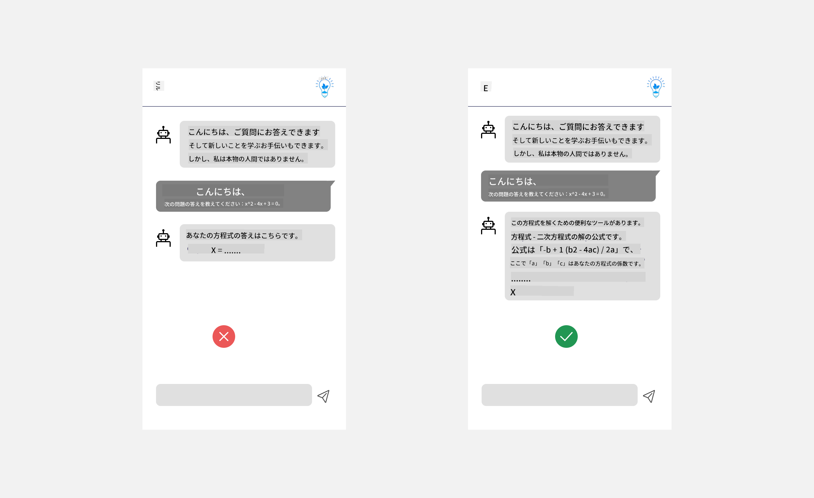
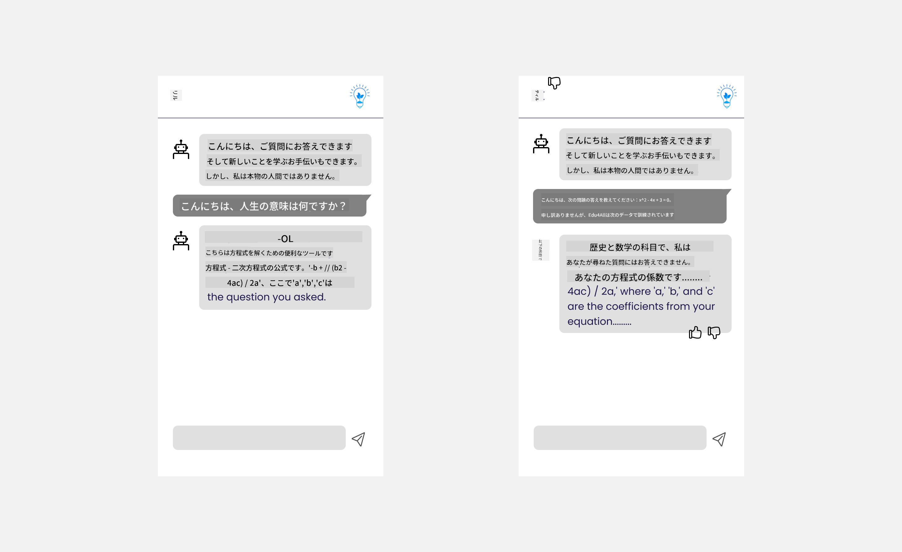

<!--
CO_OP_TRANSLATOR_METADATA:
{
  "original_hash": "ec385b41ee50579025d50cc03bfb3a25",
  "translation_date": "2025-07-09T14:52:08+00:00",
  "source_file": "12-designing-ux-for-ai-applications/README.md",
  "language_code": "ja"
}
-->
# AIアプリケーションのUXデザイン

> _(上の画像をクリックすると、このレッスンのビデオが視聴できます)_

ユーザーエクスペリエンスはアプリ開発において非常に重要な要素です。ユーザーが効率的にタスクを実行できるようにアプリを使える必要があります。効率的であることは大切ですが、それだけでなく、誰もが使えるようにアプリを設計し、_アクセシブル_にすることも必要です。この章ではその点に焦点を当て、ユーザーが使いたくなるアプリを設計できるようにします。

## はじめに

ユーザーエクスペリエンスとは、ユーザーが特定の製品やサービス（システム、ツール、デザインなど）とどのように関わり、利用するかを指します。AIアプリケーションを開発する際、開発者はユーザーエクスペリエンスが効果的であるだけでなく、倫理的であることにも注力します。このレッスンでは、ユーザーのニーズに応える人工知能（AI）アプリケーションの構築方法を学びます。

このレッスンで扱う内容は以下の通りです：

- ユーザーエクスペリエンスの紹介とユーザーニーズの理解
- 信頼性と透明性を考慮したAIアプリケーションの設計
- 協働とフィードバックを促進するAIアプリケーションの設計

## 学習目標

このレッスンを終えた後、あなたは以下のことができるようになります：

- ユーザーのニーズに応えるAIアプリケーションの構築方法を理解する
- 信頼と協働を促進するAIアプリケーションを設計する

### 前提条件

時間を取って、[ユーザーエクスペリエンスとデザイン思考について](https://learn.microsoft.com/training/modules/ux-design?WT.mc_id=academic-105485-koreyst)さらに学んでみてください。

## ユーザーエクスペリエンスの紹介とユーザーニーズの理解

私たちの架空の教育系スタートアップには、主に教師と学生という2つのユーザー層があります。それぞれのユーザーには独自のニーズがあります。ユーザー中心設計は、製品が対象ユーザーにとって関連性があり、有益であることを優先します。

アプリケーションは**役立ち、信頼でき、アクセシブルで快適**であるべきで、良いユーザーエクスペリエンスを提供します。

### 使いやすさ（Usability）

役立つとは、アプリケーションが意図された目的に合った機能を持つことを意味します。例えば、採点プロセスの自動化や復習用のフラッシュカード生成などです。採点プロセスを自動化するアプリは、事前に定められた基準に基づいて学生の課題に正確かつ効率的に点数を付けることが求められます。同様に、復習用フラッシュカードを生成するアプリは、データに基づいて関連性が高く多様な問題を作成できる必要があります。

### 信頼性（Reliability）

信頼できるとは、アプリケーションが一貫してエラーなくタスクを実行できることを意味します。ただし、AIも人間と同様に完璧ではなく、エラーが起こる可能性があります。アプリケーションはエラーや予期しない状況に遭遇し、人間の介入や修正が必要になることもあります。エラーをどのように扱うか？このレッスンの最後のセクションで、AIシステムやアプリケーションが協働とフィードバックのためにどのように設計されているかを説明します。

### アクセシビリティ（Accessibility）

アクセシブルであるとは、障害のある方を含むさまざまな能力を持つユーザーにも使いやすいユーザーエクスペリエンスを提供し、誰も取り残さないことを意味します。アクセシビリティのガイドラインや原則に従うことで、AIソリューションはより包括的で使いやすく、すべてのユーザーにとって有益になります。

### 快適さ（Pleasant）

快適であるとは、アプリケーションの使用が楽しいことを意味します。魅力的なユーザーエクスペリエンスはユーザーに良い印象を与え、アプリに戻ってきてもらいやすくなり、ビジネスの収益向上にもつながります。

すべての課題がAIで解決できるわけではありません。AIは手作業の自動化やユーザー体験のパーソナライズなど、ユーザーエクスペリエンスを補完する役割を果たします。

## 信頼性と透明性を考慮したAIアプリケーションの設計

AIアプリケーションを設計する際、信頼の構築は非常に重要です。信頼は、ユーザーがアプリケーションが確実に仕事をこなし、結果を一貫して提供し、その結果がユーザーのニーズに合っていると確信できることを意味します。この分野でのリスクは、不信感と過信です。不信感はユーザーがAIシステムをほとんどまたは全く信頼しない場合に起こり、アプリケーションの拒否につながります。過信はユーザーがAIシステムの能力を過大評価しすぎる場合に起こり、AIシステムを過度に信頼してしまいます。例えば、自動採点システムに過信すると、教師が一部の答案を確認しなくなり、採点システムの誤りに気づかず不公平または不正確な成績がつく可能性があります。フィードバックや改善の機会も失われるかもしれません。

信頼を設計の中心に据えるための2つの方法は、説明可能性とコントロールです。

### 説明可能性（Explainability）

AIが将来の世代に知識を伝えるなどの意思決定を支援する場合、教師や保護者がAIの意思決定の仕組みを理解することが重要です。これが説明可能性です。AIアプリケーションがどのように意思決定を行うかを理解することを指します。説明可能性を考慮した設計には、AIアプリケーションができることの具体例を示すことが含まれます。例えば、「AI教師を始めよう」ではなく、「AIを使ってノートを要約し、復習を簡単にしよう」といった表現が使えます。

もう一つの例は、AIがユーザーや個人データをどのように使うかです。例えば、学生というペルソナのユーザーは制限があるかもしれません。AIは質問の答えを直接教えられない場合もありますが、問題解決の考え方を導く手助けはできます。

説明可能性のもう一つの重要なポイントは、説明を簡潔にすることです。学生や教師はAIの専門家ではないため、アプリケーションができること・できないことの説明は分かりやすく簡単であるべきです。

### コントロール（Control）

生成AIはAIとユーザーの協働を生み出します。例えば、ユーザーが異なる結果を得るためにプロンプトを修正できるようにします。さらに、出力が生成された後も、ユーザーが結果を修正できることでコントロール感を持てます。例えば、Bingを使うと、フォーマット、トーン、長さに基づいてプロンプトを調整できます。さらに、出力に変更を加えたり修正したりすることも可能です。

Bingのもう一つの機能は、ユーザーがAIが使用するデータの収集に対してオプトイン・オプトアウトできることです。学校向けアプリケーションでは、学生が自分のノートや教師の資料を復習用の教材として使いたい場合があります。

> AIアプリケーションを設計する際は、ユーザーがAIの能力に過信しないよう意図的に設計することが重要です。その一つの方法は、プロンプトと結果の間に「摩擦」を作り、これはAIであり人間ではないことをユーザーに思い出させることです。

## 協働とフィードバックを促進するAIアプリケーションの設計

前述の通り、生成AIはユーザーとAIの協働を生み出します。多くの場合、ユーザーがプロンプトを入力し、AIが出力を生成します。もし出力が間違っていたらどうしますか？エラーが発生した場合、アプリケーションはどのように対応しますか？AIはユーザーのせいにするでしょうか、それともエラーを説明する時間を取るでしょうか？

AIアプリケーションはフィードバックを受け取り、返す仕組みを組み込むべきです。これによりAIシステムの改善が促進されるだけでなく、ユーザーとの信頼関係も築かれます。フィードバックループを設計に含める例として、出力に対する簡単な「いいね」や「よくないね」ボタンがあります。

もう一つの方法は、システムの能力と限界を明確に伝えることです。ユーザーがAIの能力を超えた要求をした場合の対応方法も用意すべきです。以下の例をご覧ください。

システムエラーはよくあることで、ユーザーがAIの範囲外の情報を求めたり、アプリケーションが生成できる質問や科目の数に制限があったりする場合があります。例えば、歴史と数学のデータで訓練されたAIアプリケーションは地理に関する質問に対応できないかもしれません。これを緩和するために、AIシステムは「申し訳ありませんが、当製品は以下の科目のデータで訓練されています……ご質問にはお答えできません」といった応答を返すことができます。

AIアプリケーションは完璧ではないため、ミスをすることがあります。アプリケーションを設計する際は、ユーザーからのフィードバックやエラー処理の余地を設け、シンプルで分かりやすい方法で対応できるようにしましょう。

## 課題

これまでに作成したAIアプリを使って、以下のステップを実装することを検討してください：

- **快適さ:** アプリをより快適にするにはどうすればよいか考えてみましょう。説明を随所に加えていますか？ユーザーが探索したくなるよう促していますか？エラーメッセージの表現はどうですか？

- **使いやすさ:** Webアプリを作る場合、マウスとキーボードの両方で操作できるようにしましょう。

- **信頼と透明性:** AIやその出力を完全に信頼しすぎないようにし、出力を検証するために人間を介在させる方法を考え、実装してください。また、信頼と透明性を実現する他の方法も検討しましょう。

- **コントロール:** ユーザーがアプリに提供するデータをコントロールできるようにしましょう。AIアプリケーションでデータ収集のオプトイン・オプトアウトができる仕組みを実装してください。

## 学習を続けましょう！

このレッスンを終えたら、[Generative AI Learning collection](https://aka.ms/genai-collection?WT.mc_id=academic-105485-koreyst)でさらに生成AIの知識を深めてください！

次のレッスン13では、[AIアプリケーションのセキュリティ](../13-securing-ai-applications/README.md?WT.mc_id=academic-105485-koreyst)について学びます！

**免責事項**：  
本書類はAI翻訳サービス「[Co-op Translator](https://github.com/Azure/co-op-translator)」を使用して翻訳されました。正確性を期しておりますが、自動翻訳には誤りや不正確な部分が含まれる可能性があります。原文の言語による文書が正式な情報源とみなされるべきです。重要な情報については、専門の人間による翻訳を推奨します。本翻訳の利用により生じた誤解や誤訳について、当方は一切の責任を負いかねます。