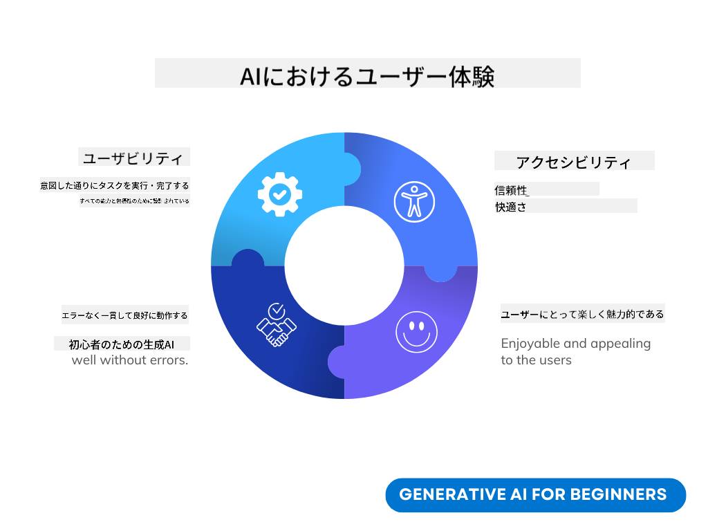
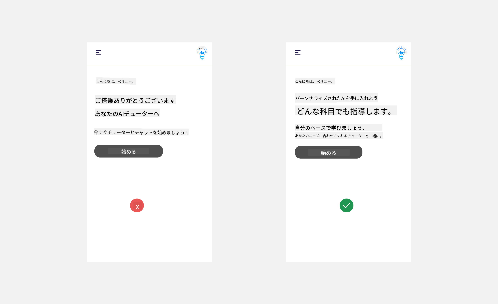
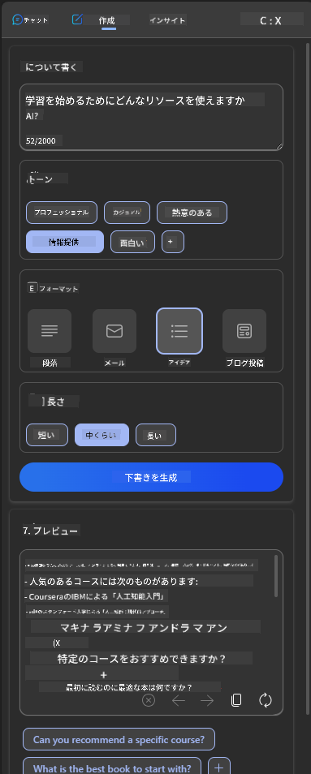

<!--
CO_OP_TRANSLATOR_METADATA:
{
  "original_hash": "78bbeed50fd4dc9fdee931f5daf98cb3",
  "translation_date": "2025-10-17T23:49:38+00:00",
  "source_file": "12-designing-ux-for-ai-applications/README.md",
  "language_code": "ja"
}
-->
# AIアプリケーションのUX設計

> _(上の画像をクリックして、このレッスンの動画をご覧ください)_

ユーザーエクスペリエンスはアプリを構築する際に非常に重要な要素です。ユーザーが効率的にタスクを実行できるようにする必要があります。効率的であることは重要ですが、すべての人が利用できるようにアプリを設計することも必要です。つまり、アプリを_アクセシブル_にすることです。この章ではこの分野に焦点を当て、誰もが使いたくなるアプリを設計することを目指します。

## はじめに

ユーザーエクスペリエンスとは、ユーザーが特定の製品やサービス（システム、ツール、デザインなど）とどのようにやり取りし、利用するかを指します。AIアプリケーションを開発する際、開発者はユーザーエクスペリエンスが効果的であるだけでなく、倫理的であることにも注力します。このレッスンでは、ユーザーのニーズに応えるAIアプリケーションの構築方法を学びます。

このレッスンでは以下の内容を扱います：

- ユーザーエクスペリエンスの概要とユーザーのニーズの理解
- 信頼性と透明性を重視したAIアプリケーションの設計
- コラボレーションとフィードバックを重視したAIアプリケーションの設計

## 学習目標

このレッスンを終えた後、以下のことができるようになります：

- ユーザーのニーズに応えるAIアプリケーションの構築方法を理解する。
- 信頼性とコラボレーションを促進するAIアプリケーションを設計する。

### 前提条件

[ユーザーエクスペリエンスとデザイン思考](https://learn.microsoft.com/training/modules/ux-design?WT.mc_id=academic-105485-koreyst)についてさらに学んでみてください。

## ユーザーエクスペリエンスの概要とユーザーのニーズの理解

架空の教育系スタートアップでは、主なユーザーとして教師と学生の2つのグループがいます。それぞれのユーザーには独自のニーズがあります。ユーザー中心のデザインは、ユーザーを優先し、製品が対象者にとって関連性があり有益であることを保証します。

アプリケーションは、良いユーザーエクスペリエンスを提供するために、**有用性、信頼性、アクセシビリティ、快適性**を備えている必要があります。

### 有用性

有用性とは、アプリケーションがその目的に合った機能を持っていることを意味します。例えば、採点プロセスを自動化したり、復習用のフラッシュカードを生成したりすることです。採点プロセスを自動化するアプリケーションは、事前に定義された基準に基づいて学生の課題に正確かつ効率的にスコアを付けることができる必要があります。同様に、復習用フラッシュカードを生成するアプリケーションは、データに基づいて関連性のある多様な質問を作成できる必要があります。

### 信頼性

信頼性とは、アプリケーションが一貫してエラーなくタスクを実行できることを意味します。ただし、AIも人間と同様に完璧ではなく、エラーが発生する可能性があります。アプリケーションはエラーや予期しない状況に直面することがあり、その際には人間の介入や修正が必要になる場合があります。エラーをどのように処理するかについては、このレッスンの最後のセクションで、コラボレーションとフィードバックを重視したAIシステムとアプリケーションの設計方法を取り上げます。

### アクセシビリティ

アクセシビリティとは、障害を持つ人を含むさまざまな能力を持つユーザーに対してユーザーエクスペリエンスを拡張し、誰もが利用できるようにすることを意味します。アクセシビリティのガイドラインと原則に従うことで、AIソリューションはより包括的で使いやすく、すべてのユーザーにとって有益なものになります。

### 快適性

快適性とは、アプリケーションが使いやすく、楽しいものであることを意味します。魅力的なユーザーエクスペリエンスは、ユーザーにアプリケーションを再び利用したいと思わせ、ビジネスの収益を増加させる可能性があります。

すべての課題がAIで解決できるわけではありません。AIはユーザーエクスペリエンスを補完するために活用されます。例えば、手作業のタスクを自動化したり、ユーザーエクスペリエンスを個別化したりすることです。

## 信頼性と透明性を重視したAIアプリケーションの設計

AIアプリケーションを設計する際には、信頼を築くことが重要です。信頼があることで、ユーザーはアプリケーションが仕事を完了し、結果を一貫して提供し、ユーザーのニーズに合った結果を出すことを確信できます。この分野でのリスクは、不信感と過信です。不信感は、ユーザーがAIシステムにほとんどまたは全く信頼を持たない場合に発生し、結果としてアプリケーションが拒否されます。過信は、ユーザーがAIシステムの能力を過大評価し、AIシステムを過度に信頼してしまう場合に発生します。例えば、採点を自動化するシステムの場合、過信が原因で教師が一部の答案を確認せずに採点システムが正しく機能しているかを確認しないことがあります。これにより、学生に不公平または不正確な成績が与えられたり、フィードバックや改善の機会が失われたりする可能性があります。

信頼を設計の中心に据えるための方法として、説明可能性とコントロールの2つがあります。

### 説明可能性

AIが将来の世代に知識を伝えるような意思決定を支援する場合、教師や保護者がAIの意思決定方法を理解することが重要です。これが説明可能性です。つまり、AIアプリケーションがどのように意思決定を行うかを理解することです。説明可能性を考慮した設計には、AIがどのようにして出力に至ったかを強調する詳細を追加することが含まれます。出力が人間ではなくAIによって生成されたものであることを、利用者が認識できるようにする必要があります。例えば、「今すぐ家庭教師とチャットを始めましょう」と言う代わりに、「あなたのニーズに合わせて学習をサポートするAI家庭教師を利用しましょう」と伝えることができます。

もう1つの例として、AIがユーザーや個人データをどのように利用するかがあります。例えば、学生のペルソナを持つユーザーには、そのペルソナに基づいて制限がある場合があります。AIは質問への答えを明かすことはできないかもしれませんが、問題を解決する方法を考える手助けをすることはできます。

説明可能性のもう1つの重要な部分は、説明を簡素化することです。学生や教師はAIの専門家ではないかもしれません。そのため、アプリケーションができることやできないことの説明は簡潔で理解しやすいものであるべきです。

### コントロール

生成AIはAIとユーザーの間にコラボレーションを生み出します。例えば、ユーザーが異なる結果を得るためにプロンプトを修正することができます。また、出力が生成された後、ユーザーは結果を修正することができ、コントロール感を得ることができます。例えば、Bingを使用する際、フォーマット、トーン、長さに基づいてプロンプトを調整することができます。さらに、出力に変更を加えたり、結果を修正することも可能です。

また、Bingのもう1つの機能として、ユーザーがアプリケーションが使用するデータに対してオプトインやオプトアウトする能力があります。学校のアプリケーションでは、学生が自分のノートや教師のリソースを復習資料として使用したい場合があります。

> AIアプリケーションを設計する際には、ユーザーがAIを過信してその能力に対して非現実的な期待を抱かないようにするために、意図的な設計が重要です。その方法の1つとして、プロンプトと結果の間に摩擦を生み出し、ユーザーにこれはAIであり人間ではないことを思い出させることが挙げられます。

## コラボレーションとフィードバックを重視したAIアプリケーションの設計

前述のように、生成AIはユーザーとAIの間にコラボレーションを生み出します。ほとんどのやり取りは、ユーザーがプロンプトを入力し、AIが出力を生成する形で行われます。では、出力が間違っていた場合はどうなるでしょうか？エラーが発生した場合、アプリケーションはどのように対応するのでしょうか？AIはユーザーを非難するのか、それともエラーを説明する時間を取るのでしょうか？

AIアプリケーションはフィードバックを受け取り、提供するように設計されるべきです。これにより、AIシステムが改善されるだけでなく、ユーザーとの信頼も構築されます。設計にはフィードバックループを含めるべきであり、例えば出力に対してシンプルな「良い」または「悪い」の評価を行う機能を追加することができます。

もう1つの方法として、システムの能力と限界を明確に伝えることがあります。ユーザーがAIの能力を超えた要求をした場合、それを適切に処理する方法も必要です。以下の例のように対応することができます。

システムエラーはアプリケーションでよく発生します。例えば、ユーザーがAIの範囲外の情報を必要とする場合や、アプリケーションが生成できる質問や科目の数に制限がある場合です。例えば、歴史や数学のデータで訓練されたAIアプリケーションは、地理に関する質問には対応できないかもしれません。この場合、AIシステムは「申し訳ありませんが、当製品は以下の科目のデータで訓練されています……。ご質問にお答えすることはできません。」といった回答を提供することができます。

AIアプリケーションは完璧ではないため、ミスをする可能性があります。アプリケーションを設計する際には、ユーザーからのフィードバックを受け入れ、エラーを簡単かつ分かりやすく処理する余地を作ることが重要です。

## 課題

これまでに構築したAIアプリを取り上げ、以下のステップをアプリに実装することを検討してください：

- **快適性:** アプリをより快適にする方法を考えてみましょう。説明を十分に追加していますか？ユーザーに探索を促していますか？エラーメッセージの文言は適切ですか？

- **有用性:** Webアプリを構築する際、アプリがマウスとキーボードの両方で操作可能であることを確認してください。

- **信頼性と透明性:** AIとその出力を完全に信頼せず、出力を検証するために人間をプロセスに加える方法を検討してください。また、信頼性と透明性を達成するための他の方法を検討し、実装してください。

- **コントロール:** ユーザーがアプリケーションに提供するデータをコントロールできるようにしてください。AIアプリケーションでのデータ収集に対してユーザーがオプトインおよびオプトアウトできる方法を実装してください。

<!-- ## [講義後のクイズ](../../../12-designing-ux-for-ai-applications/quiz-url) -->

## 学習を続けましょう！

このレッスンを完了した後は、[生成AI学習コレクション](https://aka.ms/genai-collection?WT.mc_id=academic-105485-koreyst)をチェックして、生成AIの知識をさらに深めましょう！

次のレッスン13では、[AIアプリケーションのセキュリティ](../13-securing-ai-applications/README.md?WT.mc_id=academic-105485-koreyst)について学びます！

---

**免責事項**:  
この文書はAI翻訳サービス[Co-op Translator](https://github.com/Azure/co-op-translator)を使用して翻訳されています。正確性を追求しておりますが、自動翻訳には誤りや不正確な部分が含まれる可能性があります。元の言語で記載された文書を正式な情報源としてご参照ください。重要な情報については、専門の人間による翻訳を推奨します。この翻訳の使用に起因する誤解や誤解釈について、当社は一切の責任を負いません。