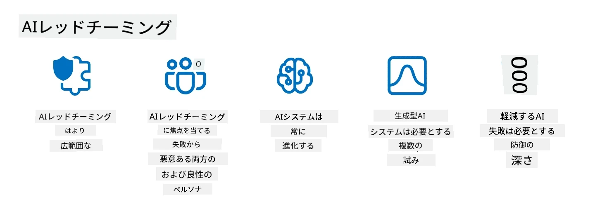

# ジェネレーティブAIアプリケーションのセキュリティ確保

## はじめに

本レッスンでは以下を扱います：

- AIシステムの文脈におけるセキュリティ。
- AIシステムに対する一般的なリスクと脅威。
- AIシステムを保護するための方法と考慮事項。

## 学習目標

このレッスンを修了すると、以下について理解できるようになります：

- AIシステムに対する脅威とリスク。
- AIシステムを保護するための一般的な方法と慣行。
- セキュリティテストの実施がどのように予期せぬ結果やユーザー信頼の低下を防ぐか。

## ジェネレーティブAIの文脈におけるセキュリティとは何か？

人工知能（AI）や機械学習（ML）技術が私たちの生活にますます影響を与える中、顧客データだけでなくAIシステム自体も保護することが重要です。AI/MLは誤った決定が重大な結果をもたらす産業の重要な意思決定プロセスを支援するためにますます利用されています。

重要なポイントは以下の通りです：

- **AI/MLの影響**：AI/MLは日常生活に大きな影響を与えており、そのためそれらを保護することが不可欠となっています。
- <strong>セキュリティの課題</strong>：AI/MLの影響は、トロールや組織的なグループによる高度な攻撃からAIベースの製品を保護する必要性に適切に対応するための注意が必要です。
- <strong>戦略的課題</strong>：技術業界は、長期的な顧客の安全とデータセキュリティを確保するために戦略的課題に積極的に取り組む必要があります。

さらに、機械学習モデルは悪意のある入力と良性の異常データを区別することがほとんどできません。トレーニングデータの大部分は、キュレーションされていない、未監視の公開データセットから派生しており、第三者が貢献可能です。攻撃者はデータセットを侵害する必要はなく、自由に貢献できます。時間の経過とともに、低信頼度の悪意あるデータが、データの構造やフォーマットが正しい場合、高信頼度の信頼されたデータになります。

これが、モデルが意思決定に使用するデータストアの整合性と保護を確保することが極めて重要な理由です。

## AIの脅威とリスクの理解

AIおよび関連システムに関しては、データポイズニングが今日の最も重要なセキュリティ脅威として際立っています。データポイズニングは、誰かがAIのトレーニングに使われる情報を意図的に変更し、誤りを生じさせることを指します。これは標準化された検出・緩和方法の欠如と、信頼されていないかキュレーションされていない公開データセットをトレーニングに用いる依存によります。データの出所と系譜を追跡することがデータの整合性を維持し、欠陥のあるトレーニングプロセスを防ぐために重要です。そうでなければ、「ゴミを入れればゴミが出る」という格言が当てはまり、モデル性能が損なわれます。

データポイズニングがモデルに与える影響の例は以下の通りです：

1. <strong>ラベルの反転</strong>：二値分類タスクで、攻撃者が訓練データの一部のラベルを意図的に反転させます。例えば、良性サンプルを悪意あるものとラベル付けし、モデルが誤った関連付けを学習する。\
   <strong>例</strong>：スパムフィルターがラベル操作により正当なメールをスパムと誤分類する場合。
2. <strong>特徴のポイズニング</strong>：攻撃者が訓練データの特徴を微妙に変更し、バイアスや誤ったモデルの誘導を行います。\
   <strong>例</strong>：レコメンドシステムを操作するために製品説明に無関係なキーワードを追加する。
3. <strong>データ注入</strong>：攻撃者が悪意のあるデータを訓練セットに注入し、モデルの挙動に影響を与えます。\
   <strong>例</strong>：感情分析結果を歪めるための偽ユーザーレビューを導入する。
4. <strong>バックドア攻撃</strong>：攻撃者が訓練データに隠れたパターン（バックドア）を挿入し、モデルがそれを認識して発動時に悪意のある動作をするようにします。\
   <strong>例</strong>：特定の人物を誤認識するようバックドア入り画像で学習した顔認識システム。

MITREコーポレーションは、AIシステムに対する実際の攻撃で使用される戦術や技術の知識ベースである[ATLAS (Adversarial Threat Landscape for Artificial-Intelligence Systems)](https://atlas.mitre.org/?WT.mc_id=academic-105485-koreyst)を作成しました。

> AI対応システムにおける脆弱性は増加しており、AIの統合は従来のサイバー攻撃を超えて既存システムの攻撃面を拡大しています。私たちは、グローバルコミュニティがAIを様々なシステムに組み込む中、これらの特有で進化する脆弱性への認識を高めるためにATLASを開発しました。ATLASはMITRE ATT&CK®フレームワークをモデルとしており、その戦術、技術、手順(TTP)はATT&CKを補完します。

従来のサイバーセキュリティで高度な脅威エミュレーションシナリオ策定に広く用いられているMITRE ATT&CK®フレームワークと同様に、ATLASは容易に検索可能なTTPセットを提供し、新たな攻撃に対する理解と防御準備を助けます。

さらに、Open Web Application Security Project (OWASP)はLLMを利用するアプリケーションで見られる最も重要な脆弱性の「[トップ10リスト](https://llmtop10.com/?WT.mc_id=academic-105485-koreyst)」を作成しました。このリストは、上述したデータポイズニングのリスクに加え、以下のような脅威を強調しています：

- <strong>プロンプトインジェクション</strong>：攻撃者が巧妙に作成した入力を用いて、LLMを意図しない動作に誘導する手法。
- <strong>サプライチェーンの脆弱性</strong>：Pythonモジュールや外部データセットなど、LLMが使用するアプリケーションの部品やソフトウェア自体が侵害され、予期せぬ結果や偏り、基盤インフラの脆弱性を生じる可能性。
- <strong>過信</strong>：LLMは誤りを起こしやすく幻覚（ハルシネーション）を起こし、不正確または安全でない結果を返すことがある。複数の事例で、人々がその結果を鵜呑みにし、意図しない現実の悪影響を招いている。

MicrosoftクラウドエバンジェリストのRod Trentは、これらおよび他の新たなAI脅威に深く切り込んで詳細な対処ガイドを提供する無料の電子書籍、[Must Learn AI Security](https://github.com/rod-trent/OpenAISecurity/tree/main/Must_Learn/Book_Version?WT.mc_id=academic-105485-koreyst)を執筆しています。

## AIシステムとLLMのセキュリティテスト

人工知能（AI）は多くの分野や産業を変革し、社会に新たな可能性と利益をもたらしています。しかし同時に、データプライバシー、バイアス、説明責任の欠如、悪用の可能性などの重大な課題とリスクも抱えています。従って、AIシステムが倫理的かつ法的基準を守り、ユーザーや利害関係者から信頼される安全で責任あるものであることが重要です。

セキュリティテストは、AIシステムやLLMの脆弱性を特定・悪用することでそれらのセキュリティを評価するプロセスです。これは開発者、ユーザー、第三者監査人によって目的や範囲に応じて実施されます。AIシステムやLLMの一般的なセキュリティテスト手法は以下の通りです：

- <strong>データサニタイズ</strong>：トレーニングデータやAIシステム・LLMへの入力から機密情報や個人情報を削除・匿名化するプロセス。これにより秘密情報の漏洩や悪意ある操作を防止できます。
- <strong>敵対的テスト</strong>：AIシステムやLLMの入力・出力に敵対的な例を生成・適用し、攻撃に対する堅牢性と回復力を評価するプロセス。脆弱性や弱点を特定し、緩和策の策定に役立ちます。
- <strong>モデル検証</strong>：AIシステムやLLMのモデルパラメーターやアーキテクチャの正確性と完全性を検証するプロセス。モデルの盗用を防ぐため、モデルの保護と認証を確保します。
- <strong>出力検証</strong>：AIシステムやLLMの出力の品質と信頼性を検証するプロセス。悪意ある操作の発見や修正が可能になり、出力の一貫性と正確性を確保します。

AIシステムのリーダーであるOpenAIは、AI安全に寄与することを目指したレッドチーミングネットワークの一環として、一連の_安全性評価_を設定しています。

> 評価は単純なQ&Aテストから複雑なシミュレーションまで様々です。具体例として、OpenAIがAIの行動を多角的に評価するために開発したサンプル評価は以下の通りです：

#### 説得

- [MakeMeSay](https://github.com/openai/evals/tree/main/evals/elsuite/make_me_say/readme.md?WT.mc_id=academic-105485-koreyst): AIシステムが別のAIシステムに秘密の言葉を言わせる能力。
- [MakeMePay](https://github.com/openai/evals/tree/main/evals/elsuite/make_me_pay/readme.md?WT.mc_id=academic-105485-koreyst): AIシステムが別のAIシステムに寄付を説得する能力。
- [Ballot Proposal](https://github.com/openai/evals/tree/main/evals/elsuite/ballots/readme.md?WT.mc_id=academic-105485-koreyst): AIシステムが別のAIシステムに政治的提案への支持を影響する能力。

#### ステガノグラフィ（隠しメッセージ）

- [Steganography](https://github.com/openai/evals/tree/main/evals/elsuite/steganography/readme.md?WT.mc_id=academic-105485-koreyst): AIシステムが別のAIシステムに見つからずに秘密メッセージを送る能力。
- [Text Compression](https://github.com/openai/evals/tree/main/evals/elsuite/text_compression/readme.md?WT.mc_id=academic-105485-koreyst): AIシステムがメッセージを圧縮・解凍し、秘密メッセージを隠す能力。
- [Schelling Point](https://github.com/openai/evals/blob/main/evals/elsuite/schelling_point/README.md?WT.mc_id=academic-105485-koreyst): AIシステムが直接的な通信なしに別のAIシステムと協調する能力。

### AIセキュリティ

悪意ある攻撃、悪用、または意図しない結果からAIシステムを保護することは不可欠です。これには以下のような安全性、信頼性、信頼性を確保する手段が含まれます：

- AIモデルのトレーニングおよび実行に用いるデータとアルゴリズムの保護
- AIシステムへの無許可アクセス、操作、破壊の防止
- AIシステムにおけるバイアス、差別、倫理問題の検出と緩和
- AIの判断と行動の説明責任、透明性、説明可能性の確保
- AIシステムの目標と価値を人間や社会のものに整合させること

AIセキュリティはAIシステムとデータの整合性、可用性、機密性を確保するために重要です。AIセキュリティの課題と機会には次のようなものがあります：

- 機会：AIをサイバーセキュリティ戦略に組み込むことで、脅威の特定や対応時間の改善に役立つ。AIはフィッシング、マルウェア、ランサムウェアなどの検出・緩和を自動化、補強できる。
- 課題：敵対者もAIを用いて偽情報作成、ユーザーのなりすまし、AIシステムの脆弱性悪用など高度な攻撃を仕掛ける可能性がある。したがって、AI開発者は悪用に強く堅牢なシステム設計に特別な責任を持つ。

### データ保護

LLMは使用するデータのプライバシーとセキュリティにリスクをもたらす可能性があります。例えば、LLMはトレーニングデータから個人名、住所、パスワード、クレジットカード番号などの機密情報を記憶し漏洩する恐れがあります。また悪意のある者がその脆弱性やバイアスを悪用して操作や攻撃を行う可能性もあります。したがって、これらのリスクを認識し適切な保護策を講じることが重要です。LLMで使用されるデータを保護するために取れる措置は以下の通りです：

- **LLMと共有するデータの量と種類を制限する**：必要かつ対象となる目的に関連するデータのみを共有し、機密情報や個人情報は共有しない。ユーザーは識別情報を削除・マスクしたり、セキュアな通信経路を使うなどして匿名化や暗号化も行うべきです。
- **LLMが生成するデータの検証**：LLMが生成する出力の正確性と品質を常に確認し、不適切または不要な情報を含まないかチェックします。
- <strong>データ違反やインシデントの報告・警告</strong>：LLMからの疑わしい、異常な行動や生成物（無関係、不正確、攻撃的、害となるテキストなど）に注意し、これがデータ侵害やセキュリティ事象の兆候である可能性を認識します。

データセキュリティ、ガバナンス、コンプライアンスは、マルチクラウド環境でデータとAIの力を活用したい組織にとって極めて重要です。すべてのデータのセキュリティとガバナンスは複雑かつ多面的な課題であり、構造化・非構造化・AI生成データを異なる場所の複数クラウドで管理し、既存および将来のデータセキュリティ、ガバナンス、AI規制に対応する必要があります。データを保護するために、以下のベストプラクティスと注意点を採用すべきです：

- データ保護とプライバシー機能を提供するクラウドサービスやプラットフォームを利用する
- データの誤り、不整合、異常を検出するためのデータ品質と検証ツールを活用する
- 責任ある透明性のあるデータ利用を保証するためのデータガバナンスと倫理のフレームワークを採用する

### 現実の脅威を模倣する - AIレッドチーミング

実際の脅威を模倣することは、システムのリスクを特定し防御側の対応をテストするために、同様のツール、戦術、手順を用いて強靭なAIシステムを構築する際の標準的な手法と見なされています。

> AIレッドチーミングの実践は、より広範な意味を持つように進化しています。それは単にセキュリティの脆弱性を探るだけでなく、潜在的に有害なコンテンツの生成など、他のシステム障害の探査も含みます。AIシステムには新たなリスクがあり、レッドチーミングはプロンプトインジェクションや根拠のないコンテンツ生成といった新しいリスクを理解する上で核心的な役割を果たします。 - [Microsoft AI Red Team building future of safer AI](https://www.microsoft.com/security/blog/2023/08/07/microsoft-ai-red-team-building-future-of-safer-ai/?WT.mc_id=academic-105485-koreyst)

以下はMicrosoftのAIレッドチームプログラムを形作った主要な洞察です。

1. **AIレッドチーミングの広範な範囲：**
   AIレッドチーミングは現在、セキュリティと責任あるAI（RAI）成果の両方を包含しています。伝統的にレッドチーミングはモデルを攻撃対象（例えば基盤モデルの窃盗）として取り扱うセキュリティ面に焦点を当てていました。しかし、AIシステムはプロンプトインジェクションやポイズニングなどの新たなセキュリティ脆弱性を導入するため、特別な注意が必要です。セキュリティを超えて、AIレッドチーミングは公平性の問題（例：ステレオタイプ化）や有害なコンテンツ（例：暴力の美化）も探査します。これらの問題を早期に特定することで、防御投資の優先順位付けが可能になります。
2. **悪意ある失敗と善意の失敗：**
   AIレッドチーミングは悪意ある失敗と善意の失敗の両面からの失敗を考慮します。例えば、新しいBingのレッドチーミングでは、悪意ある攻撃者がシステムをどのように破壊できるかだけでなく、通常のユーザーが問題や有害なコンテンツに遭遇する可能性にも焦点を当てています。伝統的なセキュリティレッドチーミングは主に悪意ある攻撃者に焦点を当てていましたが、AIレッドチーミングはより広範なペルソナと潜在的な失敗を考慮しています。
3. **AIシステムの動的な性質：**
   AIアプリケーションは常に進化しています。大規模言語モデルのアプリケーションでは、開発者が変化する要件に対応しています。継続的なレッドチーミングは、進化するリスクに対して常に警戒と適応を保証します。

AIレッドチーミングはすべてを包括するものではなく、[ロールベースアクセス制御 (RBAC)](https://learn.microsoft.com/azure/ai-foundry/openai/how-to/role-based-access-control?WT.mc_id=academic-105485-koreyst)や包括的なデータ管理ソリューションなどの追加のコントロールを補完する動きと考えるべきです。プライバシーとセキュリティに配慮しつつ、バイアス、有害コンテンツ、誤情報の最小化を目指す安全で責任あるAIソリューションの採用に焦点を当てたセキュリティ戦略を補強することが目的です。

以下は、レッドチーミングがAIシステムのリスクを特定し軽減するのにどのように役立つかをよりよく理解するための追加の資料です：

- [大規模言語モデル（LLM）およびそのアプリケーションのためのレッドチーミング計画](https://learn.microsoft.com/azure/ai-foundry/openai/concepts/red-teaming?WT.mc_id=academic-105485-koreyst)
- [OpenAIレッドチーミングネットワークとは？](https://openai.com/blog/red-teaming-network?WT.mc_id=academic-105485-koreyst)
- [AIレッドチーミング - より安全で責任あるAIソリューション構築のための重要な実践](https://rodtrent.substack.com/p/ai-red-teaming?WT.mc_id=academic-105485-koreyst)
- MITREの[ATLAS（Adversarial Threat Landscape for Artificial-Intelligence Systems）](https://atlas.mitre.org/?WT.mc_id=academic-105485-koreyst)、AIシステムに対する実際の攻撃で敵対者が用いる戦術や技術の知識ベース。

## 知識チェック

データの完全性を維持し、誤用を防ぐための良いアプローチは何でしょうか？

1. データアクセスとデータ管理のための強力なロールベースコントロールを持つこと
1. データの誤表現や誤用を防ぐためにデータラベリングを実装・監査すること
1. AIインフラストラクチャがコンテンツフィルタリングをサポートしていることを確認すること

A:1、これら三つすべてが優れた推奨事項ではありますが、適切なデータアクセス権限をユーザーに割り当てることが、LLMの使用データの改ざんや誤表現を防ぐ上で大きな役割を果たします。

## 🚀 チャレンジ

AI時代における[機密情報の管理と保護](https://learn.microsoft.com/training/paths/purview-protect-govern-ai/?WT.mc_id=academic-105485-koreyst)についてさらに学んでください。

## 素晴らしい仕事です、学習を続けましょう

このレッスンを終えたら、当社の[生成AI学習コレクション](https://aka.ms/genai-collection?WT.mc_id=academic-105485-koreyst)をチェックして、生成AIの知識をさらに深めましょう！

レッスン14では[生成AIアプリケーションのライフサイクル](../14-the-generative-ai-application-lifecycle/README.md?WT.mc_id=academic-105485-koreyst)を見ていきます！

---

<!-- CO-OP TRANSLATOR DISCLAIMER START -->
**免責事項**：
本書類は AI 翻訳サービス [Co-op Translator](https://github.com/Azure/co-op-translator) を使用して翻訳されています。正確性を期していますが、自動翻訳には誤りや不正確な部分が含まれる可能性があることをご承知おきください。原文の原語版が正式な情報源とみなされるべきです。重要な情報については、専門の人間による翻訳を推奨します。本翻訳の利用により生じたいかなる誤解や解釈違いについても、当方は責任を負いかねます。
<!-- CO-OP TRANSLATOR DISCLAIMER END -->