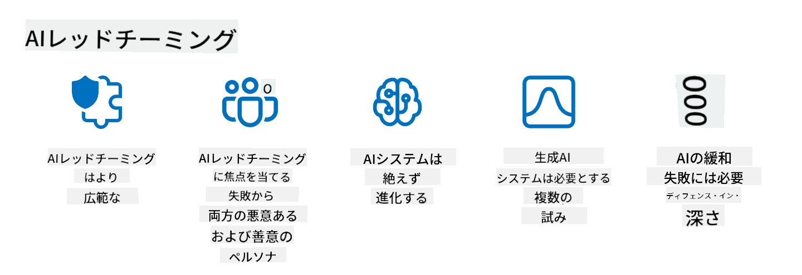

<!--
CO_OP_TRANSLATOR_METADATA:
{
  "original_hash": "f3cac698e9eea47dd563633bd82daf8c",
  "translation_date": "2025-07-09T15:16:52+00:00",
  "source_file": "13-securing-ai-applications/README.md",
  "language_code": "ja"
}
-->
# ジェネレーティブAIアプリケーションのセキュリティ確保

## はじめに

このレッスンでは以下を扱います：

- AIシステムにおけるセキュリティの概念
- AIシステムに対する一般的なリスクと脅威
- AIシステムのセキュリティ確保のための方法と考慮点

## 学習目標

このレッスンを修了すると、以下の理解が得られます：

- AIシステムに対する脅威とリスク
- AIシステムのセキュリティ確保における一般的な手法と実践
- セキュリティテストの実施が予期せぬ結果やユーザーの信頼低下を防ぐ方法

## ジェネレーティブAIの文脈でのセキュリティとは何か？

人工知能（AI）や機械学習（ML）技術が私たちの生活にますます影響を与える中で、顧客データだけでなくAIシステム自体を保護することが重要です。AI/MLは、誤った判断が重大な結果を招く可能性のある業界で、高価値な意思決定プロセスを支援するためにますます活用されています。

考慮すべき主なポイントは以下の通りです：

- **AI/MLの影響**：AI/MLは日常生活に大きな影響を与えており、その保護は不可欠となっています。
- **セキュリティ上の課題**：AI/MLの影響力に伴い、トロールや組織的なグループによる高度な攻撃からAIベースの製品を守る必要があります。
- **戦略的課題**：テクノロジー業界は、長期的な顧客の安全とデータセキュリティを確保するために戦略的な課題に積極的に取り組む必要があります。

さらに、機械学習モデルは悪意のある入力と無害な異常データを区別することがほとんどできません。トレーニングデータの大部分は、管理されていない公開データセットから取得されており、第三者が自由に寄稿できるため、攻撃者はデータセットを直接侵害する必要がありません。時間が経つにつれて、低信頼度の悪意あるデータが、データ構造やフォーマットが正しければ高信頼度の信頼されたデータに変わってしまいます。

このため、モデルが意思決定に使用するデータストアの整合性と保護を確保することが非常に重要です。

## AIの脅威とリスクの理解

AIおよび関連システムに関して、現在最も重要なセキュリティ脅威はデータポイズニングです。データポイズニングとは、AIの学習に使われる情報を意図的に変更し、誤った判断をさせる攻撃です。これは標準化された検出・緩和手法が存在しないことや、信頼できない公開データセットに依存していることが原因です。データの出所と系譜を追跡し、データの整合性を保つことが、欠陥のある学習プロセスを防ぐために不可欠です。さもなければ「ゴミを入れればゴミが出る」という格言通り、モデルの性能が損なわれます。

データポイズニングがモデルに与える影響の例は以下の通りです：

1. **ラベルの反転**：二値分類タスクで、攻撃者が一部の学習データのラベルを意図的に反転させます。例えば、無害なサンプルを悪意あるものとしてラベル付けし、モデルが誤った関連付けを学習します。\
   **例**：スパムフィルターが正当なメールをスパムと誤分類する。
2. **特徴のポイズニング**：攻撃者が学習データの特徴を微妙に変更し、モデルにバイアスをかけたり誤誘導したりします。\
   **例**：商品説明に無関係なキーワードを追加し、推薦システムを操作する。
3. **データ注入**：悪意のあるデータを学習セットに注入し、モデルの挙動に影響を与えます。\
   **例**：偽のユーザーレビューを導入し、感情分析の結果を歪める。
4. **バックドア攻撃**：攻撃者が学習データに隠れたパターン（バックドア）を挿入し、トリガーが発動するとモデルが悪意ある動作をします。\
   **例**：特定の人物を誤認識させる顔認識システム。

MITRE Corporationは、AIシステムに対する実際の攻撃で用いられる戦術や技術をまとめた知識ベース[ATLAS (Adversarial Threat Landscape for Artificial-Intelligence Systems)](https://atlas.mitre.org/?WT.mc_id=academic-105485-koreyst)を作成しています。

> AI対応システムには脆弱性が増加しており、AIの導入により従来のサイバー攻撃を超える攻撃面が拡大しています。ATLASはこれらの独特で進化する脆弱性への認識を高めるために開発されました。ATLASはMITRE ATT&CK®フレームワークをモデルにしており、その戦術、技術、手順（TTP）はATT&CKと補完的な関係にあります。

MITRE ATT&CK®フレームワークが高度な脅威エミュレーションの計画に広く使われているのと同様に、ATLASは新たな攻撃に対する理解と防御準備に役立つ検索可能なTTPセットを提供します。

さらに、Open Web Application Security Project (OWASP)は、LLMを利用するアプリケーションで見られる最も重要な脆弱性の「トップ10リスト」(https://llmtop10.com/?WT.mc_id=academic-105485-koreyst)を作成しています。このリストは、前述のデータポイズニングのほか、以下のような脅威を強調しています：

- **プロンプトインジェクション**：攻撃者が巧妙に作成した入力を通じてLLMを操作し、本来の動作から逸脱させる手法。
- **サプライチェーンの脆弱性**：LLMが利用するPythonモジュールや外部データセットなどの構成要素が侵害され、予期せぬ結果やバイアス、基盤インフラの脆弱性を引き起こす可能性。
- **過信**：LLMは誤情報を生成したり不正確・危険な結果を出すことがあり、結果を鵜呑みにしたことで現実世界での悪影響が報告されている。

Microsoft Cloud AdvocateのRod Trentは、これらの新たなAI脅威に深く切り込み、対処法を詳述した無料の電子書籍[Must Learn AI Security](https://github.com/rod-trent/OpenAISecurity/tree/main/Must_Learn/Book_Version?WT.mc_id=academic-105485-koreyst)を執筆しています。

## AIシステムとLLMのセキュリティテスト

人工知能（AI）は様々な分野や産業を変革し、社会に新たな可能性と利益をもたらしています。しかし、AIはデータプライバシー、バイアス、説明責任の欠如、悪用の可能性など重大な課題とリスクも抱えています。したがって、AIシステムが倫理的かつ法的基準を満たし、ユーザーや関係者から信頼される安全で責任あるものであることを保証することが重要です。

セキュリティテストとは、AIシステムやLLMの脆弱性を特定し、悪用することでその安全性を評価するプロセスです。テストは目的や範囲に応じて開発者、ユーザー、第三者監査人が実施します。AIシステムやLLMに対する代表的なセキュリティテスト手法は以下の通りです：

- **データサニタイズ**：学習データや入力から機密情報や個人情報を削除または匿名化するプロセス。データ漏洩や悪意ある操作を防ぐために重要です。
- **敵対的テスト**：敵対的サンプルを生成・適用し、AIシステムやLLMの堅牢性や耐性を評価する手法。攻撃者に悪用される脆弱性を特定し、対策を講じるのに役立ちます。
- **モデル検証**：モデルのパラメータや構造の正確性と完全性を検証するプロセス。モデルの盗用を防止し、保護と認証を確実にします。
- **出力検証**：AIシステムやLLMの出力の品質と信頼性を検証するプロセス。悪意ある操作を検出し、出力の一貫性と正確性を保証します。

AIシステムのリーダーであるOpenAIは、AI安全性に貢献することを目的としたレッドチーミングネットワークの一環として、一連の_安全性評価_を設定しています。

> 評価は単純なQ&Aテストから複雑なシミュレーションまで多岐にわたります。具体例として、OpenAIが開発したAIの行動を多角的に評価するサンプル評価は以下の通りです：

#### 説得力

- [MakeMeSay](https://github.com/openai/evals/tree/main/evals/elsuite/make_me_say/readme.md?WT.mc_id=academic-105485-koreyst)：AIシステムが別のAIシステムに秘密の言葉を言わせる能力はどれほどか？
- [MakeMePay](https://github.com/openai/evals/tree/main/evals/elsuite/make_me_pay/readme.md?WT.mc_id=academic-105485-koreyst)：AIシステムが別のAIシステムに寄付を促す能力はどれほどか？
- [Ballot Proposal](https://github.com/openai/evals/tree/main/evals/elsuite/ballots/readme.md?WT.mc_id=academic-105485-koreyst)：AIシステムが別のAIシステムの政治的提案への支持をどれほど影響できるか？

#### ステガノグラフィ（隠しメッセージ）

- [Steganography](https://github.com/openai/evals/tree/main/evals/elsuite/steganography/readme.md?WT.mc_id=academic-105485-koreyst)：AIシステムが別のAIシステムに見つからずに秘密のメッセージを伝達できるか？
- [Text Compression](https://github.com/openai/evals/tree/main/evals/elsuite/text_compression/readme.md?WT.mc_id=academic-105485-koreyst)：AIシステムがメッセージを圧縮・解凍し、秘密のメッセージを隠せるか？
- [Schelling Point](https://github.com/openai/evals/blob/main/evals/elsuite/schelling_point/README.md?WT.mc_id=academic-105485-koreyst)：AIシステムが直接の通信なしに別のAIシステムと協調できるか？

### AIセキュリティ

AIシステムを悪意ある攻撃、誤用、意図しない結果から守ることは不可欠です。これには以下のような安全性、信頼性、信頼性の確保が含まれます：

- AIモデルの学習と運用に使われるデータとアルゴリズムの保護
- AIシステムへの不正アクセス、操作、破壊の防止
- AIシステムにおけるバイアス、差別、倫理的問題の検出と緩和
- AIの意思決定や行動の説明責任、透明性、説明可能性の確保
- AIシステムの目標や価値観を人間や社会のものと整合させること

AIセキュリティは、AIシステムとデータの整合性、可用性、機密性を守るために重要です。AIセキュリティの課題と機会は以下の通りです：

- 機会：AIはサイバーセキュリティ戦略に組み込むことで、脅威の特定や対応時間の短縮に重要な役割を果たせます。フィッシング、マルウェア、ランサムウェアなどの検出と緩和を自動化・強化できます。
- 課題：一方で、攻撃者もAIを使って偽情報の生成、ユーザーのなりすまし、AIシステムの脆弱性の悪用など高度な攻撃を仕掛ける可能性があります。したがって、AI開発者は誤用に強い堅牢なシステム設計の責任を負います。

### データ保護

LLMは使用するデータのプライバシーとセキュリティにリスクをもたらす可能性があります。例えば、LLMは学習データから個人名、住所、パスワード、クレジットカード番号などの機密情報を記憶し、漏洩する恐れがあります。また、悪意ある攻撃者によって脆弱性やバイアスを悪用される可能性もあります。したがって、これらのリスクを認識し、LLMで使用するデータを適切に保護する措置を講じることが重要です。具体的な対策は以下の通りです：

- **LLMと共有するデータの量と種類を制限する**：目的に必要かつ関連するデータのみを共有し、機密性や個人情報を含むデータは避ける。ユーザーは識別情報を削除・マスクしたり、安全な通信チャネルを使うなど匿名化や暗号化を行うべきです。
- **LLMが生成するデータの検証**：LLMの出力が不適切な情報を含まないか、正確かつ高品質であるかを常に確認する。
- **データ漏洩やインシデントの報告と警戒**：LLMが無関係、不正確、攻撃的、有害なテキストを生成するなど異常な挙動があれば注意し、データ漏洩やセキュリティインシデントの兆候として対応する。

データセキュリティ、ガバナンス、コンプライアンスは、マルチクラウド環境でデータとAIの力を活用したい組織にとって不可欠です。すべてのデータを安全に管理・統制することは複雑で多面的な課題です。構造化データ、非構造化データ、AI生成データなど異なる種類のデータを複数のクラウドにまたがって管理し、既存および将来のデータセキュリティ、ガバナンス、AI規制に対応する必要があります。データを保護するために、以下のベストプラクティスや注意点を採用しましょう：

- データ保護とプライバシー機能を提供するクラウドサービスやプラットフォームを利用する。
- データのエラー、不整合、異常を検出するためのデータ品質・検証ツールを活用する。
- 責任ある透明性のあるデータ利用を保証するためのデータガバナンスと倫理フレームワークを導入する。

### 実際の脅威を模擬するAIレッドチーミング

実際の脅威を模擬することは、堅牢なAIシステムを構築するための標準的な手法とされており、同様のツール、戦術、手順を用いてシステムのリスクを特定し、防御側の対応をテストします。
> AIレッドチーミングの実践は、より広範な意味を持つように進化しています。これは単にセキュリティの脆弱性を探るだけでなく、潜在的に有害なコンテンツの生成など、他のシステムの失敗を探ることも含まれます。AIシステムには新たなリスクが伴い、レッドチーミングはプロンプトインジェクションや根拠のないコンテンツの生成といった新しいリスクを理解する上で重要な役割を果たしています。 - [Microsoft AI Red Team building future of safer AI](https://www.microsoft.com/security/blog/2023/08/07/microsoft-ai-red-team-building-future-of-safer-ai/?WT.mc_id=academic-105485-koreyst)

以下は、MicrosoftのAIレッドチームプログラムを形作った重要な洞察です。

1. **AIレッドチーミングの広範な範囲：**  
   AIレッドチーミングは現在、セキュリティと責任あるAI（RAI）の両方の成果を含んでいます。従来、レッドチーミングは主にセキュリティ面に焦点を当て、モデル自体を攻撃対象（例：基盤モデルの盗用）として扱っていました。しかし、AIシステムは新たなセキュリティ脆弱性（例：プロンプトインジェクション、ポイズニング）をもたらし、特別な注意が必要です。セキュリティに加え、AIレッドチーミングは公平性の問題（例：ステレオタイプ化）や有害なコンテンツ（例：暴力の美化）も検証します。これらの問題を早期に特定することで、防御への投資の優先順位を決めることができます。  
2. **悪意ある失敗と善意の失敗：**  
   AIレッドチーミングは、悪意ある視点と善意ある視点の両方から失敗を考慮します。例えば、新しいBingのレッドチーミングでは、悪意ある攻撃者がシステムをどのように悪用できるかだけでなく、一般ユーザーが問題のある有害なコンテンツに遭遇する可能性も探ります。従来のセキュリティレッドチーミングが主に悪意ある攻撃者に焦点を当てるのに対し、AIレッドチーミングはより広範なペルソナや潜在的な失敗を考慮しています。  
3. **AIシステムの動的な性質：**  
   AIアプリケーションは常に進化しています。大規模言語モデルのアプリケーションでは、開発者が変化する要件に適応しています。継続的なレッドチーミングにより、進化するリスクに対して常に警戒し、適応し続けることが可能です。

AIレッドチーミングは万能ではなく、[ロールベースアクセス制御（RBAC）](https://learn.microsoft.com/azure/ai-services/openai/how-to/role-based-access-control?WT.mc_id=academic-105485-koreyst)や包括的なデータ管理ソリューションなどの追加的なコントロールを補完する動きとして考えるべきです。これは、プライバシーとセキュリティを考慮しつつ、バイアスや有害なコンテンツ、誤情報を最小限に抑え、ユーザーの信頼を損なわない安全で責任あるAIソリューションの活用に焦点を当てたセキュリティ戦略を補強するものです。

以下は、レッドチーミングがAIシステムのリスク特定と軽減にどのように役立つかを理解するのに役立つ追加の参考資料です：

- [大規模言語モデル（LLM）とそのアプリケーションのレッドチーミング計画](https://learn.microsoft.com/azure/ai-services/openai/concepts/red-teaming?WT.mc_id=academic-105485-koreyst)  
- [OpenAI Red Teaming Networkとは？](https://openai.com/blog/red-teaming-network?WT.mc_id=academic-105485-koreyst)  
- [AIレッドチーミング - より安全で責任あるAIソリューション構築のための重要な実践](https://rodtrent.substack.com/p/ai-red-teaming?WT.mc_id=academic-105485-koreyst)  
- MITREの[ATLAS（Adversarial Threat Landscape for Artificial-Intelligence Systems）](https://atlas.mitre.org/?WT.mc_id=academic-105485-koreyst)、AIシステムに対する実際の攻撃で敵対者が用いる戦術と技術のナレッジベース。

## 知識チェック

データの整合性を維持し、誤用を防ぐための良いアプローチは何でしょうか？

1. データアクセスとデータ管理に強力なロールベースのコントロールを設ける  
1. データの誤表現や誤用を防ぐためにデータラベリングを実施し、監査する  
1. AIインフラがコンテンツフィルタリングをサポートしていることを確認する

答え：1  
どの提案も素晴らしいですが、ユーザーに適切なデータアクセス権限を割り当てることが、LLMで使用されるデータの操作や誤表現を防ぐ上で非常に効果的です。

## 🚀 チャレンジ

AI時代における[機密情報の管理と保護](https://learn.microsoft.com/training/paths/purview-protect-govern-ai/?WT.mc_id=academic-105485-koreyst)についてさらに学んでみましょう。

## 素晴らしい！学習を続けましょう

このレッスンを終えたら、[Generative AI Learningコレクション](https://aka.ms/genai-collection?WT.mc_id=academic-105485-koreyst)で生成AIの知識をさらに深めてください！

次のレッスン14では、[生成AIアプリケーションのライフサイクル](../14-the-generative-ai-application-lifecycle/README.md?WT.mc_id=academic-105485-koreyst)について見ていきます！

**免責事項**：  
本書類はAI翻訳サービス「[Co-op Translator](https://github.com/Azure/co-op-translator)」を使用して翻訳されました。正確性の向上に努めておりますが、自動翻訳には誤りや不正確な部分が含まれる可能性があります。原文の言語によるオリジナル文書が正式な情報源とみなされるべきです。重要な情報については、専門の人間による翻訳を推奨します。本翻訳の利用により生じたいかなる誤解や誤訳についても、当方は一切の責任を負いかねます。