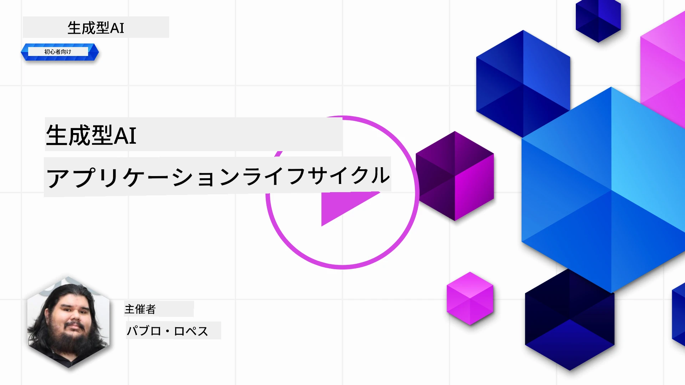
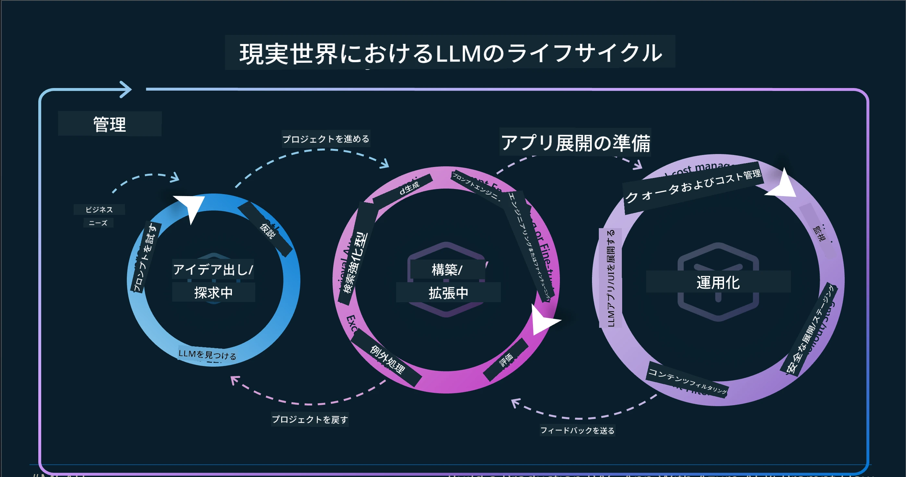
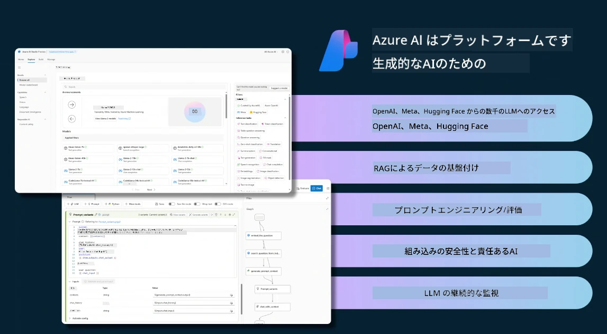
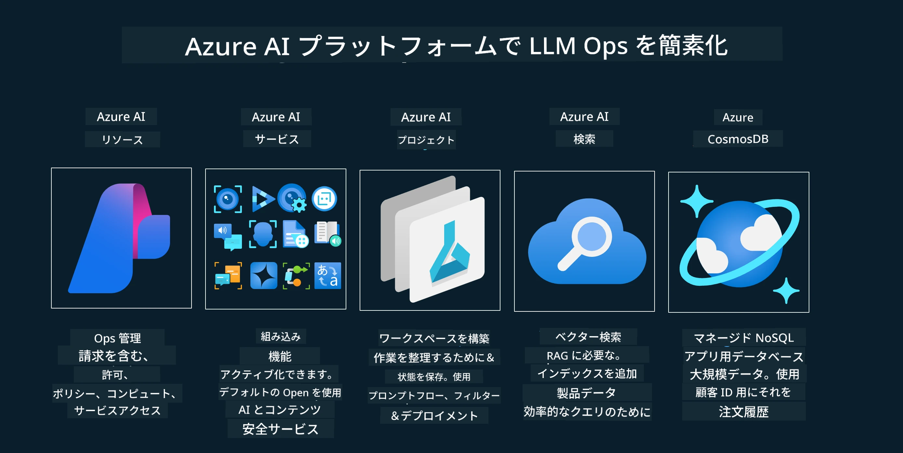
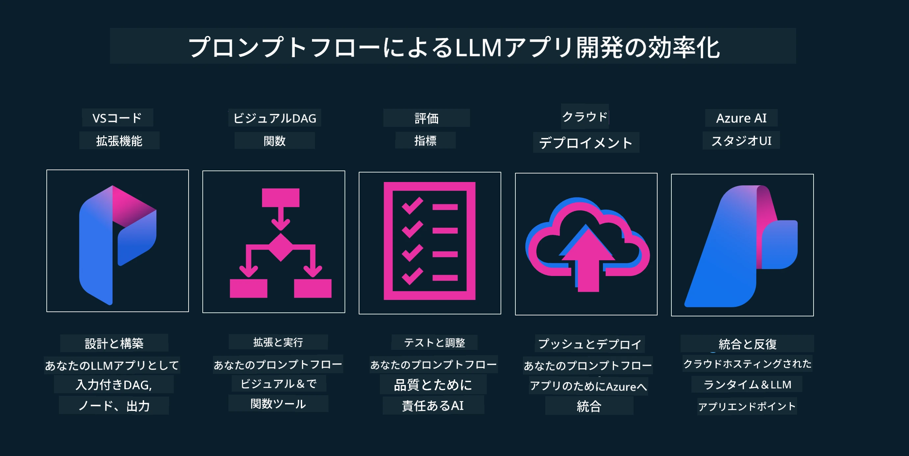

# 生成AIアプリケーションのライフサイクル

すべてのAIアプリケーションにとって重要な問いは、AI機能の関連性です。AIは急速に進化する分野であるため、アプリケーションが常に関連性があり、信頼性が高く、堅牢であることを保証するには、継続的に監視、評価、改善する必要があります。ここで生成AIのライフサイクルが役立ちます。

生成AIのライフサイクルは、生成AIアプリケーションの開発、展開、維持の各段階を案内するフレームワークです。目標を定義し、パフォーマンスを測定し、課題を特定し、解決策を実装するのに役立ちます。また、アプリケーションをドメインやステークホルダーの倫理的および法的基準に整合させるのにも役立ちます。生成AIのライフサイクルに従うことで、アプリケーションが常に価値を提供し、ユーザーを満足させることを保証できます。

## はじめに

この章では、以下を学びます：

- MLOpsからLLMOpsへのパラダイムシフトの理解
- LLMのライフサイクル
- ライフサイクルツール
- ライフサイクルのメトリクス化と評価

## MLOpsからLLMOpsへのパラダイムシフトの理解

LLMは人工知能の新しいツールであり、アプリケーションの分析や生成タスクにおいて非常に強力です。しかし、この力はAIや従来の機械学習タスクの合理化方法にいくつかの影響を与えます。

これにより、このツールを動的かつ適切なインセンティブで適応させるための新しいパラダイムが必要になります。古いAIアプリを「MLアプリ」、新しいAIアプリを「GenAIアプリ」または単に「AIアプリ」と分類できます。これは当時の主流技術や手法を反映しています。この変化は複数の面で物語を変えます。以下の比較をご覧ください。

LLMOpsでは、アプリ開発者により焦点を当て、統合を重要なポイントとして使用し、「モデル・アズ・ア・サービス」を利用し、以下の指標を考慮しています。

- 品質：応答の質
- 有害性：責任あるAI
- 正直さ：応答の根拠（意味が通じるか？正しいか？）
- コスト：ソリューションの予算
- レイテンシ：トークン応答の平均時間

## LLMのライフサイクル

まず、ライフサイクルとその変更点を理解するために、次のインフォグラフィックに注目しましょう。

ご覧の通り、これは通常のMLOpsのライフサイクルとは異なります。LLMには多くの新しい要件があります。プロンプティング、品質向上のためのさまざまな技術（ファインチューニング、RAG、メタプロンプト）、責任あるAIに関する異なる評価と責任、最後に新しい評価指標（品質、有害性、正直さ、コスト、レイテンシ）です。

例えば、アイデア出しの方法を見てみましょう。プロンプトエンジニアリングを使ってさまざまなLLMを試し、仮説が正しいかどうかを検証します。

これは線形ではなく、統合されたループであり、反復的で包括的なサイクルであることに注意してください。

これらのステップをどのように探求できるでしょうか？ライフサイクルの構築方法を詳しく見てみましょう。

少し複雑に見えるかもしれませんが、まずは3つの大きなステップに注目しましょう。

1. アイデア出し／探索：探索段階では、ビジネスニーズに応じて探求します。プロトタイピングを行い、[PromptFlow](https://microsoft.github.io/promptflow/index.html?WT.mc_id=academic-105485-koreyst)を作成し、仮説に対して十分に効率的かどうかをテストします。
1. 構築／拡張：実装段階では、大規模なデータセットで評価を開始し、ファインチューニングやRAGなどの技術を実装してソリューションの堅牢性を確認します。うまくいかない場合は、再実装したり、フローに新しいステップを追加したり、データを再構築したりすることが役立ちます。フローとスケールをテストし、メトリクスを確認したら、次のステップに進む準備が整います。
1. 運用化：統合段階では、監視およびアラートシステムをシステムに追加し、展開とアプリケーション統合を行います。

その後、セキュリティ、コンプライアンス、ガバナンスに焦点を当てた管理の包括的なサイクルがあります。

おめでとうございます。これでAIアプリが準備完了し、運用可能になりました。実践的な体験には、[Contoso Chat Demo](https://nitya.github.io/contoso-chat/?WT.mc_id=academic-105485-koreys)をご覧ください。

では、どのようなツールを使えるでしょうか？

## ライフサイクルツール

ツールとして、Microsoftは[Azure AI Platform](https://azure.microsoft.com/solutions/ai/?WT.mc_id=academic-105485-koreys)と[PromptFlow](https://microsoft.github.io/promptflow/index.html?WT.mc_id=academic-105485-koreyst)を提供しており、サイクルの実装を容易にし、すぐに使えるようにします。

[Azure AI Platform](https://azure.microsoft.com/solutions/ai/?WT.mc_id=academic-105485-koreys)では、[AI Studio](https://ai.azure.com/?WT.mc_id=academic-105485-koreys)を利用できます。AI Studioは、モデル、サンプル、ツールを探索し、リソース管理、UI開発フロー、コードファースト開発のためのSDK/CLIオプションを提供するウェブポータルです。

Azure AIは、複数のリソースを使用して、運用、サービス、プロジェクト、ベクトル検索、データベースのニーズを管理できます。

Proof-of-Concept（POC）から大規模アプリケーションまで、PromptFlowで構築：

- VS Codeから視覚的かつ機能的なツールでアプリを設計・構築
- 品質の高いAIのためにアプリをテスト・ファインチューニングを簡単に実施
- Azure AI Studioを使ってクラウドと統合し、迅速な統合のためにプッシュ＆デプロイを繰り返す

## 素晴らしい！学習を続けましょう！

素晴らしいですね。次は、[Contoso Chat App](https://nitya.github.io/contoso-chat/?WT.mc_id=academic-105485-koreyst)でこれらの概念を使ったアプリケーションの構造を学び、Cloud Advocacyがデモでこれらの概念をどのように追加しているかを確認しましょう。さらにコンテンツをお求めなら、[Igniteブレイクアウトセッション](https://www.youtube.com/watch?v=DdOylyrTOWg)もご覧ください。

次に、レッスン15で[Retrieval Augmented Generationとベクトルデータベース](../15-rag-and-vector-databases/README.md?WT.mc_id=academic-105485-koreyst)が生成AIにどのように影響し、より魅力的なアプリケーションを作るかを理解しましょう！

---

<!-- CO-OP TRANSLATOR DISCLAIMER START -->
**免責事項**：  
本書類はAI翻訳サービス「[Co-op Translator](https://github.com/Azure/co-op-translator)」を使用して翻訳されました。正確性の向上に努めておりますが、自動翻訳には誤りや不正確な部分が含まれる可能性があります。原文の言語による文書が正式な情報源とみなされるべきです。重要な情報については、専門の人間による翻訳を推奨します。本翻訳の利用により生じたいかなる誤解や誤訳についても、当方は責任を負いかねます。
<!-- CO-OP TRANSLATOR DISCLAIMER END -->
