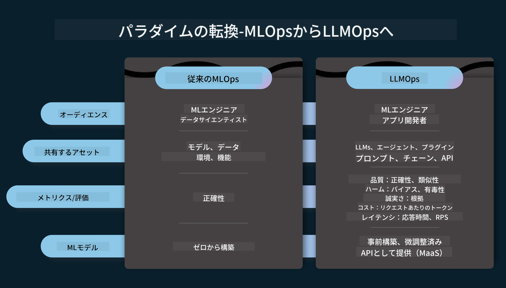
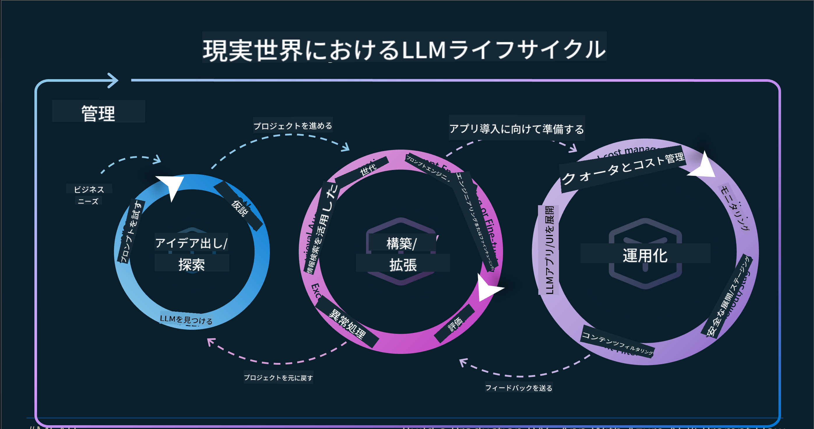
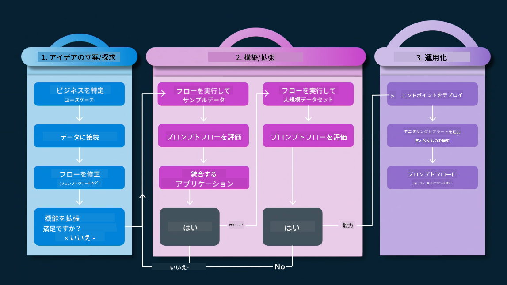
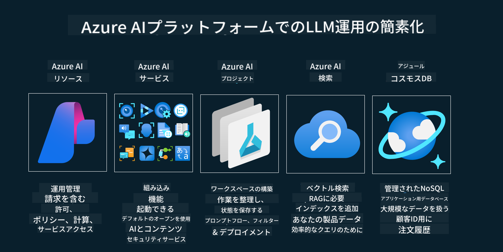
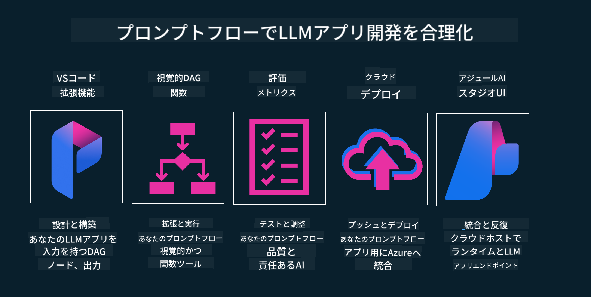

<!--
CO_OP_TRANSLATOR_METADATA:
{
  "original_hash": "27a5347a5022d5ef0a72ab029b03526a",
  "translation_date": "2025-05-19T23:22:19+00:00",
  "source_file": "14-the-generative-ai-application-lifecycle/README.md",
  "language_code": "ja"
}
-->

# 生成AIアプリケーションライフサイクル

すべてのAIアプリケーションにとって重要な質問は、AI機能の関連性です。AIは急速に進化する分野であるため、アプリケーションが常に関連性を持ち、信頼性があり、堅牢であることを保証するためには、継続的に監視、評価、改善する必要があります。ここで生成AIライフサイクルが役立ちます。

生成AIライフサイクルは、生成AIアプリケーションの開発、展開、維持の段階を通じてあなたを導くフレームワークです。目標を定義し、パフォーマンスを測定し、課題を特定し、解決策を実行するのに役立ちます。また、あなたのアプリケーションをドメインと利害関係者の倫理的および法的基準に合わせるのにも役立ちます。生成AIライフサイクルに従うことで、アプリケーションが常に価値を提供し、ユーザーを満足させることができます。

## はじめに

この章では、以下を学びます：

- MLOpsからLLMOpsへのパラダイムシフトを理解する
- LLMライフサイクル
- ライフサイクルツール
- ライフサイクルの測定と評価

## MLOpsからLLMOpsへのパラダイムシフトを理解する

LLMは人工知能の新しいツールであり、アプリケーションの分析と生成タスクで非常に強力ですが、この力はAIと従来の機械学習タスクを効率化する方法にいくつかの影響を与えます。

これにより、このツールを動的に適応させるための新しいパラダイムが必要です。過去のAIアプリを「MLアプリ」、新しいAIアプリを「GenAIアプリ」または単に「AIアプリ」と分類し、その時代の主流技術と手法を反映します。これにより、私たちのストーリーが複数の方法で変化します。次の比較を見てください。

LLMOpsでは、アプリ開発者により焦点を当てており、統合を重要なポイントとして、「モデル・アズ・ア・サービス」を使用し、メトリクスの以下のポイントを考慮します。

- 品質: 応答の質
- 有害性: 責任あるAI
- 誠実さ: 応答の根拠（意味があるか？正しいか？）
- コスト: ソリューション予算
- 遅延: トークン応答の平均時間

## LLMライフサイクル

まず、ライフサイクルとその変更を理解するために、次のインフォグラフィックを確認しましょう。

ご覧の通り、これは通常のMLOpsのライフサイクルとは異なります。LLMには多くの新しい要件があり、プロンプティング、品質向上のための異なる手法（ファインチューニング、RAG、メタプロンプツ）、責任あるAIに対する異なる評価と責任、最後に新しい評価指標（品質、有害性、誠実さ、コスト、遅延）があります。

例えば、私たちがどのようにアイデアを出すかを見てください。プロンプトエンジニアリングを使用して、様々なLLMを試し、仮説が正しいかどうかをテストする可能性を探ります。

これは線形ではなく、統合されたループであり、反復的で包括的なサイクルです。

これらのステップをどのように探求することができるでしょうか？ライフサイクルをどのように構築するかを詳細に見ていきましょう。

少し複雑に見えるかもしれませんが、まずは3つの大きなステップに焦点を当てましょう。

1. アイデア出し/探求: 探索、ここではビジネスニーズに応じて探求できます。プロトタイピング、[PromptFlow](https://microsoft.github.io/promptflow/index.html?WT.mc_id=academic-105485-koreyst)を作成し、仮説に対して効率的かどうかをテストします。
2. 構築/拡張: 実装、ここでは大規模なデータセットを評価し、ファインチューニングやRAGのような手法を実装して、ソリューションの堅牢性を確認します。もしそうでなければ、再実装し、フローに新しいステップを追加したり、データを再構成することで役立つかもしれません。フローとスケールをテストし、メトリクスを確認し、機能する場合は次のステップに進む準備が整います。
3. オペレーショナライズ: 統合、ここでは監視とアラートシステムをシステムに追加し、アプリケーションへの展開と統合を行います。

その後、セキュリティ、コンプライアンス、ガバナンスに焦点を当てた管理の包括的なサイクルがあります。

おめでとうございます。これでAIアプリが準備完了し、運用可能です。実際の体験については、[Contoso Chat Demo](https://nitya.github.io/contoso-chat/?WT.mc_id=academic-105485-koreys)をご覧ください。

さて、どのようなツールを使用できるでしょうか？

## ライフサイクルツール

ツールに関しては、Microsoftは[Azure AI Platform](https://azure.microsoft.com/solutions/ai/?WT.mc_id=academic-105485-koreys)と[PromptFlow](https://microsoft.github.io/promptflow/index.html?WT.mc_id=academic-105485-koreyst)を提供しており、サイクルを容易に実装し、すぐに使用可能にします。

[Azure AI Platform](https://azure.microsoft.com/solutions/ai/?WT.mc_id=academic-105485-koreys)では、[AI Studio](https://ai.azure.com/?WT.mc_id=academic-105485-koreys)を使用できます。AI Studioは、モデル、サンプル、ツールを探索できるウェブポータルです。リソースの管理、UI開発フロー、コードファースト開発のためのSDK/CLIオプションを提供します。

Azure AIは、複数のリソースを使用して、操作、サービス、プロジェクト、ベクトル検索、データベースのニーズを管理できます。

Proof-of-Concept(POC)から大規模アプリケーションまで、PromptFlowで構築します：

- VS Codeから視覚的および機能的なツールを使用してアプリを設計・構築
- 簡単に質の高いAIのためにアプリをテストおよびファインチューニング
- Azure AI Studioを使用してクラウドと統合し、迅速な統合のためにプッシュおよび展開

## 素晴らしい！学習を続けましょう！

素晴らしいですね。次に、[Contoso Chat App](https://nitya.github.io/contoso-chat/?WT.mc_id=academic-105485-koreyst)を使ってアプリケーションを構築する方法を学び、クラウドアドボカシーがデモでこれらの概念をどのように追加するかを確認してください。さらに多くのコンテンツについては、[Ignite breakout session](https://www.youtube.com/watch?v=DdOylyrTOWg)をチェックしてください。

次に、Lesson 15を確認して、[Retrieval Augmented Generation and Vector Databases](../15-rag-and-vector-databases/README.md?WT.mc_id=academic-105485-koreyst)が生成AIにどのように影響を与え、より魅力的なアプリケーションを作るかを理解しましょう！

**免責事項**:
この文書はAI翻訳サービス[Co-op Translator](https://github.com/Azure/co-op-translator)を使用して翻訳されています。正確さを追求していますが、自動翻訳には誤りや不正確さが含まれる可能性があることをご承知おきください。元の言語による原文が正式な情報源と見なされるべきです。重要な情報については、プロの人間による翻訳をお勧めします。この翻訳の使用に起因する誤解や誤った解釈について、当方は責任を負いません。