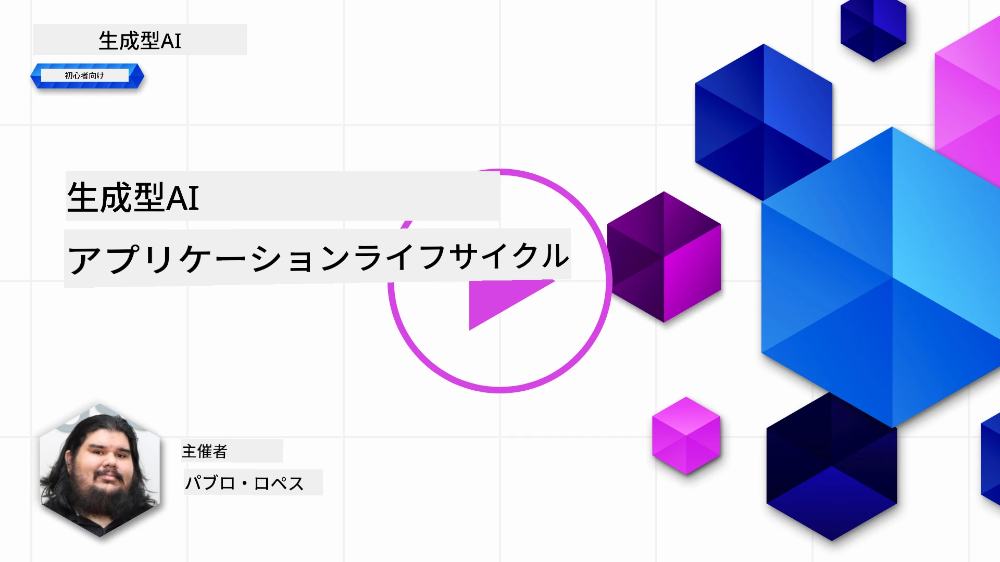
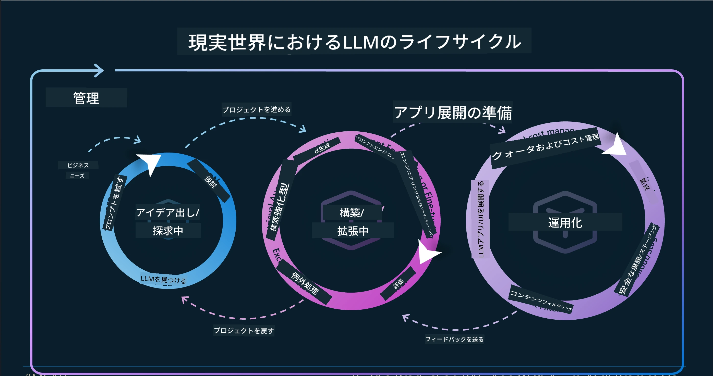
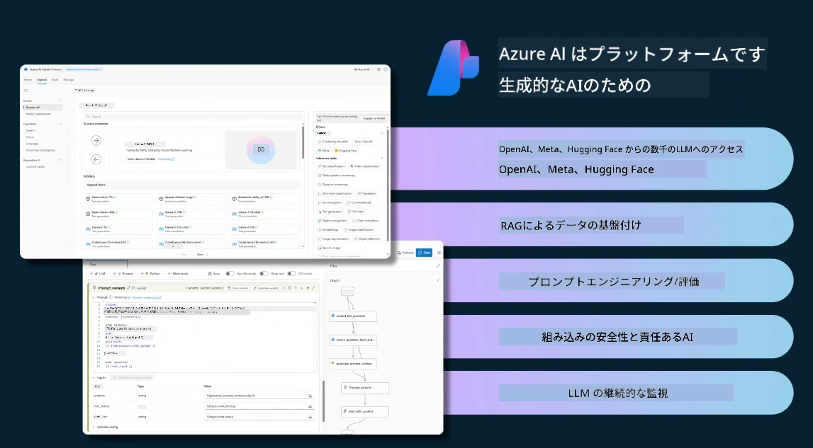
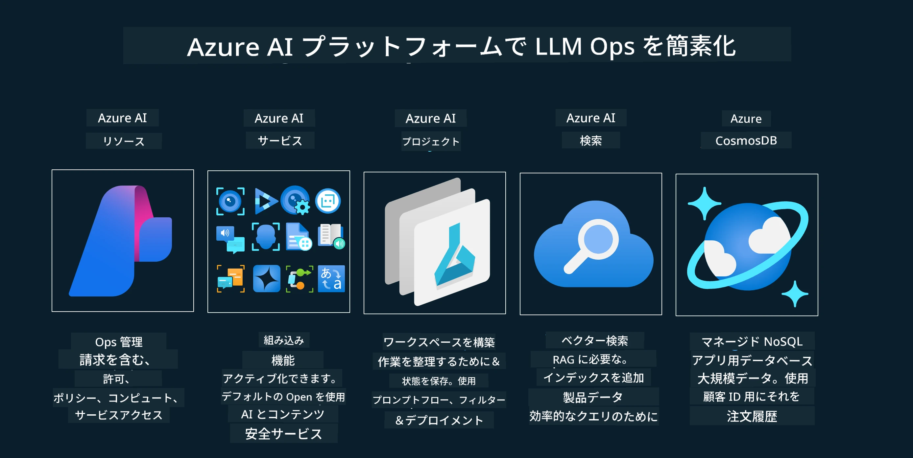
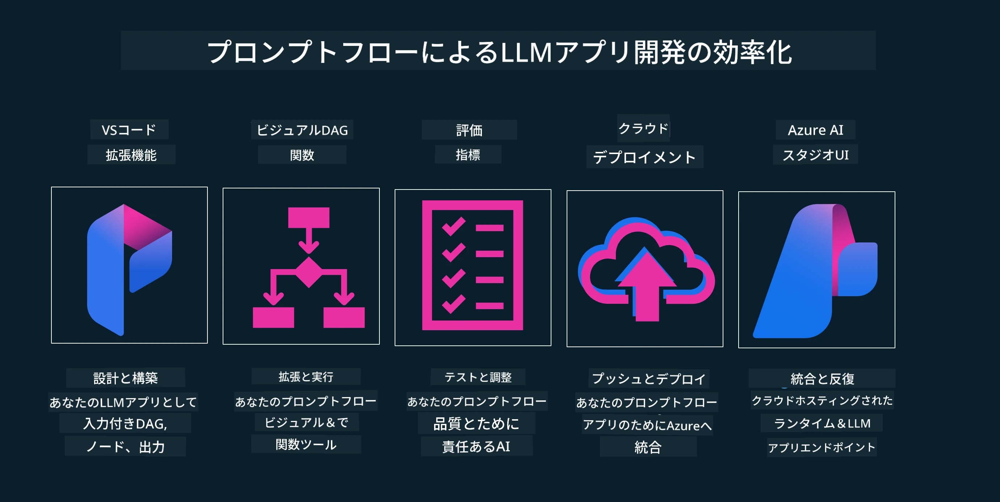

# ジェネレーティブAIアプリケーションライフサイクル

すべてのAIアプリケーションにとって重要な問いは、AIが急速に進化する分野であるため、AI機能の関連性を保つことです。アプリケーションが常に関連性があり、信頼でき、堅牢であることを維持するためには、継続的に監視、評価、改善を行う必要があります。ここで、ジェネレーティブAIライフサイクルが役立ちます。

ジェネレーティブAIライフサイクルは、ジェネレーティブAIアプリケーションの開発、展開、維持管理の各段階を案内するフレームワークです。目標の定義、パフォーマンスの測定、課題の特定、解決策の実施を支援します。また、ドメインおよびステークホルダーの倫理的かつ法的基準にアプリケーションを整合させる助けにもなります。ジェネレーティブAIライフサイクルに従うことで、アプリケーションが常に価値を提供し、ユーザーを満足させることを保証できます。

## はじめに

この章では次のことを学びます：

- MLOpsからLLMOpsへのパラダイムシフトを理解する
- LLMライフサイクル
- ライフサイクルツール
- ライフサイクルのメトリック化と評価

## MLOpsからLLMOpsへのパラダイムシフトを理解する

LLMは人工知能の新しいツールであり、分析や生成タスクにおいて非常に強力です。しかし、この力はAIや従来の機械学習タスクを合理化する方法にいくつかの影響を与えます。

このため、正しいインセンティブを持ちダイナミックにこのツールに適応する新しいパラダイムが必要です。古いAIアプリは「MLアプリ」と分類し、新しいAIアプリは「GenAIアプリ」または単に「AIアプリ」と呼び、その時代の主流技術や手法を反映します。これにより、複数の点で私たちの物語が変わります。次の比較をご覧ください。

LLMOpsでは、アプリ開発者によりフォーカスし、統合を重要視して「Models-as-a-Service」を利用し、次のポイントをメトリックとして考慮します。

- 品質: 応答品質
- ハーム: 責任あるAI
- 正直さ: 応答の根拠（意味が通るか？正しいか？）
- コスト: ソリューション予算
- レイテンシ: トークン応答の平均時間

## LLMライフサイクル

まず、ライフサイクルとその変更点を理解するために、次のインフォグラフィックに注目してください。

通常のMLOpsのライフサイクルとは異なることに気づくでしょう。LLMには新しい要求が多くあります。プロンプティング、品質向上のためのさまざまな技術（ファインチューニング、RAG、メタプロンプト）、責任あるAIに関する評価と責任、最後に新しい評価指標（品質、ハーム、正直さ、コスト、レイテンシ）です。

例えば、アイデア発想はどうでしょう。プロンプトエンジニアリングを使って、さまざまなLLMを試し仮説が正しいかテストします。

これは線形ではなく、統合された繰り返しループで、包括的なサイクルを持っています。

では、そのステップをどのように探求するのでしょう？ ライフサイクルをどのように構築するか詳しく見ていきましょう。

少し複雑に見えるかもしれませんが、まずは3つの大きなステップに注目しましょう。

1. アイデア発想・探索: ビジネスニーズに応じて探索します。プロトタイピングや [PromptFlow](https://microsoft.github.io/promptflow/index.html?WT.mc_id=academic-105485-koreyst) の作成、仮説の効率をテストします。
1. 構築・拡張: 実装段階で、大規模データセットの評価、ファインチューニングやRAGなどの技術でソリューションの堅牢性をチェックします。問題があれば再実装やフローの修正、データの再構成を行います。テストやスケールがうまくいき、メトリクスを満たせば、次のステップへ進みます。
1. 運用化: 統合段階で、監視やアラートシステムの追加、デプロイメント、アプリケーションへの統合を行います。

そして、セキュリティ、コンプライアンス、ガバナンスに焦点を当てた包括的サイクルのマネジメントがあります。

おめでとうございます、これでAIアプリが運用準備完了です。実際に触ってみたい場合は、[Contoso Chat Demo](https://nitya.github.io/contoso-chat/?WT.mc_id=academic-105485-koreyst) をご覧ください。

では、どんなツールを使えるでしょうか？

## ライフサイクルツール

ツールとして、Microsoftは [Azure AI Platform](https://azure.microsoft.com/solutions/ai/?WT.mc_id=academic-105485-koreyst) と [PromptFlow](https://microsoft.github.io/promptflow/index.html?WT.mc_id=academic-105485-koreyst) を提供しており、サイクルの実装を容易にし準備万端にします。

[Azure AI Platform](https://azure.microsoft.com/solutions/ai/?WT.mc_id=academic-105485-koreyst) では [AI Studio](https://ai.azure.com/?WT.mc_id=academic-105485-koreyst) を利用できます。AI Studioはモデル、サンプル、ツールの探索やリソース管理、UI開発フロー、コードファースト開発のためのSDK/CLIオプションを提供するウェブポータルです。

Azure AIは、複数のリソースを用いて運用、サービス、プロジェクト、ベクター検索およびデータベースのニーズを管理できます。

Proof-of-Concept（POC）から大規模アプリケーションまで、PromptFlowで構築：

- VS Codeからの視覚的かつ機能的なツールを使い、アプリ設計と構築
- 品質の高いAIのために簡単にテストとファインチューニング
- Azure AI Studioでクラウド統合、反復、プッシュ、デプロイを迅速に実行

## 素晴らしい！学習を続けましょう！

すばらしいですね。次に、[Contoso Chat App](https://nitya.github.io/contoso-chat/?WT.mc_id=academic-105485-koreyst) を使って、アプリケーションの構築方法やCloud Advocacyがデモにどのようにこれらの概念を取り入れているかを学びましょう。さらにコンテンツは[Igniteのブレイクアウトセッション](https://www.youtube.com/watch?v=DdOylyrTOWg)でご覧いただけます。

次に、Lesson 15で [Retrieval Augmented Generation と Vector Databases](../15-rag-and-vector-databases/README.md?WT.mc_id=academic-105485-koreyst) がジェネレーティブAIにどのような影響を与え、より魅力的なアプリケーションを作るかを理解しましょう！

---

<!-- CO-OP TRANSLATOR DISCLAIMER START -->
**免責事項**：
本書類はAI翻訳サービス「Co-op Translator」（https://github.com/Azure/co-op-translator）を使用して翻訳されました。正確性の向上に努めておりますが、自動翻訳には誤りや不正確な部分が含まれる可能性があります。原文の言語による文書が正本として扱われるべきものです。重要な情報については、専門の人間による翻訳を推奨いたします。本翻訳の利用に起因するいかなる誤解や誤訳についても、一切の責任を負いかねますのでご了承ください。
<!-- CO-OP TRANSLATOR DISCLAIMER END -->