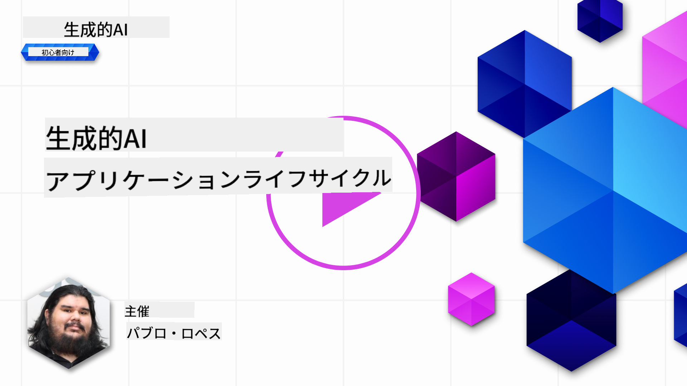
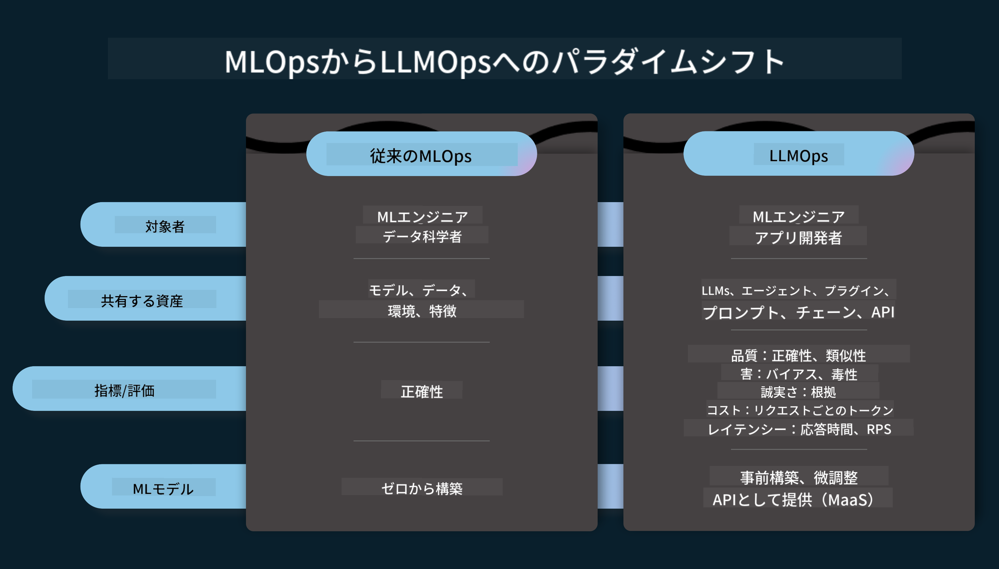
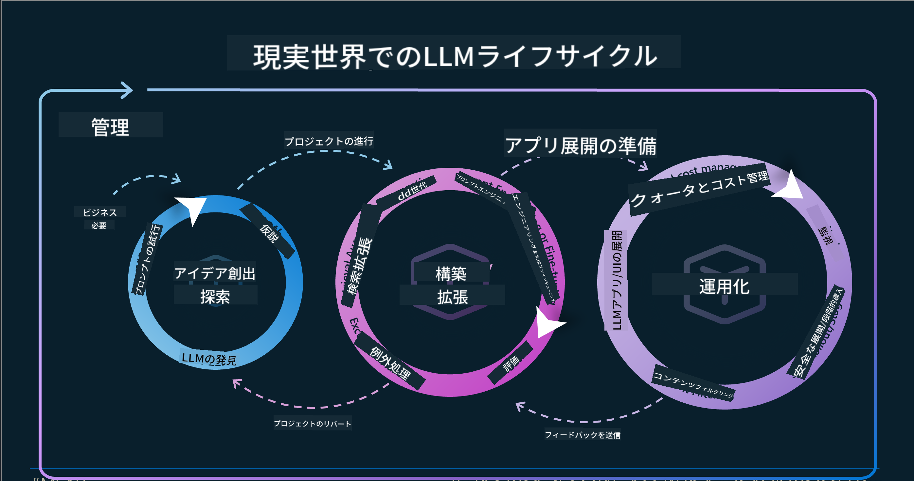
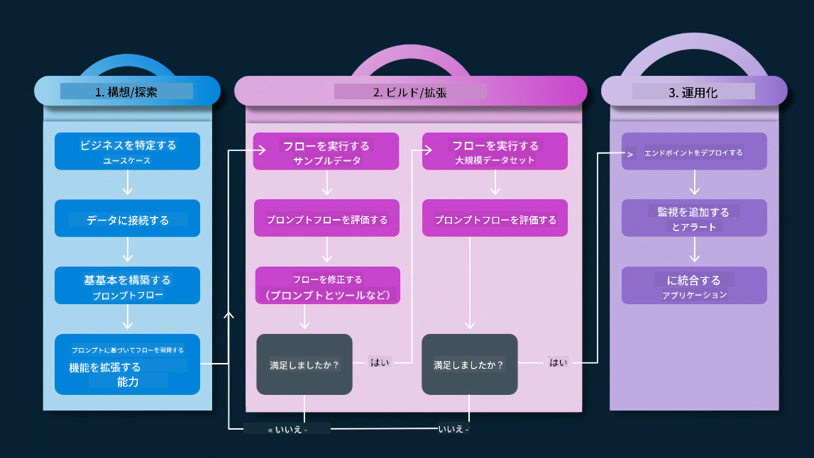
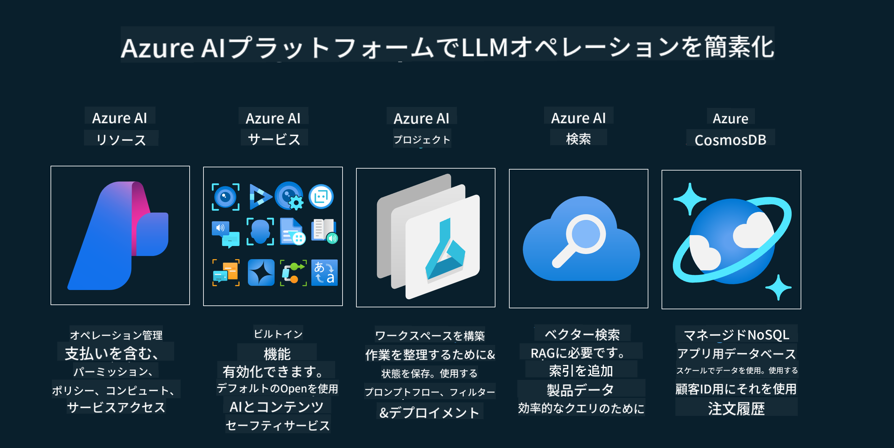
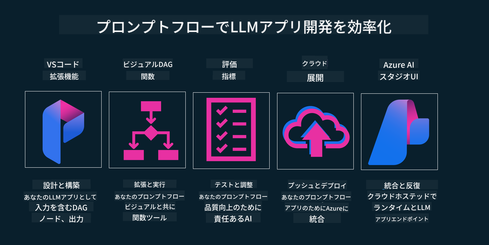

<!--
CO_OP_TRANSLATOR_METADATA:
{
  "original_hash": "27a5347a5022d5ef0a72ab029b03526a",
  "translation_date": "2025-06-25T21:58:00+00:00",
  "source_file": "14-the-generative-ai-application-lifecycle/README.md",
  "language_code": "ja"
}
-->

# ジェネレーティブAIアプリケーションライフサイクル

AIアプリケーションにとって重要な質問は、AI機能の関連性です。AIは急速に進化している分野であり、アプリケーションを常に関連性があり、信頼性が高く、堅牢であるようにするためには、継続的に監視、評価、改善する必要があります。ここで、ジェネレーティブAIライフサイクルが役立ちます。

ジェネレーティブAIライフサイクルは、ジェネレーティブAIアプリケーションの開発、展開、維持の各段階を案内するフレームワークです。目標を定義し、パフォーマンスを測定し、課題を特定し、解決策を実施するのに役立ちます。また、アプリケーションをドメインや利害関係者の倫理的および法的基準に合わせるのにも役立ちます。ジェネレーティブAIライフサイクルに従うことで、アプリケーションが常に価値を提供し、ユーザーを満足させることができます。

## はじめに

この章では以下のことを学びます：

- MLOpsからLLMOpsへのパラダイムシフトの理解
- LLMライフサイクル
- ライフサイクルツール
- ライフサイクルの測定と評価

## MLOpsからLLMOpsへのパラダイムシフトの理解

LLMは人工知能の新しいツールであり、アプリケーションの分析と生成タスクにおいて非常に強力です。しかし、この力にはAIと従来の機械学習タスクを効率化する方法にいくつかの影響があります。

これにより、このツールを動的に適応させるための新しいパラダイムが必要です。古いAIアプリを「MLアプリ」、新しいAIアプリを「GenAIアプリ」または単に「AIアプリ」として分類できます。これにより、当時使用されていた主流の技術や手法を反映しています。この変化は私たちの物語を多くの面でシフトさせます。以下の比較を見てください。

LLMOpsでは、アプリ開発者に焦点を当て、統合を重要なポイントとして使用し、「モデル・アズ・ア・サービス」を利用し、メトリクスのために以下のポイントを考えます。

- 品質：応答の質
- 害：責任あるAI
- 誠実さ：応答の根拠（意味があるか？正しいか？）
- コスト：ソリューションの予算
- レイテンシー：トークン応答の平均時間

## LLMライフサイクル

まず、ライフサイクルとその変更を理解するために、次のインフォグラフィックに注目しましょう。

ご覧のとおり、これは通常のMLOpsのライフサイクルとは異なります。LLMには、プロンプト、品質向上のための異なる手法（ファインチューニング、RAG、メタプロンプト）、責任あるAIに関する異なる評価と責任、新しい評価指標（品質、害、誠実さ、コスト、レイテンシー）など、多くの新しい要件があります。

たとえば、私たちがどのようにアイデアを出すかを見てみましょう。プロンプトエンジニアリングを使用して、さまざまなLLMを試し、仮説が正しいかどうかをテストするための可能性を探ります。

これは直線的ではなく、統合されたループであり、反復的で包括的なサイクルです。

これらのステップをどのように探ることができるでしょうか？ライフサイクルをどのように構築できるかを詳しく見てみましょう。

少し複雑に見えるかもしれませんが、まずは3つの大きなステップに焦点を当てましょう。

1. アイデア出し/探求：探求、ここではビジネスニーズに応じて探求できます。プロトタイピング、[PromptFlow](https://microsoft.github.io/promptflow/index.html?WT.mc_id=academic-105485-koreyst)を作成し、仮説に対して十分に効率的かどうかをテストします。
2. 構築/拡張：実装、ここでより大きなデータセットを評価し、ファインチューニングやRAGなどの手法を実装して、ソリューションの堅牢性を確認します。もしそうでない場合、再実装し、フローに新しいステップを追加するか、データを再構築することが役立つかもしれません。フローとスケールをテストした後、動作し、メトリクスを確認できれば、次のステップに進む準備が整います。
3. 運用化：統合、システムに監視とアラートシステムを追加し、アプリケーションへの展開と統合を行います。

その後、セキュリティ、コンプライアンス、ガバナンスに焦点を当てた包括的な管理サイクルがあります。

おめでとうございます。これでAIアプリが準備完了し、運用可能です。実践的な経験を得るために、[Contoso Chat Demo](https://nitya.github.io/contoso-chat/?WT.mc_id=academic-105485-koreys)を見てみてください。

では、どのようなツールを使用できるでしょうか？

## ライフサイクルツール

ツールとして、Microsoftは[Azure AI Platform](https://azure.microsoft.com/solutions/ai/?WT.mc_id=academic-105485-koreys)と[PromptFlow](https://microsoft.github.io/promptflow/index.html?WT.mc_id=academic-105485-koreyst)を提供しており、サイクルの実装と準備を簡単に行えるようにしています。

[Azure AI Platform](https://azure.microsoft.com/solutions/ai/?WT.mc_id=academic-105485-koreys)では、[AI Studio](https://ai.azure.com/?WT.mc_id=academic-105485-koreys)を使用できます。AI Studioは、モデル、サンプル、ツールを探索できるWebポータルで、リソースの管理、UI開発フロー、コードファースト開発のためのSDK/CLIオプションを提供します。

Azure AIは、操作、サービス、プロジェクト、ベクター検索、データベースのニーズを管理するための複数のリソースを使用することができます。

Proof-of-Concept(POC)から大規模アプリケーションまで、PromptFlowを使用して構築：

- VS Codeからビジュアルおよび機能的なツールを使用してアプリを設計および構築
- 簡単にAIの品質をテストし、微調整
- Azure AI Studioを使用してクラウドと統合し、迅速な統合のためにプッシュおよびデプロイ

## 素晴らしい！学習を続けましょう！

素晴らしいですね。今、[Contoso Chat App](https://nitya.github.io/contoso-chat/?WT.mc_id=academic-105485-koreyst)でのコンセプトの使用方法を学び、Cloud Advocacyがデモでこれらのコンセプトをどのように追加しているかを確認してください。さらに多くのコンテンツについては、[Igniteブレークアウトセッション](https://www.youtube.com/watch?v=DdOylyrTOWg)をご覧ください。

次に、Lesson 15をチェックして、[Retrieval Augmented Generation and Vector Databases](../15-rag-and-vector-databases/README.md?WT.mc_id=academic-105485-koreyst)がジェネレーティブAIにどのように影響し、より魅力的なアプリケーションを作成するかを理解しましょう！

**免責事項**:  
この文書はAI翻訳サービス[Co-op Translator](https://github.com/Azure/co-op-translator)を使用して翻訳されています。正確さを追求しておりますが、自動翻訳には誤りや不正確さが含まれる可能性があることをご承知おきください。原文の言語による文書が権威ある情報源とみなされるべきです。重要な情報については、専門の人間による翻訳をお勧めします。この翻訳の使用に起因する誤解や誤訳について、当社は責任を負いません。