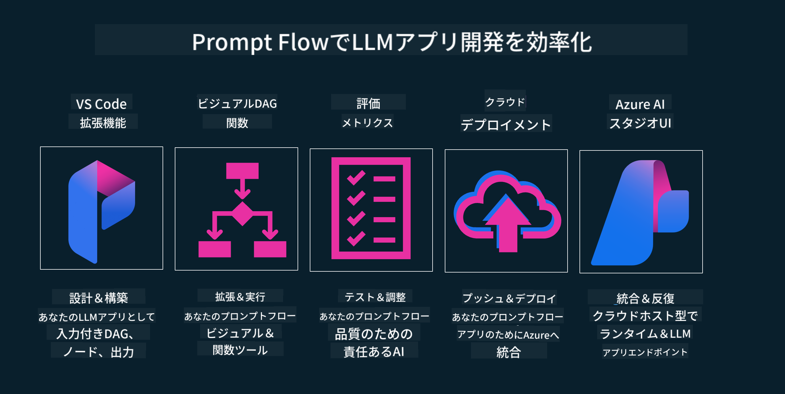

<!--
CO_OP_TRANSLATOR_METADATA:
{
  "original_hash": "b9d32511b27373a1b21b5789d4fda057",
  "translation_date": "2025-10-17T23:54:53+00:00",
  "source_file": "14-the-generative-ai-application-lifecycle/README.md",
  "language_code": "ja"
}
-->

# 生成AIアプリケーションライフサイクル

すべてのAIアプリケーションにとって重要な質問は、AI機能の関連性です。AIは急速に進化している分野であり、アプリケーションが常に関連性、信頼性、堅牢性を保つためには、継続的に監視、評価、改善を行う必要があります。ここで役立つのが生成AIライフサイクルです。

生成AIライフサイクルは、生成AIアプリケーションを開発、展開、維持する段階を案内するフレームワークです。このフレームワークは、目標を定義し、パフォーマンスを測定し、課題を特定し、解決策を実施するのに役立ちます。また、アプリケーションをドメインやステークホルダーの倫理的および法的基準に合わせるのにも役立ちます。生成AIライフサイクルに従うことで、アプリケーションが常に価値を提供し、ユーザーを満足させることができます。

## はじめに

この章では以下を学びます：

- MLOpsからLLMOpsへのパラダイムシフトを理解する
- LLMライフサイクル
- ライフサイクルツール
- ライフサイクルの測定と評価

## MLOpsからLLMOpsへのパラダイムシフトを理解する

LLMは人工知能の新しいツールであり、アプリケーションの分析や生成タスクにおいて非常に強力です。しかし、この力にはAIや従来の機械学習タスクを効率化する方法にいくつかの影響があります。

これにより、このツールを動的に適応させるための新しいパラダイムが必要になります。古いAIアプリを「MLアプリ」とし、新しいAIアプリを「生成AIアプリ」または単に「AIアプリ」と分類することで、その時代の主流技術や手法を反映させることができます。この変化は、以下の比較に示されるように、さまざまな方法で私たちの考え方を変えます。

LLMOpsでは、アプリ開発者に焦点を当て、統合を重要なポイントとして、「モデル・アズ・ア・サービス」を使用し、以下のポイントを指標として考えます。

- 品質：応答の品質
- 有害性：責任あるAI
- 誠実性：応答の根拠（意味が通じるか？正しいか？）
- コスト：ソリューションの予算
- レイテンシー：トークン応答の平均時間

## LLMライフサイクル

まず、ライフサイクルとその変更点を理解するために、次のインフォグラフィックを見てみましょう。

これが通常のMLOpsライフサイクルとは異なることがわかるでしょう。LLMには、プロンプト作成、品質向上のためのさまざまな技術（ファインチューニング、RAG、メタプロンプト）、責任あるAIに関する評価と責任、そして新しい評価指標（品質、有害性、誠実性、コスト、レイテンシー）など、多くの新しい要件があります。

例えば、アイデアを出す方法を見てみましょう。プロンプトエンジニアリングを使用して、さまざまなLLMを試し、仮説が正しいかどうかをテストする可能性を探ります。

これは直線的ではなく、統合されたループであり、反復的で包括的なサイクルです。

これらのステップをどのように探求できるでしょうか？ライフサイクルを構築する方法を詳しく見てみましょう。

少し複雑に見えるかもしれませんが、まずは3つの大きなステップに焦点を当てましょう。

1. アイデア出し/探索: 探索。ここでは、ビジネスニーズに応じてプロトタイピングを行い、[PromptFlow](https://microsoft.github.io/promptflow/index.html?WT.mc_id=academic-105485-koreyst)を作成して仮説が十分に効率的かどうかをテストします。
2. 構築/拡張: 実装。次に、より大きなデータセットを評価し、ファインチューニングやRAGなどの技術を実装して、ソリューションの堅牢性を確認します。もしうまくいかない場合は、フローに新しいステップを追加したり、データを再構築したりして再実装することが役立つかもしれません。フローとスケールをテストし、指標を確認して問題がなければ、次のステップに進む準備が整います。
3. 運用化: 統合。監視とアラートシステムをシステムに追加し、アプリケーションへの統合と展開を行います。

その後、セキュリティ、コンプライアンス、ガバナンスに焦点を当てた包括的な管理サイクルがあります。

おめでとうございます！これでAIアプリが準備完了し、運用可能です。実践的な体験をするには、[Contoso Chat Demo](https://nitya.github.io/contoso-chat/?WT.mc_id=academic-105485-koreys)をご覧ください。

では、どのようなツールを使用できるでしょうか？

## ライフサイクルツール

ツールとして、Microsoftは[Azure AI Platform](https://azure.microsoft.com/solutions/ai/?WT.mc_id=academic-105485-koreys)と[PromptFlow](https://microsoft.github.io/promptflow/index.html?WT.mc_id=academic-105485-koreyst)を提供しており、これらはライフサイクルの実装を簡単にし、すぐに使用可能にします。

[Azure AI Platform](https://azure.microsoft.com/solutions/ai/?WT.mc_id=academic-105485-koreys)では、[AI Studio](https://ai.azure.com/?WT.mc_id=academic-105485-koreys)を使用できます。AI Studioは、モデル、サンプル、ツールを探索できるウェブポータルであり、リソース管理、UI開発フロー、コードファースト開発のためのSDK/CLIオプションを提供します。

Azure AIは、運用、サービス、プロジェクト、ベクトル検索、データベースのニーズを管理するための複数のリソースを提供します。

Proof-of-Concept(POC)から大規模アプリケーションまで、PromptFlowを使用して構築できます：

- VS Codeから視覚的および機能的なツールを使用してアプリを設計・構築
- 簡単に品質の高いAIアプリをテストおよびファインチューニング
- Azure AI Studioを使用してクラウドと統合し、迅速に統合するためにプッシュおよびデプロイ

## 素晴らしい！学習を続けましょう！

素晴らしいですね！[Contoso Chat App](https://nitya.github.io/contoso-chat/?WT.mc_id=academic-105485-koreyst)を使用して、これらの概念をデモにどのように組み込むかを確認し、アプリケーションの構造化方法についてさらに学びましょう。さらにコンテンツを知りたい場合は、[Igniteのブレイクアウトセッション](https://www.youtube.com/watch?v=DdOylyrTOWg)をご覧ください！

次に、Lesson 15をチェックして、[Retrieval Augmented Generationとベクトルデータベース](../15-rag-and-vector-databases/README.md?WT.mc_id=academic-105485-koreyst)が生成AIにどのように影響を与え、より魅力的なアプリケーションを作るかを理解しましょう！

---

**免責事項**:  
この文書はAI翻訳サービス[Co-op Translator](https://github.com/Azure/co-op-translator)を使用して翻訳されています。正確性を追求しておりますが、自動翻訳には誤りや不正確な部分が含まれる可能性があります。元の言語で記載された文書を正式な情報源としてご参照ください。重要な情報については、専門の人間による翻訳を推奨します。この翻訳の使用に起因する誤解や誤認について、当方は一切の責任を負いません。