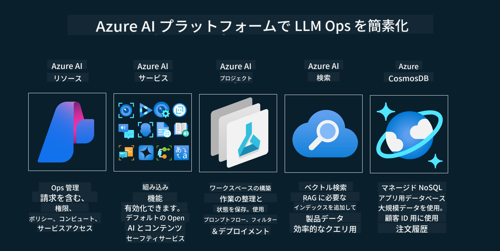

<!--
CO_OP_TRANSLATOR_METADATA:
{
  "original_hash": "27a5347a5022d5ef0a72ab029b03526a",
  "translation_date": "2025-07-09T15:49:31+00:00",
  "source_file": "14-the-generative-ai-application-lifecycle/README.md",
  "language_code": "ja"
}
-->

# ジェネレーティブAIアプリケーションのライフサイクル

すべてのAIアプリケーションにとって重要な問いは、AI機能の関連性です。AIは急速に進化する分野であるため、アプリケーションが常に関連性があり、信頼性が高く、堅牢であることを保証するには、継続的に監視、評価、改善する必要があります。ここでジェネレーティブAIのライフサイクルが役立ちます。

ジェネレーティブAIのライフサイクルは、ジェネレーティブAIアプリケーションの開発、展開、維持管理の各段階を案内するフレームワークです。目標の定義、パフォーマンスの測定、課題の特定、解決策の実施を支援します。また、アプリケーションをドメインやステークホルダーの倫理的・法的基準に合わせることも助けます。ジェネレーティブAIのライフサイクルに従うことで、常に価値を提供し、ユーザーの満足を得られるアプリケーションを実現できます。

## はじめに

この章では以下を学びます：

- MLOpsからLLMOpsへのパラダイムシフトの理解
- LLMのライフサイクル
- ライフサイクルツール
- ライフサイクルのメトリクス化と評価

## MLOpsからLLMOpsへのパラダイムシフトの理解

LLMは人工知能の新たなツールであり、アプリケーションの分析や生成タスクにおいて非常に強力です。しかし、この力はAIや従来の機械学習タスクの効率化に影響を与えます。

このため、適切なインセンティブを持ってこのツールを動的に適応させる新しいパラダイムが必要です。古いAIアプリを「MLアプリ」、新しいAIアプリを「GenAIアプリ」または単に「AIアプリ」と分類し、その時代の主流技術や手法を反映しています。これにより、私たちの考え方は多方面で変わります。以下の比較をご覧ください。

LLMOpsでは、アプリ開発者により焦点を当て、統合を重要視し、「Models-as-a-Service」を活用し、以下のポイントでメトリクスを考えます。

- Quality: 応答の質
- Harm: 責任あるAI
- Honesty: 応答の根拠（意味が通っているか？正しいか？）
- Cost: ソリューションの予算
- Latency: トークン応答の平均時間

## LLMのライフサイクル

まず、ライフサイクルとその変更点を理解するために、次のインフォグラフィックを見てみましょう。

ご覧の通り、これは従来のMLOpsのライフサイクルとは異なります。LLMには、プロンプティング、品質向上のためのさまざまな手法（ファインチューニング、RAG、メタプロンプト）、責任あるAIに関する異なる評価と責任、そして新しい評価指標（Quality、Harm、Honesty、Cost、Latency）など、多くの新しい要件があります。

例えば、アイデア出しの方法を見てみましょう。プロンプトエンジニアリングを使って複数のLLMを試し、仮説が正しいかどうかを検証します。

これは直線的なプロセスではなく、統合されたループであり、反復的で包括的なサイクルです。

これらのステップをどのように探求できるでしょうか？ライフサイクルの構築方法を詳しく見ていきましょう。

少し複雑に見えるかもしれませんが、まずは大きく3つのステップに注目しましょう。

1. アイデア出し／探索：ビジネスニーズに応じて探索します。プロトタイピングを行い、[PromptFlow](https://microsoft.github.io/promptflow/index.html?WT.mc_id=academic-105485-koreyst)を作成し、仮説に対して十分に効率的かテストします。
1. 構築／拡張：実装段階です。より大きなデータセットで評価を始め、ファインチューニングやRAGなどの手法を使ってソリューションの堅牢性を確認します。うまくいかない場合は、再実装やフローの追加、データの再構築を検討します。フローとスケールのテストが成功し、メトリクスを満たせば次のステップへ進みます。
1. 運用化：統合段階です。監視やアラートシステムを追加し、システムの展開とアプリケーションへの統合を行います。

その後、セキュリティ、コンプライアンス、ガバナンスに焦点を当てた管理の包括的なサイクルがあります。

おめでとうございます。これでAIアプリが準備完了し、運用可能になりました。実際に体験したい方は、[Contoso Chat Demo](https://nitya.github.io/contoso-chat/?WT.mc_id=academic-105485-koreys)をご覧ください。

では、どんなツールを使えるでしょうか？

## ライフサイクルツール

ツールとして、Microsoftは[Azure AI Platform](https://azure.microsoft.com/solutions/ai/?WT.mc_id=academic-105485-koreys)と[PromptFlow](https://microsoft.github.io/promptflow/index.html?WT.mc_id=academic-105485-koreyst)を提供しており、ライフサイクルの実装を簡単にし、すぐに使い始められます。

[Azure AI Platform](https://azure.microsoft.com/solutions/ai/?WT.mc_id=academic-105485-koreys)では、[AI Studio](https://ai.azure.com/?WT.mc_id=academic-105485-koreys)を利用できます。AI Studioは、モデル、サンプル、ツールを探索できるウェブポータルで、リソース管理、UI開発フロー、コードファースト開発のためのSDK/CLIオプションを提供します。

Azure AIは、複数のリソースを活用して、運用、サービス、プロジェクト、ベクター検索、データベースのニーズを管理できます。

Proof-of-Concept（POC）から大規模アプリケーションまで、PromptFlowで構築：

- VS Codeから視覚的かつ機能的なツールでアプリを設計・構築
- 簡単に品質の高いAIのためにテストとファインチューニング
- Azure AI Studioを使ってクラウドと統合し、迅速な展開と反復を実現

## 素晴らしい！学習を続けましょう！

素晴らしいですね。次は、[Contoso Chat App](https://nitya.github.io/contoso-chat/?WT.mc_id=academic-105485-koreyst)でこれらの概念をどのようにアプリケーションに構築しているかを学び、Cloud Advocacyがデモでどのようにこれらの概念を活用しているかを確認しましょう。さらに詳しい内容は、[Igniteブレイクアウトセッション](https://www.youtube.com/watch?v=DdOylyrTOWg)もご覧ください。

次に、Lesson 15で[Retrieval Augmented Generationとベクターデータベース](../15-rag-and-vector-databases/README.md?WT.mc_id=academic-105485-koreyst)がジェネレーティブAIにどのように影響し、より魅力的なアプリケーションを作るかを理解しましょう！

**免責事項**：  
本書類はAI翻訳サービス「[Co-op Translator](https://github.com/Azure/co-op-translator)」を使用して翻訳されました。正確性の向上に努めておりますが、自動翻訳には誤りや不正確な部分が含まれる可能性があります。原文の言語によるオリジナル文書が正式な情報源とみなされるべきです。重要な情報については、専門の人間による翻訳を推奨します。本翻訳の利用により生じた誤解や誤訳について、当方は一切の責任を負いかねます。