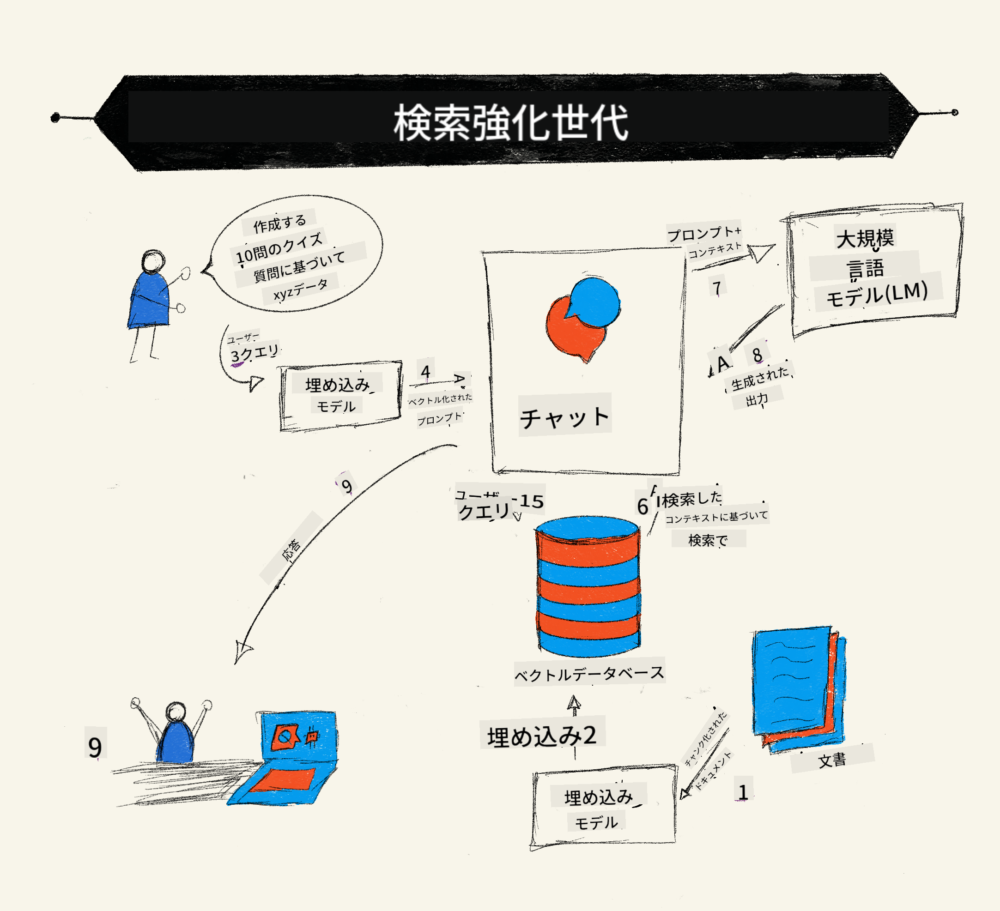
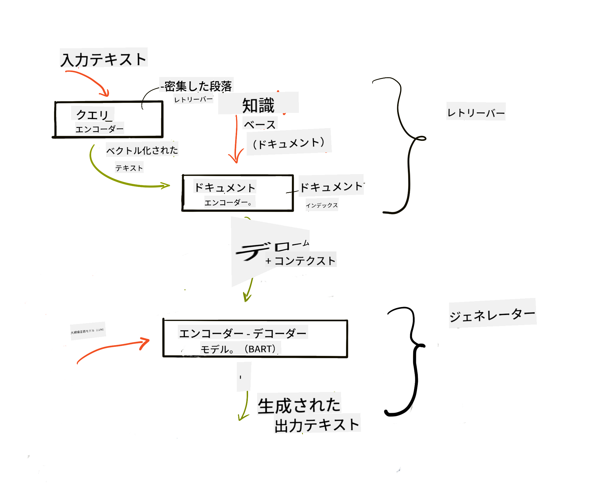
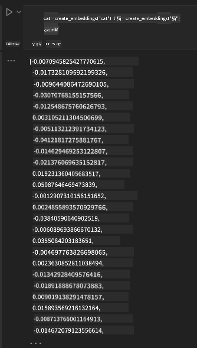

<!--
CO_OP_TRANSLATOR_METADATA:
{
  "original_hash": "e2861bbca91c0567ef32bc77fe054f9e",
  "translation_date": "2025-05-20T01:06:51+00:00",
  "source_file": "15-rag-and-vector-databases/README.md",
  "language_code": "ja"
}
-->
# 検索強化生成 (RAG) とベクターデータベース

[](https://aka.ms/gen-ai-lesson15-gh?WT.mc_id=academic-105485-koreyst)

検索アプリケーションのレッスンでは、独自のデータを大規模言語モデル (LLM) に統合する方法を簡単に学びました。このレッスンでは、LLMアプリケーションにデータを根拠づける概念、プロセスのメカニズム、埋め込みやテキストを含むデータを保存する方法についてさらに深く掘り下げます。

> **ビデオは近日公開予定**

## はじめに

このレッスンでは、以下の内容をカバーします：

- RAGの紹介、それが何であり、なぜAI（人工知能）で使用されるのか。

- ベクターデータベースとは何かを理解し、アプリケーション用に作成する。

- RAGをアプリケーションに統合する実践的な例。

## 学習目標

このレッスンを完了すると、次のことができるようになります：

- データの取得と処理におけるRAGの重要性を説明する。

- RAGアプリケーションをセットアップし、データをLLMに根拠づける。

- LLMアプリケーションにおけるRAGとベクターデータベースの効果的な統合。

## シナリオ: 独自のデータでLLMを強化する

このレッスンでは、教育スタートアップに独自のノートを追加し、チャットボットがさまざまな科目に関する情報を得られるようにします。ノートを使用することで、学習者はより良く学習し、異なるトピックを理解しやすくなり、試験の復習が容易になります。シナリオを作成するために使用するのは：

- `Azure OpenAI:` チャットボットを作成するために使用するLLM

- `AI for beginners' lesson on Neural Networks`: これがLLMに根拠づけるデータです

- `Azure AI Search` と `Azure Cosmos DB:` ベクターデータベースを使用してデータを保存し、検索インデックスを作成します

ユーザーはノートから練習クイズを作成したり、復習用のフラッシュカードを作成したり、それを簡潔な概要にまとめたりすることができます。まず、RAGとは何か、その動作を見てみましょう：

## 検索強化生成 (RAG)

LLMを搭載したチャットボットは、ユーザーのプロンプトを処理して応答を生成します。これはインタラクティブに設計されており、幅広いトピックでユーザーと対話します。ただし、その応答は提供されたコンテキストと基盤となるトレーニングデータに限定されます。たとえば、GPT-4の知識のカットオフは2021年9月であり、この期間以降に発生したイベントについての知識はありません。さらに、LLMを訓練するために使用されたデータには、個人的なノートや会社の製品マニュアルなどの機密情報は含まれていません。

### RAG（検索強化生成）の動作方法



たとえば、ノートからクイズを作成するチャットボットを展開したい場合、知識ベースへの接続が必要です。ここでRAGが役立ちます。RAGの動作は以下の通りです：

- **知識ベース:** 検索前に、これらのドキュメントを取り込み、前処理する必要があります。通常、大きなドキュメントを小さなチャンクに分割し、テキスト埋め込みに変換してデータベースに保存します。

- **ユーザーの質問:** ユーザーが質問をします。

- **検索:** ユーザーが質問をすると、埋め込みモデルが知識ベースから関連情報を検索し、プロンプトに組み込むための追加のコンテキストを提供します。

- **強化生成:** LLMは検索されたデータに基づいて応答を強化します。これにより、生成された応答は事前に訓練されたデータだけでなく、追加されたコンテキストからの関連情報にも基づいています。検索されたデータはLLMの応答を補強するために使用されます。LLMはその後、ユーザーの質問に対する回答を返します。



RAGのアーキテクチャは、エンコーダーとデコーダーの2つの部分からなるトランスフォーマーを使用して実装されます。たとえば、ユーザーが質問をすると、入力テキストがベクトルに「エンコード」され、単語の意味を捉え、ベクトルがドキュメントインデックスに「デコード」され、ユーザーの質問に基づいて新しいテキストを生成します。LLMはエンコーダーデコーダーモデルの両方を使用して出力を生成します。

提案された論文によると、RAGを実装する際の2つのアプローチは次のとおりです：[知識集約型NLP（自然言語処理ソフトウェア）タスクのための検索強化生成](https://arxiv.org/pdf/2005.11401.pdf?WT.mc_id=academic-105485-koreyst)：

- **_RAG-Sequence_** 検索されたドキュメントを使用して、ユーザーの質問に対する最適な回答を予測します。

- **RAG-Token** ドキュメントを使用して次のトークンを生成し、それをユーザーの質問に答えるために検索します。

### なぜRAGを使用するのか？

- **情報の豊富さ:** テキスト応答が最新であることを保証します。したがって、内部知識ベースにアクセスすることで、特定のドメインタスクのパフォーマンスを向上させます。

- **検証可能なデータ** を知識ベースで利用することで、ユーザーの質問にコンテキストを提供し、捏造を減らします。

- LLMの微調整に比べてより経済的であるため、**コスト効率が高い**です。

## 知識ベースの作成

私たちのアプリケーションは、AI初心者向けカリキュラムのニューラルネットワークレッスンという個人データに基づいています。

### ベクターデータベース

ベクターデータベースは、従来のデータベースとは異なり、埋め込みベクトルを保存、管理、検索するために設計された専門的なデータベースです。ドキュメントの数値表現を保存します。データを数値埋め込みに分解することで、AIシステムがデータを理解し、処理しやすくなります。

埋め込みをベクターデータベースに保存する理由は、LLMが入力として受け付けるトークンの数に制限があるためです。埋め込み全体をLLMに渡すことはできないため、チャンクに分割する必要があります。ユーザーが質問をすると、質問に最も近い埋め込みがプロンプトとともに返されます。チャンク化は、LLMを通過するトークンの数にかかるコストも削減します。

人気のあるベクターデータベースには、Azure Cosmos DB、Clarifyai、Pinecone、Chromadb、ScaNN、Qdrant、DeepLakeがあります。Azure CLIを使用してAzure Cosmos DBモデルを次のコマンドで作成できます：

```bash
az login
az group create -n <resource-group-name> -l <location>
az cosmosdb create -n <cosmos-db-name> -r <resource-group-name>
az cosmosdb list-keys -n <cosmos-db-name> -g <resource-group-name>
```

### テキストから埋め込みへ

データを保存する前に、それをデータベースに保存する前にベクトル埋め込みに変換する必要があります。大きなドキュメントや長いテキストを扱う場合、予想されるクエリに基づいてチャンク化することができます。チャンク化は、文レベルや段落レベルで行うことができます。チャンク化は周囲の単語から意味を引き出すため、ドキュメントのタイトルを追加したり、チャンクの前後にテキストを含めたりすることで、チャンクに他のコンテキストを追加できます。データを次のようにチャンク化できます：

```python
def split_text(text, max_length, min_length):
    words = text.split()
    chunks = []
    current_chunk = []

    for word in words:
        current_chunk.append(word)
        if len(' '.join(current_chunk)) < max_length and len(' '.join(current_chunk)) > min_length:
            chunks.append(' '.join(current_chunk))
            current_chunk = []

    # If the last chunk didn't reach the minimum length, add it anyway
    if current_chunk:
        chunks.append(' '.join(current_chunk))

    return chunks
```

チャンク化した後、さまざまな埋め込みモデルを使用してテキストを埋め込むことができます。使用できるモデルには、word2vec、OpenAIのada-002、Azure Computer Visionなどがあります。使用するモデルの選択は、使用する言語、エンコードされたコンテンツの種類（テキスト/画像/音声）、エンコードできる入力のサイズ、埋め込み出力の長さに依存します。

OpenAIの`text-embedding-ada-002`モデルを使用した埋め込みテキストの例：


## 検索とベクター検索

ユーザーが質問をすると、検索者はそれをクエリエンコーダーを使用してベクトルに変換し、入力に関連するドキュメント検索インデックス内の関連ベクトルを検索します。完了すると、入力ベクトルとドキュメントベクトルの両方をテキストに変換し、LLMを通じて渡します。

### 検索

検索は、システムがインデックスから検索基準を満たすドキュメントを迅速に見つけようとする際に発生します。検索者の目標は、コンテキストを提供し、データにLLMを根拠づけるために使用されるドキュメントを取得することです。

データベース内で検索を実行する方法はいくつかあります：

- **キーワード検索** - テキスト検索に使用されます

- **セマンティック検索** - 単語の意味を使用します

- **ベクター検索** - 埋め込みモデルを使用してドキュメントをテキストからベクトル表現に変換します。検索は、ユーザーの質問に最も近いベクトル表現を持つドキュメントをクエリすることで行われます。

- **ハイブリッド** - キーワード検索とベクター検索の両方を組み合わせたもの。

検索に関する課題は、データベースにクエリに類似した応答がない場合に発生します。その場合、システムは可能な限り最良の情報を返しますが、関連性のための最大距離を設定する、またはキーワード検索とベクター検索の両方を組み合わせたハイブリッド検索を使用するなどの戦術を使用できます。このレッスンでは、ベクター検索とキーワード検索の両方を組み合わせたハイブリッド検索を使用します。データをチャンクと埋め込みを含む列を持つデータフレームに保存します。

### ベクター類似性

検索者は、知識データベースを通じて、近くにある埋め込みを検索します。最も近い隣接は、類似したテキストです。ユーザーがクエリを行う場合、最初に埋め込まれ、類似した埋め込みと一致します。異なるベクトルがどれだけ類似しているかを見つけるために使用される一般的な測定は、2つのベクトル間の角度に基づくコサイン類似性です。

他の代替手段として使用できる類似性の測定方法には、ベクトルの端点間の直線距離であるユークリッド距離や、2つのベクトルの対応する要素の積の合計を測定するドット積があります。

### 検索インデックス

検索を行う際、検索を実行する前に知識ベースの検索インデックスを構築する必要があります。インデックスは埋め込みを保存し、大規模なデータベースでも最も類似したチャンクを迅速に検索できます。ローカルにインデックスを作成するには、次のようにします：

```python
from sklearn.neighbors import NearestNeighbors

embeddings = flattened_df['embeddings'].to_list()

# Create the search index
nbrs = NearestNeighbors(n_neighbors=5, algorithm='ball_tree').fit(embeddings)

# To query the index, you can use the kneighbors method
distances, indices = nbrs.kneighbors(embeddings)
```

### 再ランク付け

データベースをクエリした後、最も関連性のある結果から並べ替える必要があるかもしれません。再ランク付けLLMは、機械学習を利用して検索結果の関連性を向上させ、最も関連性の高い順に並べ替えます。Azure AI Searchを使用すると、再ランク付けはセマンティック再ランカーを使用して自動的に行われます。最近傍を使用した再ランク付けの動作例：

```python
# Find the most similar documents
distances, indices = nbrs.kneighbors([query_vector])

index = []
# Print the most similar documents
for i in range(3):
    index = indices[0][i]
    for index in indices[0]:
        print(flattened_df['chunks'].iloc[index])
        print(flattened_df['path'].iloc[index])
        print(flattened_df['distances'].iloc[index])
    else:
        print(f"Index {index} not found in DataFrame")
```

## すべてをまとめる

最後のステップは、LLMを組み込んで、データに根拠を持たせた応答を得ることです。以下のように実装できます：

```python
user_input = "what is a perceptron?"

def chatbot(user_input):
    # Convert the question to a query vector
    query_vector = create_embeddings(user_input)

    # Find the most similar documents
    distances, indices = nbrs.kneighbors([query_vector])

    # add documents to query  to provide context
    history = []
    for index in indices[0]:
        history.append(flattened_df['chunks'].iloc[index])

    # combine the history and the user input
    history.append(user_input)

    # create a message object
    messages=[
        {"role": "system", "content": "You are an AI assistant that helps with AI questions."},
        {"role": "user", "content": history[-1]}
    ]

    # use chat completion to generate a response
    response = openai.chat.completions.create(
        model="gpt-4",
        temperature=0.7,
        max_tokens=800,
        messages=messages
    )

    return response.choices[0].message

chatbot(user_input)
```

## アプリケーションの評価

### 評価指標

- 提供された応答の質を確認し、それが自然で流暢で人間らしいかどうかを確認する

- データの根拠性：提供されたドキュメントからの応答であるかどうかを評価する

- 関連性：応答が質問に一致し、関連しているかどうかを評価する

- 流暢さ：応答が文法的に意味をなしているかどうか

## RAG（検索強化生成）とベクターデータベースを使用するユースケース

関数呼び出しがアプリを改善できるさまざまなユースケースがあります：

- 質問応答：会社のデータをチャットに根拠づけ、従業員が質問できるようにする。

- レコメンデーションシステム：映画やレストランなど、最も類似した値をマッチングするシステムを作成する。

- チャットボットサービス：チャット履歴を保存し、ユーザーデータに基づいて会話をパーソナライズする。

- ベクター埋め込みに基づく画像検索、画像認識や異常検出に役立ちます。

## まとめ

データをアプリケーションに追加することから、ユーザーのクエリと出力まで、RAGの基本的な領域をカバーしました。RAGの作成を簡素化するために、Semanti Kernel、Langchain、Autogenなどのフレームワークを使用できます。

## 課題

検索強化生成（RAG）の学習を続けるために、以下を構築できます：

- 任意のフレームワークを使用してアプリケーションのフロントエンドを構築する

- LangChainまたはSemantic Kernelのいずれかのフレームワークを利用し、アプリケーションを再作成する。

レッスンを完了したことをおめでとうございます 👏。

## 学習はここで止まりません、旅を続けましょう

このレッスンを完了した後、[生成AI学習コレクション](https://aka.ms/genai-collection?WT.mc_id=academic-105485-koreyst)をチェックして、生成AIの知識をさらに高めましょう！

**免責事項**:  
この文書は、AI翻訳サービス[Co-op Translator](https://github.com/Azure/co-op-translator)を使用して翻訳されています。正確さを期すために努力していますが、自動翻訳には誤りや不正確さが含まれる可能性があることをご承知おきください。元の言語の文書が権威ある情報源と見なされるべきです。重要な情報については、専門の人間による翻訳をお勧めします。この翻訳の使用に起因する誤解や誤訳について、当社は責任を負いません。