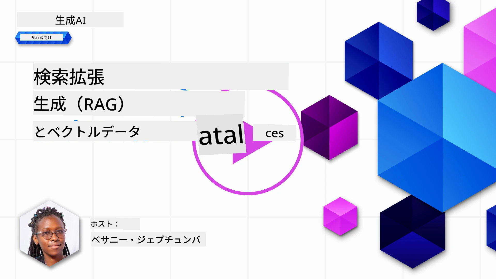
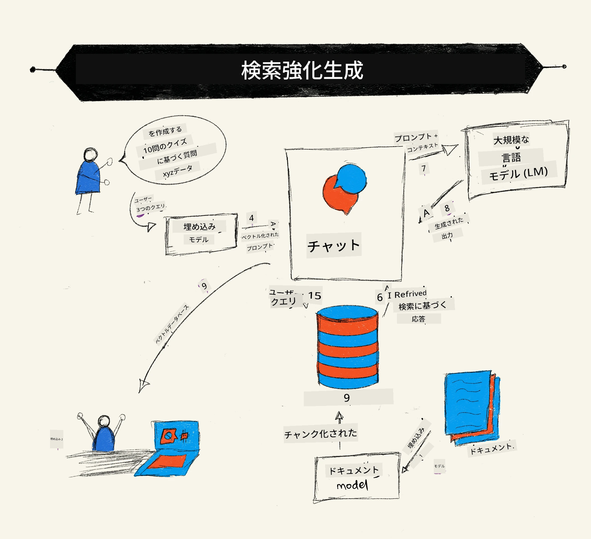
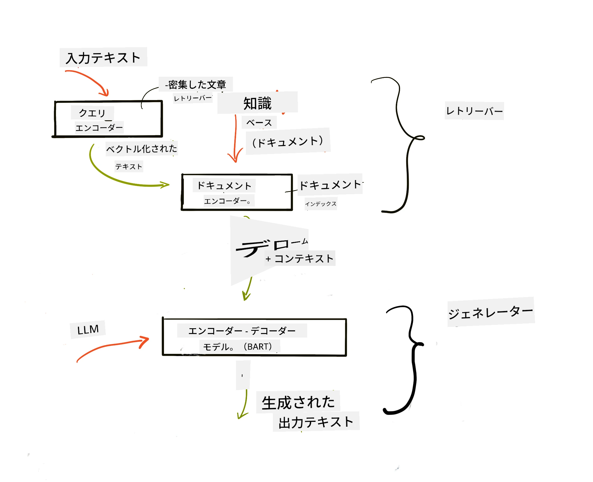
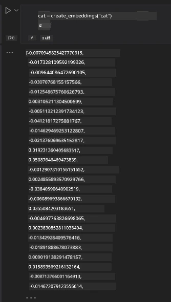

# 検索強化型生成（RAG）とベクターデータベース

[](https://youtu.be/4l8zhHUBeyI?si=BmvDmL1fnHtgQYkL)

検索アプリケーションのレッスンでは、独自のデータを大型言語モデル（LLM）に統合する方法を簡単に学びました。このレッスンでは、LLMアプリケーションにおけるデータのグラウンディングの概念、プロセスの仕組み、埋め込みとテキストの両方を含むデータの保存方法についてさらに深く掘り下げます。

> <strong>ビデオは近日公開予定です</strong>

## はじめに

このレッスンで扱う内容は以下の通りです：

- RAGの紹介、その概要とAI（人工知能）で使用される理由。

- ベクターデータベースの理解とアプリケーション用の作成方法。

- RAGをアプリケーションに統合する実践例。

## 学習目標

このレッスンを終了すると、以下が可能になります：

- データ検索と処理におけるRAGの重要性を説明できるようになる。

- RAGアプリケーションをセットアップし、データをLLMにグラウンディングする。

- LLMアプリケーションにおけるRAGとベクターデータベースの効果的な統合。

## シナリオ：独自データでLLMを強化する

このレッスンでは、教育系スタートアップに独自のノートを追加し、チャットボットが各科目についてより多くの情報を得られるようにします。ノートを活用することで、学習者はより効果的に勉強し、各トピックを理解しやすくなり、試験の復習が容易になります。このシナリオ作成には以下を使用します：

- `Azure OpenAI:` チャットボット作成に用いるLLM

- `AI for beginners' lesson on Neural Networks`: LLMのグラウンディングに使うデータ

- `Azure AI Search` と `Azure Cosmos DB:` データ保存および検索インデックス作成用のベクターデータベース

ユーザーはノートから練習クイズや復習用フラッシュカードを作成し、簡潔な概要にまとめられるようになります。まずはRAGとは何か、どのように機能するのかを見てみましょう：

## 検索強化型生成（RAG）

LLM搭載のチャットボットはユーザープロンプトを処理し応答を生成します。インタラクティブに設計されており、幅広いトピックでユーザーと対話します。しかし、その応答は与えられた文脈や基礎訓練データに制限されます。例えば、GPT-4の知識カットオフは2021年9月であり、それ以降の出来事については知らないことになります。また、LLMの訓練に使用されるデータには個人のノートや企業の製品マニュアルなどの機密情報は含まれていません。

### RAG（検索強化型生成）の仕組み



例えば、ノートからクイズを作成するチャットボットを展開したい場合、そのためには知識ベースへの接続が必要です。ここでRAGが役立ちます。RAGは次の步骤で動作します：

- **知識ベース:** 検索前に、文書を取り込み前処理します。通常、大量の文書を小さなチャンクに分割し、テキスト埋め込みに変換してデータベースに保存します。

- **ユーザーの問い合わせ:** ユーザーが質問をします。

- **検索:** ユーザーの質問に対して、埋め込みモデルが知識ベースから関連情報を取得し、これをプロンプトに組み込みます。

- **強化生成:** LLMは取得したデータに基づいて応答を改善します。これにより、応答は事前訓練データのみに基づくものではなく、追加された文脈情報に基づく関連情報から生成されます。取得したデータを利用してLLMの応答を拡充し、ユーザーの質問に回答します。



RAGのアーキテクチャは、エンコーダーとデコーダーの二つの部分からなるトランスフォーマーで実装されています。例えば、ユーザーが質問をしたとき、入力テキストは単語の意味を捉えたベクトルに「エンコード」され、これらのベクトルを「デコード」して文書インデックスにアクセスし、ユーザーの質問に基づく新しいテキストを生成します。LLMはエンコーダー・デコーダーモデルの両方を用いて出力を生成します。

RAGを実装する際の方式として、提案された論文[Retrieval-Augmented Generation for Knowledge intensive NLP (natural language processing software) Tasks](https://arxiv.org/pdf/2005.11401.pdf?WT.mc_id=academic-105485-koreyst)では以下の二つが挙げられています：

- **_RAG-Sequence_**：取得した文書を使ってユーザーの質問に対する最適解を予測する。

- **RAG-Token**：ユーザーの質問に答えるために次のトークンを生成しながら文書を逐次取得する。

### なぜRAGを使うのか？ 

- **情報の豊富さ:** テキスト応答が最新かつ現時点の情報を反映し、ドメイン特化タスクのパフォーマンスを向上させるため、内部の知識ベースにアクセスします。

- 知識ベース内の<strong>検証可能なデータ</strong>を利用して、虚偽の情報の生成を削減しユーザーの質問に文脈を与えます。

- LLMのファインチューニングよりも経済的で<strong>コスト効率が良い</strong>です。

## 知識ベースの作成

本アプリケーションは、パーソナルデータ、すなわち「AI for Beginners」のニューラルネットワークレッスンに基づいています。

### ベクターデータベース

ベクターデータベースは従来のデータベースとは異なり、埋め込みベクトルを保存・管理・検索するために特化されたデータベースです。文書を数値的な表現として保存します。データを数値埋め込みに分解することで、AIシステムがデータを理解し処理しやすくなります。

埋め込みはベクターデータベースに保存します。LLMは入力できるトークン数に制限があるため、埋め込み全体を直接渡すことはできません。そこで埋め込みをチャンクに分割し、ユーザーの質問に最も関連する埋め込みをプロンプトとともに返す必要があります。チャンク分割はまた、LLMに渡すトークン数を減らしコスト削減にも効果的です。

人気のあるベクターデータベースにはAzure Cosmos DB、Clarifyai、Pinecone、Chromadb、ScaNN、Qdrant、DeepLakeなどがあります。Azure CLIを使ってAzure Cosmos DBモデルを作成するには次のコマンドを実行します：

```bash
az login
az group create -n <resource-group-name> -l <location>
az cosmosdb create -n <cosmos-db-name> -r <resource-group-name>
az cosmosdb list-keys -n <cosmos-db-name> -g <resource-group-name>
```

### テキストから埋め込みへ

データを保存する前に、テキストをベクトル埋め込みに変換する必要があります。大きな文書や長いテキストの場合は、期待するクエリに応じてチャンクに分割することができます。チャンク分割は文や段落単位で可能です。チャンクは周辺の単語の意味を捉えるので、チャンクに文書タイトルを追加したりチャンク前後のテキストを含めて文脈を加えることもできます。データのチャンク分割例は以下の通りです：

```python
def split_text(text, max_length, min_length):
    words = text.split()
    chunks = []
    current_chunk = []

    for word in words:
        current_chunk.append(word)
        if len(' '.join(current_chunk)) < max_length and len(' '.join(current_chunk)) > min_length:
            chunks.append(' '.join(current_chunk))
            current_chunk = []

    # 最後のチャンクが最小長に達していなくても、いずれにせよ追加してください
    if current_chunk:
        chunks.append(' '.join(current_chunk))

    return chunks
```

チャンクに分割したら、異なる埋め込みモデルを使ってテキストを埋め込むことができます。使用可能なモデルにはword2vec、OpenAIのada-002、Azure Computer Visionなど多くあります。モデル選択は使用言語、符号化するコンテンツの種類（テキスト／画像／音声）、入力の大きさや埋め込み出力の長さによります。

OpenAIの`text-embedding-ada-002`モデルで埋め込んだテキストの例は以下の通りです：


## 検索とベクター検索

ユーザーが質問をすると、検索器はクエリエンコーダーを使って質問をベクトルに変換し、文書検索インデックスから入力に関連するベクトルを探します。完了すると、入力ベクトルと文書のベクトルの両方をテキストに変換しLLMに渡します。

### 検索

検索とは、システムがインデックスから条件に合致する文書をすばやく見つけ出すことです。検索器の目標は、LLMの文脈となる文書、すなわちあなたのデータに基づいてLLMをグラウンドさせるために用いられる文書を取得することです。

データベース内の検索には以下の方法があります：

- <strong>キーワード検索</strong> - テキスト検索に使用

- <strong>ベクター検索</strong> - 埋め込みモデルを使って文書をテキストからベクトル表現に変換し、単語の意味に基づく<strong>セマンティック検索</strong>を可能にします。検索はユーザーの質問に最も近いベクトル表現を持つ文書を対象に行います。

- <strong>ハイブリッド</strong> - キーワード検索とベクター検索を組み合わせたもの。

検索の課題は、データベース内に似た回答がない場合、システムは最良の情報を返そうとしますが、適切な手法として関連度の最大距離を設定したり、キーワード検索とベクター検索を組み合わせたハイブリッド検索を使用することがあります。本レッスンではベクター検索とキーワード検索の組み合わせであるハイブリッド検索を使用し、データをチャンクと埋め込みを含むデータフレームに保存します。

### ベクトル類似度

検索器はディスタンスが近い埋め込みを知識ベースから探します。ユーザーの質問はまず埋め込まれ、類似する埋め込みとマッチングされます。異なるベクトルの類似度を測る一般的な手法にコサイン類似度があり、これは二つのベクトル間の角度で算出されます。

他の類似度計測としては、ベクトルの端点間の直線距離を用いるユークリッド距離や、二つのベクトルの対応する要素の積の和を測るドット積があります。

### 検索インデックス

検索を行う際には、検索を行う前に知識ベースの検索インデックスを構築する必要があります。インデックスは埋め込みを保存し、大量のデータベースでも最も類似したチャンクを高速に検索できます。ローカルでインデックスを作成するには以下を使用します：

```python
from sklearn.neighbors import NearestNeighbors

embeddings = flattened_df['embeddings'].to_list()

# 検索インデックスを作成する
nbrs = NearestNeighbors(n_neighbors=5, algorithm='ball_tree').fit(embeddings)

# インデックスを照会するには、kneighborsメソッドを使用できます
distances, indices = nbrs.kneighbors(embeddings)
```

### 再ランキング

データベースにクエリを投げた後、結果を関連度の高い順に並べ替える必要がある場合があります。再ランキングLLMは機械学習を用いて検索結果の関連性を向上させ、最も関連する順に並べます。Azure AI Searchでは、セマンティックリランカーを使って自動で再ランキングが行われます。最も近い隣接点を使った再ランキングの例は以下の通りです：

```python
# 最も類似したドキュメントを見つける
distances, indices = nbrs.kneighbors([query_vector])

index = []
# 最も類似したドキュメントを表示する
for i in range(3):
    index = indices[0][i]
    for index in indices[0]:
        print(flattened_df['chunks'].iloc[index])
        print(flattened_df['path'].iloc[index])
        print(flattened_df['distances'].iloc[index])
    else:
        print(f"Index {index} not found in DataFrame")
```

## まとめて実装する

最後に、LLMを組み込んでデータに基づいた応答を得られるようにします。実装例は以下の通りです：

```python
user_input = "what is a perceptron?"

def chatbot(user_input):
    # 質問をクエリベクターに変換する
    query_vector = create_embeddings(user_input)

    # 最も類似したドキュメントを見つける
    distances, indices = nbrs.kneighbors([query_vector])

    # コンテキストを提供するためにドキュメントをクエリに追加する
    history = []
    for index in indices[0]:
        history.append(flattened_df['chunks'].iloc[index])

    # 履歴とユーザー入力を結合する
    history.append(user_input)

    # メッセージオブジェクトを作成する
    messages=[
        {"role": "system", "content": "You are an AI assistant that helps with AI questions."},
        {"role": "user", "content": "\n\n".join(history) }
    ]

    # Responses APIを使用して応答を生成する
    response = client.responses.create(
        model="gpt-4o-mini",
        temperature=0.7,
        max_output_tokens=800,
        input=messages,
        store=False,
    )

    return response.output_text

chatbot(user_input)
```

## アプリケーションの評価

### 評価指標

- 自然で流暢、人間らしい応答の質

- データのグラウンディング：応答が提供された文書に基づいているかの評価

- 関連性：応答が質問内容に合致し関連しているかの評価

- 流暢さ - 応答が文法的に理解可能かの評価

## RAG（検索強化型生成）とベクターデータベースのユースケース

関数呼び出しでアプリを改善できる多様なユースケースがあります：

- 質問応答：企業データをグラウンディングし、社員が質問できるチャットボットを作成。

- 推薦システム：最も類似した値をマッチングするシステム作成（映画、レストランなど）。

- チャットボットサービス：チャット履歴を保存し、ユーザーデータに基づいて会話をパーソナライズ。

- ベクター埋め込みによる画像検索。画像認識や異常検知に有用。

## まとめ

RAGの基本的な部分について、データ追加、ユーザークエリ、応答までをカバーしました。RAGの構築を簡単にするために、Semanti Kernel、Langchain、Autogenなどのフレームワークを利用できます。

## 課題

検索強化型生成（RAG）の理解を深めるため、次のことに取り組んでみてください：

- お好みのフレームワークでアプリケーションのフロントエンドを構築する

- LangChainまたはSemantic Kernelのいずれかのフレームワークを使い、アプリケーションを再構築する

レッスン完了おめでとうございます👏

## 学習はここで終わりません、旅を続けましょう

レッスン終了後は、[Generative AI Learning collection](https://aka.ms/genai-collection?WT.mc_id=academic-105485-koreyst) をチェックして、生成AIの知識をさらに深めてください！

---

<!-- CO-OP TRANSLATOR DISCLAIMER START -->
**免責事項**：
本書類は AI 翻訳サービス [Co-op Translator](https://github.com/Azure/co-op-translator) を使用して翻訳されています。正確性を期していますが、自動翻訳には誤りや不正確な部分が含まれる可能性があることをご承知おきください。原文の原語版が正式な情報源とみなされるべきです。重要な情報については、専門の人間による翻訳を推奨します。本翻訳の利用により生じたいかなる誤解や解釈違いについても、当方は責任を負いかねます。
<!-- CO-OP TRANSLATOR DISCLAIMER END -->