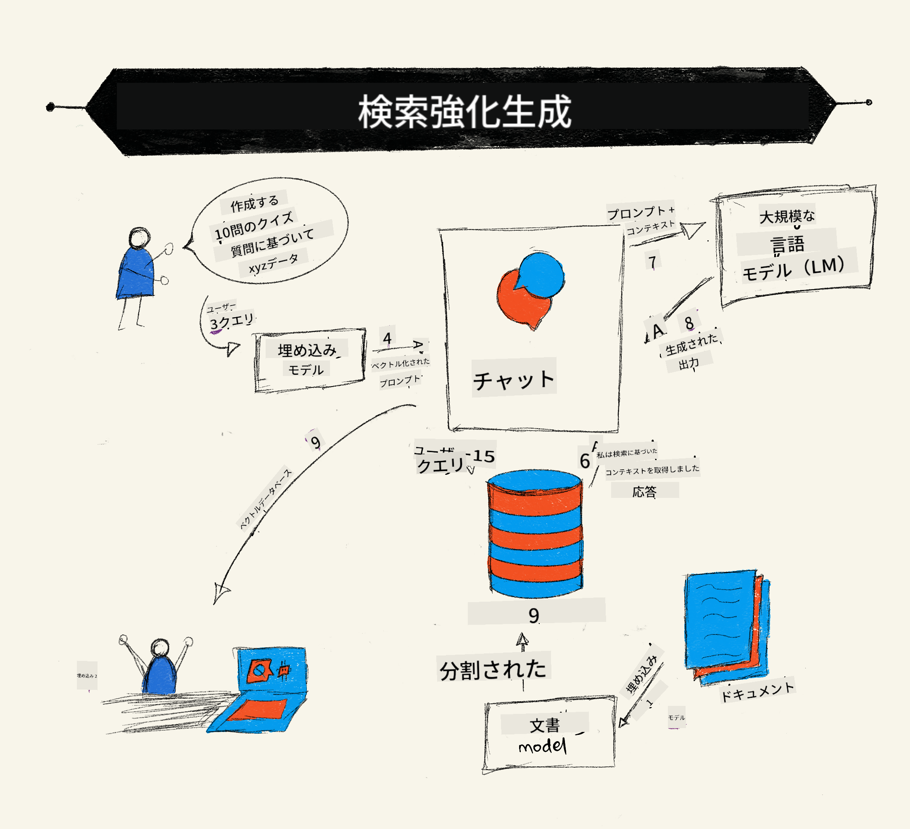
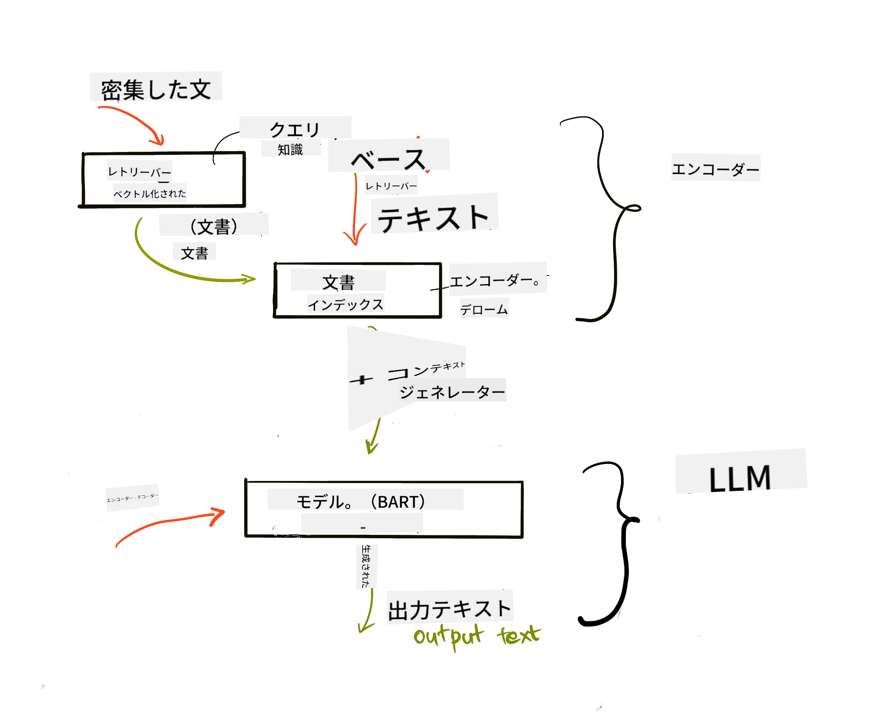
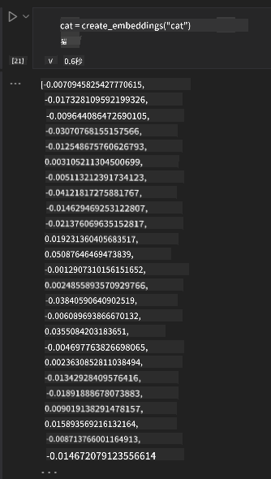

<!--
CO_OP_TRANSLATOR_METADATA:
{
  "original_hash": "e2861bbca91c0567ef32bc77fe054f9e",
  "translation_date": "2025-06-25T22:22:39+00:00",
  "source_file": "15-rag-and-vector-databases/README.md",
  "language_code": "ja"
}
-->
# 検索強化生成 (RAG) とベクターデータベース

検索アプリケーションのレッスンでは、自分のデータを大規模言語モデル (LLM) に統合する方法を簡単に学びました。このレッスンでは、LLMアプリケーションにデータを基づける概念、そのプロセスの仕組み、およびデータを保存する方法（埋め込みとテキストの両方を含む）について詳しく学びます。

> **ビデオは近日公開予定**

## はじめに

このレッスンでは、以下をカバーします：

- RAGの概要、AI（人工知能）での使用理由。

- ベクターデータベースの理解とアプリケーション用のデータベースの作成。

- アプリケーションにRAGを統合する実践的な例。

## 学習目標

このレッスンを完了すると、次のことができるようになります：

- データの取得と処理におけるRAGの重要性を説明する。

- RAGアプリケーションを設定し、データをLLMに基づける。

- LLMアプリケーションでのRAGとベクターデータベースの効果的な統合。

## シナリオ：自分のデータでLLMを強化する

このレッスンでは、教育スタートアップに自分のメモを追加し、チャットボットがさまざまな科目についての情報を得られるようにします。私たちのメモを使用することで、学習者はより良い学習をし、異なるトピックを理解し、試験のための復習が容易になります。シナリオを作成するために、以下を使用します：

- `Azure OpenAI:` チャットボットを作成するために使用するLLM

- `AI for beginners' lesson on Neural Networks`: これはLLMを基づけるデータです

- `Azure AI Search` と `Azure Cosmos DB:` ベクターデータベースはデータを保存し、検索インデックスを作成するために使用します

ユーザーはメモから練習クイズを作成したり、復習フラッシュカードを作成したり、簡潔な概要に要約したりできます。始めるにあたり、RAGとは何か、どのように機能するかを見ていきましょう：

## 検索強化生成 (RAG)

LLMを活用したチャットボットは、ユーザーのプロンプトを処理して応答を生成します。それはインタラクティブに設計されており、幅広いトピックでユーザーと対話します。しかし、その応答は提供されたコンテキストと基礎的なトレーニングデータに限定されています。たとえば、GPT-4の知識のカットオフは2021年9月であり、この期間以降に発生したイベントについての知識がありません。さらに、LLMを訓練するために使用されるデータには、個人のメモや会社の製品マニュアルなどの機密情報は含まれていません。

### RAGs（検索強化生成）の仕組み



ノートからクイズを作成するチャットボットを展開したいとしましょう。この場合、ナレッジベースへの接続が必要です。ここでRAGが役立ちます。RAGsは次のように機能します：

- **ナレッジベース：** 取得前に、これらの文書は取り込まれ、前処理される必要があります。通常、大きな文書を小さなチャンクに分割し、テキスト埋め込みに変換してデータベースに保存します。

- **ユーザークエリ：** ユーザーが質問をします

- **取得：** ユーザーが質問すると、埋め込みモデルはナレッジベースから関連情報を取得し、プロンプトに組み込むためのより多くのコンテキストを提供します。

- **強化生成：** LLMは取得されたデータに基づいて応答を強化します。これにより、生成された応答は事前に訓練されたデータだけでなく、追加されたコンテキストからの関連情報にも基づいています。取得されたデータはLLMの応答を強化するために使用されます。LLMはその後、ユーザーの質問に対する答えを返します。



RAGのアーキテクチャは、エンコーダーとデコーダーの2つの部分からなるトランスフォーマーを使用して実装されます。たとえば、ユーザーが質問をすると、入力テキストは単語の意味をキャプチャするベクトルに「エンコード」され、そのベクトルは文書インデックスに「デコード」され、ユーザーのクエリに基づいて新しいテキストを生成します。LLMはエンコーダーデコーダーモデルの両方を使用して出力を生成します。

提案された論文に従ってRAGを実装する際の2つのアプローチ：[Retrieval-Augmented Generation for Knowledge intensive NLP (natural language processing software) Tasks](https://arxiv.org/pdf/2005.11401.pdf?WT.mc_id=academic-105485-koreyst) は次の通りです：

- **_RAG-Sequence_** 取得された文書を使用してユーザーのクエリに対する最適な答えを予測する

- **RAG-Token** 文書を使用して次のトークンを生成し、それらを取得してユーザーのクエリに答える

### なぜRAGを使用するのか？

- **情報の豊かさ：** テキスト応答が最新であることを保証します。したがって、内部ナレッジベースにアクセスすることで、ドメイン固有のタスクのパフォーマンスを向上させます。

- ナレッジベースの**検証可能なデータ**を利用してユーザーのクエリにコンテキストを提供することで、誤情報を減らします。

- LLMを微調整するよりも経済的であるため、**費用対効果が高い**です。

## ナレッジベースの作成

私たちのアプリケーションは、AI For Beginnersカリキュラムのニューラルネットワークレッスンである個人データに基づいています。

### ベクターデータベース

ベクターデータベースは、従来のデータベースとは異なり、埋め込まれたベクトルを保存、管理、および検索するために設計された専門的なデータベースです。文書の数値表現を保存します。データを数値埋め込みに分解することで、AIシステムがデータを理解し処理しやすくなります。

LLMは入力として受け入れるトークンの数に制限があるため、埋め込みをベクターデータベースに保存します。埋め込み全体をLLMに渡すことはできないため、チャンクに分解し、ユーザーが質問した際に、その質問に最も似た埋め込みをプロンプトと一緒に返す必要があります。チャンク化は、LLMを通過するトークン数にかかるコストも削減します。

一般的なベクターデータベースには、Azure Cosmos DB、Clarifyai、Pinecone、Chromadb、ScaNN、Qdrant、DeepLakeなどがあります。次のコマンドを使用して、Azure CLIを使用してAzure Cosmos DBモデルを作成できます：

```bash
az login
az group create -n <resource-group-name> -l <location>
az cosmosdb create -n <cosmos-db-name> -r <resource-group-name>
az cosmosdb list-keys -n <cosmos-db-name> -g <resource-group-name>
```

### テキストから埋め込みへ

データを保存する前に、データをデータベースに保存する前にベクター埋め込みに変換する必要があります。大きな文書や長いテキストを扱う場合、予想されるクエリに基づいてチャンク化できます。チャンク化は、文レベルや段落レベルで行うことができます。チャンク化は周囲の単語から意味を引き出すため、ドキュメントのタイトルを追加したり、チャンクの前後にテキストを追加したりすることで、チャンクに他のコンテキストを追加できます。データを次のようにチャンク化できます：

```python
def split_text(text, max_length, min_length):
    words = text.split()
    chunks = []
    current_chunk = []

    for word in words:
        current_chunk.append(word)
        if len(' '.join(current_chunk)) < max_length and len(' '.join(current_chunk)) > min_length:
            chunks.append(' '.join(current_chunk))
            current_chunk = []

    # If the last chunk didn't reach the minimum length, add it anyway
    if current_chunk:
        chunks.append(' '.join(current_chunk))

    return chunks
```

チャンク化が完了したら、さまざまな埋め込みモデルを使用してテキストを埋め込むことができます。使用できるモデルには、word2vec、OpenAIのada-002、Azure Computer Visionなどがあります。使用するモデルの選択は、使用する言語、エンコードされるコンテンツのタイプ（テキスト/画像/オーディオ）、エンコードできる入力のサイズ、および埋め込み出力の長さに依存します。

OpenAIの`text-embedding-ada-002`モデルを使用した埋め込みテキストの例は次の通りです：


## 取得とベクター検索

ユーザーが質問をすると、リトリーバーはクエリエンコーダーを使用してそれをベクターに変換し、入力に関連する文書の検索インデックスを検索して関連するベクトルを探します。完了すると、入力ベクトルと文書ベクトルの両方をテキストに変換し、LLMを通じて渡します。

### 取得

取得は、システムがインデックスから検索基準を満たす文書を迅速に見つけようとする際に発生します。リトリーバーの目標は、文書を取得してコンテキストを提供し、データに基づいてLLMを固定することです。

データベース内で検索を行う方法は以下の通りです：

- **キーワード検索** - テキスト検索に使用

- **セマンティック検索** - 単語の意味を使用

- **ベクター検索** - 埋め込みモデルを使用して文書をテキストからベクター表現に変換します。取得は、ユーザーの質問に最も近いベクター表現を持つ文書をクエリすることによって行われます。

- **ハイブリッド** - キーワード検索とベクター検索の組み合わせ。

取得における課題は、データベースにクエリに対する類似した応答がない場合に発生し、その場合システムは最良の情報を返しますが、関連性の最大距離を設定するなどの戦術を使用したり、キーワード検索とベクター検索を組み合わせたハイブリッド検索を使用したりできます。このレッスンでは、ベクター検索とキーワード検索の両方を組み合わせたハイブリッド検索を使用します。データをチャンクと埋め込みを含む列を持つデータフレームに保存します。

### ベクター類似性

リトリーバーは、ナレッジデータベース内で、互いに近い埋め込み、最も近い隣人を検索します。それらは類似したテキストです。ユーザーがクエリを行うと、最初に埋め込まれ、類似した埋め込みと一致します。異なるベクトルがどれほど類似しているかを見つけるために使用される一般的な測定方法は、2つのベクトル間の角度に基づくコサイン類似性です。

類似性を測定するために使用できる他の代替手段には、ベクトルのエンドポイント間の直線であるユークリッド距離と、2つのベクトルの対応する要素の積の合計を測定する内積があります。

### 検索インデックス

取得を行う際には、検索を行う前にナレッジベースの検索インデックスを構築する必要があります。インデックスは埋め込みを保存し、大規模なデータベースでも最も類似したチャンクを迅速に取得できます。ローカルにインデックスを作成するには：

```python
from sklearn.neighbors import NearestNeighbors

embeddings = flattened_df['embeddings'].to_list()

# Create the search index
nbrs = NearestNeighbors(n_neighbors=5, algorithm='ball_tree').fit(embeddings)

# To query the index, you can use the kneighbors method
distances, indices = nbrs.kneighbors(embeddings)
```

### 再ランキング

データベースをクエリした後、最も関連性の高い結果をソートする必要があるかもしれません。再ランキングLLMは、検索結果の関連性を向上させるために機械学習を利用し、それらを最も関連性の高い順に並べ替えます。Azure AI Searchを使用すると、セマンティック再ランカーを使用して再ランキングが自動的に行われます。最も近い隣人を使用した再ランキングの仕組みの例：

```python
# Find the most similar documents
distances, indices = nbrs.kneighbors([query_vector])

index = []
# Print the most similar documents
for i in range(3):
    index = indices[0][i]
    for index in indices[0]:
        print(flattened_df['chunks'].iloc[index])
        print(flattened_df['path'].iloc[index])
        print(flattened_df['distances'].iloc[index])
    else:
        print(f"Index {index} not found in DataFrame")
```

## すべてをまとめる

最後のステップは、データに基づいた応答を取得できるようにLLMを追加することです。次のように実装できます：

```python
user_input = "what is a perceptron?"

def chatbot(user_input):
    # Convert the question to a query vector
    query_vector = create_embeddings(user_input)

    # Find the most similar documents
    distances, indices = nbrs.kneighbors([query_vector])

    # add documents to query  to provide context
    history = []
    for index in indices[0]:
        history.append(flattened_df['chunks'].iloc[index])

    # combine the history and the user input
    history.append(user_input)

    # create a message object
    messages=[
        {"role": "system", "content": "You are an AI assistant that helps with AI questions."},
        {"role": "user", "content": history[-1]}
    ]

    # use chat completion to generate a response
    response = openai.chat.completions.create(
        model="gpt-4",
        temperature=0.7,
        max_tokens=800,
        messages=messages
    )

    return response.choices[0].message

chatbot(user_input)
```

## アプリケーションの評価

### 評価指標

- 提供された応答の質が自然で流暢で人間らしいかどうか

- データの基盤性：提供された文書から来た応答かどうかを評価する

- 関連性：応答が質問と一致し関連しているかを評価する

- 流暢性 - 応答が文法的に意味があるかどうか

## RAG（検索強化生成）とベクターデータベースを使用するユースケース

関数呼び出しがアプリを改善する多くのユースケースがあります：

- 質問応答：会社のデータを基にしたチャットを従業員が質問するために使用できる。

- 推薦システム：映画、レストランなどの最も類似した値をマッチングするシステムを作成できる。

- チャットボットサービス：チャット履歴を保存し、ユーザーデータに基づいて会話をパーソナライズできる。

- ベクター埋め込みに基づく画像検索は、画像認識や異常検出に役立つ。

## まとめ

私たちは、データをアプリケーションに追加することから、ユーザーのクエリと出力に至るまで、RAGの基本的な領域をカバーしました。RAGの作成を簡素化するために、Semanti Kernel、Langchain、Autogenなどのフレームワークを使用できます。

## 課題

検索強化生成（RAG）の学習を続けるために、次のことを行うことができます：

- お好みのフレームワークを使用してアプリケーションのフロントエンドを構築する

- LangChainまたはSemantic Kernelのいずれかのフレームワークを利用し、アプリケーションを再作成する。

レッスンを完了したことをおめでとうございます 👏。

## 学習はここで終わりません、旅を続けましょう

このレッスンを完了した後、[Generative AI Learning collection](https://aka.ms/genai-collection?WT.mc_id=academic-105485-koreyst)をチェックして、生成AIの知識をさらに向上させてください！

**免責事項**:
このドキュメントはAI翻訳サービス[Co-op Translator](https://github.com/Azure/co-op-translator)を使用して翻訳されています。正確性を期していますが、自動翻訳には誤りや不正確さが含まれる場合がありますのでご注意ください。原文がある言語のドキュメントが信頼できる情報源と見なされるべきです。重要な情報については、専門の人間による翻訳をお勧めします。この翻訳の使用により生じる誤解や誤訳について、当社は責任を負いません。