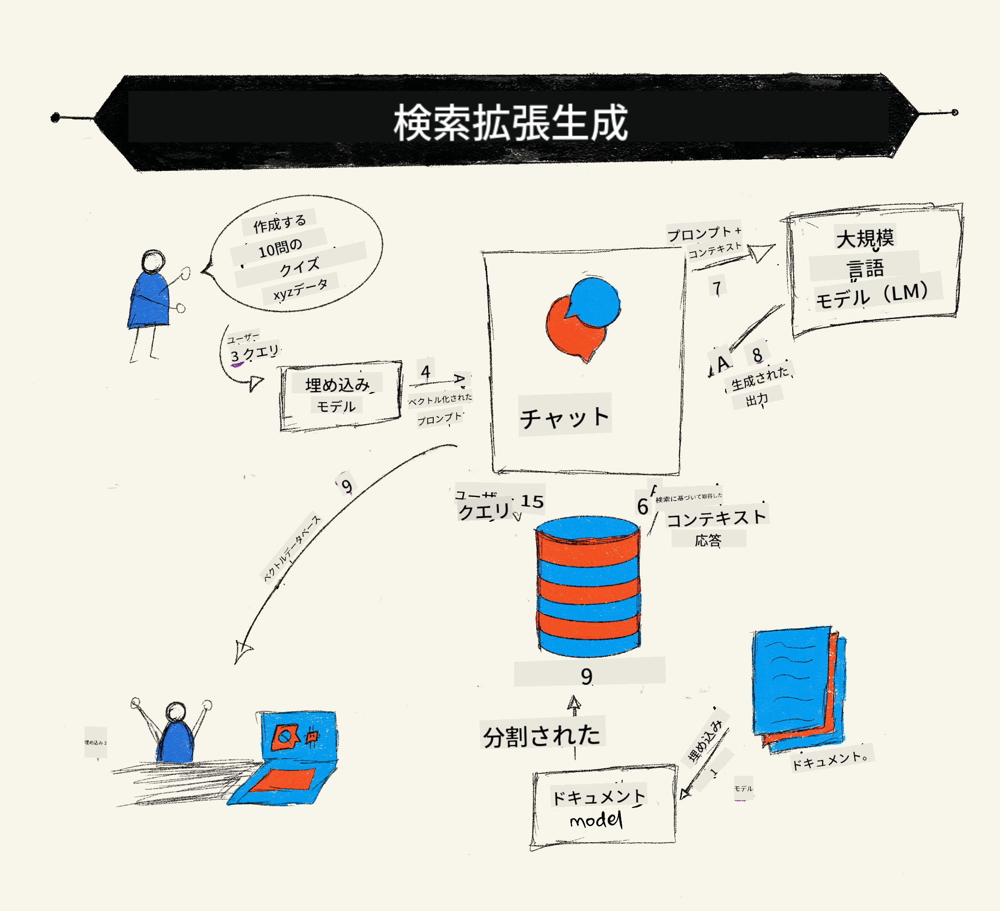
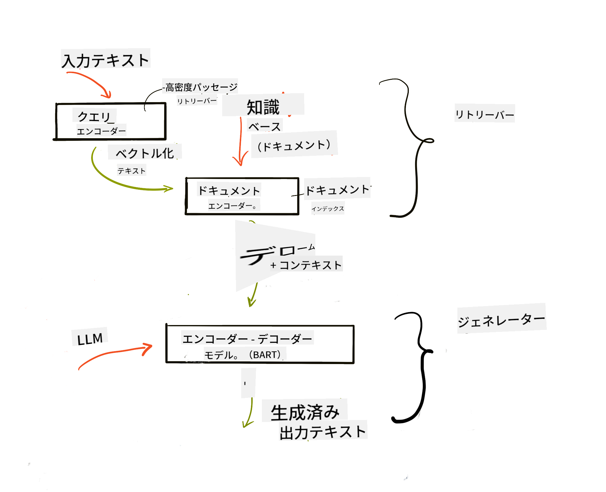
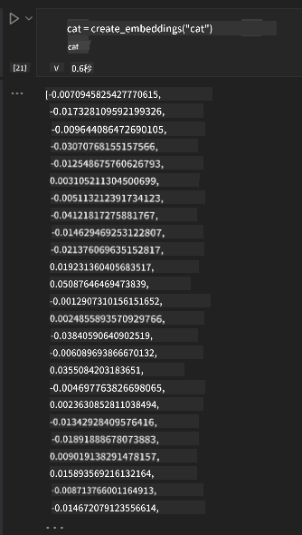

<!--
CO_OP_TRANSLATOR_METADATA:
{
  "original_hash": "e2861bbca91c0567ef32bc77fe054f9e",
  "translation_date": "2025-07-09T16:06:11+00:00",
  "source_file": "15-rag-and-vector-databases/README.md",
  "language_code": "ja"
}
-->
# Retrieval Augmented Generation (RAG) とベクトルデータベース

[](https://aka.ms/gen-ai-lesson15-gh?WT.mc_id=academic-105485-koreyst)

検索アプリケーションのレッスンでは、独自のデータを大規模言語モデル（LLM）に統合する方法を簡単に学びました。このレッスンでは、LLMアプリケーションにデータを基盤として組み込む概念、プロセスの仕組み、埋め込みやテキストを含むデータの保存方法についてさらに深掘りします。

> **動画は近日公開予定です**

## はじめに

このレッスンで扱う内容は以下の通りです：

- RAGとは何か、そしてAI（人工知能）でなぜ使われるのかの紹介

- ベクトルデータベースとは何かを理解し、アプリケーション用に作成する方法

- RAGをアプリケーションに統合する実践例

## 学習目標

このレッスンを終えた後、以下ができるようになります：

- データ検索と処理におけるRAGの重要性を説明できる

- RAGアプリケーションをセットアップし、データをLLMに基盤付けることができる

- LLMアプリケーションにおけるRAGとベクトルデータベースの効果的な統合ができる

## シナリオ：独自データでLLMを強化する

このレッスンでは、教育系スタートアップに自分たちのノートを追加し、チャットボットがさまざまな科目についてより多くの情報を得られるようにします。ノートを活用することで、学習者はより効率的に学び、異なるトピックを理解しやすくなり、試験の復習も楽になります。シナリオ作成には以下を使用します：

- `Azure OpenAI:` チャットボット作成に使うLLM

- `AI for beginners' lesson on Neural Networks:` LLMの基盤となるデータ

- `Azure AI Search` と `Azure Cosmos DB:` データを保存し検索インデックスを作成するベクトルデータベース

ユーザーはノートから練習問題を作成したり、復習用のフラッシュカードを作ったり、要約して簡潔な概要を得ることができます。まずはRAGとは何か、その仕組みを見ていきましょう。

## Retrieval Augmented Generation (RAG)

LLMを搭載したチャットボットは、ユーザーのプロンプトに応じて応答を生成します。対話型で幅広いトピックに対応しますが、応答は提供されたコンテキストと基礎となる学習データに限定されます。例えば、GPT-4の知識カットオフは2021年9月であり、それ以降の出来事は知りません。また、LLMの学習に使われるデータには、個人のメモや企業の製品マニュアルなどの機密情報は含まれていません。

### RAG（Retrieval Augmented Generation）の仕組み



例えば、ノートからクイズを作成するチャットボットを展開したい場合、知識ベースへの接続が必要です。ここでRAGが役立ちます。RAGの動作は以下の通りです：

- **知識ベース:** 検索前に文書を取り込み、前処理を行います。通常は大きな文書を小さなチャンクに分割し、テキスト埋め込みに変換してデータベースに保存します。

- **ユーザーの質問:** ユーザーが質問をします

- **検索:** ユーザーの質問に対し、埋め込みモデルが知識ベースから関連情報を取得し、プロンプトに組み込みます。

- **拡張生成:** LLMは取得したデータを基に応答を強化します。これにより、事前学習データだけでなく、追加されたコンテキストに基づく関連情報を含んだ応答が生成されます。LLMはユーザーの質問に対して回答を返します。



RAGのアーキテクチャは、エンコーダーとデコーダーの2つの部分からなるトランスフォーマーモデルで実装されます。例えば、ユーザーが質問すると、入力テキストは単語の意味を捉えたベクトルに「エンコード」され、そのベクトルは文書インデックスに「デコード」され、ユーザーの質問に基づく新しいテキストが生成されます。LLMはエンコーダー・デコーダーモデルの両方を使って出力を生成します。

提案された論文[Retrieval-Augmented Generation for Knowledge intensive NLP Tasks](https://arxiv.org/pdf/2005.11401.pdf?WT.mc_id=academic-105485-koreyst)によると、RAGの実装には以下の2つのアプローチがあります：

- **_RAG-Sequence_**：取得した文書を使ってユーザーの質問に対する最適な回答を予測する

- **RAG-Token**：文書を使って次のトークンを生成し、それを繰り返してユーザーの質問に答える

### なぜRAGを使うのか？

- **情報の豊富さ:** テキスト応答が最新かつ現状に即していることを保証します。これにより、特定のドメインに特化したタスクの性能が向上します。

- **虚偽情報の削減:** 知識ベースの**検証可能なデータ**を利用して、ユーザーの質問に対するコンテキストを提供します。

- **コスト効率:** LLMのファインチューニングよりも経済的です。

## 知識ベースの作成

今回のアプリケーションは、個人のデータ、つまり「AI For Beginners」のニューラルネットワークレッスンに基づいています。

### ベクトルデータベース

ベクトルデータベースは、従来のデータベースとは異なり、埋め込みベクトルを保存・管理・検索するために特化したデータベースです。文書の数値的表現を保存します。データを数値の埋め込みに分解することで、AIシステムがデータを理解しやすくなります。

LLMは入力できるトークン数に制限があるため、埋め込み全体を一度に渡すことはできません。そこで、埋め込みをチャンクに分割し、ユーザーの質問に最も関連する埋め込みをプロンプトと一緒に返します。チャンク化はLLMに渡すトークン数を減らし、コスト削減にもつながります。

代表的なベクトルデータベースには、Azure Cosmos DB、Clarifyai、Pinecone、Chromadb、ScaNN、Qdrant、DeepLakeなどがあります。Azure CLIを使ってAzure Cosmos DBモデルを作成するには以下のコマンドを使います：

```bash
az login
az group create -n <resource-group-name> -l <location>
az cosmosdb create -n <cosmos-db-name> -r <resource-group-name>
az cosmosdb list-keys -n <cosmos-db-name> -g <resource-group-name>
```

### テキストから埋め込みへ

データを保存する前に、テキストをベクトル埋め込みに変換する必要があります。大きな文書や長いテキストの場合、予想されるクエリに基づいてチャンク化できます。チャンク化は文単位や段落単位で行えます。チャンクは周囲の単語から意味を導き出すため、文書タイトルやチャンクの前後のテキストなど、追加のコンテキストを加えることも可能です。チャンク化の例は以下の通りです：

```python
def split_text(text, max_length, min_length):
    words = text.split()
    chunks = []
    current_chunk = []

    for word in words:
        current_chunk.append(word)
        if len(' '.join(current_chunk)) < max_length and len(' '.join(current_chunk)) > min_length:
            chunks.append(' '.join(current_chunk))
            current_chunk = []

    # If the last chunk didn't reach the minimum length, add it anyway
    if current_chunk:
        chunks.append(' '.join(current_chunk))

    return chunks
```

チャンク化した後は、さまざまな埋め込みモデルを使ってテキストを埋め込みます。利用可能なモデルには、word2vec、OpenAIのada-002、Azure Computer Visionなどがあります。選択するモデルは、使用言語、エンコードするコンテンツの種類（テキスト／画像／音声）、入力サイズ、埋め込み出力の長さによって異なります。

OpenAIの`text-embedding-ada-002`モデルで埋め込んだテキストの例：


## 検索とベクトル検索

ユーザーが質問すると、リトリーバーはクエリエンコーダーを使って質問をベクトルに変換し、文書検索インデックスから関連するベクトルを探します。検索が終わると、入力ベクトルと文書ベクトルをテキストに変換し、LLMに渡します。

### 検索

検索は、検索条件を満たす文書をインデックスから素早く見つける処理です。リトリーバーの目的は、LLMにコンテキストを提供し、データに基づいた応答を可能にする文書を取得することです。

データベース内の検索方法には以下があります：

- **キーワード検索** - テキスト検索に使用

- **セマンティック検索** - 単語の意味に基づく検索

- **ベクトル検索** - 埋め込みモデルを使って文書をベクトル表現に変換し、ユーザーの質問に最も近いベクトルを持つ文書を検索

- **ハイブリッド検索** - キーワード検索とベクトル検索の組み合わせ

検索の課題は、データベースに類似する回答がない場合、システムは最善の情報を返しますが、関連性の最大距離を設定したり、キーワード検索とベクトル検索を組み合わせたハイブリッド検索を使うことで改善できます。このレッスンではハイブリッド検索を使い、チャンクと埋め込みを含むデータフレームにデータを保存します。

### ベクトル類似度

リトリーバーは知識データベース内で近い埋め込みを検索します。最も近い隣接ベクトルは類似したテキストを表します。ユーザーの質問はまず埋め込みに変換され、類似する埋め込みとマッチングされます。類似度の測定には、2つのベクトル間の角度に基づくコサイン類似度が一般的に使われます。

他の類似度測定方法としては、ベクトルの端点間の直線距離を測るユークリッド距離や、対応する要素の積の和を測るドット積があります。

### 検索インデックス

検索を行う前に、知識ベースの検索インデックスを作成する必要があります。インデックスは埋め込みを保存し、大規模なデータベースでも最も類似したチャンクを素早く取得できます。ローカルでインデックスを作成するには以下を使います：

```python
from sklearn.neighbors import NearestNeighbors

embeddings = flattened_df['embeddings'].to_list()

# Create the search index
nbrs = NearestNeighbors(n_neighbors=5, algorithm='ball_tree').fit(embeddings)

# To query the index, you can use the kneighbors method
distances, indices = nbrs.kneighbors(embeddings)
```

### 再ランキング

データベースをクエリした後、結果を関連度の高い順に並べ替える必要があります。再ランキングLLMは機械学習を使い、検索結果の関連性を向上させ、最も関連性の高いものから順に並べます。Azure AI Searchでは、セマンティック再ランキングが自動で行われます。近傍法を使った再ランキングの例：

```python
# Find the most similar documents
distances, indices = nbrs.kneighbors([query_vector])

index = []
# Print the most similar documents
for i in range(3):
    index = indices[0][i]
    for index in indices[0]:
        print(flattened_df['chunks'].iloc[index])
        print(flattened_df['path'].iloc[index])
        print(flattened_df['distances'].iloc[index])
    else:
        print(f"Index {index} not found in DataFrame")
```

## まとめて実装する

最後に、LLMを組み込んでデータに基づいた応答を得られるようにします。実装例は以下の通りです：

```python
user_input = "what is a perceptron?"

def chatbot(user_input):
    # Convert the question to a query vector
    query_vector = create_embeddings(user_input)

    # Find the most similar documents
    distances, indices = nbrs.kneighbors([query_vector])

    # add documents to query  to provide context
    history = []
    for index in indices[0]:
        history.append(flattened_df['chunks'].iloc[index])

    # combine the history and the user input
    history.append(user_input)

    # create a message object
    messages=[
        {"role": "system", "content": "You are an AI assistant that helps with AI questions."},
        {"role": "user", "content": history[-1]}
    ]

    # use chat completion to generate a response
    response = openai.chat.completions.create(
        model="gpt-4",
        temperature=0.7,
        max_tokens=800,
        messages=messages
    )

    return response.choices[0].message

chatbot(user_input)
```

## アプリケーションの評価

### 評価指標

- 応答の質：自然で流暢、人間らしいかどうか

- データの基盤性：応答が提供された文書に基づいているかどうか

- 関連性：応答が質問に合致し関連しているかどうか

- 流暢さ：文法的に意味が通っているかどうか

## RAG（Retrieval Augmented Generation）とベクトルデータベースの活用例

関数呼び出しでアプリを改善できるさまざまなユースケースがあります：

- 質問応答：社内データを基盤にしたチャットで従業員が質問できるようにする

- レコメンデーションシステム：映画やレストランなど、最も類似した価値をマッチングするシステムを作成

- チャットボットサービス：チャット履歴を保存し、ユーザーデータに基づいて会話をパーソナライズ

- ベクトル埋め込みを使った画像検索：画像認識や異常検知に有用

## まとめ

RAGの基本的な部分、データの追加、ユーザーの質問、出力について学びました。RAGの作成を簡単にするために、Semanti Kernel、Langchain、Autogenなどのフレームワークを利用できます。

## 課題

Retrieval Augmented Generation (RAG) の学習を続けるために、以下を作成してみましょう：

- お好きなフレームワークを使ってアプリケーションのフロントエンドを構築する

- LangChainまたはSemantic Kernelのいずれかのフレームワークを利用してアプリケーションを再構築する

レッスン修了おめでとうございます 👏

## 学びはここで終わりません、旅を続けましょう

このレッスンを終えたら、[Generative AI Learning collection](https://aka.ms/genai-collection?WT.mc_id=academic-105485-koreyst)でさらにジェネレーティブAIの知識を深めていきましょう！

**免責事項**：  
本書類はAI翻訳サービス「[Co-op Translator](https://github.com/Azure/co-op-translator)」を使用して翻訳されました。正確性の向上に努めておりますが、自動翻訳には誤りや不正確な部分が含まれる可能性があります。原文の言語によるオリジナル文書が正式な情報源とみなされるべきです。重要な情報については、専門の人間による翻訳を推奨します。本翻訳の利用により生じたいかなる誤解や誤訳についても、当方は責任を負いかねます。