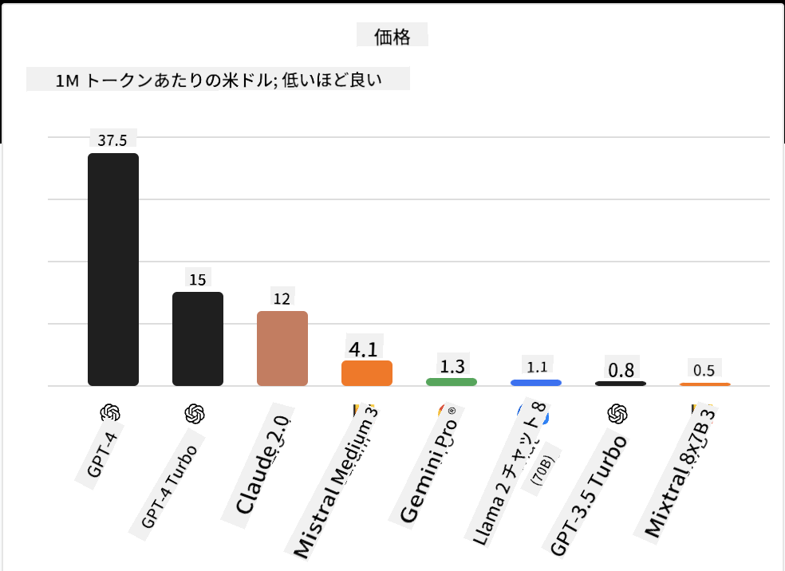
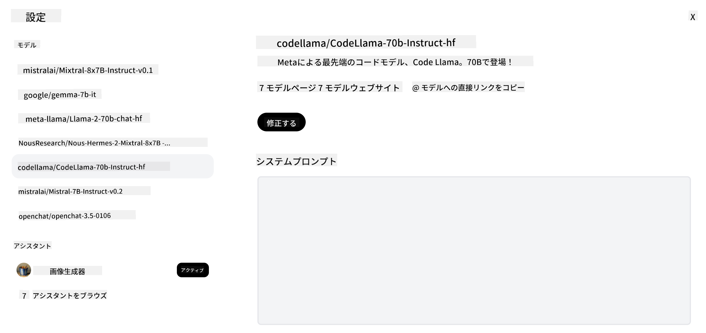
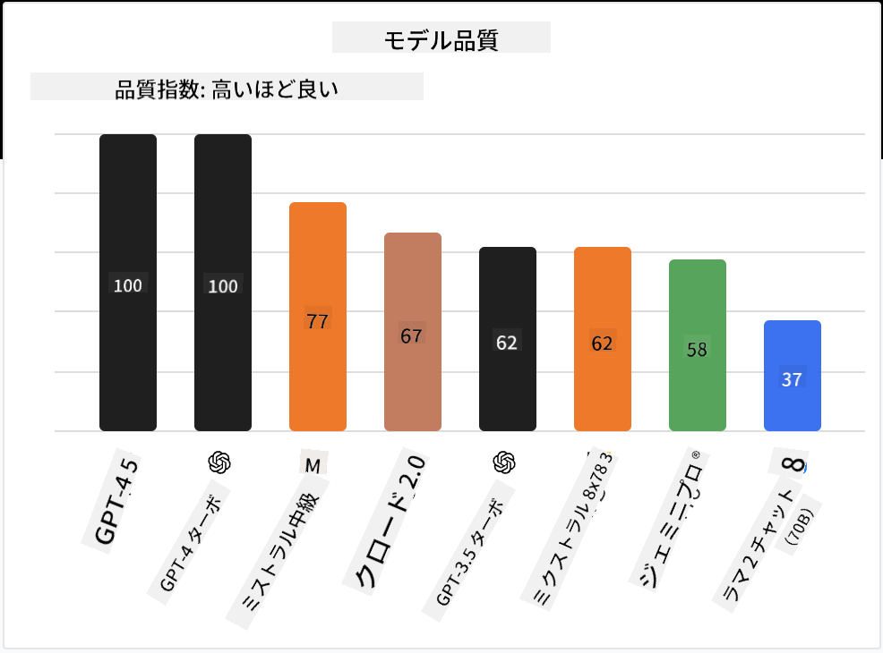

<!--
CO_OP_TRANSLATOR_METADATA:
{
  "original_hash": "0bba96e53ab841d99db731892a51fab8",
  "translation_date": "2025-05-20T06:49:49+00:00",
  "source_file": "16-open-source-models/README.md",
  "language_code": "ja"
}
-->

## はじめに

オープンソースLLMの世界は、刺激的で常に進化しています。このレッスンでは、オープンソースモデルについて詳しく見ていきます。独自モデルとオープンソースモデルの比較について知りたい方は、「[異なるLLMの探索と比較](../02-exploring-and-comparing-different-llms/README.md?WT.mc_id=academic-105485-koreyst)」のレッスンをご覧ください。このレッスンではファインチューニングについても触れますが、詳細な説明は「[LLMのファインチューニング](../18-fine-tuning/README.md?WT.mc_id=academic-105485-koreyst)」のレッスンにあります。

## 学習目標

- オープンソースモデルの理解を深める
- オープンソースモデルを使用することの利点を理解する
- Hugging FaceやAzure AI Studioで利用可能なオープンモデルを探求する

## オープンソースモデルとは？

オープンソースソフトウェアは、さまざまな分野で技術の成長に重要な役割を果たしてきました。オープンソースイニシアティブ（OSI）は、ソフトウェアをオープンソースとして分類するための[10の基準](https://web.archive.org/web/20241126001143/https://opensource.org/osd?WT.mc_id=academic-105485-koreyst)を定義しています。ソースコードは、OSIが承認したライセンスの下でオープンに共有されなければなりません。

LLMの開発にはソフトウェア開発と似た要素がありますが、プロセスは完全に同じではありません。このため、LLMの文脈でのオープンソースの定義についてコミュニティで多くの議論がなされています。モデルが伝統的なオープンソースの定義に一致するためには、次の情報が公開されている必要があります。

- モデルの訓練に使用されたデータセット。
- 訓練の一部としての完全なモデルの重み。
- 評価コード。
- ファインチューニングコード。
- 完全なモデルの重みと訓練メトリクス。

現在、この基準を満たすモデルはごくわずかです。Allen Institute for Artificial Intelligence (AllenAI) が作成した[OLMoモデル](https://huggingface.co/allenai/OLMo-7B?WT.mc_id=academic-105485-koreyst)はこのカテゴリーに入ります。

このレッスンでは、執筆時点で上記の基準を満たしていない可能性があるため、以降は「オープンモデル」と呼びます。

## オープンモデルの利点

**高度にカスタマイズ可能** - オープンモデルは詳細な訓練情報と共に公開されているため、研究者や開発者はモデルの内部を修正することができます。これにより、特定のタスクや研究分野に特化した高度に専門化されたモデルを作成することができます。例としては、コード生成、数学的操作、生物学などがあります。

**コスト** - これらのモデルを使用および展開する際のトークンごとのコストは、独自モデルよりも低くなります。生成AIアプリケーションを構築する際には、使用ケースにおける性能と価格を比較することが重要です。

 出典: Artificial Analysis

**柔軟性** - オープンモデルを使用すると、異なるモデルを使用したり組み合わせたりする柔軟性が得られます。例としては、ユーザーインターフェースで使用するモデルを直接選択できる[HuggingChat Assistants](https://huggingface.co/chat?WT.mc_id=academic-105485-koreyst)があります。

## さまざまなオープンモデルの探索

### Llama 2

Metaが開発した[LLama2](https://huggingface.co/meta-llama?WT.mc_id=academic-105485-koreyst)は、チャットベースのアプリケーションに最適化されたオープンモデルです。これは、大量の対話と人間のフィードバックを含むファインチューニング手法によるものです。この手法により、モデルは人間の期待により一致した結果を生成し、より良いユーザーエクスペリエンスを提供します。

Llamaのファインチューニング版の例としては、日本語に特化した[Japanese Llama](https://huggingface.co/elyza/ELYZA-japanese-Llama-2-7b?WT.mc_id=academic-105485-koreyst)や、ベースモデルを強化した[Llama Pro](https://huggingface.co/TencentARC/LLaMA-Pro-8B?WT.mc_id=academic-105485-koreyst)があります。

### Mistral

[Mistral](https://huggingface.co/mistralai?WT.mc_id=academic-105485-koreyst)は、高性能と効率に強く焦点を当てたオープンモデルです。Mixture-of-Expertsアプローチを使用しており、特定の入力に応じて選択される専門家モデルのグループを1つのシステムに組み合わせています。これにより、モデルは専門とする入力にのみ対応するため、計算がより効率的になります。

Mistralのファインチューニング版の例としては、医療分野に焦点を当てた[BioMistral](https://huggingface.co/BioMistral/BioMistral-7B?text=Mon+nom+est+Thomas+et+mon+principal?WT.mc_id=academic-105485-koreyst)や、数学的計算を行う[OpenMath Mistral](https://huggingface.co/nvidia/OpenMath-Mistral-7B-v0.1-hf?WT.mc_id=academic-105485-koreyst)があります。

### Falcon

[Falcon](https://huggingface.co/tiiuae?WT.mc_id=academic-105485-koreyst)は、技術革新研究所（**TII**）によって作成されたLLMです。Falcon-40Bは、40億のパラメータで訓練されており、GPT-3よりも少ない計算予算でより良い性能を示しています。これは、FlashAttentionアルゴリズムとマルチクエリアテンションを使用して推論時のメモリ要件を削減しているためです。この推論時間の短縮により、Falcon-40Bはチャットアプリケーションに適しています。

Falconのファインチューニング版の例としては、オープンモデルに基づいて構築されたアシスタントである[OpenAssistant](https://huggingface.co/OpenAssistant/falcon-40b-sft-top1-560?WT.mc_id=academic-105485-koreyst)や、ベースモデルよりも高性能を発揮する[GPT4ALL](https://huggingface.co/nomic-ai/gpt4all-falcon?WT.mc_id=academic-105485-koreyst)があります。

## 選び方

オープンモデルを選ぶ際に一つの答えはありません。Azure AI Studioのタスク別フィルター機能を使用することから始めると良いでしょう。これにより、モデルがどのようなタスクに訓練されているかを理解するのに役立ちます。Hugging Faceはまた、特定のメトリクスに基づいて最も性能の良いモデルを示すLLMリーダーボードを維持しています。

異なるタイプのLLMを比較したい場合、[Artificial Analysis](https://artificialanalysis.ai/?WT.mc_id=academic-105485-koreyst)も素晴らしいリソースです。

 出典: Artificial Analysis

特定の使用ケースに取り組んでいる場合、同じ分野に焦点を当てたファインチューニング版を探すことが効果的です。複数のオープンモデルを試して、あなたとユーザーの期待に応じてどのように性能を発揮するかを確認することも良い実践です。

## 次のステップ

オープンモデルの最も良い点は、すぐに作業を始められることです。[Azure AI Studio Model Catalog](https://ai.azure.com?WT.mc_id=academic-105485-koreyst)をチェックしてみてください。ここには、ここで取り上げたモデルを含む特定のHugging Faceコレクションがあります。

## 学習はここで終わりません。旅を続けましょう

このレッスンを終えた後、[Generative AI Learning collection](https://aka.ms/genai-collection?WT.mc_id=academic-105485-koreyst)をチェックして、Generative AIの知識をさらに向上させましょう！

**免責事項**:  
この文書は、AI翻訳サービス[Co-op Translator](https://github.com/Azure/co-op-translator)を使用して翻訳されています。正確さを期すために努めていますが、自動翻訳には誤りや不正確さが含まれる場合があります。元の言語での文書を正式な情報源として考慮してください。重要な情報については、専門の人間による翻訳をお勧めします。この翻訳の使用に起因する誤解や誤訳について、当社は責任を負いません。