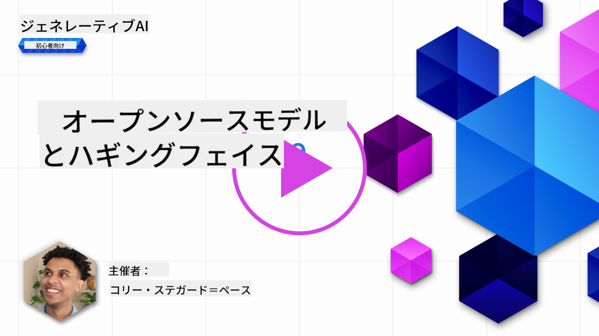
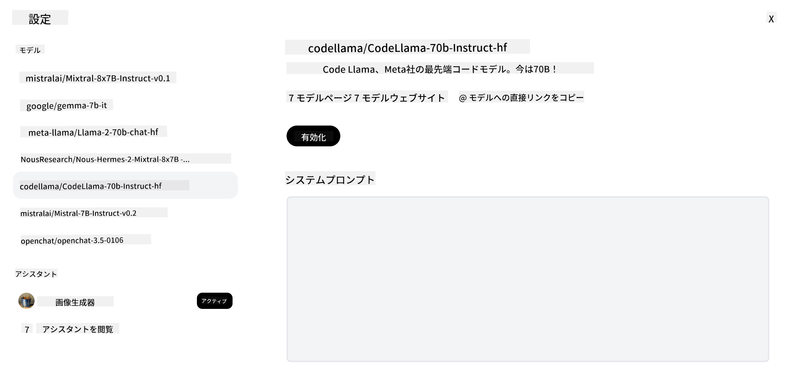

<!--
CO_OP_TRANSLATOR_METADATA:
{
  "original_hash": "0bba96e53ab841d99db731892a51fab8",
  "translation_date": "2025-07-09T17:06:05+00:00",
  "source_file": "16-open-source-models/README.md",
  "language_code": "ja"
}
-->

## はじめに

オープンソースのLLMの世界は刺激的で常に進化しています。このレッスンでは、オープンソースモデルについて詳しく解説します。もし、プロプライエタリモデルとオープンソースモデルの比較に関心がある場合は、[「さまざまなLLMの探索と比較」レッスン](../02-exploring-and-comparing-different-llms/README.md?WT.mc_id=academic-105485-koreyst)をご覧ください。また、このレッスンではファインチューニングについても触れますが、より詳しい説明は[「LLMのファインチューニング」レッスン](../18-fine-tuning/README.md?WT.mc_id=academic-105485-koreyst)で確認できます。

## 学習目標

- オープンソースモデルの理解を深める
- オープンソースモデルを使うメリットを理解する
- Hugging FaceやAzure AI Studioで利用可能なオープンモデルを探る

## オープンソースモデルとは？

オープンソースソフトウェアは、さまざまな分野で技術の発展に重要な役割を果たしてきました。Open Source Initiative（OSI）は、ソフトウェアがオープンソースと認められるための[10の基準](https://web.archive.org/web/20241126001143/https://opensource.org/osd?WT.mc_id=academic-105485-koreyst)を定めています。ソースコードはOSIが承認したライセンスのもとで公開されている必要があります。

LLMの開発はソフトウェア開発と似た要素を持ちますが、完全に同じプロセスではありません。このため、LLMの文脈でのオープンソースの定義についてコミュニティ内で多くの議論がされています。伝統的なオープンソースの定義に沿うモデルであれば、以下の情報が公開されているべきです：

- モデルの学習に使われたデータセット
- 学習済みの完全なモデルの重み
- 評価用のコード
- ファインチューニング用のコード
- モデルの重みと学習時のメトリクス全て

現在、この基準を満たすモデルはごくわずかです。[Allen Institute for Artificial Intelligence (AllenAI) が作成した OLMo モデル](https://huggingface.co/allenai/OLMo-7B?WT.mc_id=academic-105485-koreyst)がその一例です。

本レッスンでは、執筆時点で上記の基準を完全に満たしていない場合もあるため、これらのモデルを「オープンモデル」と呼びます。

## オープンモデルのメリット

**高いカスタマイズ性** - オープンモデルは詳細な学習情報とともに公開されているため、研究者や開発者はモデルの内部を自由に改変できます。これにより、特定のタスクや分野に特化した高度に専門化されたモデルを作成可能です。例としては、コード生成、数学的演算、生物学などがあります。

**コスト** - これらのモデルの利用や展開にかかるトークンあたりのコストは、プロプライエタリモデルよりも低くなっています。ジェネレーティブAIアプリケーションを構築する際は、パフォーマンスと価格のバランスを考慮してモデルを選ぶことが重要です。

  
出典: Artificial Analysis

**柔軟性** - オープンモデルを使うことで、異なるモデルを使い分けたり組み合わせたりする柔軟性が得られます。例えば、[HuggingChat Assistants](https://huggingface.co/chat?WT.mc_id=academic-105485-koreyst)では、ユーザーがUI上で直接使用するモデルを選択できます。

## さまざまなオープンモデルの紹介

### Llama 2

[Metaが開発したLlama2](https://huggingface.co/meta-llama?WT.mc_id=academic-105485-koreyst)は、チャットベースのアプリケーションに最適化されたオープンモデルです。これは、大量の対話データと人間のフィードバックを用いたファインチューニング手法によるものです。この方法により、モデルは人間の期待により沿った結果を出し、より良いユーザー体験を提供します。

Llamaのファインチューニング版の例としては、日本語に特化した[Japanese Llama](https://huggingface.co/elyza/ELYZA-japanese-Llama-2-7b?WT.mc_id=academic-105485-koreyst)や、ベースモデルを強化した[Llama Pro](https://huggingface.co/TencentARC/LLaMA-Pro-8B?WT.mc_id=academic-105485-koreyst)があります。

### Mistral

[Mistral](https://huggingface.co/mistralai?WT.mc_id=academic-105485-koreyst)は、高性能と効率性に重点を置いたオープンモデルです。Mixture-of-Experts（専門家混合）アプローチを採用しており、複数の専門モデルを組み合わせ、入力に応じて特定のモデルを選択して処理します。これにより、専門分野に特化したモデルだけが計算を行うため、効率的な処理が可能です。

Mistralのファインチューニング版の例には、医療分野に特化した[BioMistral](https://huggingface.co/BioMistral/BioMistral-7B?text=Mon+nom+est+Thomas+et+mon+principal?WT.mc_id=academic-105485-koreyst)や、数学的計算を行う[OpenMath Mistral](https://huggingface.co/nvidia/OpenMath-Mistral-7B-v0.1-hf?WT.mc_id=academic-105485-koreyst)があります。

### Falcon

[Falcon](https://huggingface.co/tiiuae?WT.mc_id=academic-105485-koreyst)はTechnology Innovation Institute（**TII**）によって作られたLLMです。Falcon-40Bは400億パラメータで学習されており、GPT-3よりも少ない計算リソースで高い性能を発揮すると示されています。これはFlashAttentionアルゴリズムとマルチクエリアテンションを活用し、推論時のメモリ使用量を削減しているためです。推論時間が短縮されているため、Falcon-40Bはチャットアプリケーションに適しています。

Falconのファインチューニング版の例には、オープンモデルをベースにしたアシスタントである[OpenAssistant](https://huggingface.co/OpenAssistant/falcon-40b-sft-top1-560?WT.mc_id=academic-105485-koreyst)や、ベースモデルより高性能な[GPT4ALL](https://huggingface.co/nomic-ai/gpt4all-falcon?WT.mc_id=academic-105485-koreyst)があります。

## モデルの選び方

オープンモデルの選択に正解はありません。まずはAzure AI Studioのタスク別フィルター機能を使って、モデルがどのようなタスクに対応しているかを確認するのが良いでしょう。Hugging Faceも特定のメトリクスに基づくLLMリーダーボードを管理しており、性能の高いモデルを知ることができます。

異なるタイプのLLMを比較したい場合は、[Artificial Analysis](https://artificialanalysis.ai/?WT.mc_id=academic-105485-koreyst)も優れたリソースです。

  
出典: Artificial Analysis

特定のユースケースに取り組む場合は、同じ分野に特化したファインチューニング版を探すのが効果的です。また、複数のオープンモデルを試して、自分やユーザーの期待にどのように応えるかを比較するのも良い方法です。

## 次のステップ

オープンモデルの最大の魅力は、すぐに使い始められることです。ここで紹介したモデルを含むHugging Faceのコレクションがある[Azure AI Studio Model Catalog](https://ai.azure.com?WT.mc_id=academic-105485-koreyst)をぜひチェックしてみてください。

## 学びはここで終わらない、旅を続けよう

このレッスンを終えたら、[Generative AI Learning collection](https://aka.ms/genai-collection?WT.mc_id=academic-105485-koreyst)でジェネレーティブAIの知識をさらに深めていきましょう！

**免責事項**：  
本書類はAI翻訳サービス「[Co-op Translator](https://github.com/Azure/co-op-translator)」を使用して翻訳されました。正確性の向上に努めておりますが、自動翻訳には誤りや不正確な部分が含まれる可能性があります。原文の言語によるオリジナル文書が正式な情報源とみなされるべきです。重要な情報については、専門の人間による翻訳を推奨します。本翻訳の利用により生じたいかなる誤解や誤訳についても、当方は責任を負いかねます。