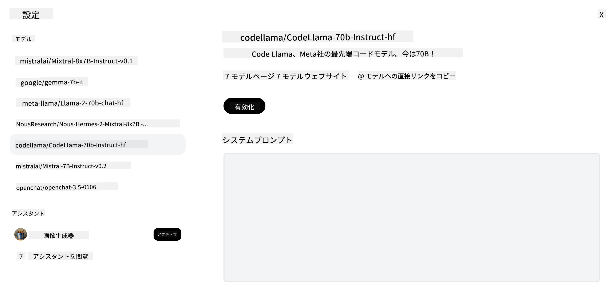

<!--
CO_OP_TRANSLATOR_METADATA:
{
  "original_hash": "0bba96e53ab841d99db731892a51fab8",
  "translation_date": "2025-06-25T23:51:28+00:00",
  "source_file": "16-open-source-models/README.md",
  "language_code": "ja"
}
-->

## はじめに

オープンソースLLMの世界は刺激的で常に進化しています。このレッスンはオープンソースモデルを深く理解することを目的としています。独自モデルとオープンソースモデルの比較に関する情報を探している場合は、「異なるLLMの探索と比較」レッスンに移動してください。このレッスンでは微調整のトピックも扱いますが、より詳細な説明は「LLMの微調整」レッスンで見つけることができます。

## 学習目標

- オープンソースモデルの理解を深める
- オープンソースモデルを使用することの利点を理解する
- Hugging FaceとAzure AI Studioで利用可能なオープンモデルを探索する

## オープンソースモデルとは？

オープンソースソフトウェアは、さまざまな分野での技術の成長に重要な役割を果たしてきました。オープンソースイニシアティブ（OSI）は、ソフトウェアをオープンソースとして分類するための10の基準を定義しています。ソースコードは、OSIによって承認されたライセンスの下でオープンに共有されなければなりません。

LLMの開発はソフトウェアの開発と似た要素がありますが、プロセスは完全に同じではありません。これにより、LLMの文脈でのオープンソースの定義についてコミュニティ内で多くの議論が生じています。モデルが従来のオープンソースの定義に合致するためには、次の情報が公に利用可能であるべきです：

- モデルの訓練に使用されたデータセット。
- 訓練の一部としての完全なモデルの重み。
- 評価コード。
- 微調整コード。
- 完全なモデルの重みと訓練メトリクス。

現在、この基準に合致するモデルはほんの数例です。Allen Institute for Artificial Intelligence (AllenAI)によって作成されたOLMoモデルがそのカテゴリーに入ります。

このレッスンでは、執筆時点で上記の基準に合致していない可能性があるため、モデルを「オープンモデル」として参照します。

## オープンモデルの利点

**高度にカスタマイズ可能** - オープンモデルは詳細な訓練情報と共に公開されているため、研究者や開発者はモデルの内部を変更できます。これにより、特定のタスクや研究分野に特化した高度に専門化されたモデルを作成することができます。コード生成、数学的操作、生物学などの例があります。

**コスト** - これらのモデルを使用および展開する際のトークンあたりのコストは、独自モデルよりも低くなります。生成AIアプリケーションを構築する際には、これらのモデルを使用する際のパフォーマンスと価格を検討する必要があります。

出典: Artificial Analysis

**柔軟性** - オープンモデルを使用することで、異なるモデルを使用したり組み合わせたりする柔軟性が得られます。ユーザーがインターフェースで直接使用するモデルを選択できるHuggingChat Assistantsの例があります：

## 異なるオープンモデルの探索

### Llama 2

Metaによって開発されたLLama2は、チャットベースのアプリケーションに最適化されたオープンモデルです。これは大量の対話と人間のフィードバックを含む微調整方法によるものです。この方法により、モデルは人間の期待に合った結果を生成し、より良いユーザー体験を提供します。

Llamaの微調整版の例として、日本語に特化したJapanese Llamaや、ベースモデルの強化版であるLlama Proがあります。

### Mistral

Mistralは高性能と効率性に重点を置いたオープンモデルです。Mixture-of-Expertsアプローチを使用し、専門家モデルのグループを一つのシステムに組み合わせ、入力に応じて特定のモデルが選択されます。これにより、モデルは専門化された入力にのみ対処するため、計算がより効果的になります。

Mistralの微調整版の例として、医療分野に焦点を当てたBioMistralや、数学的計算を行うOpenMath Mistralがあります。

### Falcon

FalconはTechnology Innovation Institute (TII)によって作成されたLLMです。Falcon-40Bは40億のパラメータで訓練され、GPT-3よりも少ない計算予算でより良い性能を示しています。これはFlashAttentionアルゴリズムと多重クエリ注意を使用することで、推論時のメモリ要件を削減することができるためです。推論時間の短縮により、Falcon-40Bはチャットアプリケーションに適しています。

Falconの微調整版の例として、オープンモデル上に構築されたアシスタントであるOpenAssistantや、ベースモデルよりも高い性能を発揮するGPT4ALLがあります。

## 選び方

オープンモデルを選ぶための唯一の答えはありません。Azure AI Studioのタスクフィルター機能を使用することから始めるのが良いでしょう。これにより、モデルがどのようなタスクに訓練されているかを理解することができます。Hugging FaceもLLMリーダーボードを維持しており、特定のメトリクスに基づいて最も性能の良いモデルを示しています。

異なるタイプのLLMを比較する際には、Artificial Analysisも優れたリソースです：

出典: Artificial Analysis

特定のユースケースに取り組む際には、同じ領域に焦点を当てた微調整版を探すことが効果的です。複数のオープンモデルを実験し、自分とユーザーの期待に応じてどのように性能を発揮するかを確認することも良い方法です。

## 次のステップ

オープンモデルの最良の部分は、すぐに作業を始められることです。Azure AI Studio Model Catalogをチェックしてみてください。ここには、ここで議論したモデルを含む特定のHugging Faceコレクションがあります。

## 学習はここで止まりません、旅を続けましょう

このレッスンを完了した後、Generative AI Learningコレクションをチェックして、Generative AIの知識をさらに高めましょう！

**免責事項**：
この文書は、AI翻訳サービス[Co-op Translator](https://github.com/Azure/co-op-translator)を使用して翻訳されています。正確性を追求していますが、自動翻訳には誤りや不正確さが含まれる可能性があることをご了承ください。元の言語での文書が信頼できる情報源と見なされるべきです。重要な情報については、専門の人間による翻訳をお勧めします。この翻訳の使用に起因する誤解や誤った解釈について、当社は責任を負いません。