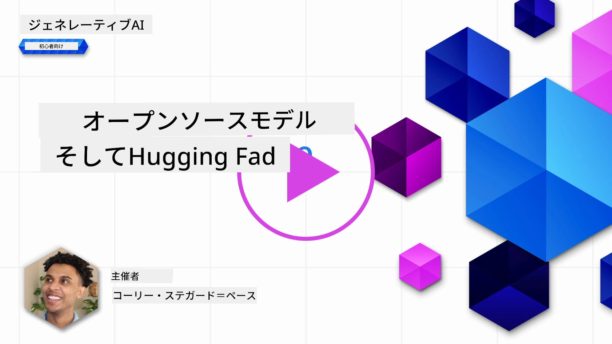
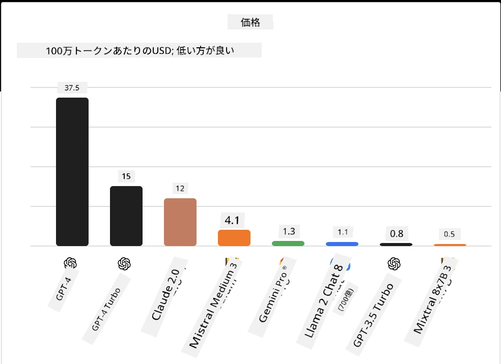
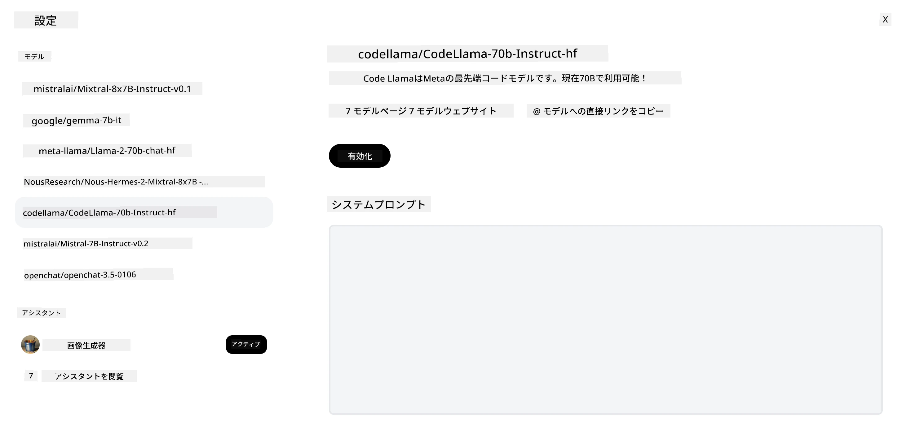
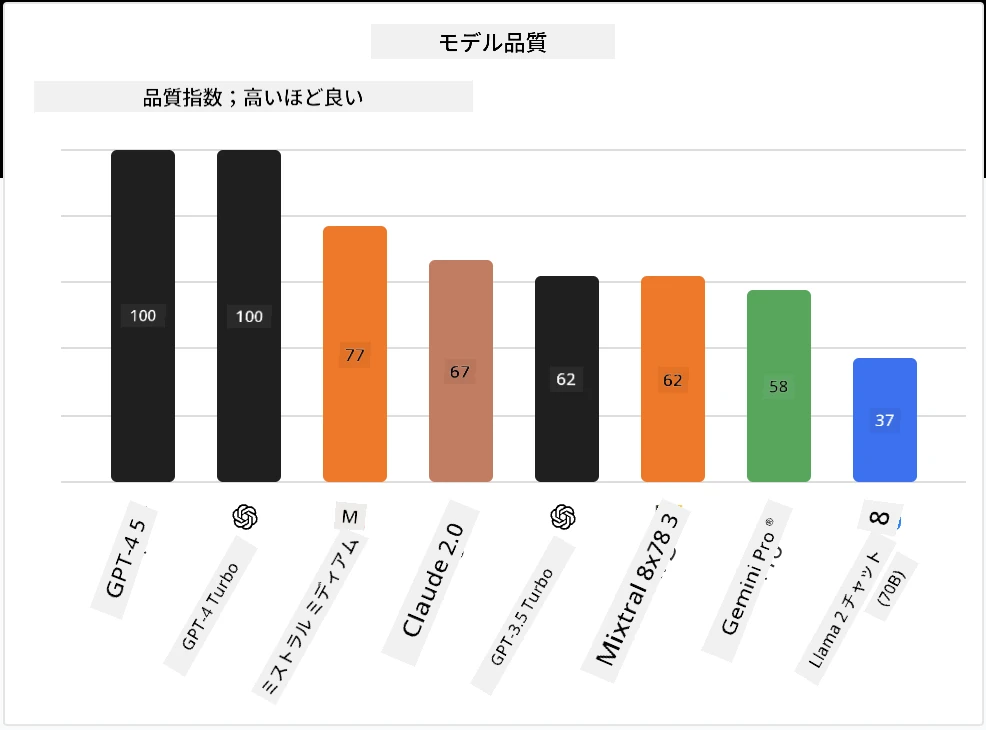

## はじめに

オープンソースLLMの世界は刺激的で常に進化しています。このレッスンではオープンソースモデルについて深く掘り下げます。独自モデルとオープンソースモデルの比較情報をお探しの場合は、[「さまざまなLLMの探索と比較」レッスン](../02-exploring-and-comparing-different-llms/README.md?WT.mc_id=academic-105485-koreyst)をご覧ください。また、このレッスンではファインチューニングの話題にも触れますが、詳しい説明は[「LLMのファインチューニング」レッスン](../18-fine-tuning/README.md?WT.mc_id=academic-105485-koreyst)にあります。

## 学習目標

- オープンソースモデルの理解を深める
- オープンソースモデルを使うことの利点を理解する
- Hugging FaceやMicrosoft Foundryのモデルカタログにあるオープンモデルを探究する

## オープンソースモデルとは何か？

オープンソースソフトウェアは様々な分野の技術発展に重要な役割を果たしています。Open Source Initiative (OSI)は[ソフトウェアのオープンソース分類基準10項目](https://web.archive.org/web/20241126001143/https://opensource.org/osd?WT.mc_id=academic-105485-koreyst)を定めています。ソースコードはOSIが承認したライセンスの下で公開されなければなりません。

LLMの開発はソフトウェア開発と似た要素がありますが、同じプロセスではありません。このためLLMの文脈におけるオープンソースの定義についてコミュニティ内で多く議論が起きています。従来のオープンソース定義に沿うモデルは、次の情報が公開されているべきです：

- モデル学習に使われたデータセット
- 学習済みモデルの完全な重み
- 評価用コード
- ファインチューニング用コード
- モデルの完全な重みと学習メトリクス

この基準を満たすモデルは現在ごくわずかです。[Allen Institute for Artificial Intelligence（AllenAI）によるOLMoモデル](https://huggingface.co/allenai/OLMo-7B?WT.mc_id=academic-105485-koreyst)がこのカテゴリに当てはまります。

本レッスンでは、記述時点で上記基準に完全には一致しない場合もあるため、これらのモデルを「オープンモデル」と呼びます。

## オープンモデルの利点

<strong>高度なカスタマイズが可能</strong> - オープンモデルは詳細な学習情報と共に公開されているため、研究者や開発者はモデル内部を変更できます。これにより特定のタスクや研究分野に特化したファインチューニング済みの高度に専門化されたモデルが作成可能です。例としてはコード生成、数学的演算、生物学などがあります。

<strong>コスト</strong> - これらのモデルのトークンごとの利用・展開コストは独自モデルよりも低いです。生成系AIアプリケーションを開発する際は、パフォーマンスと価格のバランスを考慮してこれらのモデルを検討すべきです。

出典: Artificial Analysis

<strong>柔軟性</strong> - オープンモデルを使うと、異なるモデルを使い分けたり組み合わせたりと柔軟な活用が可能です。例として[HuggingChatアシスタント](https://huggingface.co/chat?WT.mc_id=academic-105485-koreyst)ではユーザーインターフェイスから直接使用するモデルを選べます：

## さまざまなオープンモデルを探る

### Llama 2

Meta が開発した[LLama2](https://huggingface.co/meta-llama?WT.mc_id=academic-105485-koreyst)はチャット向けに最適化されたオープンモデルです。多くの対話データと人間のフィードバックを用いたファインチューニング手法により、人間の期待に沿った応答が得られ優れたユーザー体験を提供します。

Llamaをファインチューニングした例として、日本語に特化した[Japanese Llama](https://huggingface.co/elyza/ELYZA-japanese-Llama-2-7b?WT.mc_id=academic-105485-koreyst)や、ベースモデルを改良した[Llama Pro](https://huggingface.co/TencentARC/LLaMA-Pro-8B?WT.mc_id=academic-105485-koreyst)があります。

### Mistral

[Mistral](https://huggingface.co/mistralai?WT.mc_id=academic-105485-koreyst)は高性能と効率に重点を置いたオープンモデルです。Mixture-of-Experts アプローチを用い、複数の専門モデルを入力に応じて選択的に動作させることで計算効率を高めています。

Mistralのファインチューニング例には医療分野に特化した[BioMistral](https://huggingface.co/BioMistral/BioMistral-7B?text=Mon+nom+est+Thomas+et+mon+principal?WT.mc_id=academic-105485-koreyst)や数学計算に強い[OpenMath Mistral](https://huggingface.co/nvidia/OpenMath-Mistral-7B-v0.1-hf?WT.mc_id=academic-105485-koreyst)があります。

### Falcon

Technology Innovation Institute（**TII**）が開発した[Falcon](https://huggingface.co/tiiuae?WT.mc_id=academic-105485-koreyst)は40億パラメータで学習され、FlashAttentionアルゴリズムとマルチクエリアテンションを用いることで推論時のメモリ消費を抑えつつGPT-3を上回る性能を発揮します。これにより、チャットアプリケーションに適しています。

Falconのファインチューニング版として、オープンモデルベースのアシスタントである[OpenAssistant](https://huggingface.co/OpenAssistant/falcon-40b-sft-top1-560?WT.mc_id=academic-105485-koreyst)や、ベースモデルを超える性能を持つ[GPT4ALL](https://huggingface.co/nomic-ai/gpt4all-falcon?WT.mc_id=academic-105485-koreyst)があります。

## どのように選ぶか

オープンモデルの選択に単一の答えはありません。始めるにはMicrosoft Foundryモデルカタログのタスク別フィルター機能がおすすめです。モデルが対象とするタスクを把握できます。Hugging Faceも特定のメトリクスに基づくLLMリーダーボードを公開しています。

さまざまなタイプのLLMを比較する際には、[Artificial Analysis](https://artificialanalysis.ai/?WT.mc_id=academic-105485-koreyst)も優れたリソースです：

出典: Artificial Analysis

特定のユースケースに取り組む場合は、同じ分野に特化したファインチューニング済みモデルを探すのが効果的です。複数のオープンモデルを試して、自分やユーザーの期待にどう応えるかを確認するのも良い方法です。

## 次のステップ

オープンモデルの良いところは、すぐに使い始められることです。ここで紹介したモデルを集めたHugging Faceコレクションを特徴とする[Microsoft Foundryモデルカタログ](https://ai.azure.com?WT.mc_id=academic-105485-koreyst)をチェックしましょう。

## 学びはここで終わらない、旅を続けよう

このレッスンを終えたら、さらなる生成系AIの知識習得のために[Generative AI Learning collection](https://aka.ms/genai-collection?WT.mc_id=academic-105485-koreyst)をぜひご覧ください！

---

<!-- CO-OP TRANSLATOR DISCLAIMER START -->
**免責事項**：
本書類は AI 翻訳サービス [Co-op Translator](https://github.com/Azure/co-op-translator) を使用して翻訳されています。正確性を期していますが、自動翻訳には誤りや不正確な部分が含まれる可能性があることをご承知おきください。原文の原語版が正式な情報源とみなされるべきです。重要な情報については、専門の人間による翻訳を推奨します。本翻訳の利用により生じたいかなる誤解や解釈違いについても、当方は責任を負いかねます。
<!-- CO-OP TRANSLATOR DISCLAIMER END -->