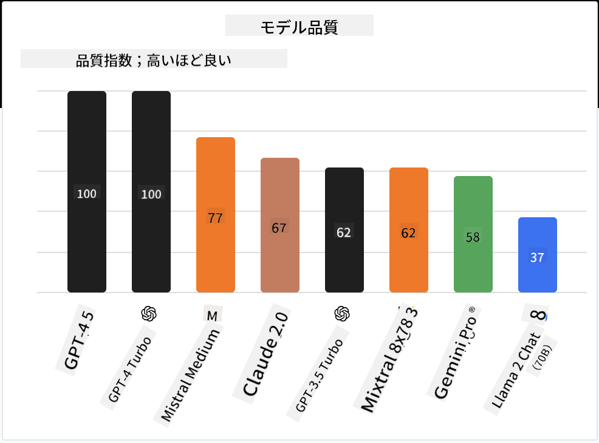

<!--
CO_OP_TRANSLATOR_METADATA:
{
  "original_hash": "a8b2d4bb727c877ebf9edff8623d16b9",
  "translation_date": "2025-09-06T10:13:23+00:00",
  "source_file": "16-open-source-models/README.md",
  "language_code": "ja"
}
-->

## はじめに

オープンソースのLLMの世界は刺激的で、常に進化しています。このレッスンでは、オープンソースモデルについて詳しく解説します。プロプライエタリモデルとオープンソースモデルの比較に関する情報を探している場合は、["Exploring and Comparing Different LLMs" lesson](../02-exploring-and-comparing-different-llms/README.md?WT.mc_id=academic-105485-koreyst)をご覧ください。また、このレッスンではファインチューニングについても触れますが、より詳細な説明は["Fine-Tuning LLMs" lesson](../18-fine-tuning/README.md?WT.mc_id=academic-105485-koreyst)で確認できます。

## 学習目標

- オープンソースモデルについて理解を深める
- オープンソースモデルを使用する利点を理解する
- Hugging FaceやAzure AI Studioで利用可能なオープンモデルを探る

## オープンソースモデルとは？

オープンソースソフトウェアは、さまざまな分野で技術の発展に重要な役割を果たしてきました。オープンソースイニシアティブ（OSI）は、ソフトウェアをオープンソースとして分類するための[10の基準](https://web.archive.org/web/20241126001143/https://opensource.org/osd?WT.mc_id=academic-105485-koreyst)を定義しています。ソースコードは、OSIが承認したライセンスの下で公開されている必要があります。

LLMの開発はソフトウェア開発と似た要素を持っていますが、プロセスは完全に同じではありません。このため、LLMの文脈でのオープンソースの定義についてコミュニティ内で多くの議論が行われています。従来のオープンソースの定義に沿ったモデルであるためには、以下の情報が公開されている必要があります：

- モデルのトレーニングに使用されたデータセット
- トレーニングの一部としての完全なモデルウェイト
- 評価コード
- ファインチューニングコード
- 完全なモデルウェイトとトレーニングメトリクス

現在、この基準を満たすモデルはごくわずかです。[Allen Institute for Artificial Intelligence (AllenAI) によって作成されたOLMoモデル](https://huggingface.co/allenai/OLMo-7B?WT.mc_id=academic-105485-koreyst)は、このカテゴリーに該当します。

このレッスンでは、執筆時点で上記の基準を満たしていない可能性があるため、以降「オープンモデル」と呼ぶことにします。

## オープンモデルの利点

**高度なカスタマイズ性** - オープンモデルは詳細なトレーニング情報とともに公開されているため、研究者や開発者はモデルの内部を変更することができます。これにより、特定のタスクや研究分野に特化したモデルを作成することが可能になります。例としては、コード生成、数学的操作、生物学などがあります。

**コスト** - これらのモデルを使用・展開する際のトークンあたりのコストは、プロプライエタリモデルよりも低くなります。生成AIアプリケーションを構築する際には、使用ケースに基づいて性能と価格を比較することが重要です。

  
出典: Artificial Analysis

**柔軟性** - オープンモデルを使用することで、異なるモデルを使用したり組み合わせたりする柔軟性が得られます。例としては、[HuggingChat Assistants](https://huggingface.co/chat?WT.mc_id=academic-105485-koreyst)では、ユーザーがインターフェース内で使用するモデルを直接選択できます：

## さまざまなオープンモデルを探る

### Llama 2

[LLama2](https://huggingface.co/meta-llama?WT.mc_id=academic-105485-koreyst)は、Metaによって開発されたオープンモデルで、チャットベースのアプリケーションに最適化されています。これは、大量の対話データと人間のフィードバックを含むファインチューニング方法によるものです。この方法により、モデルは人間の期待に沿った結果を生成し、より良いユーザー体験を提供します。

Llamaのファインチューニング版の例としては、日本語に特化した[Japanese Llama](https://huggingface.co/elyza/ELYZA-japanese-Llama-2-7b?WT.mc_id=academic-105485-koreyst)や、ベースモデルを強化した[Llama Pro](https://huggingface.co/TencentARC/LLaMA-Pro-8B?WT.mc_id=academic-105485-koreyst)があります。

### Mistral

[Mistral](https://huggingface.co/mistralai?WT.mc_id=academic-105485-koreyst)は、高性能と効率性に重点を置いたオープンモデルです。Mixture-of-Expertsアプローチを使用しており、専門モデルのグループを1つのシステムに統合し、入力に応じて特定のモデルが選択されます。この方法により、計算が効率的になり、モデルは専門分野の入力にのみ対応します。

Mistralのファインチューニング版の例としては、医療分野に特化した[BioMistral](https://huggingface.co/BioMistral/BioMistral-7B?text=Mon+nom+est+Thomas+et+mon+principal?WT.mc_id=academic-105485-koreyst)や、数学的計算を行う[OpenMath Mistral](https://huggingface.co/nvidia/OpenMath-Mistral-7B-v0.1-hf?WT.mc_id=academic-105485-koreyst)があります。

### Falcon

[Falcon](https://huggingface.co/tiiuae?WT.mc_id=academic-105485-koreyst)は、Technology Innovation Institute (**TII**)によって作成されたLLMです。Falcon-40Bは40億のパラメータでトレーニングされており、GPT-3よりも少ない計算予算で優れた性能を発揮することが示されています。これは、FlashAttentionアルゴリズムとマルチクエリアテンションを使用して推論時のメモリ要件を削減しているためです。この推論時間の短縮により、Falcon-40Bはチャットアプリケーションに適しています。

Falconのファインチューニング版の例としては、オープンモデルを基盤としたアシスタント[OpenAssistant](https://huggingface.co/OpenAssistant/falcon-40b-sft-top1-560?WT.mc_id=academic-105485-koreyst)や、ベースモデルよりも高性能を発揮する[GPT4ALL](https://huggingface.co/nomic-ai/gpt4all-falcon?WT.mc_id=academic-105485-koreyst)があります。

## 選び方

オープンモデルを選ぶための唯一の正解はありません。まずはAzure AI Studioのタスク別フィルター機能を使用するのが良いでしょう。これにより、モデルがどのようなタスクにトレーニングされているかを理解できます。Hugging Faceも、特定のメトリクスに基づいて最も性能の良いモデルを示すLLMリーダーボードを維持しています。

異なるタイプのLLMを比較する際には、[Artificial Analysis](https://artificialanalysis.ai/?WT.mc_id=academic-105485-koreyst)も優れたリソースです：

  
出典: Artificial Analysis

特定の使用ケースに取り組む場合、同じ分野に特化したファインチューニング版を探すのが効果的です。複数のオープンモデルを試して、あなたやユーザーの期待に応じた性能を確認するのも良い方法です。

## 次のステップ

オープンモデルの最大の利点は、すぐに作業を始められることです。[Azure AI Foundry Model Catalog](https://ai.azure.com?WT.mc_id=academic-105485-koreyst)をチェックしてみてください。ここには、今回取り上げたモデルを含むHugging Faceコレクションが特集されています。

## 学習はここで終わりません、旅を続けましょう

このレッスンを終えた後は、[Generative AI Learning collection](https://aka.ms/genai-collection?WT.mc_id=academic-105485-koreyst)をチェックして、生成AIの知識をさらに深めてください！

---

**免責事項**:  
この文書は、AI翻訳サービス [Co-op Translator](https://github.com/Azure/co-op-translator) を使用して翻訳されています。正確性を追求しておりますが、自動翻訳には誤りや不正確な部分が含まれる可能性があることをご承知ください。元の言語で記載された文書が正式な情報源とみなされるべきです。重要な情報については、専門の人間による翻訳を推奨します。この翻訳の使用に起因する誤解や誤った解釈について、当方は責任を負いません。