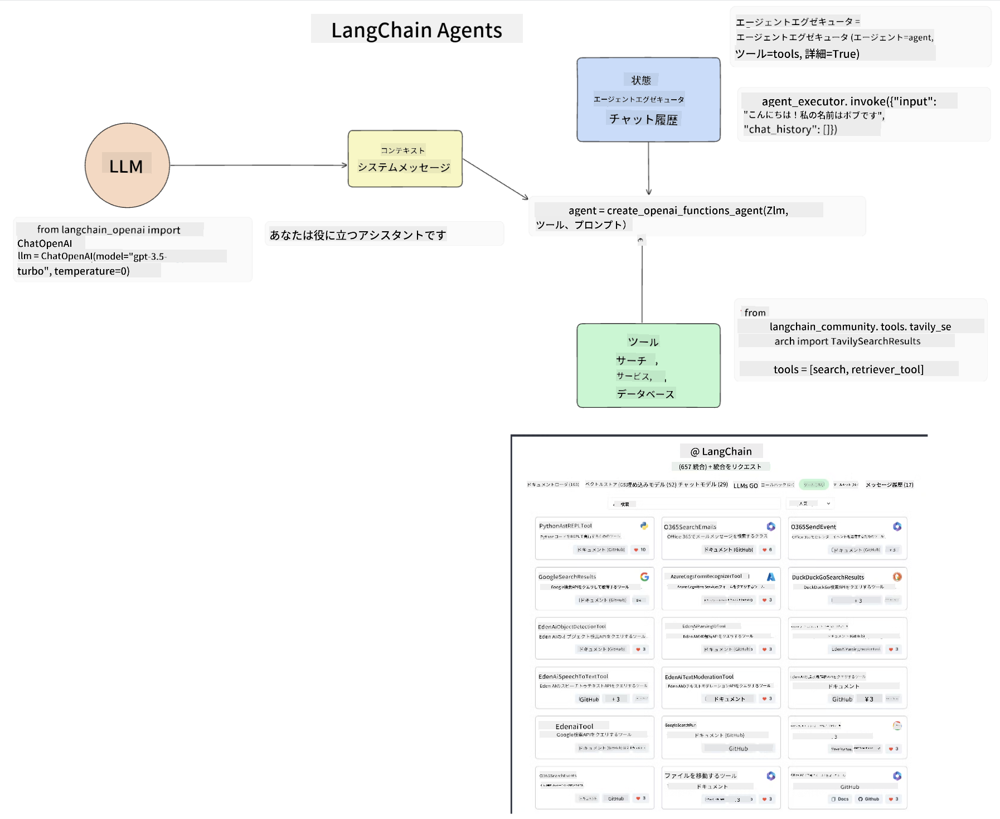
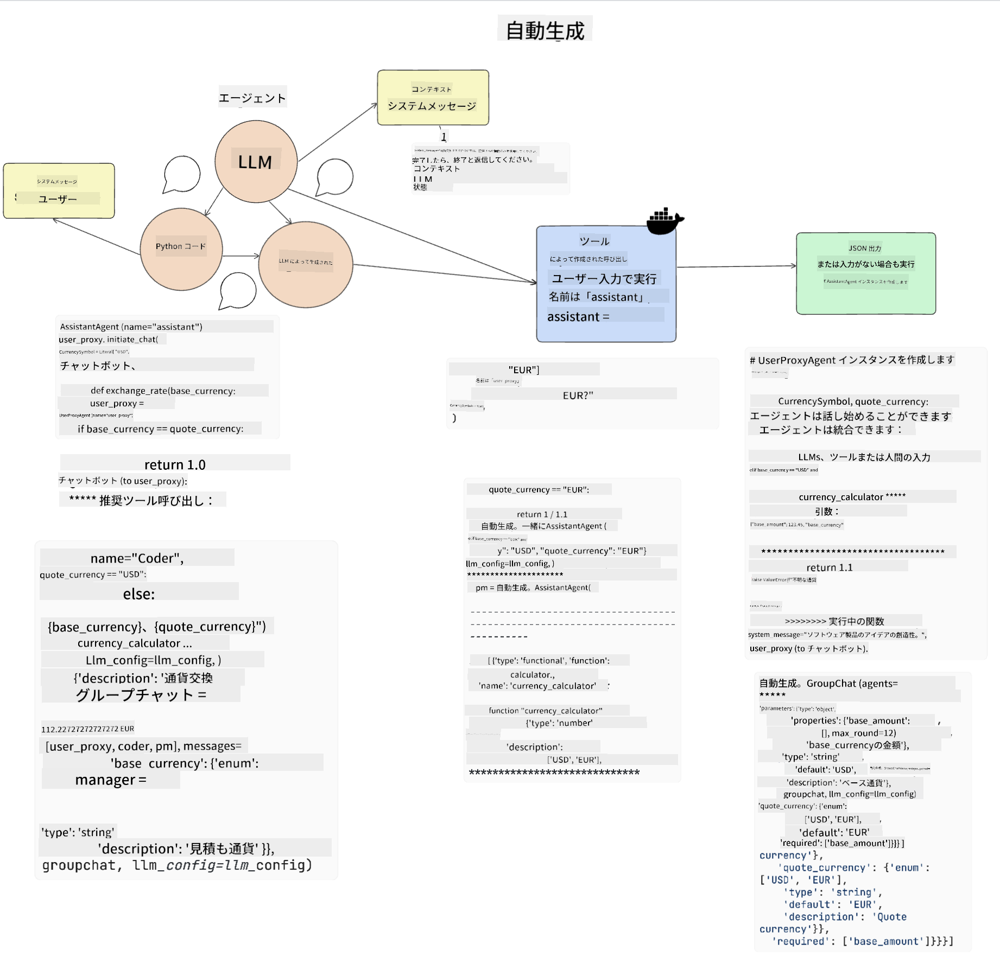
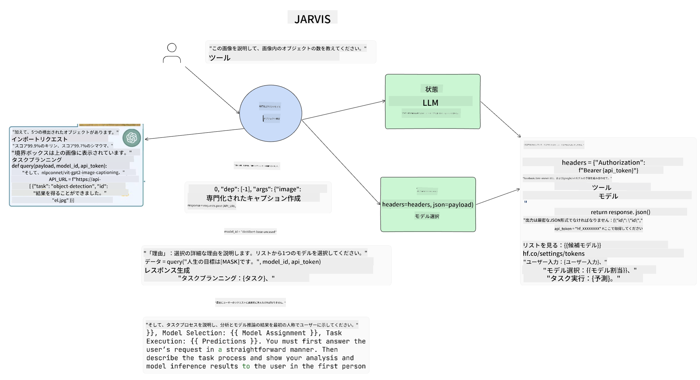

<!--
CO_OP_TRANSLATOR_METADATA:
{
  "original_hash": "11f03c81f190d9cbafd0f977dcbede6c",
  "translation_date": "2025-05-20T07:11:41+00:00",
  "source_file": "17-ai-agents/README.md",
  "language_code": "ja"
}
-->
[](https://aka.ms/gen-ai-lesson17-gh?WT.mc_id=academic-105485-koreyst)

## はじめに

AIエージェントは、生成AIの中での興味深い進展を表しており、大規模言語モデル（LLM）がアシスタントから行動を取るエージェントへと進化することを可能にします。AIエージェントフレームワークは、開発者がLLMにツールと状態管理へのアクセスを提供するアプリケーションを作成できるようにします。これらのフレームワークはまた、LLMが計画した行動をユーザーや開発者が監視できるようにすることで、エクスペリエンス管理を向上させます。

このレッスンでは、以下の領域をカバーします：

- AIエージェントとは何かを理解する - AIエージェントとは具体的に何か？
- 4つの異なるAIエージェントフレームワークを探求する - それぞれの独自性とは？
- これらのAIエージェントをさまざまなユースケースに適用する - AIエージェントをいつ使用すべきか？

## 学習目標

このレッスンを受けた後、次のことができるようになります：

- AIエージェントが何であり、どのように使用できるかを説明する。
- 人気のあるAIエージェントフレームワークの違いを理解し、それらがどのように異なるかを理解する。
- AIエージェントがどのように機能するかを理解し、それらを使用してアプリケーションを構築する。

## AIエージェントとは？

AIエージェントは、生成AIの世界で非常に興味深い分野です。この興奮には、時折用語やその適用に対する混乱が伴います。AIエージェントを指すほとんどのツールを含むシンプルで包括的な定義を使用します：

AIエージェントは、大規模言語モデル（LLM）に**状態**と**ツール**へのアクセスを提供することで、タスクを実行できるようにします。


これらの用語を定義しましょう：

**大規模言語モデル** - これらはこのコースを通じて言及されているモデルで、GPT-3.5、GPT-4、Llama-2などがあります。

**状態** - これは、LLMが作業しているコンテキストを指します。LLMは、過去の行動のコンテキストと現在のコンテキストを使用して、次の行動の意思決定を導きます。AIエージェントフレームワークは、開発者がこのコンテキストを簡単に維持できるようにします。

**ツール** - ユーザーが要求したタスクを完了するために、LLMはツールへのアクセスが必要です。ツールの例としては、データベース、API、外部アプリケーション、さらには別のLLMもあります！

これらの定義が、これから見る実装方法を理解するための良い基礎を提供することを願っています。さまざまなAIエージェントフレームワークを探ってみましょう：

## LangChainエージェント

[LangChainエージェント](https://python.langchain.com/docs/how_to/#agents?WT.mc_id=academic-105485-koreyst)は、上記の定義を実装したものです。

**状態**を管理するために、`AgentExecutor`という組み込み関数を使用します。これは、定義された`agent`と利用可能な`tools`を受け入れます。

`Agent Executor`はまた、チャットの履歴を保存して、チャットのコンテキストを提供します。



LangChainは、LLMがアクセスできるようにアプリケーションにインポートできる[ツールのカタログ](https://integrations.langchain.com/tools?WT.mc_id=academic-105485-koreyst)を提供しています。これらはコミュニティやLangChainチームによって作成されています。

これらのツールを定義して`Agent Executor`に渡すことができます。

AIエージェントについて話すとき、可視性はもう一つの重要な側面です。アプリケーション開発者がLLMがどのツールを使用しているか、なぜ使用しているかを理解することが重要です。そのために、LangChainのチームはLangSmithを開発しました。

## AutoGen

次に紹介するAIエージェントフレームワークは[AutoGen](https://microsoft.github.io/autogen/?WT.mc_id=academic-105485-koreyst)です。AutoGenの主な焦点は会話です。エージェントは**会話可能**であり、**カスタマイズ可能**です。

**会話可能 -** LLMはタスクを完了するために別のLLMと会話を開始し、続けることができます。これは`AssistantAgents`を作成し、特定のシステムメッセージを与えることで行われます。

```python

autogen.AssistantAgent( name="Coder", llm_config=llm_config, ) pm = autogen.AssistantAgent( name="Product_manager", system_message="Creative in software product ideas.", llm_config=llm_config, )

```

**カスタマイズ可能** - エージェントはLLMだけでなく、ユーザーやツールとしても定義できます。開発者として、タスクを完了するためのフィードバックをユーザーとやり取りする`UserProxyAgent`を定義できます。このフィードバックは、タスクの実行を続行するか停止するかを決定できます。

```python
user_proxy = UserProxyAgent(name="user_proxy")
```

### 状態とツール

状態を変更し管理するために、アシスタントエージェントはPythonコードを生成してタスクを完了します。

プロセスの例を示します：



#### システムメッセージで定義されたLLM

```python
system_message="For weather related tasks, only use the functions you have been provided with. Reply TERMINATE when the task is done."
```

このシステムメッセージは、この特定のLLMにタスクに関連する関数を指示します。AutoGenを使用すると、異なるシステムメッセージを持つ複数の定義されたAssistantAgentsを持つことができます。

#### ユーザーによって開始されるチャット

```python
user_proxy.initiate_chat( chatbot, message="I am planning a trip to NYC next week, can you help me pick out what to wear? ", )

```

このuser_proxy（人間）からのメッセージは、エージェントが実行すべき可能性のある関数を探求するプロセスを開始します。

#### 関数が実行される

```bash
chatbot (to user_proxy):

***** Suggested tool Call: get_weather ***** Arguments: {"location":"New York City, NY","time_periond:"7","temperature_unit":"Celsius"} ******************************************************** --------------------------------------------------------------------------------

>>>>>>>> EXECUTING FUNCTION get_weather... user_proxy (to chatbot): ***** Response from calling function "get_weather" ***** 112.22727272727272 EUR ****************************************************************

```

初期チャットが処理されると、エージェントは呼び出すツールを提案します。この場合、それは`get_weather`. Depending on your configuration, this function can be automatically executed and read by the Agent or can be executed based on user input.

You can find a list of [AutoGen code samples](https://microsoft.github.io/autogen/docs/Examples/?WT.mc_id=academic-105485-koreyst) to further explore how to get started building.

## Taskweaver

The next agent framework we will explore is [Taskweaver](https://microsoft.github.io/TaskWeaver/?WT.mc_id=academic-105485-koreyst). It is known as a "code-first" agent because instead of working strictly with `strings` , it can work with DataFrames in Python. This becomes extremely useful for data analysis and generation tasks. This can be things like creating graphs and charts or generating random numbers.

### State and Tools

To manage the state of the conversation, TaskWeaver uses the concept of a `Planner`. The `Planner` is a LLM that takes the request from the users and maps out the tasks that need to be completed to fulfill this request.

To complete the tasks the `Planner` is exposed to the collection of tools called `Plugins`という関数です。これはPythonクラスや一般的なコードインタープリタである可能性があります。これらのプラグインは埋め込みとして保存されており、LLMが正しいプラグインをより良く検索できるようにしています。


異常検出を処理するためのプラグインの例を示します：

```python
class AnomalyDetectionPlugin(Plugin): def __call__(self, df: pd.DataFrame, time_col_name: str, value_col_name: str):
```

コードは実行前に検証されます。Taskweaverでコンテキストを管理するもう一つの機能は、会話の`experience`. Experience allows for the context of a conversation to be stored over to the long term in a YAML file. This can be configured so that the LLM improves over time on certain tasks given that it is exposed to prior conversations.

## JARVIS

The last agent framework we will explore is [JARVIS](https://github.com/microsoft/JARVIS?tab=readme-ov-file?WT.mc_id=academic-105485-koreyst). What makes JARVIS unique is that it uses an LLM to manage the `state`と`tools`が他のAIモデルです。それぞれのAIモデルは、物体検出、転写、画像キャプションなど特定のタスクを実行する専門のモデルです。



LLMは、汎用モデルとして、ユーザーからのリクエストを受け取り、特定のタスクとそのタスクを完了するために必要な引数/データを識別します。

```python
[{"task": "object-detection", "id": 0, "dep": [-1], "args": {"image": "e1.jpg" }}]
```

その後、LLMはリクエストを専門のAIモデルが解釈できる形式（例えばJSON）にフォーマットします。AIモデルがタスクに基づいて予測を返すと、LLMは応答を受け取ります。

タスクを完了するために複数のモデルが必要な場合、それらのモデルからの応答を解釈し、それらを統合してユーザーへの応答を生成します。

以下の例は、ユーザーが画像内の物体の説明と数を要求した場合の動作を示しています：

## 課題

AutoGenを使用してAIエージェントを構築し、学習を続けましょう：

- 教育スタートアップの異なる部門とのビジネスミーティングをシミュレートするアプリケーションを作成します。
- LLMが異なるペルソナと優先順位を理解し、新製品アイデアを提案するためのシステムメッセージを作成します。
- その後、LLMは各部門からのフォローアップ質問を生成し、提案と製品アイデアを洗練し、改善します。

## 学習はここで終わりません、旅を続けましょう

このレッスンを終えた後、[Generative AI Learning collection](https://aka.ms/genai-collection?WT.mc_id=academic-105485-koreyst)をチェックして、生成AIの知識をさらに深めましょう！

**免責事項**:  
この文書は、AI翻訳サービス[Co-op Translator](https://github.com/Azure/co-op-translator)を使用して翻訳されています。正確さを期すよう努めていますが、自動翻訳には誤りや不正確さが含まれる可能性があります。元の言語で書かれた原文を権威ある情報源として考慮してください。重要な情報については、専門の人間による翻訳をお勧めします。この翻訳の使用に起因する誤解や誤解釈については責任を負いません。