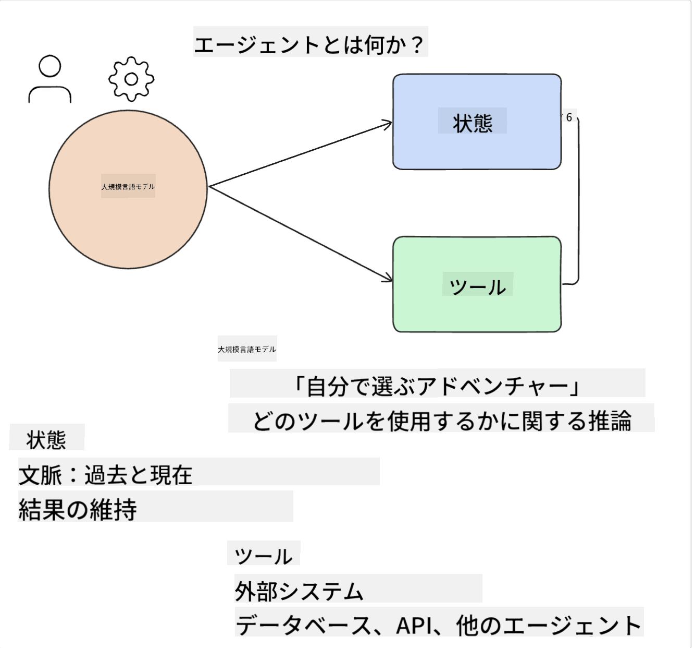
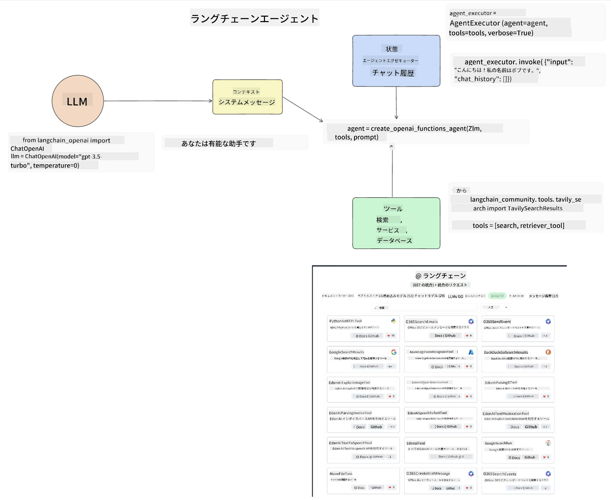
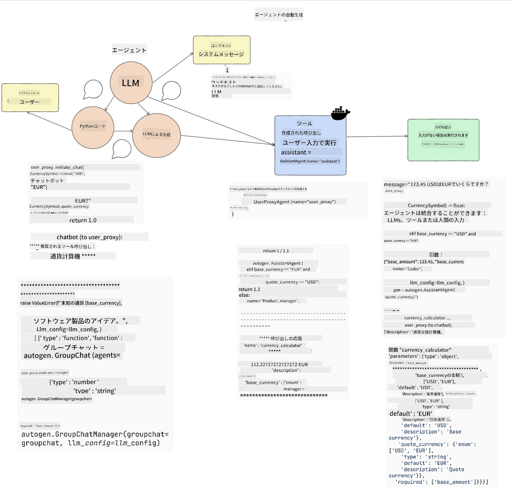
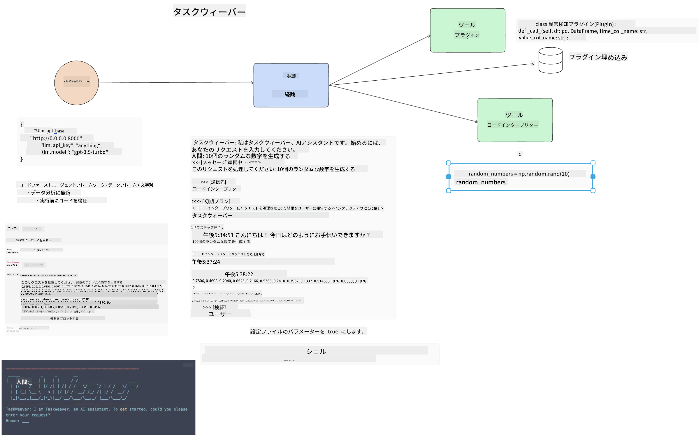
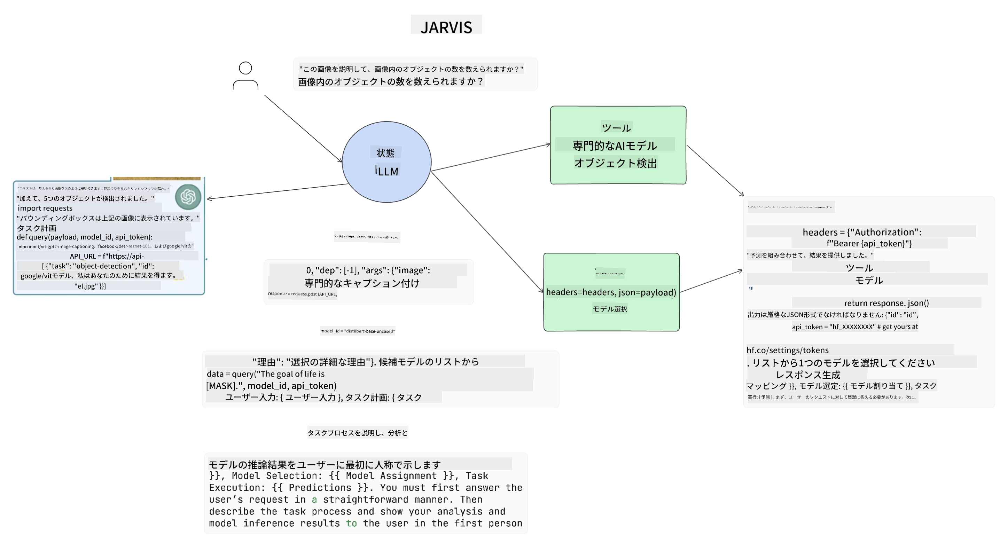

<!--
CO_OP_TRANSLATOR_METADATA:
{
  "original_hash": "11f03c81f190d9cbafd0f977dcbede6c",
  "translation_date": "2025-06-26T00:11:57+00:00",
  "source_file": "17-ai-agents/README.md",
  "language_code": "ja"
}
-->
[](https://aka.ms/gen-ai-lesson17-gh?WT.mc_id=academic-105485-koreyst)

## はじめに

AIエージェントは、生成AIの中でエキサイティングな進化を遂げており、大規模言語モデル（LLM）がアシスタントから行動を起こせるエージェントへと進化することを可能にします。AIエージェントフレームワークは、開発者がLLMにツールと状態管理へのアクセスを提供するアプリケーションを作成することを可能にします。これらのフレームワークはまた、LLMが計画したアクションをユーザーや開発者が監視できるようにすることで、エクスペリエンス管理を向上させます。

このレッスンでは以下の内容を扱います：

- AIエージェントとは何かを理解する - AIエージェントとは具体的に何か？
- 4つの異なるAIエージェントフレームワークを探る - それぞれの特徴は何か？
- これらのAIエージェントを異なるユースケースに適用する - AIエージェントをいつ使うべきか？

## 学習目標

このレッスンを受けた後、次のことができるようになります：

- AIエージェントとは何か、そしてそれをどのように使うことができるかを説明する。
- 人気のあるAIエージェントフレームワークの違いを理解し、それらがどのように異なるかを把握する。
- AIエージェントがどのように機能するかを理解し、それを使ってアプリケーションを構築する。

## AIエージェントとは？

AIエージェントは、生成AIの世界で非常にエキサイティングな分野です。この興奮とともに、用語やその応用に対する混乱が生じることもあります。AIエージェントと呼ばれるツールのほとんどを包含しつつシンプルに保つために、以下の定義を使用します：

AIエージェントは、大規模言語モデル（LLM）が**状態**と**ツール**にアクセスすることでタスクを実行できるようにします。



これらの用語を定義しましょう：

**大規模言語モデル** - これはこのコース全体で言及されているモデルで、GPT-3.5、GPT-4、Llama-2などがあります。

**状態** - これはLLMが動作しているコンテキストを指します。LLMは過去のアクションと現在のコンテキストを利用し、次のアクションの意思決定を導きます。AIエージェントフレームワークは、開発者がこのコンテキストをより簡単に維持できるようにします。

**ツール** - ユーザーが要求したタスクを完了するため、またLLMが計画したタスクを完了するために、LLMはツールへのアクセスが必要です。ツールの例としては、データベース、API、外部アプリケーション、さらには別のLLMなどがあります。

これらの定義は、これから見ていく実装方法についての基礎を提供するでしょう。それでは、いくつかの異なるAIエージェントフレームワークを探ってみましょう：

## LangChainエージェント

[LangChainエージェント](https://python.langchain.com/docs/how_to/#agents?WT.mc_id=academic-105485-koreyst)は、上記で提供した定義の実装です。

**状態**を管理するために、`AgentExecutor`という組み込み関数を使用します。これは定義された`agent`と利用可能な`tools`を受け入れます。

`Agent Executor`はまた、チャット履歴を保存してチャットのコンテキストを提供します。



LangChainは、LLMがアクセスできるあなたのアプリケーションにインポートできる[ツールのカタログ](https://integrations.langchain.com/tools?WT.mc_id=academic-105485-koreyst)を提供しています。これらはコミュニティやLangChainチームによって作成されています。

これらのツールを定義して`Agent Executor`に渡すことができます。

AIエージェントについて話すとき、可視性はもう一つの重要な側面です。アプリケーション開発者がLLMがどのツールを使っているか、そしてなぜそれを使っているかを理解することが重要です。そのために、LangChainのチームはLangSmithを開発しました。

## AutoGen

次に紹介するAIエージェントフレームワークは[AutoGen](https://microsoft.github.io/autogen/?WT.mc_id=academic-105485-koreyst)です。AutoGenの主な焦点は会話です。エージェントは**会話可能**であり、**カスタマイズ可能**です。

**会話可能 -** LLMは他のLLMと会話を開始し、続けることでタスクを完了することができます。これは`AssistantAgents`を作成し、特定のシステムメッセージを与えることで行われます。

```python

autogen.AssistantAgent( name="Coder", llm_config=llm_config, ) pm = autogen.AssistantAgent( name="Product_manager", system_message="Creative in software product ideas.", llm_config=llm_config, )

```

**カスタマイズ可能** - エージェントはLLMとしてだけでなく、ユーザーやツールとしても定義できます。開発者として、タスクの完了に対するフィードバックをユーザーとやり取りする役割を持つ`UserProxyAgent`を定義することができます。このフィードバックは、タスクの実行を続けるか、停止するかを決定します。

```python
user_proxy = UserProxyAgent(name="user_proxy")
```

### 状態とツール

状態を変更し管理するために、アシスタントエージェントはPythonコードを生成してタスクを完了します。

プロセスの例は以下の通りです：



#### システムメッセージで定義されたLLM

```python
system_message="For weather related tasks, only use the functions you have been provided with. Reply TERMINATE when the task is done."
```

このシステムメッセージは、特定のLLMにそのタスクに関連する関数を指示します。AutoGenでは、異なるシステムメッセージを持つ複数のAssistantAgentsを定義することができます。

#### ユーザーによって開始されるチャット

```python
user_proxy.initiate_chat( chatbot, message="I am planning a trip to NYC next week, can you help me pick out what to wear? ", )

```

user_proxy（人間）からのこのメッセージは、エージェントが実行すべき可能性のある関数を探索するプロセスを開始します。

#### 関数が実行される

```bash
chatbot (to user_proxy):

***** Suggested tool Call: get_weather ***** Arguments: {"location":"New York City, NY","time_periond:"7","temperature_unit":"Celsius"} ******************************************************** --------------------------------------------------------------------------------

>>>>>>>> EXECUTING FUNCTION get_weather... user_proxy (to chatbot): ***** Response from calling function "get_weather" ***** 112.22727272727272 EUR ****************************************************************

```

最初のチャットが処理されると、エージェントは呼び出すべきツールを提案します。この場合、それは`get_weather`. Depending on your configuration, this function can be automatically executed and read by the Agent or can be executed based on user input.

You can find a list of [AutoGen code samples](https://microsoft.github.io/autogen/docs/Examples/?WT.mc_id=academic-105485-koreyst) to further explore how to get started building.

## Taskweaver

The next agent framework we will explore is [Taskweaver](https://microsoft.github.io/TaskWeaver/?WT.mc_id=academic-105485-koreyst). It is known as a "code-first" agent because instead of working strictly with `strings` , it can work with DataFrames in Python. This becomes extremely useful for data analysis and generation tasks. This can be things like creating graphs and charts or generating random numbers.

### State and Tools

To manage the state of the conversation, TaskWeaver uses the concept of a `Planner`. The `Planner` is a LLM that takes the request from the users and maps out the tasks that need to be completed to fulfill this request.

To complete the tasks the `Planner` is exposed to the collection of tools called `Plugins`という関数です。これはPythonクラスや一般的なコードインタープリターである可能性があります。このプラグインは埋め込みとして保存され、LLMが正しいプラグインをよりよく検索できるようにします。



異常検出を処理するためのプラグインの例は以下の通りです：

```python
class AnomalyDetectionPlugin(Plugin): def __call__(self, df: pd.DataFrame, time_col_name: str, value_col_name: str):
```

コードは実行前に検証されます。Taskweaverでコンテキストを管理するためのもう一つの機能は、会話の`experience`. Experience allows for the context of a conversation to be stored over to the long term in a YAML file. This can be configured so that the LLM improves over time on certain tasks given that it is exposed to prior conversations.

## JARVIS

The last agent framework we will explore is [JARVIS](https://github.com/microsoft/JARVIS?tab=readme-ov-file?WT.mc_id=academic-105485-koreyst). What makes JARVIS unique is that it uses an LLM to manage the `state`であり、`tools`は他のAIモデルです。各AIモデルは、物体検出、転写、画像キャプションなどの特定のタスクを実行する専門のモデルです。



LLMは汎用モデルとして、ユーザーからのリクエストを受け取り、特定のタスクとその完了に必要な引数/データを特定します。

```python
[{"task": "object-detection", "id": 0, "dep": [-1], "args": {"image": "e1.jpg" }}]
```

その後、LLMはリクエストを専門のAIモデルが解釈できる形式、例えばJSONにフォーマットします。AIモデルがタスクに基づいて予測を返したら、LLMはその応答を受け取ります。

タスクを完了するために複数のモデルが必要な場合、それらのモデルからの応答を解釈し、それらを統合してユーザーへの応答を生成します。

以下の例は、ユーザーが画像内のオブジェクトの説明とカウントを要求した場合にどのように機能するかを示しています：

## 課題

AIエージェントの学習を続けるために、AutoGenを使用して以下を構築できます：

- 教育系スタートアップの異なる部門とのビジネス会議をシミュレートするアプリケーション。
- LLMが異なるペルソナと優先順位を理解するのを導くシステムメッセージを作成し、ユーザーが新しい製品アイデアを提案できるようにする。
- その後、LLMは各部門からのフォローアップ質問を生成し、提案と製品アイデアを洗練し改善する。

## 学習はここで終わりません、旅を続けましょう

このレッスンを完了した後は、[生成AI学習コレクション](https://aka.ms/genai-collection?WT.mc_id=academic-105485-koreyst)をチェックして、生成AIの知識をさらに高めてください！

**免責事項**:
この文書はAI翻訳サービス[Co-op Translator](https://github.com/Azure/co-op-translator)を使用して翻訳されています。正確さを追求しておりますが、機械翻訳には誤りや不正確さが含まれる可能性があることをご了承ください。元の文書を原文として信頼できる情報源とするべきです。重要な情報については、専門の人間による翻訳をお勧めします。この翻訳の使用により生じる誤解や誤った解釈については責任を負いません。