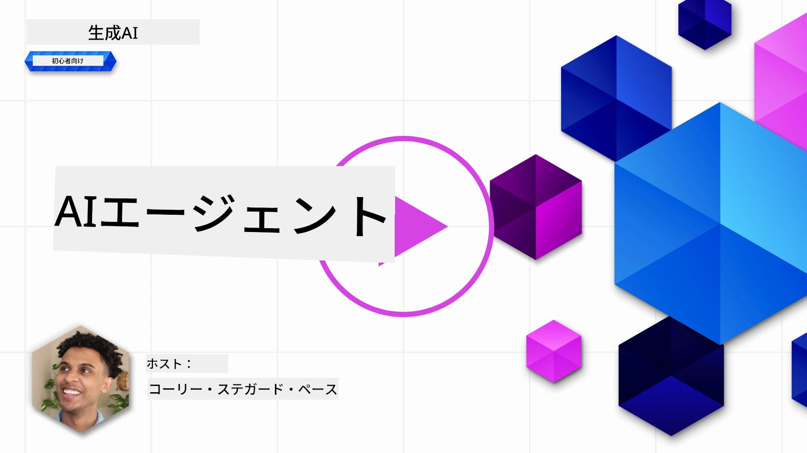
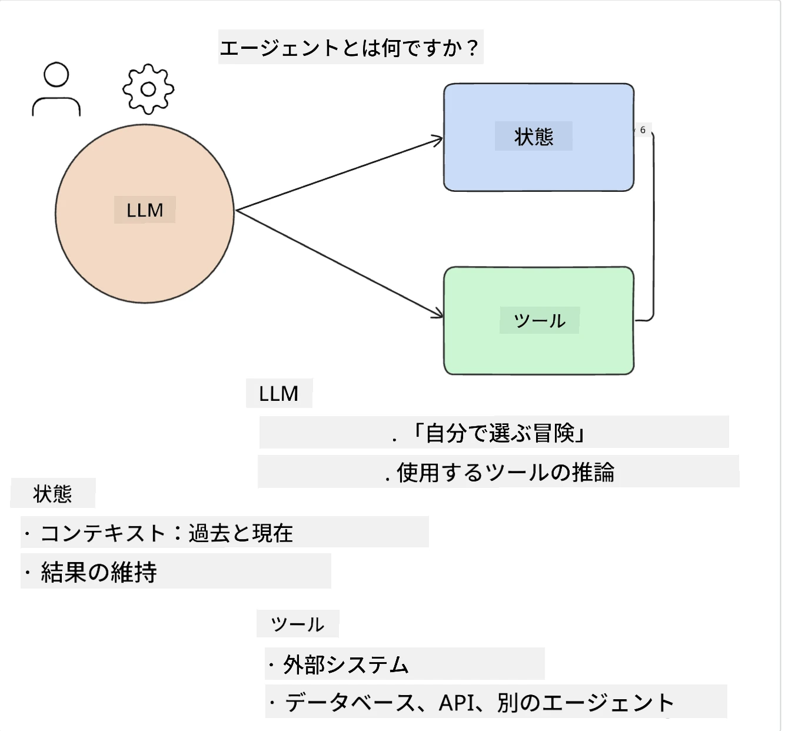
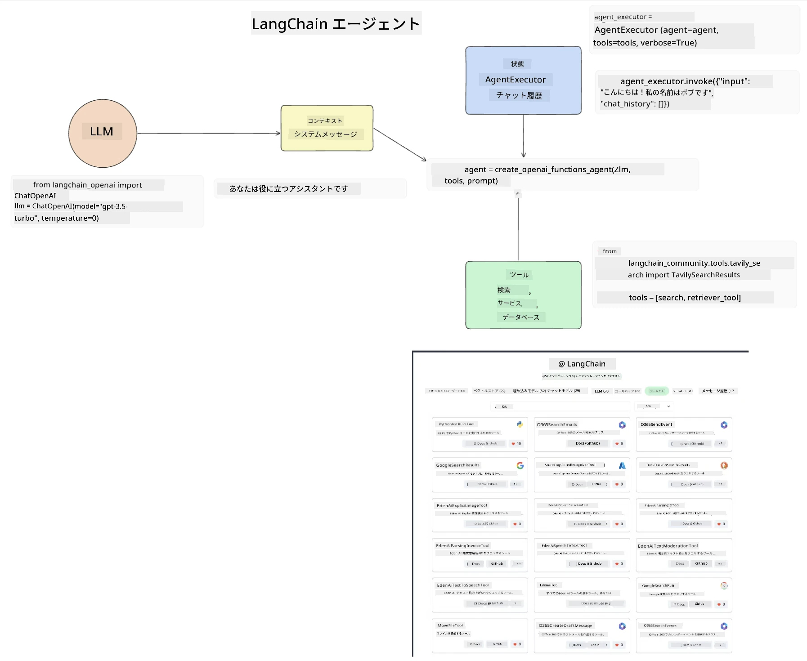
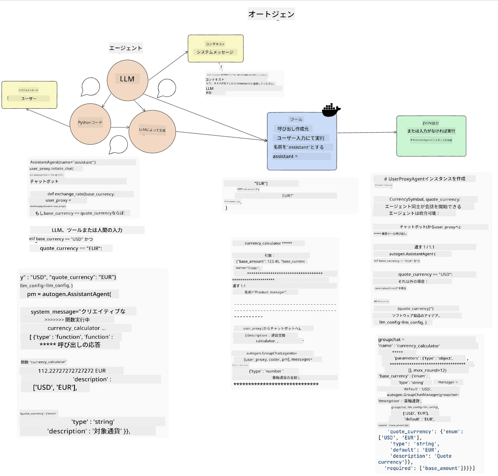
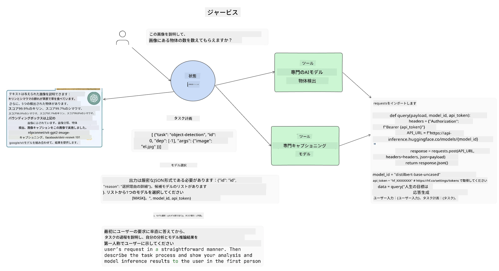

[](https://youtu.be/yAXVW-lUINc?si=bOtW9nL6jc3XJgOM)

## はじめに

AIエージェントは、生成AIにおけるエキサイティングな進展を表しており、大規模言語モデル（LLM）がアシスタントから実際に行動を起こせるエージェントへ進化することを可能にします。AIエージェントフレームワークは、開発者がLLMにツールや状態管理へのアクセスを与えるアプリケーションを作ることを可能にします。これらのフレームワークは可視性も向上させ、ユーザーや開発者がLLMが計画した行動を監視できるようにし、体験管理を改善します。

本レッスンでは以下の内容を扱います：

- AIエージェントとは何かを理解する - AIエージェントとは具体的に何か？
- 4つの異なるAIエージェントフレームワークを探る - それぞれ何が独特なのか？
- これらのAIエージェントをさまざまなユースケースに適用する - いつAIエージェントを使うべきか？

## 学習目標

本レッスンを受講後、あなたは以下のことができるようになります：

- AIエージェントとは何か、どのように使えるかを説明できる。
- 人気のあるいくつかのAIエージェントフレームワークの違い、そしてそれらがどのように異なるかを理解できる。
- AIエージェントの動作を理解し、それらを用いてアプリケーションを構築できる。

## AIエージェントとは？

AIエージェントは生成AIの世界で非常にエキサイティングな分野です。この興奮と共に時に用語やその適用に混乱が生じます。できるだけ簡潔に、そしてAIエージェントと呼ばれるほとんどのツールを包摂するために、次の定義を使います：

AIエージェントは大規模言語モデル（LLM）が**状態**と**ツール**へのアクセスを得ることでタスクを実行できるようにします。



これらの用語を定義しましょう：

**大規模言語モデル** - 本コースで言及しているモデル、例えばGPT-3.5、GPT-4、Llama-2などです。

**状態** - LLMが作業しているコンテキストを指します。LLMはこれまでの行動や現在のコンテキストを使用し、その後の行動の意思決定を導きます。AIエージェントフレームワークは開発者がこのコンテキストをより簡単に管理できるようにします。

**ツール** - ユーザーが要求しLLMが計画したタスクを完了するために、LLMはツールへのアクセスを必要とします。例えば、データベース、API、外部アプリケーション、あるいは別のLLMなどがツールとして考えられます。

これらの定義は実装方法を見ていく上で良い基盤になるでしょう。次にいくつかの異なるAIエージェントフレームワークを見ていきましょう：

## LangChain エージェント

[LangChain Agents](https://python.langchain.com/docs/how_to/#agents?WT.mc_id=academic-105485-koreyst)は、上記で示した定義を実装したものです。

**状態** の管理には `AgentExecutor` という組み込みの関数を使用します。これは定義された `agent` と利用可能な `tools` を受け取ります。

`AgentExecutor` はチャット履歴も保存し、チャットのコンテキストを提供します。



LangChainはコミュニティやLangChainチームによって作成された、LLMがアクセスできる[ツールカタログ](https://integrations.langchain.com/tools?WT.mc_id=academic-105485-koreyst)を提供しています。

これらのツールを定義し、それを `AgentExecutor` に渡すことができます。

AIエージェントを語るとき、可視性はもう一つ重要な側面です。どのツールをなぜLLMが使っているのかをアプリ開発者が理解することが重要です。そのためにLangChainチームはLangSmithを開発しました。

## AutoGen

次に紹介するAIエージェントフレームワークは[AutoGen](https://microsoft.github.io/autogen/?WT.mc_id=academic-105485-koreyst)です。AutoGenの主なフォーカスは会話です。エージェントは**対話可能**かつ**カスタマイズ可能**です。

**対話可能 -** LLMはタスクを完了するために他のLLMと会話を開始し、継続できます。これは`AssistantAgents`を作成し、それらに特定のシステムメッセージを与えることで実現されます。

```python

autogen.AssistantAgent( name="Coder", llm_config=llm_config, ) pm = autogen.AssistantAgent( name="Product_manager", system_message="Creative in software product ideas.", llm_config=llm_config, )

```

**カスタマイズ可能** - エージェントはLLMだけでなく、ユーザーやツールとしても定義できます。開発者としては、タスク完了に向けたフィードバックのためにユーザーとの対話を担当する`UserProxyAgent`を定義できます。このフィードバックはタスクの継続か停止のいずれかとなります。

```python
user_proxy = UserProxyAgent(name="user_proxy")
```

### 状態とツール

状態を変更・管理するために、アシスタントエージェントはPythonコードを生成してタスクを完了します。

プロセスの例はこちらです：



#### システムメッセージで定義されたLLM

```python
system_message="For weather related tasks, only use the functions you have been provided with. Reply TERMINATE when the task is done."
```

このシステムメッセージはこの特定のLLMにとって関連のある関数を示します。AutoGenでは異なるシステムメッセージを持つ複数のAssistantAgentsを定義できます。

#### ユーザーによるチャット開始

```python
user_proxy.initiate_chat( chatbot, message="I am planning a trip to NYC next week, can you help me pick out what to wear? ", )

```

user_proxy（人間）からのこのメッセージが、どの関数をエージェントが実行すべきか探索するプロセスを開始します。

#### 関数の実行

```bash
chatbot (to user_proxy):

***** Suggested tool Call: get_weather ***** Arguments: {"location":"New York City, NY","time_periond:"7","temperature_unit":"Celsius"} ******************************************************** --------------------------------------------------------------------------------

>>>>>>>> EXECUTING FUNCTION get_weather... user_proxy (to chatbot): ***** Response from calling function "get_weather" ***** 112.22727272727272 EUR ****************************************************************

```

初期チャットが処理された後、エージェントは呼び出すべきツールを提案します。この例では`get_weather`と呼ばれる関数です。設定によっては、この関数は自動的に実行されエージェントに読み込まれるか、ユーザー入力に基づき実行されます。

[AutoGenコードサンプル](https://microsoft.github.io/autogen/docs/Examples/?WT.mc_id=academic-105485-koreyst)のリストで始め方をさらに探ることもできます。

## Taskweaver

次に探るエージェントフレームワークは[Taskweaver](https://microsoft.github.io/TaskWeaver/?WT.mc_id=academic-105485-koreyst)です。これは「コードファースト」エージェントとして知られています。`strings`だけではなくPythonのDataFrameも扱えます。これはデータ分析や生成タスクに非常に役立ちます。例えばグラフやチャートの作成、ランダムナンバーの生成などです。

### 状態とツール

会話の状態を管理するためにTaskWeaverは`Planner`の概念を使います。`Planner`はユーザーからの要求を受け、その要求を満たすために完了すべきタスクをマップするLLMです。

タスクを完了するため、`Planner`は`Plugins`と呼ばれるツール群にアクセスします。これはPythonクラスや汎用コードインタプリタであり、これらのプラグインは埋め込みとして保存され、LLMが適切なプラグインをより良く検索できるようになります。


こちらは異常検知を扱うプラグインの例です：

```python
class AnomalyDetectionPlugin(Plugin): def __call__(self, df: pd.DataFrame, time_col_name: str, value_col_name: str):
```

コードは実行前に検証されます。Taskweaverでコンテキスト管理のもう一つの機能は`experience`です。Experienceは会話のコンテキストをYAMLファイルの長期保存に使えます。設定でLLMが過去の会話に触れることで特定のタスクの性能を時間と共に改善できます。

## JARVIS

最後に探るエージェントフレームワークは[JARVIS](https://github.com/microsoft/JARVIS?tab=readme-ov-file&WT.mc_id=academic-105485-koreyst)です。JARVISの特徴は、LLMが会話の`状態`を管理し、`ツール`は他のAIモデルであることです。各AIモデルは物体検出、文字起こし、画像キャプションなど特定のタスクを担う専門モデルです。



一般目的モデルであるLLMはユーザーからの要求を受け、具体的なタスクと完了に必要な引数やデータを特定します。

```python
[{"task": "object-detection", "id": 0, "dep": [-1], "args": {"image": "e1.jpg" }}]
```

その後、LLMは専門AIモデルが解釈できる形式（JSONなど）でリクエストを整形します。AIモデルがタスクに基づいた予測を返すと、LLMはその応答を受け取ります。

複数のモデルを使う必要があれば、LLMはそれらモデルのレスポンスを解釈し、まとめてユーザーへの答えを生成します。

以下の例はユーザーが写真内の物体の説明と数を求めた場合の動作を示します。

## 課題

AutoGenでビルドしながらAIエージェントの学習を続けましょう：

- 教育系スタートアップの異なる部署とのビジネスミーティングをシミュレートするアプリケーション。
- LLMが異なるペルソナや優先事項を理解できるようにシステムメッセージを作成し、ユーザーが新商品案をプレゼンできるようにする。
- 各部署からのフォローアップ質問をLLMが生成し、プレゼンと商品案を洗練・改善する。

## 学びはここで終わらない、旅を続けよう

本レッスンを終了したら、[生成AI学習コレクション](https://aka.ms/genai-collection?WT.mc_id=academic-105485-koreyst)もぜひチェックし、生成AIの知識をさらに深めてください！

---

<!-- CO-OP TRANSLATOR DISCLAIMER START -->
**免責事項**：  
本ドキュメントは、AI翻訳サービス「Co-op Translator」（https://github.com/Azure/co-op-translator）を使用して翻訳されています。正確性の確保に努めておりますが、自動翻訳には誤りや不正確な箇所が含まれる場合があります。原文（母国語版）が正式な情報源として優先されるべきものです。重要な情報については、専門の人間翻訳をご利用いただくことを推奨します。本翻訳の使用により生じたいかなる誤解や誤訳についても、当方は一切責任を負いかねます。
<!-- CO-OP TRANSLATOR DISCLAIMER END -->