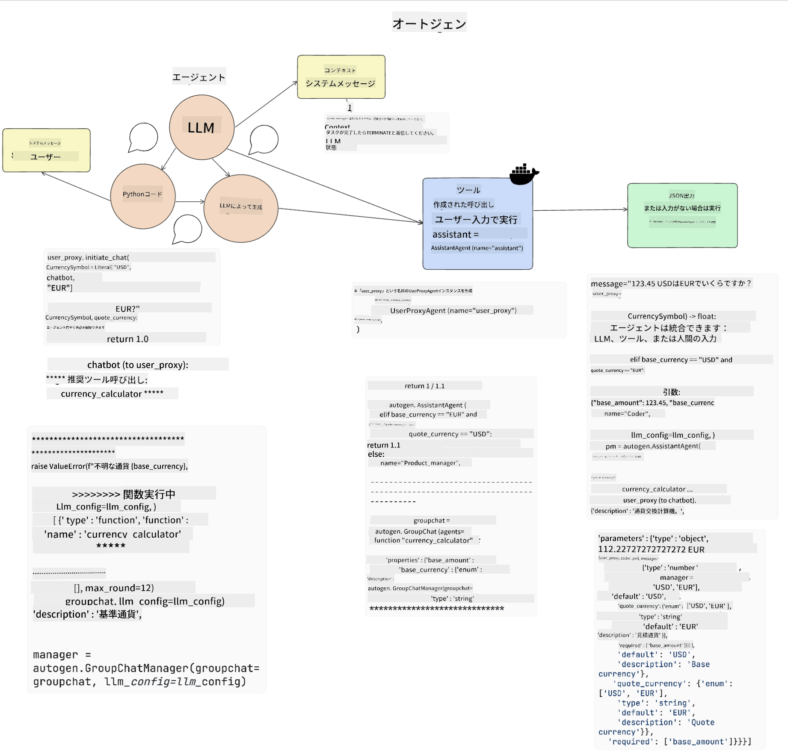

<!--
CO_OP_TRANSLATOR_METADATA:
{
  "original_hash": "11f03c81f190d9cbafd0f977dcbede6c",
  "translation_date": "2025-07-09T17:21:05+00:00",
  "source_file": "17-ai-agents/README.md",
  "language_code": "ja"
}
-->
[](https://aka.ms/gen-ai-lesson17-gh?WT.mc_id=academic-105485-koreyst)

## はじめに

AIエージェントは、生成AIの中でも非常に注目されている進展であり、大規模言語モデル（LLM）が単なるアシスタントから行動を起こせるエージェントへと進化することを可能にします。AIエージェントフレームワークは、開発者がLLMにツールや状態管理へのアクセスを提供するアプリケーションを作成できるようにします。また、これらのフレームワークは可視性を高め、ユーザーや開発者がLLMが計画した行動を監視できるようにし、体験の管理を向上させます。

このレッスンでは以下の内容を扱います：

- AIエージェントとは何かを理解する — AIエージェントとは具体的に何か？
- 4つの異なるAIエージェントフレームワークを探る — それぞれの特徴は？
- これらのAIエージェントを様々なユースケースに適用する — いつAIエージェントを使うべきか？

## 学習目標

このレッスンを終えた後、あなたは以下のことができるようになります：

- AIエージェントとは何か、そしてどのように活用できるかを説明できる。
- 人気のあるAIエージェントフレームワークの違いと特徴を理解できる。
- AIエージェントの仕組みを理解し、それを使ったアプリケーションを構築できる。

## AIエージェントとは？

AIエージェントは生成AIの世界で非常にエキサイティングな分野です。この興奮とともに、用語やその適用方法に混乱が生じることもあります。ここではシンプルに、かつ多くのAIエージェントと呼ばれるツールを包括するために、以下の定義を使います：

AIエージェントは、大規模言語モデル（LLM）に**状態**と**ツール**へのアクセスを与え、タスクを実行できるようにします。


これらの用語を定義しましょう：

**大規模言語モデル** — 本コースで扱うGPT-3.5、GPT-4、Llama-2などのモデルを指します。

**状態** — LLMが作業しているコンテキストのことです。LLMは過去の行動や現在のコンテキストを利用して、次の行動の意思決定を行います。AIエージェントフレームワークは、このコンテキスト管理を開発者がより簡単に行えるようにします。

**ツール** — ユーザーが依頼し、LLMが計画したタスクを完了するために必要なツールへのアクセスです。ツールの例としては、データベース、API、外部アプリケーション、あるいは別のLLMなどがあります。

これらの定義が、今後の実装例を理解するための基礎となることを願っています。では、いくつかの異なるAIエージェントフレームワークを見ていきましょう。

## LangChain Agents

[LangChain Agents](https://python.langchain.com/docs/how_to/#agents?WT.mc_id=academic-105485-koreyst)は、上記の定義を実装したものです。

**状態**を管理するために、`AgentExecutor`という組み込み関数を使います。これは定義された`agent`と利用可能な`tools`を受け取ります。

`AgentExecutor`はチャット履歴も保存し、チャットのコンテキストを提供します。


LangChainは、LLMがアクセスできる[ツールのカタログ](https://integrations.langchain.com/tools?WT.mc_id=academic-105485-koreyst)を提供しており、コミュニティやLangChainチームによって作成されています。

これらのツールを定義し、`AgentExecutor`に渡すことができます。

AIエージェントにおいて可視性も重要な要素です。アプリケーション開発者がLLMがどのツールを使い、なぜ使っているのかを理解することが重要です。そのためにLangChainチームはLangSmithを開発しました。

## AutoGen

次に紹介するAIエージェントフレームワークは[AutoGen](https://microsoft.github.io/autogen/?WT.mc_id=academic-105485-koreyst)です。AutoGenの主な焦点は会話です。エージェントは**会話可能**であり、**カスタマイズ可能**です。

**会話可能** — LLMは別のLLMと会話を開始し、継続してタスクを完了します。これは`AssistantAgents`を作成し、特定のシステムメッセージを与えることで実現されます。

```python

autogen.AssistantAgent( name="Coder", llm_config=llm_config, ) pm = autogen.AssistantAgent( name="Product_manager", system_message="Creative in software product ideas.", llm_config=llm_config, )

```

**カスタマイズ可能** — エージェントはLLMだけでなく、ユーザーやツールとしても定義できます。開発者は`UserProxyAgent`を定義し、タスク完了のためのフィードバックをユーザーとやり取りする役割を持たせることができます。このフィードバックはタスクの継続または停止に使われます。

```python
user_proxy = UserProxyAgent(name="user_proxy")
```

### 状態とツール

状態を変更・管理するために、アシスタントエージェントはタスクを完了するためのPythonコードを生成します。

以下はそのプロセスの例です：



#### システムメッセージで定義されたLLM

```python
system_message="For weather related tasks, only use the functions you have been provided with. Reply TERMINATE when the task is done."
```

このシステムメッセージは、特定のLLMに対してどの関数がタスクに関連しているかを指示します。AutoGenでは、異なるシステムメッセージを持つ複数のAssistantAgentsを定義できます。

#### ユーザーによるチャット開始

```python
user_proxy.initiate_chat( chatbot, message="I am planning a trip to NYC next week, can you help me pick out what to wear? ", )

```

このユーザープロキシ（人間）からのメッセージが、エージェントが実行すべき関数を探るプロセスの開始となります。

#### 関数の実行

```bash
chatbot (to user_proxy):

***** Suggested tool Call: get_weather ***** Arguments: {"location":"New York City, NY","time_periond:"7","temperature_unit":"Celsius"} ******************************************************** --------------------------------------------------------------------------------

>>>>>>>> EXECUTING FUNCTION get_weather... user_proxy (to chatbot): ***** Response from calling function "get_weather" ***** 112.22727272727272 EUR ****************************************************************

```

初期チャットが処理されると、エージェントは呼び出すべきツール（この場合は`get_weather`関数）を提案します。設定によっては、この関数は自動的に実行されエージェントが結果を読み取るか、ユーザーの入力に基づいて実行されます。

[AutoGenのコードサンプル](https://microsoft.github.io/autogen/docs/Examples/?WT.mc_id=academic-105485-koreyst)も参照して、構築の始め方をさらに学べます。

## Taskweaver

次に紹介するエージェントフレームワークは[Taskweaver](https://microsoft.github.io/TaskWeaver/?WT.mc_id=academic-105485-koreyst)です。これは「コードファースト」エージェントとして知られており、`strings`だけでなくPythonのDataFrameを扱えます。データ分析や生成タスクに非常に役立ちます。例えばグラフやチャートの作成、乱数生成などです。

### 状態とツール

会話の状態管理には`Planner`という概念を使います。`Planner`はユーザーのリクエストを受け取り、そのリクエストを満たすために完了すべきタスクをマッピングするLLMです。

タスクを完了するために、`Planner`は`Plugins`と呼ばれるツール群にアクセスします。これらはPythonクラスや一般的なコードインタプリタであり、埋め込みとして保存されているため、LLMが適切なプラグインを効率的に検索できます。


以下は異常検知を扱うプラグインの例です：

```python
class AnomalyDetectionPlugin(Plugin): def __call__(self, df: pd.DataFrame, time_col_name: str, value_col_name: str):
```

コードは実行前に検証されます。Taskweaverでコンテキスト管理を行うもう一つの機能は`experience`です。Experienceは会話のコンテキストをYAMLファイルに長期保存し、過去の会話に触れることでLLMが特定のタスクを時間とともに改善できるように設定可能です。

## JARVIS

最後に紹介するエージェントフレームワークは[JARVIS](https://github.com/microsoft/JARVIS?tab=readme-ov-file?WT.mc_id=academic-105485-koreyst)です。JARVISの特徴は、会話の`状態`管理にLLMを使い、`ツール`として他のAIモデルを利用する点です。これらのAIモデルは物体検出、文字起こし、画像キャプション生成など特定のタスクに特化しています。


汎用モデルであるLLMはユーザーからのリクエストを受け取り、特定のタスクとその完了に必要な引数やデータを特定します。

```python
[{"task": "object-detection", "id": 0, "dep": [-1], "args": {"image": "e1.jpg" }}]
```

LLMはリクエストを専門AIモデルが解釈できる形式（例えばJSON）に整形します。AIモデルがタスクに基づく予測を返すと、LLMはその応答を受け取ります。

複数のモデルがタスク完了に必要な場合、LLMはそれらのモデルからの応答を解釈し、まとめてユーザーへの応答を生成します。

以下の例は、ユーザーが画像内の物体の説明と数を求める場合の動作を示しています。

## 課題

AIエージェントの学習を続けるために、AutoGenを使って以下を構築してみましょう：

- 教育系スタートアップの異なる部署が参加するビジネス会議をシミュレートするアプリケーション。
- LLMが異なるペルソナや優先事項を理解できるように導くシステムメッセージを作成し、ユーザーが新製品アイデアを提案できるようにする。
- その後、LLMが各部署からのフォローアップ質問を生成し、提案や製品アイデアを洗練・改善する。

## 学びはここで終わらない、旅を続けよう

このレッスンを終えたら、[Generative AI Learning collection](https://aka.ms/genai-collection?WT.mc_id=academic-105485-koreyst)をチェックして、生成AIの知識をさらに深めていきましょう！

**免責事項**:  
本書類はAI翻訳サービス「[Co-op Translator](https://github.com/Azure/co-op-translator)」を使用して翻訳されました。正確性の向上に努めておりますが、自動翻訳には誤りや不正確な部分が含まれる可能性があります。原文の言語によるオリジナル文書が正式な情報源とみなされるべきです。重要な情報については、専門の人間による翻訳を推奨します。本翻訳の利用により生じたいかなる誤解や誤訳についても、当方は責任を負いかねます。