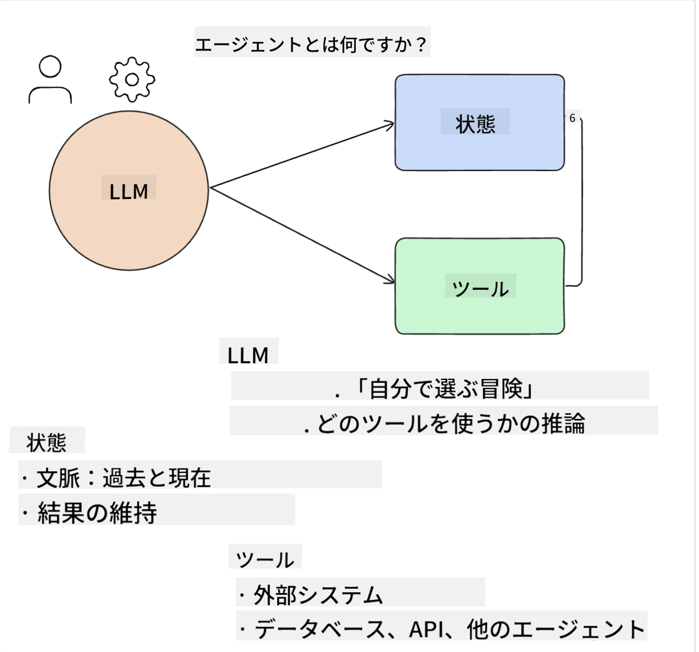
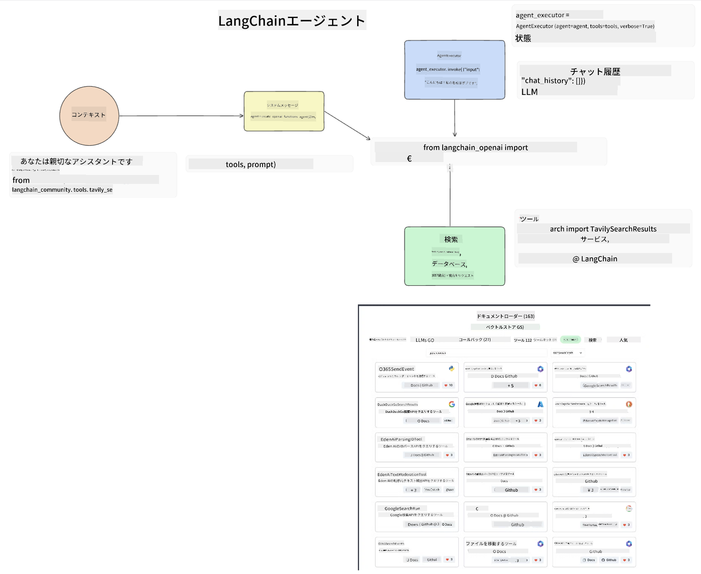

<!--
CO_OP_TRANSLATOR_METADATA:
{
  "original_hash": "8e8d1f6a63da606af7176a87ff8e92b6",
  "translation_date": "2025-10-17T23:58:04+00:00",
  "source_file": "17-ai-agents/README.md",
  "language_code": "ja"
}
-->
[](https://youtu.be/yAXVW-lUINc?si=bOtW9nL6jc3XJgOM)

## はじめに

AIエージェントは、生成AIの中で非常に興味深い進展を示しており、大規模言語モデル（LLM）が単なるアシスタントから行動を起こせるエージェントへと進化することを可能にします。AIエージェントフレームワークは、開発者がLLMにツールや状態管理へのアクセスを提供するアプリケーションを作成することを可能にします。また、これらのフレームワークは可視性を向上させ、ユーザーや開発者がLLMによって計画された行動を監視できるようにし、体験管理を改善します。

このレッスンでは以下の内容を取り上げます：

- AIエージェントとは何かを理解する - AIエージェントとは具体的に何なのか？
- 4つの異なるAIエージェントフレームワークを探る - それぞれの特徴は何か？
- これらのAIエージェントをさまざまなユースケースに適用する - どのような場合にAIエージェントを使用すべきか？

## 学習目標

このレッスンを受けた後、以下のことができるようになります：

- AIエージェントとは何か、そしてそれがどのように使用されるかを説明できる。
- 人気のあるAIエージェントフレームワークの違いを理解し、それぞれの特徴を把握できる。
- AIエージェントがどのように機能するかを理解し、それを使ったアプリケーションを構築できる。

## AIエージェントとは？

AIエージェントは生成AIの世界で非常にエキサイティングな分野です。この興奮とともに、時には用語やその適用について混乱が生じることもあります。ここでは、シンプルで包括的な定義を使用します：

AIエージェントは、大規模言語モデル（LLM）に**状態**と**ツール**へのアクセスを提供することでタスクを実行できるようにします。



これらの用語を定義しましょう：

**大規模言語モデル** - このコースで言及されるモデルで、GPT-3.5、GPT-4、Llama-2などがあります。

**状態** - これはLLMが作業しているコンテキストを指します。LLMは過去の行動や現在のコンテキストを利用して、次の行動の意思決定を導きます。AIエージェントフレームワークは、開発者がこのコンテキストをより簡単に維持できるようにします。

**ツール** - ユーザーが要求したタスクを完了し、LLMが計画したタスクを実行するために、LLMはツールへのアクセスが必要です。ツールの例として、データベース、API、外部アプリケーション、さらには別のLLMなどがあります。

これらの定義は、今後の実装方法を理解するための基礎を提供するでしょう。それでは、いくつかのAIエージェントフレームワークを探ってみましょう：

## LangChainエージェント

[LangChainエージェント](https://python.langchain.com/docs/how_to/#agents?WT.mc_id=academic-105485-koreyst)は、上記で提供した定義の実装です。

**状態**を管理するために、`AgentExecutor`という組み込み関数を使用します。これにより、定義された`agent`と利用可能な`tools`が受け入れられます。

`AgentExecutor`はチャット履歴も保存し、チャットのコンテキストを提供します。



LangChainは、LLMがアクセスできる[ツールのカタログ](https://integrations.langchain.com/tools?WT.mc_id=academic-105485-koreyst)を提供しています。これらはコミュニティやLangChainチームによって作成されています。

これらのツールを定義し、`AgentExecutor`に渡すことができます。

AIエージェントについて話す際に、可視性も重要な側面です。アプリケーション開発者がLLMがどのツールを使用しているのか、なぜ使用しているのかを理解することが重要です。そのため、LangChainチームはLangSmithを開発しました。

## AutoGen

次に紹介するAIエージェントフレームワークは[AutoGen](https://microsoft.github.io/autogen/?WT.mc_id=academic-105485-koreyst)です。AutoGenの主な焦点は会話です。エージェントは**会話可能**であり、**カスタマイズ可能**です。

**会話可能 -** LLMはタスクを完了するために別のLLMと会話を開始し、続けることができます。これは`AssistantAgents`を作成し、特定のシステムメッセージを与えることで実現されます。

```python

autogen.AssistantAgent( name="Coder", llm_config=llm_config, ) pm = autogen.AssistantAgent( name="Product_manager", system_message="Creative in software product ideas.", llm_config=llm_config, )

```

**カスタマイズ可能** - エージェントはLLMだけでなく、ユーザーやツールとしても定義できます。開発者として、タスクを完了するためのフィードバックを得るためにユーザーと対話する役割を持つ`UserProxyAgent`を定義することができます。このフィードバックはタスクの実行を続行するか停止するかを決定します。

```python
user_proxy = UserProxyAgent(name="user_proxy")
```

### 状態とツール

状態を変更し管理するために、アシスタントエージェントはタスクを完了するためにPythonコードを生成します。

以下はそのプロセスの例です：


#### システムメッセージで定義されたLLM

```python
system_message="For weather related tasks, only use the functions you have been provided with. Reply TERMINATE when the task is done."
```

このシステムメッセージは、この特定のLLMに対してタスクに関連する機能を指示します。AutoGenでは、異なるシステムメッセージを持つ複数のAssistantAgentsを定義することができます。

#### ユーザーによるチャットの開始

```python
user_proxy.initiate_chat( chatbot, message="I am planning a trip to NYC next week, can you help me pick out what to wear? ", )

```

このuser_proxy（人間）からのメッセージが、エージェントが実行すべき可能性のある機能を探るプロセスを開始します。

#### 機能の実行

```bash
chatbot (to user_proxy):

***** Suggested tool Call: get_weather ***** Arguments: {"location":"New York City, NY","time_periond:"7","temperature_unit":"Celsius"} ******************************************************** --------------------------------------------------------------------------------

>>>>>>>> EXECUTING FUNCTION get_weather... user_proxy (to chatbot): ***** Response from calling function "get_weather" ***** 112.22727272727272 EUR ****************************************************************

```

最初のチャットが処理されると、エージェントは呼び出すべきツールを提案します。この場合、`get_weather`という機能です。設定によって、この機能はエージェントによって自動的に実行されるか、ユーザー入力に基づいて実行されます。

[AutoGenのコードサンプル](https://microsoft.github.io/autogen/docs/Examples/?WT.mc_id=academic-105485-koreyst)を確認して、構築を始める方法をさらに探ってみてください。

## Taskweaver

次に探るエージェントフレームワークは[Taskweaver](https://microsoft.github.io/TaskWeaver/?WT.mc_id=academic-105485-koreyst)です。これは「コードファースト」エージェントとして知られており、`strings`だけでなくPythonのDataFramesを扱うことができます。これにより、データ分析や生成タスクに非常に役立ちます。例えば、グラフやチャートの作成、ランダムな数値の生成などです。

### 状態とツール

会話の状態を管理するために、TaskWeaverは`Planner`という概念を使用します。`Planner`はユーザーからのリクエストを受け取り、そのリクエストを満たすために必要なタスクを計画します。

タスクを完了するために、`Planner`は`Plugins`と呼ばれるツールのコレクションにアクセスします。これらはPythonクラスや一般的なコードインタープリターである可能性があります。このプラグインは埋め込みとして保存され、LLMが適切なプラグインをよりよく検索できるようにします。


以下は異常検出を処理するプラグインの例です：

```python
class AnomalyDetectionPlugin(Plugin): def __call__(self, df: pd.DataFrame, time_col_name: str, value_col_name: str):
```

コードは実行前に検証されます。Taskweaverでコンテキストを管理するもう一つの機能は`experience`です。`experience`は、会話のコンテキストを長期的にYAMLファイルに保存することを可能にします。これにより、LLMは以前の会話に基づいて特定のタスクを改善することができます。

## JARVIS

最後に探るエージェントフレームワークは[JARVIS](https://github.com/microsoft/JARVIS?tab=readme-ov-file?WT.mc_id=academic-105485-koreyst)です。JARVISのユニークな点は、会話の`状態`を管理するためにLLMを使用し、`ツール`として他のAIモデルを使用することです。これらのAIモデルは、物体検出、文字起こし、画像キャプションなど特定のタスクを実行する専門モデルです。


汎用モデルであるLLMは、ユーザーからのリクエストを受け取り、特定のタスクとそのタスクを完了するために必要な引数やデータを特定します。

```python
[{"task": "object-detection", "id": 0, "dep": [-1], "args": {"image": "e1.jpg" }}]
```

LLMはその後、特化したAIモデルが解釈できる形式（例えばJSON）でリクエストをフォーマットします。AIモデルがタスクに基づいて予測を返すと、LLMがその応答を受け取ります。

複数のモデルがタスクを完了するために必要な場合、LLMはそれらのモデルからの応答を解釈し、それらを統合してユーザーへの応答を生成します。

以下の例は、ユーザーが画像内の物体の説明と数を要求した場合の動作を示しています：

## 課題

AIエージェントの学習を続けるために、AutoGenを使用して以下を構築してみましょう：

- 教育系スタートアップの異なる部門とのビジネス会議をシミュレーションするアプリケーション。
- LLMが異なる人物像や優先事項を理解し、ユーザーが新しい製品アイデアを提案できるようにするシステムメッセージを作成する。
- その後、LLMが各部門からフォローアップの質問を生成し、提案や製品アイデアを改善する。

## 学びはここで終わりません、旅を続けましょう

このレッスンを終えた後は、[生成AI学習コレクション](https://aka.ms/genai-collection?WT.mc_id=academic-105485-koreyst)をチェックして、生成AIの知識をさらに深めてください！

---

**免責事項**:  
この文書はAI翻訳サービス[Co-op Translator](https://github.com/Azure/co-op-translator)を使用して翻訳されています。正確性を追求しておりますが、自動翻訳には誤りや不正確な部分が含まれる可能性があります。元の言語で記載された文書を正式な情報源としてご参照ください。重要な情報については、専門の人間による翻訳を推奨します。この翻訳の使用に起因する誤解や誤認について、当方は責任を負いません。