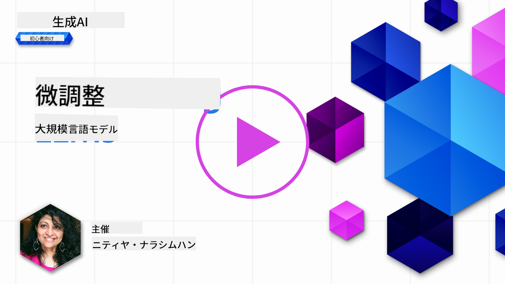
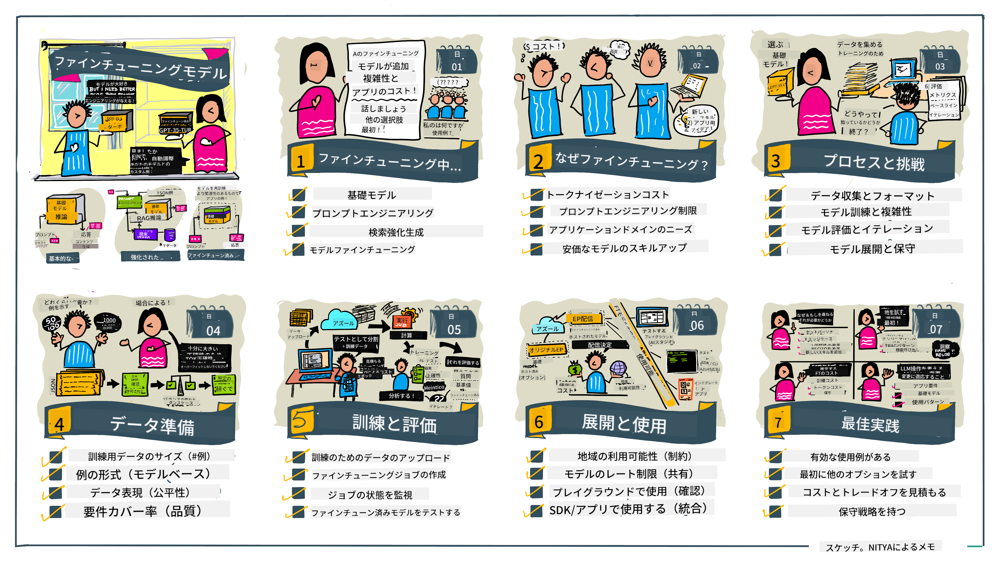

<!--
CO_OP_TRANSLATOR_METADATA:
{
  "original_hash": "68664f7e754a892ae1d8d5e2b7bd2081",
  "translation_date": "2025-05-20T07:40:22+00:00",
  "source_file": "18-fine-tuning/README.md",
  "language_code": "ja"
}
-->

# LLMの微調整

大規模言語モデルを使用して生成AIアプリケーションを構築するには、新たな課題があります。重要な問題は、モデルが生成するコンテンツの応答品質（正確性と関連性）を確保することです。以前のレッスンでは、プロンプトエンジニアリングや検索強化生成のような手法について説明しました。これらの手法は、既存のモデルのプロンプト入力を変更することで問題を解決しようとします。

本日のレッスンでは、**微調整**という第三の手法について説明します。この手法は、追加データを使用してモデル自体を再訓練することで課題に対処しようとします。詳細を見ていきましょう。

## 学習目標

このレッスンでは、事前訓練された言語モデルの微調整の概念を紹介し、このアプローチの利点と課題を探り、生成AIモデルの性能を向上させるための微調整の利用方法とタイミングについてのガイダンスを提供します。

このレッスンを終えると、次の質問に答えられるようになります：

- 言語モデルの微調整とは何ですか？
- 微調整はいつ、なぜ有用ですか？
- 事前訓練されたモデルをどのように微調整できますか？
- 微調整の限界は何ですか？

準備はいいですか？始めましょう。

## イラストガイド

詳細に入る前に、学習内容の全体像を把握したいですか？このレッスンの学習の旅を説明するイラストガイドをチェックしてください。微調整の核心概念と動機から、微調整タスクを実行するプロセスとベストプラクティスを理解するまで。このテーマは探求する価値がありますので、自己学習の旅をサポートする追加リンクを提供する[リソース](./RESOURCES.md?WT.mc_id=academic-105485-koreyst)ページを忘れずにチェックしてください！

## 言語モデルの微調整とは？

定義によれば、大規模言語モデルはインターネットを含む多様なソースから取得した大量のテキストで_事前訓練_されています。以前のレッスンで学んだように、ユーザーの質問（「プロンプト」）に対するモデルの応答の品質を向上させるためには、_プロンプトエンジニアリング_や_検索強化生成_のような手法が必要です。

人気のあるプロンプトエンジニアリングの手法は、モデルに応答で何が期待されるかについてのガイダンスを提供することです。これには、_指示_（明示的なガイダンス）を提供するか、_いくつかの例を示す_（暗黙的なガイダンス）方法があります。これは_少数ショット学習_と呼ばれますが、2つの制限があります：

- モデルのトークン制限が与える例の数を制限し、効果を制限する可能性があります。
- モデルのトークンコストが各プロンプトに例を追加することを高価にし、柔軟性を制限する可能性があります。

微調整は、事前訓練されたモデルを新しいデータで再訓練して特定のタスクでの性能を向上させる、機械学習システムで一般的な手法です。言語モデルのコンテキストでは、事前訓練されたモデルを_特定のタスクやアプリケーションドメインに合わせて選定された例で微調整_することで、その特定のタスクやドメインに対してより正確で関連性のある**カスタムモデル**を作成できます。微調整の副次的な利点は、少数ショット学習に必要な例の数を減少させることができ、トークン使用量と関連コストを削減できることです。

## モデルを微調整するのはいつ、なぜ必要ですか？

このコンテキストでは、微調整について話すとき、**新しいデータを追加して**再訓練を行う**監督付き**微調整を指します。これは、元のデータで異なるハイパーパラメータを使用してモデルを再訓練する非監督付き微調整とは異なります。

覚えておくべき重要なことは、微調整は望ましい結果を得るためにある程度の専門知識を必要とする高度な手法であるということです。誤って行うと、期待される改善が得られないだけでなく、ターゲットドメインでのモデルの性能を低下させる可能性があります。

したがって、言語モデルを「どのように」微調整するかを学ぶ前に、「なぜ」この道を選ぶべきか、「いつ」微調整のプロセスを始めるべきかを知る必要があります。次の質問を自問してみてください：

- **ユースケース**: 微調整の_ユースケース_は何ですか？現在の事前訓練されたモデルのどの側面を改善したいですか？
- **代替手段**: 望ましい結果を達成するために_他の手法_を試しましたか？それらを使用して比較のためのベースラインを作成してください。
  - プロンプトエンジニアリング: 関連するプロンプト応答の例を使用した少数ショットプロンプティングのような手法を試してください。応答の品質を評価してください。
  - 検索強化生成: データを検索して取得したクエリ結果でプロンプトを補強してみてください。応答の品質を評価してください。
- **コスト**: 微調整のコストを特定しましたか？
  - 調整可能性 - 事前訓練されたモデルは微調整可能ですか？
  - 労力 - 訓練データの準備、モデルの評価と改善のための労力。
  - コンピュート - 微調整ジョブの実行と微調整モデルのデプロイのためのコンピュート。
  - データ - 微調整の影響に十分な品質の例へのアクセス。
- **利点**: 微調整の利点を確認しましたか？
  - 品質 - 微調整されたモデルはベースラインを上回りましたか？
  - コスト - プロンプトを簡略化することでトークン使用量を削減しましたか？
  - 拡張性 - ベースモデルを新しいドメインに再利用できますか？

これらの質問に答えることで、微調整がユースケースに適したアプローチかどうかを判断できるはずです。理想的には、利点がコストを上回る場合にのみアプローチが有効です。進めることを決めたら、事前訓練されたモデルをどのように微調整できるかを考える時です。

意思決定プロセスについてさらに詳しい情報を得たいですか？[微調整するかしないか](https://www.youtube.com/watch?v=0Jo-z-MFxJs)を視聴してください。

## 事前訓練されたモデルをどのように微調整できますか？

事前訓練されたモデルを微調整するには、次のものが必要です：

- 微調整するための事前訓練されたモデル
- 微調整に使用するデータセット
- 微調整ジョブを実行するための訓練環境
- 微調整されたモデルをデプロイするためのホスティング環境

## 微調整の実際

以下のリソースは、選定されたモデルと選定されたデータセットを使用した実際の例をステップバイステップで案内するチュートリアルを提供します。これらのチュートリアルを進めるには、特定のプロバイダーのアカウントが必要であり、関連するモデルとデータセットへのアクセスが必要です。

| プロバイダー     | チュートリアル                                                                                                                                                                       | 説明                                                                                                                                                                                                                                                                                                                                                                                                                        |
| ------------ | ------------------------------------------------------------------------------------------------------------------------------------------------------------------------------ | ---------------------------------------------------------------------------------------------------------------------------------------------------------------------------------------------------------------------------------------------------------------------------------------------------------------------------------------------------------------------------------------------------------------------------------- |
| OpenAI       | [チャットモデルを微調整する方法](https://github.com/openai/openai-cookbook/blob/main/examples/How_to_finetune_chat_models.ipynb?WT.mc_id=academic-105485-koreyst)                | 訓練データの準備、微調整ジョブの実行、微調整されたモデルを推論に使用することで、特定のドメイン（「レシピアシスタント」）に`gpt-35-turbo`を微調整する方法を学びます。                                                                                                                                                                                                                                              |
| Azure OpenAI | [GPT 3.5 Turbo微調整チュートリアル](https://learn.microsoft.com/azure/ai-services/openai/tutorials/fine-tune?tabs=python-new%2Ccommand-line?WT.mc_id=academic-105485-koreyst) | 訓練データの作成とアップロード、微調整ジョブの実行という手順を踏むことで、**Azure上で**`gpt-35-turbo-0613`モデルを微調整する方法を学びます。新しいモデルをデプロイして使用します。                                                                                                                                                                                                                                                                 |
| Hugging Face | [Hugging FaceでのLLM微調整](https://www.philschmid.de/fine-tune-llms-in-2024-with-trl?WT.mc_id=academic-105485-koreyst)                                               | このブログ投稿では、[transformers](https://huggingface.co/docs/transformers/index?WT.mc_id=academic-105485-koreyst)ライブラリと[Transformer Reinforcement Learning (TRL)](https://huggingface.co/docs/trl/index?WT.mc_id=academic-105485-koreyst])を使用して、Hugging Face上のオープンな[データセット](https://huggingface.co/docs/datasets/index?WT.mc_id=academic-105485-koreyst)で_オープンLLM_（例：`CodeLlama 7B`）を微調整します。 |
|              |                                                                                                                                                                                |                                                                                                                                                                                                                                                                                                                                                                                                                                    |
| 🤗 AutoTrain | [AutoTrainでのLLM微調整](https://github.com/huggingface/autotrain-advanced/?WT.mc_id=academic-105485-koreyst)                                                         | AutoTrain（またはAutoTrain Advanced）は、Hugging Faceによって開発されたPythonライブラリであり、LLM微調整を含む多くの異なるタスクの微調整を可能にします。AutoTrainはノーコードソリューションであり、微調整は独自のクラウド、Hugging Face Spaces、またはローカルで行うことができます。ウェブベースのGUI、CLI、yaml設定ファイルを使用した訓練をサポートしています。                                                                               |
|              |                                                                                                                                                                                |                                                                                                                                                                                                                                                                                                                                                                                                                                    |

## 課題

上記のチュートリアルの1つを選択して実行してください。_これらのチュートリアルのバージョンをこのリポジトリのJupyter Notebookで参照のみのために複製するかもしれません。最新バージョンを取得するために元のソースを直接使用してください_。

## 素晴らしい仕事！学習を続けましょう。

このレッスンを終えた後は、[生成AI学習コレクション](https://aka.ms/genai-collection?WT.mc_id=academic-105485-koreyst)をチェックして、生成AIの知識をさらに向上させましょう！

おめでとうございます！！このコースのv2シリーズの最終レッスンを完了しました！学び続け、構築し続けましょう。**このトピックに関する追加の提案のリストを含む[リソース](RESOURCES.md?WT.mc_id=academic-105485-koreyst)ページをチェックしてください。

v1シリーズのレッスンも、より多くの課題と概念で更新されました。知識をリフレッシュするために少し時間を取りましょう。そして、これらのレッスンをコミュニティのために改善するために、[質問とフィードバックを共有してください](https://github.com/microsoft/generative-ai-for-beginners/issues?WT.mc_id=academic-105485-koreyst)。

**免責事項**：
この文書はAI翻訳サービス[Co-op Translator](https://github.com/Azure/co-op-translator)を使用して翻訳されています。正確性を追求していますが、自動翻訳には誤りや不正確さが含まれる可能性があることをご承知おきください。元の言語での原文が信頼できる情報源とみなされるべきです。重要な情報については、プロの人間による翻訳をお勧めします。この翻訳の使用に起因する誤解や誤った解釈については責任を負いません。