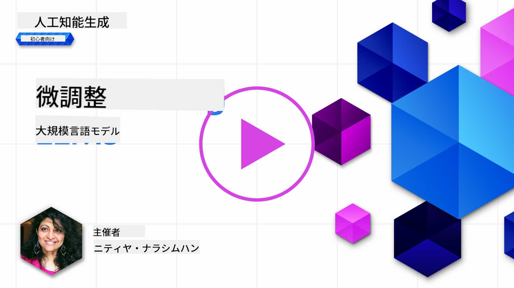
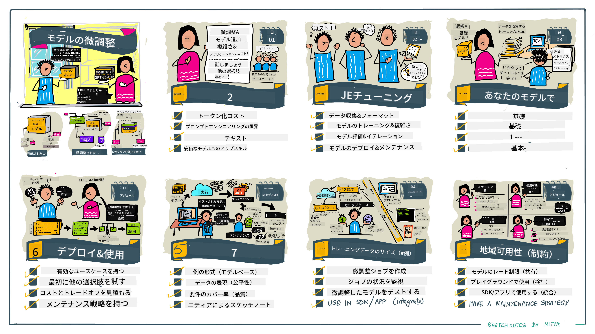

<!--
CO_OP_TRANSLATOR_METADATA:
{
  "original_hash": "68664f7e754a892ae1d8d5e2b7bd2081",
  "translation_date": "2025-06-26T00:34:46+00:00",
  "source_file": "18-fine-tuning/README.md",
  "language_code": "ja"
}
-->

# LLMの微調整

大規模言語モデルを使用して生成AIアプリケーションを構築することには新しい課題が伴います。重要な問題は、特定のユーザーリクエストに対してモデルが生成するコンテンツの応答品質（正確性と関連性）を確保することです。前回のレッスンでは、既存のモデルへのプロンプト入力を修正することで問題を解決しようとするプロンプトエンジニアリングや検索強化生成といった技術について説明しました。

今日のレッスンでは、第三の技術である**微調整**について説明します。この技術は、追加のデータでモデル自体を再訓練することで課題に取り組むものです。詳細を見ていきましょう。

## 学習目標

このレッスンでは、事前訓練された言語モデルの微調整の概念を紹介し、このアプローチの利点と課題を探り、生成AIモデルの性能を向上させるための微調整の使用方法とタイミングについてのガイドを提供します。

このレッスンを終えるまでに、次の質問に答えられるようになるでしょう：

- 言語モデルの微調整とは何ですか？
- 微調整が有用なのはいつ、なぜですか？
- 事前訓練されたモデルをどのように微調整できますか？
- 微調整の限界は何ですか？

準備はできましたか？始めましょう。

## イラスト付きガイド

詳細に入る前に、学ぶ内容の全体像を把握したいですか？このレッスンの学習の旅を説明するイラスト付きガイドをチェックしてください。微調整の核心概念と動機の学習から、微調整タスクを実行するプロセスとベストプラクティスの理解まで。これは探求するのに魅力的なトピックなので、自己学習の旅をサポートする追加リンクを見逃さないように[リソース](./RESOURCES.md?WT.mc_id=academic-105485-koreyst)ページをチェックしてください！

## 言語モデルの微調整とは？

定義上、大規模言語モデルはインターネットを含む多様なソースから得られた大量のテキストで事前訓練されています。前回のレッスンで学んだように、ユーザーの質問（「プロンプト」）へのモデルの応答の質を向上させるためには、プロンプトエンジニアリングや検索強化生成のような技術が必要です。

人気のあるプロンプトエンジニアリング技術は、モデルに応答で期待されることを指示（明示的なガイダンス）を提供するか、いくつかの例を示す（暗黙的なガイダンス）ことでより多くのガイダンスを与えることを含みます。これは「少数ショット学習」と呼ばれますが、二つの制限があります：

- モデルのトークン制限が、与えられる例の数を制限し、効果を制限する可能性があります。
- モデルのトークンコストが、各プロンプトに例を追加することを高価にし、柔軟性を制限する可能性があります。

微調整は、事前訓練されたモデルを取り、新しいデータで再訓練して特定のタスクの性能を向上させる機械学習システムで一般的な実践です。言語モデルのコンテキストでは、特定のタスクやアプリケーションドメインのために選定された例のセットで事前訓練されたモデルを微調整して、特定のタスクやドメインに対してより正確で関連性のある**カスタムモデル**を作成できます。微調整の副次的な利点は、少数ショット学習に必要な例の数を減らし、トークンの使用と関連コストを削減できることです。

## モデルを微調整するのはいつ、なぜ？

このコンテキストでは、微調整について話すとき、元の訓練データセットの一部ではなかった新しいデータを追加して再訓練する**監督付き**微調整を指します。これは、元のデータでモデルを再訓練するが異なるハイパーパラメータを使用する非監督付き微調整アプローチとは異なります。

覚えておくべき重要なことは、微調整は望ましい結果を得るためにある程度の専門知識が必要な高度な技術であるということです。誤って行うと、期待される改善が得られない可能性があり、ターゲットとするドメインに対するモデルの性能が低下する可能性もあります。

したがって、言語モデルを「どのように」微調整するかを学ぶ前に、「なぜ」このルートを取るべきか、「いつ」微調整のプロセスを開始するかを知る必要があります。まず、これらの質問を自問してみてください：

- **ユースケース**: 微調整のためのあなたの_ユースケース_は何ですか？現在の事前訓練モデルのどの側面を改善したいですか？
- **代替案**: 望ましい結果を達成するために_他の技術_を試しましたか？それらを比較のためのベースラインとして使用してください。
  - プロンプトエンジニアリング: 関連するプロンプト応答の例を用いた少数ショットプロンプトの技術を試してください。応答の質を評価します。
  - 検索強化生成: データを検索して取得したクエリ結果でプロンプトを強化してみてください。応答の質を評価します。
- **コスト**: 微調整のコストを特定しましたか？
  - 調整可能性 - 事前訓練モデルが微調整可能か？
  - 努力 - 訓練データの準備、モデルの評価と改良のための努力。
  - 計算 - 微調整ジョブの実行と微調整モデルのデプロイのための計算。
  - データ - 微調整の影響を与える十分な質の例へのアクセス。
- **利点**: 微調整の利点を確認しましたか？
  - 質 - 微調整されたモデルがベースラインを上回ったか？
  - コスト - プロンプトを簡素化することでトークン使用量を削減するか？
  - 拡張性 - ベースモデルを新しいドメインに再利用できるか？

これらの質問に答えることで、微調整があなたのユースケースにとって正しいアプローチかどうかを判断できるはずです。理想的には、利点がコストを上回る場合のみアプローチが有効です。進めることを決定したら、事前訓練モデルをどのように微調整できるかを考える時です。

意思決定プロセスについてもっと洞察を得たいですか？[微調整するかどうかの決定](https://www.youtube.com/watch?v=0Jo-z-MFxJs)を見てください。

## 事前訓練モデルをどのように微調整できますか？

事前訓練モデルを微調整するためには、次のものが必要です：

- 微調整する事前訓練モデル
- 微調整に使用するデータセット
- 微調整ジョブを実行する訓練環境
- 微調整モデルをデプロイするホスティング環境

## 微調整の実践

以下のリソースは、選定されたモデルと選定されたデータセットを使用した実際の例をステップバイステップで説明するチュートリアルを提供します。これらのチュートリアルを実行するには、特定のプロバイダーのアカウントが必要であり、関連するモデルとデータセットへのアクセスが必要です。

| プロバイダー     | チュートリアル                                                                                                                                                                       | 説明                                                                                                                                                                                                                                                                                                                                                                                                                        |
| ------------ | ------------------------------------------------------------------------------------------------------------------------------------------------------------------------------ | ---------------------------------------------------------------------------------------------------------------------------------------------------------------------------------------------------------------------------------------------------------------------------------------------------------------------------------------------------------------------------------------------------------------------------------- |
| OpenAI       | [チャットモデルの微調整方法](https://github.com/openai/openai-cookbook/blob/main/examples/How_to_finetune_chat_models.ipynb?WT.mc_id=academic-105485-koreyst)                | 訓練データの準備、微調整ジョブの実行、推論のための微調整モデルの使用によって特定のドメイン（「レシピアシスタント」）のために`gpt-35-turbo`を微調整する方法を学びます。                                                                                                                                                                                                                                              |
| Azure OpenAI | [GPT 3.5 Turbo微調整チュートリアル](https://learn.microsoft.com/azure/ai-services/openai/tutorials/fine-tune?tabs=python-new%2Ccommand-line?WT.mc_id=academic-105485-koreyst) | 訓練データの作成とアップロード、微調整ジョブの実行を行うステップを踏むことで、**Azure上で**`gpt-35-turbo-0613`モデルを微調整する方法を学びます。新しいモデルをデプロイし、使用します。                                                                                                                                                                                                                                                                 |
| Hugging Face | [Hugging FaceでのLLMの微調整](https://www.philschmid.de/fine-tune-llms-in-2024-with-trl?WT.mc_id=academic-105485-koreyst)                                               | このブログ記事は、Hugging Faceの[transformers](https://huggingface.co/docs/transformers/index?WT.mc_id=academic-105485-koreyst)ライブラリと[Transformer Reinforcement Learning (TRL)](https://huggingface.co/docs/trl/index?WT.mc_id=academic-105485-koreyst])を使用して、オープンな[データセット](https://huggingface.co/docs/datasets/index?WT.mc_id=academic-105485-koreyst)で_open LLM_（例：`CodeLlama 7B`）を微調整する方法を説明します。 |
|              |                                                                                                                                                                                |                                                                                                                                                                                                                                                                                                                                                                                                                                    |
| 🤗 AutoTrain | [AutoTrainでのLLMの微調整](https://github.com/huggingface/autotrain-advanced/?WT.mc_id=academic-105485-koreyst)                                                         | AutoTrain（またはAutoTrain Advanced）は、LLM微調整を含む多くの異なるタスクの微調整を可能にするHugging Faceによって開発されたPythonライブラリです。AutoTrainはコード不要のソリューションであり、微調整は自身のクラウド、Hugging Face Spaces、またはローカルで行うことができます。WebベースのGUI、CLI、yaml構成ファイルによる訓練をサポートしています。                                                                               |
|              |                                                                                                                                                                                |                                                                                                                                                                                                                                                                                                                                                                                                                                    |

## 課題

上記のチュートリアルのいずれかを選択し、それを実行してください。_これらのチュートリアルのバージョンを参考のためにこのリポジトリ内のJupyterノートブックで複製するかもしれません。最新バージョンを取得するためにオリジナルのソースを直接使用してください_。

## 素晴らしい仕事！学習を続けましょう。

このレッスンを完了した後、[生成AI学習コレクション](https://aka.ms/genai-collection?WT.mc_id=academic-105485-koreyst)をチェックして、生成AIの知識をさらに高めましょう！

おめでとうございます！このコースのv2シリーズの最終レッスンを完了しました！学びと構築を続けてください。**このトピックに関する追加の提案のリストについては[リソース](RESOURCES.md?WT.mc_id=academic-105485-koreyst)ページをチェックしてください。

v1シリーズのレッスンもより多くの課題と概念で更新されています。知識をリフレッシュするために少し時間を取り、これらのレッスンをコミュニティのために改善するために[質問とフィードバックを共有](https://github.com/microsoft/generative-ai-for-beginners/issues?WT.mc_id=academic-105485-koreyst)してください。

**免責事項**:  
この文書はAI翻訳サービス[Co-op Translator](https://github.com/Azure/co-op-translator)を使用して翻訳されています。正確さを追求していますが、自動翻訳には誤りや不正確さが含まれる可能性があることをご了承ください。元の言語での文書が権威ある情報源とみなされるべきです。重要な情報については、プロの人間による翻訳をお勧めします。この翻訳の使用に起因する誤解や誤解釈については、一切の責任を負いません。