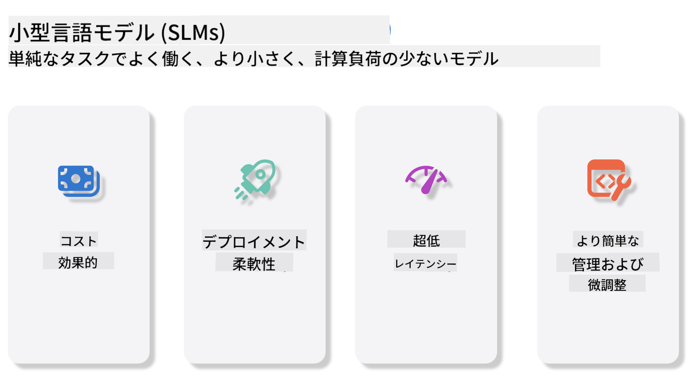
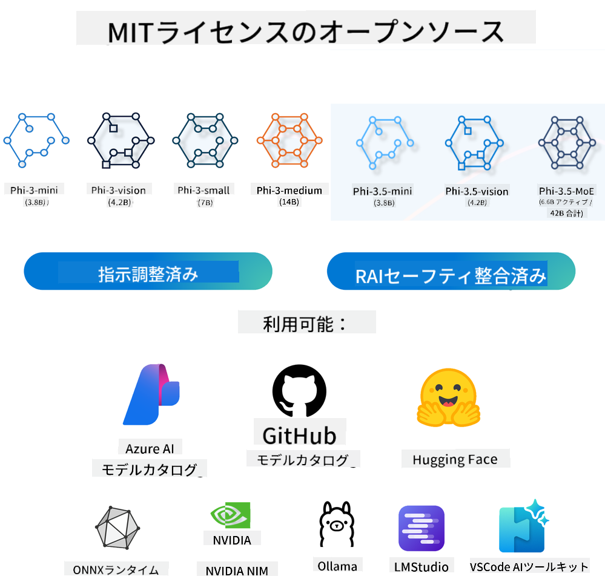
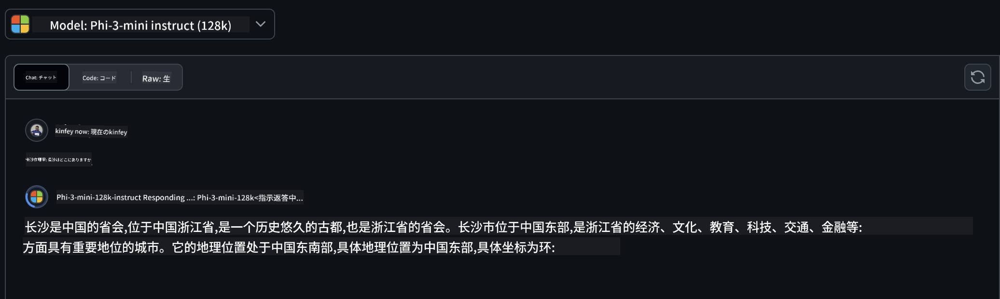
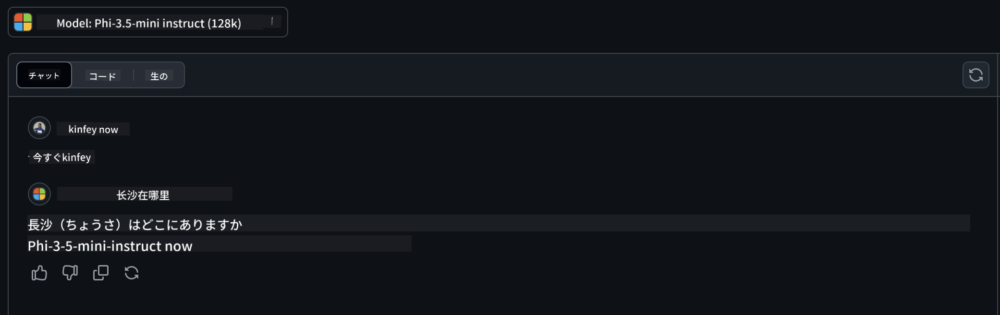

<!--
CO_OP_TRANSLATOR_METADATA:
{
  "original_hash": "124ad36cfe96f74038811b6e2bb93e9d",
  "translation_date": "2025-05-20T09:21:24+00:00",
  "source_file": "19-slm/README.md",
  "language_code": "ja"
}
-->
# 初心者向け生成AIのための小型言語モデル入門

生成AIは、新しいコンテンツを生成する能力を持つシステムを作成することに焦点を当てた人工知能の魅力的な分野です。このコンテンツは、テキストや画像から音楽、さらには仮想環境全体に至るまで多岐にわたります。生成AIの最も興味深い応用の一つは、言語モデルの領域にあります。

## 小型言語モデルとは何か？

小型言語モデル（SLM）は、大型言語モデル（LLM）の縮小版を表し、LLMの多くのアーキテクチャ原則と技術を活用しつつ、計算フットプリントを大幅に削減しています。SLMは、人間のようなテキストを生成するために設計された言語モデルのサブセットです。GPT-4のような大きなモデルとは異なり、SLMはよりコンパクトで効率的であり、計算資源が限られているアプリケーションに最適です。その小さなサイズにもかかわらず、さまざまなタスクを実行することができます。通常、SLMはLLMを圧縮または蒸留することによって構築され、元のモデルの機能と言語能力の大部分を保持することを目指しています。このモデルサイズの削減は、全体的な複雑さを減少させ、SLMをメモリ使用量と計算要件の両方においてより効率的にします。これらの最適化にもかかわらず、SLMは依然として広範な自然言語処理（NLP）タスクを実行することができます：

- テキスト生成：一貫性があり、文脈に関連する文や段落を作成する。
- テキスト補完：与えられたプロンプトに基づいて文を予測し補完する。
- 翻訳：テキストをある言語から別の言語に変換する。
- 要約：長いテキストを短く、より消化しやすい要約に凝縮する。

ただし、性能や理解の深さにおいて、より大きなモデルと比べていくつかのトレードオフがあります。

## 小型言語モデルはどのように機能するのか？

SLMは膨大な量のテキストデータを用いて訓練されます。訓練中に、言語のパターンと構造を学び、文法的に正しく、文脈に適したテキストを生成する能力を身につけます。訓練プロセスには以下が含まれます：

- データ収集：さまざまなソースから大量のテキストデータを収集する。
- 前処理：データをクリーニングし、訓練に適した形に整理する。
- 訓練：機械学習アルゴリズムを用いてモデルにテキストを理解し生成する方法を教える。
- 微調整：特定のタスクでの性能を向上させるためにモデルを調整する。

SLMの開発は、モバイルデバイスやエッジコンピューティングプラットフォームなど、資源が制約された環境で展開可能なモデルの増加するニーズに合致しています。効率に焦点を当てることで、SLMは性能とアクセス性のバランスを取り、さまざまなドメインでの広範な応用を可能にします。



## 学習目標

このレッスンでは、SLMの知識を紹介し、Microsoft Phi-3と組み合わせてテキストコンテンツ、ビジョン、MoEの異なるシナリオを学ぶことを目指します。レッスンの終わりまでに、以下の質問に答えられるようになることを期待しています：

- SLMとは何か
- SLMとLLMの違いは何か
- Microsoft Phi-3/3.5ファミリーとは何か
- Microsoft Phi-3/3.5ファミリーをどのように推論するか

準備はいいですか？始めましょう。

## 大型言語モデル（LLM）と小型言語モデル（SLM）の違い

LLMとSLMはどちらも確率的機械学習の基本原則に基づいて構築されており、アーキテクチャ設計、訓練方法論、データ生成プロセス、モデル評価技術において類似のアプローチを採用しています。しかし、これらの2つのモデルにはいくつかの重要な違いがあります。

## 小型言語モデルの応用

SLMは以下を含む広範な応用を持っています：

- チャットボット：カスタマーサポートを提供し、ユーザーと会話形式で交流する。
- コンテンツ作成：アイデアを生成したり、記事全体を執筆したりすることでライターを支援する。
- 教育：学生の作文課題を助けたり、新しい言語を学ぶのを助けたりする。
- アクセシビリティ：音声読み上げシステムなど、障害のある個人のためのツールを作成する。

**サイズ**

LLMとSLMの主な違いはモデルの規模にあります。ChatGPT（GPT-4）のようなLLMは推定1.76兆のパラメータを含むことができますが、Mistral 7BのようなオープンソースSLMは約70億のパラメータで設計されています。この違いは主にモデルアーキテクチャと訓練プロセスの違いによるものです。例えば、ChatGPTはエンコーダーデコーダーフレームワーク内で自己注意メカニズムを採用していますが、Mistral 7Bはスライディングウィンドウ注意を使用しており、デコーダーのみのモデル内でより効率的な訓練を可能にします。このアーキテクチャの違いは、これらのモデルの複雑さと性能に重大な影響を与えます。

**理解**

SLMは通常、特定のドメイン内での性能を最適化されており、高度に専門化されていますが、複数の知識分野にわたる広範な文脈理解を提供する能力が制限される可能性があります。一方、LLMはより包括的なレベルで人間のような知能をシミュレートすることを目指しています。膨大で多様なデータセットで訓練されたLLMは、さまざまなドメインで良好な性能を発揮するように設計されており、より高い汎用性と適応性を提供します。したがって、LLMは自然言語処理やプログラミングなど、より広範な下流タスクに適しています。

**計算**

LLMの訓練と展開は資源集約的なプロセスであり、大規模なGPUクラスターを含む重大な計算インフラストラクチャを必要とすることがよくあります。例えば、ChatGPTのようなモデルをゼロから訓練するには、何千ものGPUが長期間にわたって必要になるかもしれません。一方、SLMはそのパラメータ数が少ないため、計算資源の観点でよりアクセスしやすいです。Mistral 7Bのようなモデルは、中程度のGPU能力を備えたローカルマシンで訓練および実行することができますが、訓練には依然として複数のGPUを使用して数時間かかります。

**バイアス**

バイアスはLLMにおける既知の問題であり、主に訓練データの性質によるものです。これらのモデルはしばしばインターネットからの生のオープンデータに依存しており、特定のグループを過小評価または誤った表現をしたり、誤ったラベル付けを導入したり、方言、地理的変動、および文法規則によって影響を受けた言語バイアスを反映したりする可能性があります。さらに、LLMアーキテクチャの複雑さは、注意深い微調整がなければ気付かれずにバイアスを悪化させる可能性があります。一方、SLMはより制約されたドメイン特化のデータセットで訓練されているため、そのようなバイアスに対して本質的に影響を受けにくいですが、免疫ではありません。

**推論**

SLMのサイズが小さいため、推論速度において大きな利点を提供し、広範な並列処理を必要とせずにローカルハードウェア上で効率的に出力を生成することができます。対照的に、LLMはそのサイズと複雑さのために、許容可能な推論時間を達成するために多大な並列計算資源を必要とすることがよくあります。複数の同時ユーザーの存在は、特にスケールで展開される場合、LLMの応答時間をさらに遅くします。

まとめると、LLMとSLMはどちらも機械学習の基礎に基づいていますが、モデルサイズ、資源要件、文脈理解、バイアスの影響、推論速度の観点で大きく異なります。これらの違いは、異なる使用例に対するそれぞれの適性を反映しており、LLMはより汎用性が高いが資源集約的であり、SLMはよりドメイン特化の効率を提供し、計算要求が少ないです。

***注意：この章では、Microsoft Phi-3 / 3.5を例としてSLMを紹介します。***

## Phi-3 / Phi-3.5ファミリーの紹介

Phi-3 / 3.5ファミリーは主にテキスト、ビジョン、およびエージェント（MoE）アプリケーションシナリオを対象としています：

### Phi-3 / 3.5 Instruct

主にテキスト生成、チャット補完、およびコンテンツ情報抽出などに使用されます。

**Phi-3-mini**

3.8Bの言語モデルはMicrosoft Azure AI Studio、Hugging Face、およびOllamaで利用可能です。Phi-3モデルは、同等およびより大きなサイズの言語モデルを主要なベンチマークで大幅に上回ります（以下のベンチマーク数値を参照、数値が高いほど良い）。Phi-3-miniはそのサイズの2倍のモデルを上回り、Phi-3-smallとPhi-3-mediumはGPT-3.5を含むより大きなモデルを上回ります。

**Phi-3-small & medium**

わずか7Bのパラメータで、Phi-3-smallはさまざまな言語、推論、コーディング、および数学のベンチマークでGPT-3.5Tを上回ります。14Bのパラメータを持つPhi-3-mediumはこの傾向を続け、Gemini 1.0 Proを上回ります。

**Phi-3.5-mini**

Phi-3-miniのアップグレードと考えることができます。パラメータは変わりませんが、複数の言語をサポートする能力を向上させ（20以上の言語をサポート：アラビア語、中国語、チェコ語、デンマーク語、オランダ語、英語、フィンランド語、フランス語、ドイツ語、ヘブライ語、ハンガリー語、イタリア語、日本語、韓国語、ノルウェー語、ポーランド語、ポルトガル語、ロシア語、スペイン語、スウェーデン語、タイ語、トルコ語、ウクライナ語）​​、長いコンテキストのサポートを強化します。3.8Bのパラメータを持つPhi-3.5-miniは同じサイズの言語モデルを上回り、そのサイズの2倍のモデルと同等です。

### Phi-3 / 3.5 Vision

Phi-3/3.5のInstructモデルをPhiの理解能力と考えることができ、VisionはPhiに世界を理解する目を与えます。

**Phi-3-Vision**

わずか4.2Bのパラメータを持つPhi-3-visionはこの傾向を続け、一般的な視覚推論タスク、OCR、表および図の理解タスクでClaude-3 HaikuやGemini 1.0 Pro Vなどのより大きなモデルを上回ります。

**Phi-3.5-Vision**

Phi-3-Visionのアップグレードでもあり、複数の画像をサポートするように改良されています。画像だけでなく、ビデオも見ることができるビジョンの改善と考えることができます。Phi-3.5-visionはOCR、表およびチャート理解タスクでClaude-3.5 SonnetやGemini 1.5 Flashなどのより大きなモデルを上回り、一般的な視覚知識推論タスクで同等です。複数フレーム入力をサポートし、すなわち複数の入力画像に対して推論を行います。

### Phi-3.5-MoE

***Mixture of Experts(MoE)***は、モデルを事前訓練する際に計算量を大幅に削減することを可能にし、密集モデルと同じ計算予算でモデルまたはデータセットサイズを劇的に拡大することができます。特に、MoEモデルは事前訓練中に密集モデルと同じ品質をはるかに早く達成するべきです。Phi-3.5-MoEは16x3.8Bのエキスパートモジュールで構成されています。Phi-3.5-MoEはわずか6.6Bのアクティブパラメータで、より大きなモデルと同様の推論、言語理解、および数学を達成します。

Phi-3/3.5ファミリーモデルを異なるシナリオに基づいて使用することができます。LLMとは異なり、Phi-3/3.5-miniまたはPhi-3/3.5-Visionをエッジデバイスに展開することができます。

## Phi-3/3.5ファミリーモデルの使用方法

異なるシナリオでPhi-3/3.5を使用することを望んでいます。次に、異なるシナリオに基づいてPhi-3/3.5を使用します。



### 推論の違い

クラウドのAPI

**GitHubモデル**

GitHub


Modelsは最も直接的な方法です。GitHub Modelsを通じてPhi-3/3.5-Instructモデルに迅速にアクセスできます。Azure AI Inference SDK / OpenAI SDKと組み合わせることで、コードを通じてAPIにアクセスし、Phi-3/3.5-Instruct呼び出しを完了できます。また、Playgroundを通じて異なる効果をテストすることもできます。- デモ: 中国のシナリオにおけるPhi-3-miniとPhi-3.5-miniの効果の比較   **Azure AI Studio** あるいは、ビジョンやMoEモデルを使用したい場合は、Azure AI Studioを使用して呼び出しを完了できます。興味がある場合は、Phi-3 Cookbookを読んで、Azure AI Studioを通じてPhi-3/3.5 Instruct、Vision、MoEを呼び出す方法を学ぶことができます [このリンクをクリック](https://github.com/microsoft/Phi-3CookBook/blob/main/md/02.QuickStart/AzureAIStudio_QuickStart.md?WT.mc_id=academic-105485-koreyst) **NVIDIA NIM** AzureやGitHubが提供するクラウドベースのModel Catalogソリューションに加えて、[Nivida NIM](https://developer.nvidia.com/nim?WT.mc_id=academic-105485-koreyst)を使用して関連する呼び出しを完了することもできます。NIVIDA NIMを訪問してPhi-3/3.5 FamilyのAPI呼び出しを完了できます。NVIDIA NIM（NVIDIA Inference Microservices）は、開発者がAIモデルを効率的に展開できるように設計された高速化された推論マイクロサービスのセットで、クラウド、データセンター、ワークステーションなどさまざまな環境で利用できます。NVIDIA NIMの主な特徴は次のとおりです: - **展開の容易さ:** NIMはAIモデルの展開を単一のコマンドで可能にし、既存のワークフローに簡単に統合できます。 - **最適化されたパフォーマンス:** TensorRTやTensorRT-LLMなどのNVIDIAの事前最適化された推論エンジンを活用し、低レイテンシーと高スループットを実現します。 - **スケーラビリティ:** NIMはKubernetesでの自動スケーリングをサポートし、変動するワークロードに効果的に対応できます。 - **セキュリティとコントロール:** 組織は自社の管理インフラストラクチャでNIMマイクロサービスを自己ホスティングすることで、データとアプリケーションの管理を維持できます。 - **標準API:** NIMは業界標準のAPIを提供し、チャットボットやAIアシスタントなどのAIアプリケーションを簡単に構築および統合できます。NIMはNVIDIA AI Enterpriseの一部であり、AIモデルの展開と運用を簡素化し、NVIDIA GPU上で効率的に動作させることを目的としています。- デモ: Nividia NIMを使用してPhi-3.5-Vision-APIを呼び出す [[このリンクをクリック](../../../19-slm/python/Phi-3-Vision-Nividia-NIM.ipynb)] ### ローカル環境でのPhi-3/3.5の推論 Phi-3やGPT-3のような言語モデルに関連する推論は、受け取った入力に基づいて応答や予測を生成するプロセスを指します。Phi-3にプロンプトや質問を提供すると、それが訓練されたニューラルネットワークを使用して、訓練されたデータのパターンや関係を分析することで最も可能性が高く関連性のある応答を推測します。 **Hugging Face Transformer** Hugging Face Transformersは、自然言語処理（NLP）やその他の機械学習タスクのために設計された強力なライブラリです。その主なポイントは以下の通りです: 1. **事前訓練済みモデル:** テキスト分類、名前付きエンティティ認識、質問応答、要約、翻訳、テキスト生成などのさまざまなタスクに使用できる数千の事前訓練済みモデルを提供します。 2. **フレームワークの互換性:** PyTorch、TensorFlow、JAXなどの複数の深層学習フレームワークをサポートしており、1つのフレームワークでモデルを訓練し、別のフレームワークで使用できます。 3. **マルチモーダル機能:** NLPの他にも、Hugging Face Transformersはコンピュータービジョン（例: 画像分類、物体検出）や音声処理（例: 音声認識、音声分類）のタスクもサポートしています。 4. **使いやすさ:** ライブラリはモデルのダウンロードと微調整を簡単に行うためのAPIとツールを提供し、初心者から専門家までアクセスしやすくしています。 5. **コミュニティとリソース:** Hugging Faceは活気あるコミュニティを持ち、ユーザーがライブラリを始めるのに役立つ豊富なドキュメント、チュートリアル、ガイドを提供しています。[公式ドキュメント](https://huggingface.co/docs/transformers/index?WT.mc_id=academic-105485-koreyst)またはその[GitHubリポジトリ](https://github.com/huggingface/transformers?WT.mc_id=academic-105485-koreyst)。これは最も一般的に使用される方法ですが、GPUアクセラレーションも必要です。結局、VisionやMoEのようなシーンは多くの計算を必要とし、量子化されていない場合、CPUでは非常に制限されます。- デモ: Transformerを使用してPhi-3.5-Instuctを呼び出す [このリンクをクリック](../../../19-slm/python/phi35-instruct-demo.ipynb) - デモ: Transformerを使用してPhi-3.5-Visionを呼び出す[このリンクをクリック](../../../19-slm/python/phi35-vision-demo.ipynb) - デモ: Transformerを使用してPhi-3.5-MoEを呼び出す[このリンクをクリック](../../../19-slm/python/phi35_moe_demo.ipynb) **Ollama** [Ollama](https://ollama.com/?WT.mc_id=academic-105485-koreyst)は、大規模言語モデル（LLM）をローカルで実行するのを簡単にするために設計されたプラットフォームです。Llama 3.1、Phi 3、Mistral、Gemma 2など、さまざまなモデルをサポートしています。このプラットフォームは、モデルの重み、構成、データを単一のパッケージにまとめることでプロセスを簡素化し、ユーザーが自分のモデルをカスタマイズし作成するのをよりアクセスしやすくします。OllamaはmacOS、Linux、Windowsで利用可能です。クラウドサービスに頼らずにLLMを実験または展開したい場合には素晴らしいツールです。Ollamaは最も直接的な方法であり、次のステートメントを実行するだけです。 ```bash

ollama run phi3.5

``` **ONNX Runtime for GenAI** [ONNX Runtime](https://github.com/microsoft/onnxruntime-genai?WT.mc_id=academic-105485-koreyst)は、クロスプラットフォームの推論およびトレーニングの機械学習アクセラレータです。ONNX Runtime for Generative AI (GENAI)は、さまざまなプラットフォームで生成AIモデルを効率的に実行するのを助ける強力なツールです。 ## ONNX Runtimeとは何ですか？ ONNX Runtimeは、機械学習モデルの高性能推論を可能にするオープンソースプロジェクトです。これは、機械学習モデルを表現する標準であるOpen Neural Network Exchange (ONNX)形式のモデルをサポートしています。ONNX Runtime推論は、PyTorchやTensorFlow/Kerasなどの深層学習フレームワークからのモデル、またはscikit-learn、LightGBM、XGBoostなどの古典的な機械学習ライブラリをサポートし、より速い顧客体験とコスト削減を可能にします。ONNX Runtimeは異なるハードウェア、ドライバー、オペレーティングシステムに対応しており、グラフ最適化や変換とともにハードウェアアクセラレータを活用することで最適なパフォーマンスを提供します。 ## Generative AIとは何ですか？ Generative AIは、訓練されたデータに基づいてテキスト、画像、音楽などの新しいコンテンツを生成できるAIシステムを指します。例としては、GPT-3のような言語モデルやStable Diffusionのような画像生成モデルがあります。ONNX Runtime for GenAIライブラリは、ONNXモデルのための生成AIループを提供し、ONNX Runtimeによる推論、ロジット処理、検索とサンプリング、KVキャッシュ管理を含みます。 ## ONNX Runtime for GENAI ONNX Runtime for GENAIは、生成AIモデルをサポートするためにONNX Runtimeの機能を拡張します。以下はその主な特徴です: - **広範なプラットフォームサポート:** Windows、Linux、macOS、Android、iOSなど、さまざまなプラットフォームで動作します。 - **モデルサポート:** LLaMA、GPT-Neo、BLOOMなどの多くの人気のある生成AIモデルをサポートしています。 - **パフォーマンス最適化:** NVIDIA GPU、AMD GPUなどの異なるハードウェアアクセラレータに対する最適化を含んでいます。 - **使いやすさ:** アプリケーションへの簡単な統合を可能にするAPIを提供し、最小限のコードでテキスト、画像、その他のコンテンツを生成できます。 - ユーザーは高レベルのgenerate()メソッドを呼び出すか、モデルの各イテレーションをループで実行し、1回のトークンを生成し、オプションでループ内で生成パラメータを更新することができます。 - ONNX Runtimeはまた、トークンシーケンスを生成するための貪欲/ビーム検索とTopP、TopKサンプリングをサポートしており、反復ペナルティのような組み込みのロジット処理を提供します。カスタムスコアリングも簡単に追加できます。 ## 始めるには ONNX Runtime for GENAIを始めるには、以下の手順を実行できます: ### ONNX Runtimeのインストール: ```Python
pip install onnxruntime
``` ### Generative AI Extensionsのインストール: ```Python
pip install onnxruntime-genai
``` ### モデルの実行: ここにPythonの簡単な例があります: ```Python
import onnxruntime_genai as og

model = og.Model('path_to_your_model.onnx')

tokenizer = og.Tokenizer(model)

input_text = "Hello, how are you?"

input_tokens = tokenizer.encode(input_text)

output_tokens = model.generate(input_tokens)

output_text = tokenizer.decode(output_tokens)

print(output_text) 
``` ### デモ: ONNX Runtime GenAIを使用してPhi-3.5-Visionを呼び出す ```python

import onnxruntime_genai as og

model_path = './Your Phi-3.5-vision-instruct ONNX Path'

img_path = './Your Image Path'

model = og.Model(model_path)

processor = model.create_multimodal_processor()

tokenizer_stream = processor.create_stream()

text = "Your Prompt"

prompt = "<|user|>\n"

prompt += "<|image_1|>\n"

prompt += f"{text}<|end|>\n"

prompt += "<|assistant|>\n"

image = og.Images.open(img_path)

inputs = processor(prompt, images=image)

params = og.GeneratorParams(model)

params.set_inputs(inputs)

params.set_search_options(max_length=3072)

generator = og.Generator(model, params)

while not generator.is_done():

    generator.compute_logits()
    
    generator.generate_next_token()

    new_token = generator.get_next_tokens()[0]
    
    code += tokenizer_stream.decode(new_token)
    
    print(tokenizer_stream.decode(new_token), end='', flush=True)

``` **その他** ONNX RuntimeやOllamaの参照方法に加えて、異なるメーカーが提供するモデル参照方法に基づいて定量化モデルの参照を完了することもできます。例えば、Apple Metalを使用したApple MLXフレームワーク、NPUを使用したQualcomm QNN、CPU/GPUを使用したIntel OpenVINOなどがあります。さらに多くのコンテンツを[Phi-3 Cookbook](https://github.com/microsoft/phi-3cookbook?WT.mc_id=academic-105485-koreyst)から入手できます。 ## もっと 私たちはPhi-3/3.5 Familyの基本を学びましたが、SLMについてもっと学ぶためにはさらなる知識が必要です。Phi-3 Cookbookで答えを見つけることができます。もっと学びたい場合は、[Phi-3 Cookbook](https://github.com/microsoft/phi-3cookbook?WT.mc_id=academic-105485-koreyst)を訪問してください。

**免責事項**:
この文書はAI翻訳サービス[Co-op Translator](https://github.com/Azure/co-op-translator)を使用して翻訳されています。正確さを期しておりますが、自動翻訳には誤りや不正確さが含まれる可能性があることをご承知おきください。元の言語による原文が権威ある情報源と見なされるべきです。重要な情報については、専門の人間による翻訳をお勧めします。この翻訳の使用により生じた誤解や誤訳については、一切の責任を負いかねます。