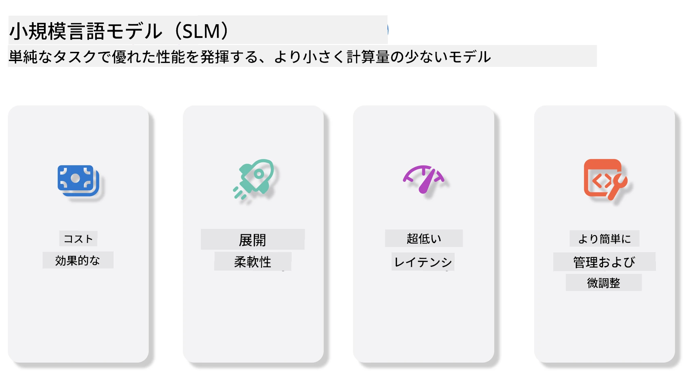
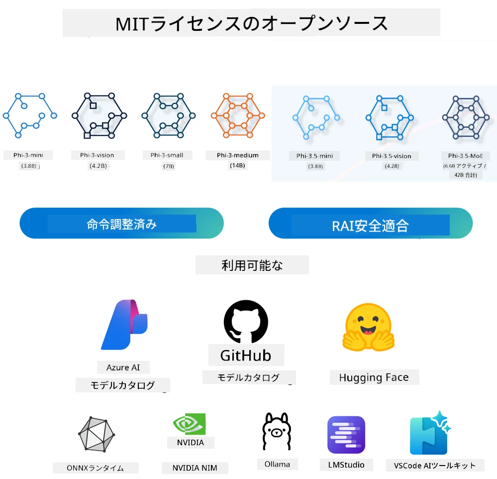
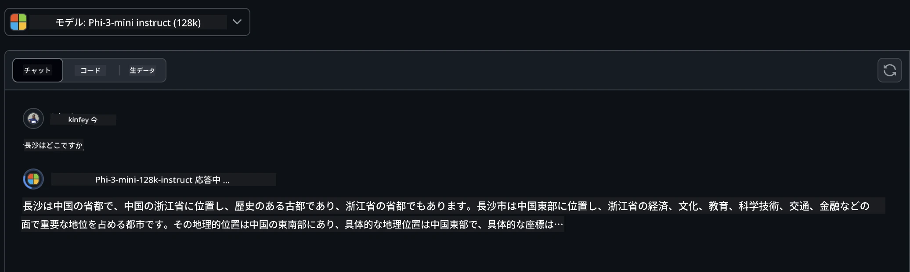
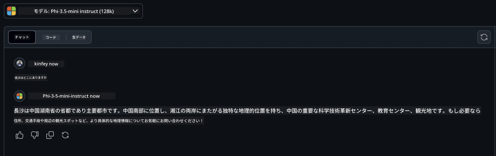

# 初心者向け生成AIのための小型言語モデル入門
生成AIは、新しいコンテンツを生成する能力を持つシステムの構築に焦点を当てた人工知能の魅力的な分野です。このコンテンツはテキストや画像から音楽、さらには仮想環境全体にまで及びます。生成AIの最もエキサイティングな応用の一つは、言語モデルの分野にあります。

## 小型言語モデルとは何か？

小型言語モデル（SLM）は、大型言語モデル（LLM）の縮小版であり、LLMの多くのアーキテクチャ的原理や技術を活用しながら、計算負荷を大幅に削減しています。

SLMは、人間らしいテキストを生成するために設計された言語モデルの一種です。GPT-4のような大規模モデルとは異なり、SLMはよりコンパクトで効率的であり、計算資源が限られた環境に適しています。サイズは小さいものの、さまざまなタスクをこなすことが可能です。通常、SLMはLLMを圧縮または蒸留して構築され、元のモデルの機能や言語能力の多くを維持することを目指しています。モデルサイズの縮小により、全体的な複雑さが減少し、メモリ使用量や計算要求の面でSLMはより効率的になります。これらの最適化にもかかわらず、SLMは幅広い自然言語処理（NLP）タスクをこなせます：

- テキスト生成：整合性があり文脈に合った文や段落を作成
- テキスト補完：与えられたプロンプトに基づき文を予測・完結
- 翻訳：ある言語のテキストを別の言語に変換
- 要約：長文を短く消化しやすい概要に凝縮

大規模モデルに比べパフォーマンスや理解の深さには多少のトレードオフがあります。

## 小型言語モデルはどのように動作するのか？

SLMは大量のテキストデータで訓練されます。訓練中に言語のパターンや構造を学び、文法的に正しく文脈に適したテキストを生成できるようになります。訓練過程は次の通りです：

- データ収集：さまざまなソースから大量のテキストデータを集める
- 前処理：訓練に適した形にデータを整理・クリーンアップ
- 訓練：機械学習アルゴリズムを用いてモデルにテキストの理解と生成を学習させる
- ファインチューニング：特定タスクの性能向上のためにモデルを調整

SLMの開発は、モバイル端末やエッジコンピューティングプラットフォームなど、完全なLLMがリソース制約により非現実的な環境で展開可能なモデルへの需要増加に合致しています。効率性に注力することで、SLMはパフォーマンスとアクセスしやすさのバランスを取り、さまざまな領域への応用を拡大しています。



## 学習目標

このレッスンでは、SLMの知識を紹介し、Microsoft Phi-3と組み合わせてテキストコンテンツ、ビジョン、MoEの様々なシナリオを学びます。

このレッスンの終了時点で、以下の質問に答えられるようになることを目指します：

- SLMとは何か？
- SLMとLLMの違いは何か？
- Microsoft Phi-3/3.5ファミリーとは何か？
- Microsoft Phi-3/3.5ファミリーで推論を実行する方法は？

準備はいいですか？始めましょう。

## 大型言語モデル（LLM）と小型言語モデル（SLM）の違い

LLMとSLMはどちらも確率的機械学習の基礎原理に基づき、アーキテクチャ設計、訓練方法論、データ生成、モデル評価など似たアプローチを取り入れています。しかし、いくつかの重要な要素が両者を区別しています。

## 小型言語モデルの用途

SLMは広範な用途に活用されています。例として：

- チャットボット：顧客サポートやユーザーとの対話
- コンテンツ作成：アイデア生成や記事のドラフト作成支援
- 教育：学生のライティング支援や新しい言語の学習支援
- アクセシビリティ：テキスト読み上げシステムなど障害者向けツール

**サイズ**

LLMとSLMの主な違いはモデルの規模にあります。ChatGPT (GPT-4) のようなLLMは約1.76兆パラメータを持つのに対し、Mistral 7BのようなオープンソースのSLMは約70億パラメータとかなり少ないです。この差はモデルのアーキテクチャや訓練プロセスの違いに起因します。例えば、ChatGPTはエンコーダ・デコーダ構造で自己注意機構を使用する一方、Mistral 7Bはデコーダオンリーのモデルでスライディングウィンドウアテンションを用いてより効率的な訓練を実現しています。このアーキテクチャの違いはモデルの複雑さや性能に大きく影響します。

**理解力**

SLMは通常、特定のドメイン内での性能最適化がされており、高度に専門化されていますが、幅広い知識領域での文脈理解は限定的かもしれません。一方、LLMは大規模で多様なデータセットを用いて訓練され、人間のような包括的な知能を模倣することを目指しています。そのため、LLMは多岐にわたる下流タスク、例えば自然言語処理やプログラミングに適しています。

**計算資源**

LLMの訓練と展開は非常にリソース集約的であり、大規模なGPUクラスターが必要です。例えば、ChatGPTのようなモデルをゼロから訓練するには数千のGPUを長期間使うことが求められます。一方、SLMはパラメータ数が少ないため、比較的少ない計算資源でアクセス可能です。Mistral 7Bのようなモデルは中程度のGPU搭載ローカルマシンでも訓練・実行可能ですが、訓練には複数GPUで数時間を要します。

**バイアス**

LLMは訓練データの性質からバイアス問題が知られています。これらのモデルはインターネットから収集された生データに依存するため、特定の集団の過小評価や誤ったラベル付け、方言や地理的変異、文法ルールに起因する言語的バイアスが含まれることがあります。加えて、LLMの複雑な構造がバイアスを無意識に増幅する場合もあります。対照的に、SLMはより制約された特定ドメインのデータセットで訓練されることが多く、そのためバイアスの影響は比較的少ないですが、完全に免れるわけではありません。

**推論**

SLMはサイズの縮小により推論速度が大幅に向上し、広範な並列処理を必要とせずにローカルハードウェア上で効率的に出力を生成できます。一方、LLMはサイズと複雑さのため、受理可能な推論時間を得るには多大な並列計算資源が必要です。さらに、複数ユーザーの同時利用があると応答速度が遅くなることも多いです。

まとめると、LLMとSLMは機械学習の基礎を共有しつつ、モデルサイズ、リソース要件、文脈理解力、バイアスの影響、推論速度において大きく異なります。これらの違いは、それぞれのユースケースにおける適合性の差異を示しており、LLMは多用途だがリソース重視、SLMは特定ドメインに効率的で計算負荷の低い選択肢となります。

***注：このレッスンでは、例としてMicrosoft Phi-3 / 3.5を用いてSLMを紹介します。***

## Phi-3 / Phi-3.5ファミリーの紹介

Phi-3 / 3.5ファミリーは主にテキスト、ビジョン、エージェント（MoE）アプリケーションシナリオを対象としています。

### Phi-3 / 3.5インストラクト

主にテキスト生成、チャット補完、コンテンツ情報抽出などに用いられます。

**Phi-3-mini**

3.8Bパラメータの言語モデルがMicrosoft Azure AI Studio、Hugging Face、Ollamaで利用可能です。Phi-3モデルは同サイズ以上の言語モデルに対して、主要ベンチマークで大きく上回る性能を示しています（以下のベンチマーク数値参照、数値が高いほど良い）。Phi-3-miniは自身の2倍サイズのモデルを上回り、Phi-3-smallとPhi-3-mediumはGPT-3.5を含むより大きなモデルに勝ります。

**Phi-3-small & medium**

7BパラメータのPhi-3-smallは多様な言語推論、コーディング、数学ベンチマークでGPT-3.5Tを上回ります。

Phi-3-mediumは14Bパラメータでこの傾向を継続し、Gemini 1.0 Proを凌駕します。

**Phi-3.5-mini**

Phi-3-miniのアップグレード版と考えられます。パラメータ数は変わらないものの、多言語対応能力が強化され（20以上の言語をサポート：アラビア語、中国語、チェコ語、デンマーク語、オランダ語、英語、フィンランド語、フランス語、ドイツ語、ヘブライ語、ハンガリー語、イタリア語、日本語、韓国語、ノルウェー語、ポーランド語、ポルトガル語、ロシア語、スペイン語、スウェーデン語、タイ語、トルコ語、ウクライナ語）、長文文脈対応も強化されています。

Phi-3.5-mini（3.8Bパラメータ）は同サイズの言語モデルを上回り、2倍サイズのモデルと同等の性能です。

### Phi-3 / 3.5ビジョン

Phi-3/3.5のInstructモデルはPhiの理解能力を示し、VisionはPhiに「目」を与えて世界を理解させる役割を持ちます。

**Phi-3-Vision**

4.2BパラメータのPhi-3-Visionは、Claude-3 HaikuやGemini 1.0 Pro Vなどより大きなモデルに対し、一般的な視覚推論、OCR、表や図の理解タスクで優れた性能を発揮します。

**Phi-3.5-Vision**

Phi-3.5-VisionはPhi-3-Visionのアップグレード版で、多画像対応を追加。単に画像を見られるだけでなく、動画も理解可能と言えます。

Phi-3.5-VisionはClaude-3.5 SonnetやGemini 1.5 Flashなどの大きなモデルと比較してOCRや表・チャートの理解タスクで優越し、一般的な視覚知識推論タスクでも同等です。複数フレーム入力をサポートし、多数の画像間での推論が可能です。

### Phi-3.5-MoE

***Mixture of Experts (MoE)*** は、従来より少ない計算資源で事前学習が可能なモデルアーキテクチャで、同じ計算予算でモデルやデータセットの規模を大幅に拡大できます。特にMoEモデルは密結合モデルと同等の品質をより速く獲得できます。

Phi-3.5-MoEは16×3.8Bのエキスパートモジュールで構成されます。6.6Bのアクティブパラメータながら、より大きなモデルと同等レベルの推論、言語理解、数学能力を持ちます。

Phi-3/3.5ファミリーはシナリオに応じて使い分け可能です。LLMと違い、Phi-3/3.5-miniやPhi-3/3.5-Visionはエッジデバイス上での展開が可能です。

## Phi-3/3.5ファミリーモデルの使い方

Phi-3/3.5を様々なシナリオで利用します。以下にシナリオ別でのPhi-3/3.5の利用方法を示します。



### クラウドAPIによる推論

**GitHub Models**

GitHub Modelsは最も直接的な手段です。GitHub Modelsを通じてPhi-3/3.5-Instructモデルに迅速にアクセス可能です。Azure AI Inference SDK / OpenAI SDKと組み合わせてコード経由でAPIにアクセスし、Phi-3/3.5-Instructを呼び出せます。またPlaygroundを使い異なる効果をテスト可能です。

- デモ：中国語シナリオでのPhi-3-miniとPhi-3.5-miniの効果比較






**Azure AI Studio**

もしビジョンやMoEモデルを使いたい場合、Azure AI Studioを使って呼び出せます。興味のある方はPhi-3 Cookbookを読み、Azure AI Studio経由でPhi-3/3.5 Instruct、Vision、MoEの呼び出し方法を学べます。[こちらのリンクをクリック](https://github.com/microsoft/Phi-3CookBook/blob/main/md/02.QuickStart/AzureAIStudio_QuickStart.md?WT.mc_id=academic-105485-koreyst)

**NVIDIA NIM**

AzureやGitHubが提供するクラウドベースのモデルカタログ以外に、[NVIDIA NIM](https://developer.nvidia.com/nim?WT.mc_id=academic-105485-koreyst)でも関連呼び出しが可能です。NVIDIA NIM（NVIDIA Inference Microservices）は、クラウド、データセンター、ワークステーションなど多様な環境にわたり効率的にAIモデルを展開するための加速推論マイクロサービス群です。

NVIDIA NIMの主な特徴は次の通りです：
- **展開の容易さ:** NIMは単一コマンドでAIモデルを展開できるため、既存のワークフローに簡単に統合できます。
- **最適化されたパフォーマンス:** TensorRTやTensorRT-LLMなど、NVIDIAの事前最適化された推論エンジンを活用し、低レイテンシと高スループットを実現します。
- **スケーラビリティ:** Kubernetesのオートスケーリングをサポートし、変動するワークロードに効果的に対応可能です。
- **セキュリティと制御:** 組織は自身の管理するインフラストラクチャ上でNIMマイクロサービスをセルフホスティングすることで、データやアプリケーションの制御を維持できます。
- **標準API:** 業界標準のAPIを提供し、チャットボットやAIアシスタントなどのAIアプリケーションの構築と統合を容易にします。

NIMはNVIDIA AI Enterpriseの一部であり、AIモデルの展開と運用を簡素化し、NVIDIA GPU上で効率的に動作させることを目指しています。

- デモ: NVIDIA NIMを使用してPhi-3.5-Vision-APIを呼び出す [[こちらをクリック](./python/Phi-3-Vision-Nividia-NIM.ipynb?WT.mc_id=academic-105485-koreyst)]


### Phi-3/3.5をローカルで実行する
Phi-3やGPT-3のような言語モデルにおける推論とは、入力に基づいて応答や予測を生成するプロセスを指します。Phi-3にプロンプトや質問を提供すると、訓練されたニューラルネットワークが、訓練データ中のパターンや関係性を分析して、最も可能性が高く関連性のある応答を推論します。

**Hugging Face Transformer**  
Hugging Face Transformersは自然言語処理（NLP）およびその他の機械学習タスク向けの強力なライブラリです。以下はその主なポイントです：

1. **事前学習済みモデル:** テキスト分類、固有表現抽出、質問応答、要約、翻訳、テキスト生成など多様なタスクに使える数千の事前学習済みモデルを提供します。

2. **フレームワークの相互運用性:** PyTorch、TensorFlow、JAXなど複数の深層学習フレームワークをサポートし、あるフレームワークでトレーニングしたモデルを別のフレームワークで使用できます。

3. **マルチモーダル対応:** NLPだけでなく、画像分類や物体検出などのコンピュータビジョン、音声認識や音声分類などのオーディオ処理もサポートしています。

4. **使いやすさ:** モデルのダウンロードやファインチューニング用のAPIやツールを提供し、初心者から専門家まで幅広くアクセス可能です。

5. **コミュニティとリソース:** 活発なコミュニティと充実したドキュメント、チュートリアル、ガイドが用意されており、利用開始や活用を支援します。  
[公式ドキュメント](https://huggingface.co/docs/transformers/index?WT.mc_id=academic-105485-koreyst) や [GitHubリポジトリ](https://github.com/huggingface/transformers?WT.mc_id=academic-105485-koreyst)も参照してください。

これは最も一般的に使われる方法ですが、GPUアクセラレーションが必須です。特にVisionやMoEのようなシナリオでは大量の計算が必要で、量子化されていない場合CPUで実行すると非常に遅くなります。

- デモ: Transformerを使ってPhi-3.5-Instructを呼び出す [こちらをクリック](./python/phi35-instruct-demo.ipynb?WT.mc_id=academic-105485-koreyst)

- デモ: Transformerを使ってPhi-3.5-Visionを呼び出す [こちらをクリック](./python/phi35-vision-demo.ipynb?WT.mc_id=academic-105485-koreyst)

- デモ: Transformerを使ってPhi-3.5-MoEを呼び出す [こちらをクリック](./python/phi35_moe_demo.ipynb?WT.mc_id=academic-105485-koreyst)

**Ollama**  
[Ollama](https://ollama.com/?WT.mc_id=academic-105485-koreyst)は、大規模言語モデル（LLM）をローカルで簡単に実行できるプラットフォームです。Llama 3.1やPhi 3、Mistral、Gemma 2など様々なモデルをサポートしています。モデルの重み、構成、データを一つのパッケージにまとめることで、ユーザーが自分でモデルをカスタマイズ・作成しやすくなっています。macOS、Linux、Windowsで利用可能で、クラウドサービスに依存せずにLLMを実験・展開したい方に最適なツールです。Ollamaは最も直接的な方法で、以下のコマンドを実行するだけです。


```bash

ollama run phi3.5

```


**ONNX Runtime for GenAI**

[ONNX Runtime](https://github.com/microsoft/onnxruntime-genai?WT.mc_id=academic-105485-koreyst)はクロスプラットフォームの推論およびトレーニング用機械学習アクセラレータです。Generative AI（GENAI）向けのONNX Runtimeは、様々なプラットフォームで効率的に生成AIモデルを実行するための強力なツールです。

## ONNX Runtimeとは？
ONNX Runtimeは、機械学習モデルの高性能推論を可能にするオープンソースプロジェクトです。ONNXフォーマットのモデルをサポートしており、PyTorchやTensorFlow/Kerasなどの深層学習フレームワーク、scikit-learnやLightGBM、XGBoostなどの古典的機械学習ライブラリのモデルも利用できます。ONNX Runtimeは異なるハードウェア、ドライバ、OSに対応し、ハードウェアアクセラレータの活用やグラフ最適化・変換により最適なパフォーマンスを提供します。

## 生成AIとは？
生成AIは訓練データに基づいてテキスト、画像、音楽など新しいコンテンツを生成するAIシステムを指します。例としてGPT-3のような言語モデルやStable Diffusionのような画像生成モデルがあります。ONNX Runtime for GenAIライブラリは、ONNXモデルの生成AIループを提供し、ONNX Runtimeによる推論、ロジット処理、探索・サンプリング、KVキャッシュ管理などを含みます。

## ONNX Runtime for GENAI
ONNX Runtime for GENAIはONNX Runtimeの機能を拡張し、生成AIモデルをサポートします。主な特徴は以下の通りです：

- **幅広いプラットフォーム対応:** Windows、Linux、macOS、Android、iOSなど多様なプラットフォームで動作します。
- **モデル対応:** LLaMA、GPT-Neo、BLOOMなど多くの人気生成AIモデルをサポートします。
- **パフォーマンス最適化:** NVIDIA GPUやAMD GPUなど様々なハードウェアアクセラレータ向けに最適化が含まれています。
- **使いやすさ:** 最小限のコードでテキストや画像などの生成を可能にするAPIを提供します。
- ユーザーは高レベルのgenerate()メソッドを呼び出すか、モデルの各イテレーションをループで実行し、トークンを一つずつ生成しつつループ内で生成パラメータを更新することも可能です。
- ONNX Runtimeは貪欲探索/ビーム探索やTopP、TopKサンプリングをサポートし、繰り返しペナルティなどのロジット処理機能も備えています。カスタムスコアリングの追加も簡単です。

## はじめに
ONNX Runtime for GENAIを始めるには以下の手順を参照してください:

### ONNX Runtimeをインストール:
```Python
pip install onnxruntime
```
  
### 生成AI拡張をインストール:
```Python
pip install onnxruntime-genai
```
  
### モデルを実行: Pythonによる簡単な例:
```Python
import onnxruntime_genai as og

model = og.Model('path_to_your_model.onnx')

tokenizer = og.Tokenizer(model)

input_text = "Hello, how are you?"

input_tokens = tokenizer.encode(input_text)

output_tokens = model.generate(input_tokens)

output_text = tokenizer.decode(output_tokens)

print(output_text) 
```
  
### デモ: ONNX Runtime GenAIを使ってPhi-3.5-Visionを呼び出す


```python

import onnxruntime_genai as og

model_path = './Your Phi-3.5-vision-instruct ONNX Path'

img_path = './Your Image Path'

model = og.Model(model_path)

processor = model.create_multimodal_processor()

tokenizer_stream = processor.create_stream()

text = "Your Prompt"

prompt = "<|user|>\n"

prompt += "<|image_1|>\n"

prompt += f"{text}<|end|>\n"

prompt += "<|assistant|>\n"

image = og.Images.open(img_path)

inputs = processor(prompt, images=image)

params = og.GeneratorParams(model)

params.set_inputs(inputs)

params.set_search_options(max_length=3072)

generator = og.Generator(model, params)

while not generator.is_done():

    generator.compute_logits()
    
    generator.generate_next_token()

    new_token = generator.get_next_tokens()[0]
    
    output = tokenizer_stream.decode(new_token)
    
    print(tokenizer_stream.decode(new_token), end='', flush=True)

```


**その他**

ONNX RuntimeやOllama以外にも、各メーカーが提供するモデル参照方式に基づく量子化モデルの参照も可能です。例えば、Apple MetalのApple MLXフレームワーク、Qualcomm QNNのNPU、Intel OpenVINOのCPU/GPUなどです。詳細は[Phi-3 Cookbook](https://github.com/microsoft/phi-3cookbook?WT.mc_id=academic-105485-koreyst)からも入手できます。


## さらに

Phi-3/3.5ファミリーの基本を学びましたが、SLMをより深く理解するにはさらなる知識が必要です。答えはPhi-3 Cookbookにあります。詳細については[Phi-3 Cookbook](https://github.com/microsoft/phi-3cookbook?WT.mc_id=academic-105485-koreyst)を訪れてください。

---

<!-- CO-OP TRANSLATOR DISCLAIMER START -->
**免責事項**：  
本書類はAI翻訳サービス「Co-op Translator」（https://github.com/Azure/co-op-translator）を使用して翻訳されました。正確性の向上に努めていますが、自動翻訳には誤りや不正確な箇所が含まれる可能性があることをご理解ください。原文が正式な情報源とみなされます。重要な情報については、専門の人間による翻訳をお勧めします。本翻訳の利用によって生じたいかなる誤解や誤訳についても、当方は責任を負いかねます。
<!-- CO-OP TRANSLATOR DISCLAIMER END -->