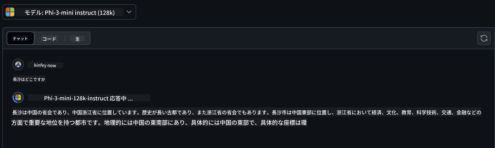
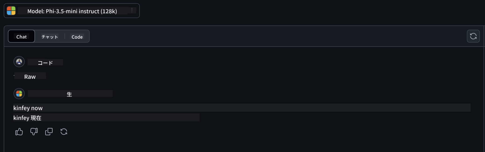

<!--
CO_OP_TRANSLATOR_METADATA:
{
  "original_hash": "124ad36cfe96f74038811b6e2bb93e9d",
  "translation_date": "2025-06-26T01:48:51+00:00",
  "source_file": "19-slm/README.md",
  "language_code": "ja"
}
-->

モデルは最も直接的な方法です。GitHub Modelsを通じてPhi-3/3.5-Instructモデルに迅速にアクセスできます。Azure AI Inference SDK / OpenAI SDKと組み合わせることで、コードを通じてAPIにアクセスし、Phi-3/3.5-Instructコールを完了できます。また、Playgroundを通じて異なる効果をテストすることもできます。- デモ：中国のシナリオにおけるPhi-3-miniとPhi-3.5-miniの効果の比較   **Azure AI Studio** または、ビジョンとMoEモデルを使用したい場合は、Azure AI Studioを使用してコールを完了できます。興味がある場合は、Phi-3 Cookbookを読んで、Azure AI Studioを通じてPhi-3/3.5 Instruct、Vision、MoEを呼び出す方法を学ぶことができます。[このリンクをクリック](https://github.com/microsoft/Phi-3CookBook/blob/main/md/02.QuickStart/AzureAIStudio_QuickStart.md?WT.mc_id=academic-105485-koreyst) **NVIDIA NIM** AzureとGitHubが提供するクラウドベースのモデルカタログソリューションに加えて、関連するコールを完了するために[Nivida NIM](https://developer.nvidia.com/nim?WT.mc_id=academic-105485-koreyst)を使用することもできます。NIVIDA NIMを訪れて、Phi-3/3.5ファミリーのAPIコールを完了できます。NVIDIA NIM（NVIDIA Inference Microservices）は、開発者がクラウド、データセンター、ワークステーションなどのさまざまな環境でAIモデルを効率的にデプロイするのを支援するために設計された一連の加速された推論マイクロサービスです。NVIDIA NIMの主な機能は次のとおりです。- **デプロイの容易さ:** NIMはAIモデルのデプロイを単一のコマンドで可能にし、既存のワークフローに統合しやすくします。- **最適化されたパフォーマンス:** TensorRTやTensorRT-LLMなどのNVIDIAの事前最適化された推論エンジンを活用し、低レイテンシと高スループットを確保します。- **スケーラビリティ:** NIMはKubernetesでの自動スケーリングをサポートし、変動するワークロードに効果的に対応します。- **セキュリティとコントロール:** 組織は自社管理のインフラストラクチャでNIMマイクロサービスをセルフホストすることで、データとアプリケーションのコントロールを維持できます。- **標準API:** NIMは業界標準のAPIを提供し、チャットボット、AIアシスタントなどのAIアプリケーションの構築と統合を容易にします。NIMはNVIDIA AI Enterpriseの一部であり、AIモデルのデプロイと運用を簡素化し、NVIDIA GPUで効率的に実行されることを保証します。- デモ: Nividia NIMを使用してPhi-3.5-Vision-APIを呼び出す [[このリンクをクリック](../../../19-slm/python/Phi-3-Vision-Nividia-NIM.ipynb)] ### ローカル環境でのPhi-3/3.5推論 Phi-3やGPT-3のような言語モデルに関連する推論は、受け取った入力に基づいて応答や予測を生成するプロセスを指します。Phi-3にプロンプトや質問を提供すると、それが訓練されたデータのパターンと関係を分析して最も可能性が高く関連性のある応答を推論します。**Hugging Face Transformer** Hugging Face Transformersは自然言語処理（NLP）やその他の機械学習タスクのために設計された強力なライブラリです。以下はその主なポイントです。1. **事前訓練済みモデル:** テキスト分類、名前付きエンティティ認識、質問応答、要約、翻訳、テキスト生成などのさまざまなタスクに使用できる数千の事前訓練済みモデルを提供します。2. **フレームワークの相互運用性:** PyTorch、TensorFlow、JAXなどの複数のディープラーニングフレームワークをサポートし、あるフレームワークでモデルを訓練して別のフレームワークで使用することができます。3. **マルチモーダル機能:** NLPに加えて、Hugging Face Transformersはコンピュータビジョン（例: 画像分類、物体検出）や音声処理（例: 音声認識、音声分類）などのタスクもサポートしています。4. **使いやすさ:** モデルを簡単にダウンロードし、微調整するためのAPIとツールを提供し、初心者から専門家までアクセス可能です。5. **コミュニティとリソース:** Hugging Faceには活気あるコミュニティと豊富なドキュメント、チュートリアル、ガイドがあり、ユーザーがライブラリを最大限に活用する手助けをします。[公式ドキュメント](https://huggingface.co/docs/transformers/index?WT.mc_id=academic-105485-koreyst)またはその[GitHubリポジトリ](https://github.com/huggingface/transformers?WT.mc_id=academic-105485-koreyst)。これは最も一般的に使用される方法ですが、GPUアクセラレーションも必要です。結局、VisionやMoEのようなシーンは多くの計算を必要とし、量子化されていない場合はCPUで非常に制限されます。- デモ: Transformerを使用してPhi-3.5-Instructを呼び出す[このリンクをクリック](../../../19-slm/python/phi35-instruct-demo.ipynb)- デモ: Transformerを使用してPhi-3.5-Visionを呼び出す[このリンクをクリック](../../../19-slm/python/phi35-vision-demo.ipynb)- デモ: Transformerを使用してPhi-3.5-MoEを呼び出す[このリンクをクリック](../../../19-slm/python/phi35_moe_demo.ipynb) **Ollama** [Ollama](https://ollama.com/?WT.mc_id=academic-105485-koreyst)は、ローカルで大規模言語モデル（LLM）を実行するのを簡単にするために設計されたプラットフォームです。Llama 3.1、Phi 3、Mistral、Gemma 2などのさまざまなモデルをサポートしています。このプラットフォームは、モデルの重み、設定、データを単一のパッケージにまとめることでプロセスを簡素化し、ユーザーが独自のモデルをカスタマイズして作成しやすくします。OllamaはmacOS、Linux、Windowsで利用可能です。クラウドサービスに依存せずにLLMを実験したりデプロイしたりする場合には素晴らしいツールです。Ollamaは最も直接的な方法であり、次のステートメントを実行するだけです。```bash

ollama run phi3.5

``` **ONNX Runtime for GenAI** [ONNX Runtime](https://github.com/microsoft/onnxruntime-genai?WT.mc_id=academic-105485-koreyst)はクロスプラットフォームの推論とトレーニングの機械学習アクセラレータです。ONNX Runtime for Generative AI (GENAI)は、さまざまなプラットフォームで生成AIモデルを効率的に実行するのを支援する強力なツールです。## ONNX Runtimeとは何ですか？ONNX Runtimeは、機械学習モデルの高性能な推論を可能にするオープンソースプロジェクトです。Open Neural Network Exchange (ONNX)形式のモデルをサポートしており、機械学習モデルを表現する標準です。ONNX Runtime推論は、PyTorchやTensorFlow/Keras、scikit-learn、LightGBM、XGBoostなどの古典的な機械学習ライブラリからのモデルをサポートし、より高速な顧客体験とコスト削減を可能にします。ONNX Runtimeはさまざまなハードウェア、ドライバ、オペレーティングシステムに対応しており、グラフの最適化と変換を活用してハードウェアアクセラレータを適用することで最適なパフォーマンスを提供します。## 生成AIとは何ですか？生成AIは、訓練されたデータに基づいてテキスト、画像、音楽などの新しいコンテンツを生成できるAIシステムを指します。例としては、GPT-3のような言語モデルやStable Diffusionのような画像生成モデルがあります。ONNX Runtime for GenAIライブラリは、ONNXモデルの生成AIループを提供し、ONNX Runtimeによる推論、ロジット処理、検索とサンプリング、KVキャッシュ管理を含みます。## ONNX Runtime for GENAI ONNX Runtime for GENAIは、生成AIモデルをサポートするためにONNX Runtimeの機能を拡張します。主な機能は以下のとおりです。- **広範なプラットフォームサポート:** Windows、Linux、macOS、Android、iOSなどのさまざまなプラットフォームで動作します。- **モデルサポート:** LLaMA、GPT-Neo、BLOOMなどの多くの人気のある生成AIモデルをサポートします。- **パフォーマンス最適化:** NVIDIA GPU、AMD GPUなどのさまざまなハードウェアアクセラレータ向けの最適化を含みます。- **使いやすさ:** テキスト、画像、その他のコンテンツを最小限のコードで生成するためのAPIを提供し、アプリケーションへの統合が容易です。- ユーザーは高レベルのgenerate()メソッドを呼び出すか、モデルの各イテレーションをループ内で実行し、一度に1つのトークンを生成し、ループ内で生成パラメータをオプションで更新することができます。- ONNX Runtimeは貪欲/ビームサーチとTopP、TopKサンプリングをサポートしてトークンシーケンスを生成し、繰り返しペナルティなどの組み込みロジット処理を提供します。カスタムスコアリングも簡単に追加できます。## 始めるには ONNX Runtime for GENAIを始めるには、以下の手順を実行できます。### ONNX Runtimeをインストール: ```Python
pip install onnxruntime
``` ### 生成AI拡張をインストール: ```Python
pip install onnxruntime-genai
``` ### モデルを実行: Pythonの簡単な例を示します。```Python
import onnxruntime_genai as og

model = og.Model('path_to_your_model.onnx')

tokenizer = og.Tokenizer(model)

input_text = "Hello, how are you?"

input_tokens = tokenizer.encode(input_text)

output_tokens = model.generate(input_tokens)

output_text = tokenizer.decode(output_tokens)

print(output_text) 
``` ### デモ: ONNX Runtime GenAIを使用してPhi-3.5-Visionを呼び出す ```python

import onnxruntime_genai as og

model_path = './Your Phi-3.5-vision-instruct ONNX Path'

img_path = './Your Image Path'

model = og.Model(model_path)

processor = model.create_multimodal_processor()

tokenizer_stream = processor.create_stream()

text = "Your Prompt"

prompt = "<|user|>\n"

prompt += "<|image_1|>\n"

prompt += f"{text}<|end|>\n"

prompt += "<|assistant|>\n"

image = og.Images.open(img_path)

inputs = processor(prompt, images=image)

params = og.GeneratorParams(model)

params.set_inputs(inputs)

params.set_search_options(max_length=3072)

generator = og.Generator(model, params)

while not generator.is_done():

    generator.compute_logits()
    
    generator.generate_next_token()

    new_token = generator.get_next_tokens()[0]
    
    code += tokenizer_stream.decode(new_token)
    
    print(tokenizer_stream.decode(new_token), end='', flush=True)

``` **その他** ONNX RuntimeとOllamaの参照方法に加えて、さまざまなメーカーが提供するモデル参照方法に基づいて量子化モデルの参照を完了することもできます。Apple Metalを使用したApple MLXフレームワーク、NPUを使用したQualcomm QNN、CPU/GPUを使用したIntel OpenVINOなどです。さらにコンテンツを[Phi-3 Cookbook](https://github.com/microsoft/phi-3cookbook?WT.mc_id=academic-105485-koreyst)から入手することもできます。## もっと Phi-3/3.5ファミリーの基本を学びましたが、SLMについてもっと学ぶにはさらに多くの知識が必要です。Phi-3 Cookbookで答えを見つけることができます。もっと学びたい場合は、[Phi-3 Cookbook](https://github.com/microsoft/phi-3cookbook?WT.mc_id=academic-105485-koreyst)を訪れてください。

**免責事項**:
この文書はAI翻訳サービス[Co-op Translator](https://github.com/Azure/co-op-translator)を使用して翻訳されています。正確性を期すよう努めていますが、自動翻訳には誤りや不正確さが含まれる可能性があることをご承知おきください。元の言語での文書が権威ある情報源とみなされるべきです。重要な情報については、プロの人間による翻訳を推奨します。この翻訳の使用に起因する誤解や誤訳について、当社は責任を負いません。