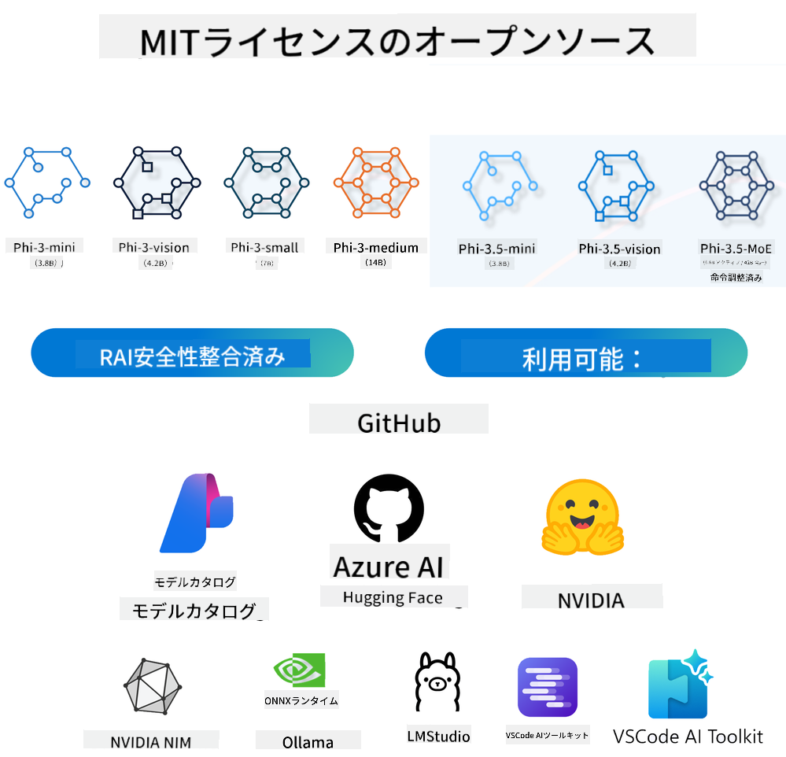
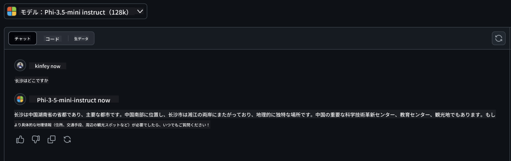

<!--
CO_OP_TRANSLATOR_METADATA:
{
  "original_hash": "124ad36cfe96f74038811b6e2bb93e9d",
  "translation_date": "2025-07-09T18:23:03+00:00",
  "source_file": "19-slm/README.md",
  "language_code": "ja"
}
-->
# 初心者向け生成AIのための小型言語モデル入門
生成AIは、新しいコンテンツを生成できるシステムの構築に焦点を当てた魅力的な人工知能の分野です。このコンテンツは、テキストや画像から音楽、さらには仮想環境全体にまで及びます。生成AIの最もエキサイティングな応用の一つが言語モデルの領域です。

## 小型言語モデルとは？

小型言語モデル（SLM）は、大型言語モデル（LLM）の縮小版であり、LLMの多くのアーキテクチャ原理や技術を活用しつつ、計算負荷を大幅に軽減したものです。

SLMは、人間のようなテキストを生成するために設計された言語モデルの一種です。GPT-4のような大型モデルとは異なり、SLMはよりコンパクトで効率的であり、計算資源が限られた環境に最適です。サイズは小さいものの、多様なタスクをこなすことができます。一般的に、SLMはLLMを圧縮または蒸留することで構築され、元のモデルの機能や言語能力の大部分を保持することを目指しています。モデルサイズの縮小により、全体の複雑さが減り、メモリ使用量や計算要件の面で効率的になります。これらの最適化にもかかわらず、SLMは以下のような幅広い自然言語処理（NLP）タスクを実行可能です：

- テキスト生成：一貫性があり文脈に合った文章や段落の作成
- テキスト補完：与えられたプロンプトに基づく文の予測と補完
- 翻訳：ある言語から別の言語への変換
- 要約：長文を短く分かりやすい要約に凝縮

ただし、大型モデルと比べると性能や理解の深さにいくつかのトレードオフがあります。

## 小型言語モデルはどのように動作するのか？
SLMは大量のテキストデータで訓練されます。訓練中に言語のパターンや構造を学習し、文法的に正しく文脈に適したテキストを生成できるようになります。訓練プロセスは以下の通りです：

- データ収集：様々なソースから大量のテキストデータを集める
- 前処理：訓練に適した形にデータを整理・クリーンアップする
- 訓練：機械学習アルゴリズムを用いてモデルにテキストの理解と生成を学習させる
- ファインチューニング：特定のタスクでの性能向上のためにモデルを調整する

SLMの開発は、モバイルデバイスやエッジコンピューティングプラットフォームなど、リソースが限られた環境での展開ニーズの高まりに対応しています。フルスケールのLLMはリソース負荷が大きいため実用的でない場合があります。効率性に重点を置くことで、SLMは性能とアクセスのバランスを取り、さまざまな分野での幅広い応用を可能にしています。


## 学習目標

このレッスンでは、SLMの知識を紹介し、Microsoft Phi-3と組み合わせてテキストコンテンツ、ビジョン、MoEのさまざまなシナリオを学びます。

このレッスンの終わりには、以下の質問に答えられるようになることを目指します：

- SLMとは何か
- SLMとLLMの違いは何か
- Microsoft Phi-3/3.5ファミリーとは何か
- Microsoft Phi-3/3.5ファミリーの推論方法

準備はいいですか？始めましょう。

## 大型言語モデル（LLM）と小型言語モデル（SLM）の違い

LLMとSLMはどちらも確率的機械学習の基本原理に基づいており、アーキテクチャ設計、訓練方法、データ生成プロセス、モデル評価技術において類似したアプローチを取っています。しかし、いくつかの重要な要素で両者は異なります。

## 小型言語モデルの応用例

SLMは以下のような幅広い応用があります：

- チャットボット：顧客サポートやユーザーとの対話
- コンテンツ作成：アイデア生成や記事の草稿作成支援
- 教育：学生の作文支援や語学学習の補助
- アクセシビリティ：テキスト読み上げシステムなど障害者支援ツールの作成

**サイズ**

LLMとSLMの主な違いはモデルの規模にあります。ChatGPT（GPT-4）などのLLMは約1.76兆パラメータを持つのに対し、オープンソースのSLMであるMistral 7Bは約70億パラメータと大幅に少ないです。この差は主にモデルアーキテクチャと訓練プロセスの違いによるものです。例えば、ChatGPTはエンコーダ・デコーダ構造内の自己注意機構を用いていますが、Mistral 7Bはスライディングウィンドウ注意機構を使い、デコーダのみのモデルでより効率的な訓練を可能にしています。このアーキテクチャの違いはモデルの複雑さと性能に大きな影響を与えます。

**理解力**

SLMは特定のドメインでの性能に最適化されていることが多く、高度に専門化されていますが、複数の知識分野にまたがる広範な文脈理解には限界があります。一方、LLMはより包括的に人間のような知能を模倣することを目指しています。多様で膨大なデータセットで訓練されており、幅広い分野で高い適応性と汎用性を持ちます。そのため、自然言語処理やプログラミングなど多様な下流タスクに適しています。

**計算資源**

LLMの訓練と展開は非常にリソースを消費し、大規模なGPUクラスタなどの計算インフラが必要です。例えば、ChatGPTのようなモデルを一から訓練するには、数千台のGPUを長期間使用することが求められます。一方、SLMはパラメータ数が少ないため、計算資源の面でより手軽に扱えます。Mistral 7Bのようなモデルは、適度なGPUを備えたローカルマシンでも訓練・実行可能ですが、訓練には複数GPUで数時間かかります。

**バイアス**

LLMにおけるバイアスは、主に訓練データの性質に起因します。これらのモデルはインターネット上の生データを多く利用しており、特定のグループが過小評価されたり誤ったラベル付けがされたり、方言や地理的差異、文法規則に基づく言語的偏りが含まれることがあります。さらに、LLMの複雑なアーキテクチャはバイアスを無意識に増幅することもあり、注意深いファインチューニングが必要です。一方、SLMはより限定的でドメイン特化したデータセットで訓練されるため、バイアスの影響は比較的少ないものの、完全に免れるわけではありません。

**推論**

SLMの小型化により、推論速度が大幅に向上し、ローカルハードウェア上で効率的に出力を生成できます。LLMはサイズと複雑さのため、許容できる推論時間を得るには大規模な並列計算資源が必要です。さらに、多数の同時ユーザーがいる場合、LLMの応答速度は特に大規模展開時に遅くなります。

まとめると、LLMとSLMは機械学習の基盤を共有しつつ、モデルサイズ、リソース要件、文脈理解力、バイアスの影響、推論速度において大きく異なります。これらの違いは、それぞれのモデルが適したユースケースを反映しており、LLMは汎用性が高い一方でリソース負荷が大きく、SLMはドメイン特化の効率性と計算負荷の軽減を提供します。

***Note：本章ではMicrosoft Phi-3 / 3.5を例にSLMを紹介します。***

## Phi-3 / Phi-3.5ファミリーの紹介

Phi-3 / 3.5ファミリーは主にテキスト、ビジョン、エージェント（MoE）アプリケーションシナリオを対象としています：

### Phi-3 / 3.5 Instruct

主にテキスト生成、チャット補完、コンテンツ情報抽出などに使われます。

**Phi-3-mini**

3.8Bパラメータの言語モデルで、Microsoft Azure AI Studio、Hugging Face、Ollamaで利用可能です。Phi-3モデルは同等またはそれ以上のサイズの言語モデルを主要ベンチマークで大きく上回ります（ベンチマーク数値は下記参照、数値が高いほど良い）。Phi-3-miniは自身の2倍のサイズのモデルを上回り、Phi-3-smallやPhi-3-mediumはGPT-3.5を含むより大きなモデルを凌駕します。

**Phi-3-small & medium**

7BパラメータのPhi-3-smallは、言語、推論、コーディング、数学の多様なベンチマークでGPT-3.5Tを上回ります。

14BパラメータのPhi-3-mediumも同様の傾向を示し、Gemini 1.0 Proを上回ります。

**Phi-3.5-mini**

Phi-3-miniのアップグレード版と考えられます。パラメータ数は変わりませんが、多言語対応能力が向上しています（20以上の言語をサポート：アラビア語、中国語、チェコ語、デンマーク語、オランダ語、英語、フィンランド語、フランス語、ドイツ語、ヘブライ語、ハンガリー語、イタリア語、日本語、韓国語、ノルウェー語、ポーランド語、ポルトガル語、ロシア語、スペイン語、スウェーデン語、タイ語、トルコ語、ウクライナ語）および長文コンテキストのサポート強化。

3.8BパラメータのPhi-3.5-miniは同サイズの言語モデルを上回り、2倍のサイズのモデルと同等の性能を持ちます。

### Phi-3 / 3.5 Vision

Phi-3/3.5のInstructモデルはPhiの理解力を表し、VisionはPhiに世界を理解する「目」を与えます。

**Phi-3-Vision**

4.2BパラメータのPhi-3-Visionはこの傾向を継続し、Claude-3 HaikuやGemini 1.0 Pro Vなどのより大きなモデルを一般的な視覚推論タスク、OCR、表や図の理解タスクで上回ります。

**Phi-3.5-Vision**

Phi-3.5-VisionはPhi-3-Visionのアップグレード版で、複数画像のサポートを追加しています。単なる画像だけでなく動画も理解できるようになったと考えられます。

Phi-3.5-VisionはClaude-3.5 SonnetやGemini 1.5 Flashなどのより大きなモデルをOCR、表やチャートの理解タスクで上回り、一般的な視覚知識推論タスクでも同等の性能を持ちます。複数フレーム入力をサポートし、複数の画像に対して推論を行えます。

### Phi-3.5-MoE

***Mixture of Experts（MoE）***は、より少ない計算量でモデルの事前学習を可能にし、同じ計算予算でモデルやデータセットの規模を大幅に拡大できます。特に、MoEモデルは密なモデルと同等の品質を事前学習の段階でより速く達成できます。

Phi-3.5-MoEは16個の3.8Bパラメータのエキスパートモジュールで構成されており、6.6Bのアクティブパラメータ数ながら、より大きなモデルと同等の推論力、言語理解力、数学能力を持ちます。

Phi-3/3.5ファミリーのモデルはシナリオに応じて使い分けが可能です。LLMとは異なり、Phi-3/3.5-miniやPhi-3/3.5-Visionはエッジデバイス上での展開も可能です。

## Phi-3/3.5ファミリーモデルの使い方

Phi-3/3.5をさまざまなシナリオで活用したいと思います。次に、異なるシナリオに基づいてPhi-3/3.5を使う方法を紹介します。



### クラウドAPIによる推論の違い

**GitHub Models**

GitHub Modelsは最も直接的な方法です。GitHub Modelsを通じてPhi-3/3.5-Instructモデルに素早くアクセスできます。Azure AI Inference SDKやOpenAI SDKと組み合わせることで、コード経由でAPIにアクセスし、Phi-3/3.5-Instructの呼び出しを完了できます。Playgroundを使ってさまざまな効果を試すことも可能です。

- デモ：中国語シナリオにおけるPhi-3-miniとPhi-3.5-miniの効果比較




**Azure AI Studio**

ビジョンやMoEモデルを使いたい場合は、Azure AI Studioを利用して呼び出しを行えます。興味があれば、Phi-3 Cookbookを参照してAzure AI Studioを通じたPhi-3/3.5 Instruct、Vision、MoEの呼び出し方法を学べます。[こちらのリンク](https://github.com/microsoft/Phi-3CookBook/blob/main/md/02.QuickStart/AzureAIStudio_QuickStart.md?WT.mc_id=academic-105485-koreyst)をクリックしてください。

**NVIDIA NIM**

AzureやGitHubが提供するクラウドベースのモデルカタログソリューションに加え、[NVIDIA NIM](https://developer.nvidia.com/nim?WT.mc_id=academic-105485-koreyst)を使って関連呼び出しを行うことも可能です。NVIDIA NIM（NVIDIA Inference Microservices）は、クラウド、データセンター、ワークステーションなど多様な環境でAIモデルを効率的に展開するための高速推論マイクロサービス群です。

NVIDIA NIMの主な特徴は以下の通りです：

- **展開の容易さ：** NIMはワンコマンドでAIモデルを展開でき、既存のワークフローに簡単に統合可能です。
- **最適化された性能：** TensorRTやTensorRT-LLMなどNVIDIAの事前最適化済み推論エンジンを活用し、低遅延かつ高スループットを実現します。
- **スケーラビリティ：** Kubernetes上でのオートスケーリングをサポートし、変動するワークロードに柔軟に対応します。
- **セキュリティと管理:** 組織は、自社で管理するインフラ上にNIMマイクロサービスをセルフホスティングすることで、データやアプリケーションの管理権を維持できます。  
- **標準API:** NIMは業界標準のAPIを提供しており、チャットボットやAIアシスタントなどのAIアプリケーションの構築や統合が容易です。

NIMはNVIDIA AI Enterpriseの一部であり、AIモデルの展開と運用を簡素化し、NVIDIA GPU上で効率的に動作させることを目指しています。

- デモ: Nividia NIMを使ってPhi-3.5-Vision-APIを呼び出す [[こちらをクリック](python/Phi-3-Vision-Nividia-NIM.ipynb)]


### ローカル環境でのPhi-3/3.5推論
Phi-3やGPT-3のような言語モデルにおける推論とは、入力に基づいて応答や予測を生成するプロセスを指します。Phi-3にプロンプトや質問を与えると、訓練されたニューラルネットワークが学習データのパターンや関係性を分析し、最も可能性が高く関連性のある応答を推測します。

**Hugging Face Transformer**  
Hugging Face Transformersは、自然言語処理（NLP）やその他の機械学習タスク向けに設計された強力なライブラリです。主なポイントは以下の通りです：

1. **事前学習済みモデル:** テキスト分類、固有表現抽出、質問応答、要約、翻訳、テキスト生成など様々なタスクに使える数千の事前学習済みモデルを提供しています。

2. **フレームワークの相互運用性:** PyTorch、TensorFlow、JAXなど複数の深層学習フレームワークをサポートしており、あるフレームワークでモデルを訓練し、別のフレームワークで利用することが可能です。

3. **マルチモーダル対応:** NLPだけでなく、画像分類や物体検出などのコンピュータビジョン、音声認識や音声分類などのオーディオ処理もサポートしています。

4. **使いやすさ:** モデルのダウンロードやファインチューニングを簡単に行えるAPIやツールを提供しており、初心者から専門家まで幅広く利用できます。

5. **コミュニティとリソース:** 活発なコミュニティと充実したドキュメント、チュートリアル、ガイドがあり、ユーザーの学習と活用を支援しています。  
[公式ドキュメント](https://huggingface.co/docs/transformers/index?WT.mc_id=academic-105485-koreyst)や[GitHubリポジトリ](https://github.com/huggingface/transformers?WT.mc_id=academic-105485-koreyst)もご覧ください。

これは最も一般的な方法ですが、GPUアクセラレーションが必要です。特にVisionやMoEのようなシーンでは計算量が多く、量子化されていない場合はCPUでの処理が非常に制限されます。

- デモ: Transformerを使ってPhi-3.5-Instuctを呼び出す [こちらをクリック](python/phi35-instruct-demo.ipynb)

- デモ: Transformerを使ってPhi-3.5-Visionを呼び出す [こちらをクリック](python/phi35-vision-demo.ipynb)

- デモ: Transformerを使ってPhi-3.5-MoEを呼び出す [こちらをクリック](python/phi35_moe_demo.ipynb)

**Ollama**  
[Ollama](https://ollama.com/?WT.mc_id=academic-105485-koreyst)は、大規模言語モデル（LLM）をローカル環境で簡単に実行できるプラットフォームです。Llama 3.1、Phi 3、Mistral、Gemma 2など様々なモデルをサポートしています。モデルの重み、設定、データを一つのパッケージにまとめて提供することで、ユーザーがカスタマイズや独自モデルの作成をしやすくしています。macOS、Linux、Windowsで利用可能で、クラウドサービスに依存せずにLLMを試したり展開したりしたい方に最適なツールです。Ollamaは最も直接的な方法で、以下のコマンドを実行するだけです。

```bash

ollama run phi3.5

```


**ONNX Runtime for GenAI**

[ONNX Runtime](https://github.com/microsoft/onnxruntime-genai?WT.mc_id=academic-105485-koreyst)は、クロスプラットフォーム対応の推論およびトレーニング用機械学習アクセラレータです。ONNX Runtime for Generative AI（GENAI）は、様々なプラットフォームで生成AIモデルを効率的に実行するための強力なツールです。

## ONNX Runtimeとは？  
ONNX Runtimeは、高性能な機械学習モデルの推論を可能にするオープンソースプロジェクトです。Open Neural Network Exchange（ONNX）フォーマットのモデルをサポートしており、これは機械学習モデルの標準的な表現形式です。ONNX Runtimeの推論は、PyTorchやTensorFlow/Kerasなどの深層学習フレームワーク、scikit-learn、LightGBM、XGBoostなどの従来の機械学習ライブラリのモデルをサポートし、より高速なユーザー体験とコスト削減を実現します。ONNX Runtimeは様々なハードウェア、ドライバー、OSに対応し、ハードウェアアクセラレータの活用やグラフ最適化・変換により最適なパフォーマンスを提供します。

## 生成AIとは？  
生成AIは、訓練データに基づいてテキスト、画像、音楽などの新しいコンテンツを生成できるAIシステムを指します。例としてGPT-3のような言語モデルやStable Diffusionのような画像生成モデルがあります。ONNX Runtime for GenAIライブラリは、ONNXモデルの生成AIループを提供し、ONNX Runtimeによる推論、ロジット処理、探索とサンプリング、KVキャッシュ管理などを含みます。

## ONNX Runtime for GENAI  
ONNX Runtime for GENAIは、ONNX Runtimeの機能を拡張し、生成AIモデルをサポートします。主な特徴は以下の通りです：

- **幅広いプラットフォーム対応:** Windows、Linux、macOS、Android、iOSなど多様なプラットフォームで動作します。  
- **モデルサポート:** LLaMA、GPT-Neo、BLOOMなど多くの人気生成AIモデルをサポートしています。  
- **パフォーマンス最適化:** NVIDIA GPU、AMD GPUなど様々なハードウェアアクセラレータ向けの最適化を含みます。  
- **使いやすさ:** アプリケーションへの統合が簡単なAPIを提供し、最小限のコードでテキストや画像などのコンテンツ生成が可能です。  
- ユーザーは高レベルのgenerate()メソッドを呼び出すか、モデルの各イテレーションをループで実行し、1トークンずつ生成しながら生成パラメータをループ内で更新することもできます。  
- ONNX Runtimeは貪欲探索やビームサーチ、TopP、TopKサンプリングによるトークン列生成、繰り返しペナルティなどのロジット処理もサポートし、カスタムスコアリングの追加も容易です。

## はじめに  
ONNX Runtime for GENAIを始めるには、以下の手順を参考にしてください：

### ONNX Runtimeのインストール:  
```Python
pip install onnxruntime
```  
### Generative AI拡張機能のインストール:  
```Python
pip install onnxruntime-genai
```

### モデルの実行: Pythonでの簡単な例:  
```Python
import onnxruntime_genai as og

model = og.Model('path_to_your_model.onnx')

tokenizer = og.Tokenizer(model)

input_text = "Hello, how are you?"

input_tokens = tokenizer.encode(input_text)

output_tokens = model.generate(input_tokens)

output_text = tokenizer.decode(output_tokens)

print(output_text) 
```  
### デモ: ONNX Runtime GenAIを使ってPhi-3.5-Visionを呼び出す  


```python

import onnxruntime_genai as og

model_path = './Your Phi-3.5-vision-instruct ONNX Path'

img_path = './Your Image Path'

model = og.Model(model_path)

processor = model.create_multimodal_processor()

tokenizer_stream = processor.create_stream()

text = "Your Prompt"

prompt = "<|user|>\n"

prompt += "<|image_1|>\n"

prompt += f"{text}<|end|>\n"

prompt += "<|assistant|>\n"

image = og.Images.open(img_path)

inputs = processor(prompt, images=image)

params = og.GeneratorParams(model)

params.set_inputs(inputs)

params.set_search_options(max_length=3072)

generator = og.Generator(model, params)

while not generator.is_done():

    generator.compute_logits()
    
    generator.generate_next_token()

    new_token = generator.get_next_tokens()[0]
    
    code += tokenizer_stream.decode(new_token)
    
    print(tokenizer_stream.decode(new_token), end='', flush=True)

```


**その他**

ONNX RuntimeやOllamaの参照方法に加え、各メーカーが提供するモデル参照方法に基づく量子化モデルの参照も可能です。例えば、AppleのMLXフレームワークとApple Metal、Qualcomm QNNとNPU、Intel OpenVINOとCPU/GPUなどがあります。さらに詳しい内容は[Phi-3 Cookbook](https://github.com/microsoft/phi-3cookbook?WT.mc_id=academic-105485-koreyst)からも入手できます。


## さらに学ぶ

Phi-3/3.5ファミリーの基本は理解できましたが、SLMについてさらに学ぶにはより多くの知識が必要です。答えはPhi-3 Cookbookにあります。もっと知りたい方はぜひ[Phi-3 Cookbook](https://github.com/microsoft/phi-3cookbook?WT.mc_id=academic-105485-koreyst)をご覧ください。

**免責事項**：  
本書類はAI翻訳サービス「[Co-op Translator](https://github.com/Azure/co-op-translator)」を使用して翻訳されました。正確性の向上に努めておりますが、自動翻訳には誤りや不正確な部分が含まれる可能性があります。原文の言語によるオリジナル文書が正式な情報源とみなされるべきです。重要な情報については、専門の人間による翻訳を推奨します。本翻訳の利用により生じたいかなる誤解や誤訳についても、当方は一切の責任を負いかねます。