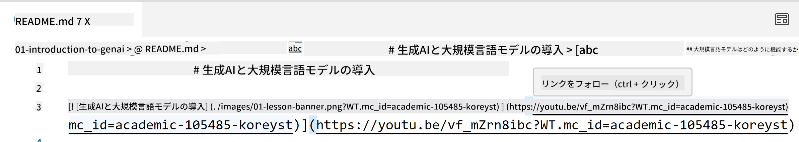
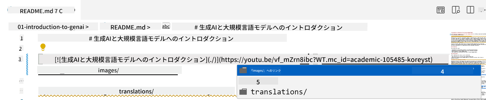
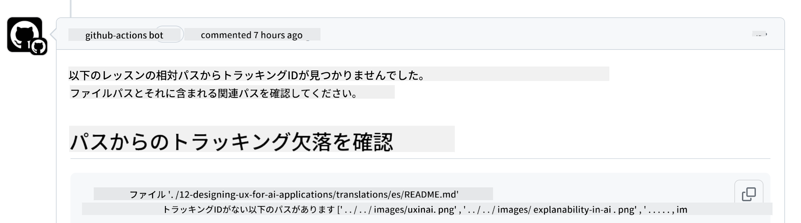
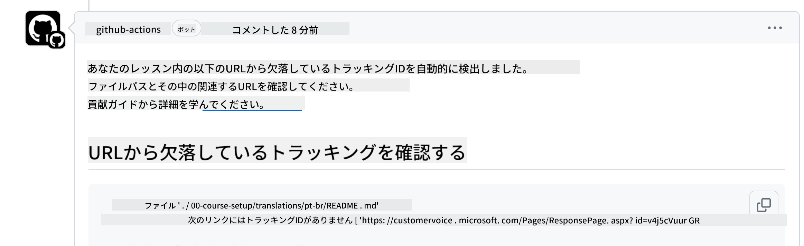

<!--
CO_OP_TRANSLATOR_METADATA:
{
  "original_hash": "57c41f2af71001a2cff9d8eb797cb843",
  "translation_date": "2025-05-19T08:40:48+00:00",
  "source_file": "CONTRIBUTING.md",
  "language_code": "ja"
}
-->
# コントリビューション

このプロジェクトは、貢献や提案を歓迎します。ほとんどの貢献には、コントリビュータ ライセンス契約 (CLA) に同意する必要があります。これは、あなたが貢献を行う権利を持ち、実際にその権利を私たちに付与することを宣言するものです。詳細については、<https://cla.microsoft.com> をご覧ください。

> 重要: このリポジトリのテキストを翻訳する際は、機械翻訳を使用しないようにしてください。翻訳はコミュニティを通じて確認しますので、習熟している言語でのみ翻訳を担当してください。

プルリクエストを送信すると、CLA-bot が自動的に CLA が必要かどうかを判断し、適切に PR を装飾します（例: ラベル、コメント）。ボットの指示に従うだけです。CLA を使用するすべてのリポジトリでこれを行うのは一度だけです。

## 行動規範

このプロジェクトは [Microsoft オープンソース行動規範](https://opensource.microsoft.com/codeofconduct/?WT.mc_id=academic-105485-koreyst) を採用しています。詳細は [行動規範 FAQ](https://opensource.microsoft.com/codeofconduct/faq/?WT.mc_id=academic-105485-koreyst) を読むか、追加の質問やコメントがある場合は [opencode@microsoft.com](mailto:opencode@microsoft.com) にお問い合わせください。

## 質問や問題？

一般的なサポートの質問については GitHub の問題を開かないでください。GitHub リストは、機能リクエストやバグ報告に使用されるべきです。これにより、実際の問題やバグをコードからより簡単に追跡し、一般的な議論を実際のコードから分離することができます。

## タイポ、問題、バグ、貢献

Generative AI for Beginners リポジトリに変更を提出する際は、次の推奨事項に従ってください。

* 修正を行う前に、常にリポジトリを自分のアカウントにフォークしてください
* 複数の変更を1つのプルリクエストにまとめないでください。例えば、バグ修正とドキュメントの更新を別々の PR で提出してください
* プルリクエストにマージの競合が表示された場合は、修正を行う前にローカルのメインをメインリポジトリの内容と同じに更新してください
* 翻訳を提出する場合は、翻訳されたすべてのファイルについて1つの PR を作成してください。コンテンツの部分的な翻訳は受け付けていません
* タイポやドキュメントの修正を提出する場合、適切であれば1つの PR に修正をまとめることができます

## 執筆に関する一般的なガイダンス

- すべての URL を `` に示すように角括弧で囲み、余分なスペースを入れずに括弧で囲むことを確認してください。
- リポジトリ内の他のファイルやフォルダへのリンク（相対リンク）は、現在の作業ディレクトリにあるファイルまたはフォルダを参照する `./` または親作業ディレクトリにあるファイルまたはフォルダを参照する `../` で始めることを確認してください。
- リポジトリ内の他のファイルやフォルダへのリンク（相対リンク）には、トラッキング ID（例: `?` または `&` その後 `wt.mc_id=` または `WT.mc_id=`）が含まれていることを確認してください。
- 次のドメイン _github.com, microsoft.com, visualstudio.com, aka.ms, and azure.com_ からの URL には、トラッキング ID（例: `?` または `&` その後 `wt.mc_id=` または `WT.mc_id=`）が含まれていることを確認してください。
- リンクに国別のロケールが含まれていないことを確認してください（例: `/en-us/` または `/en/`）。
- すべての画像が `./images` フォルダに保存されていることを確認してください。
- 画像には、英字、数字、ダッシュを使用した説明的な名前が付けられていることを確認してください。

## GitHub ワークフロー

プルリクエストを送信すると、前述のルールを検証するために4つの異なるワークフローがトリガーされます。ここに記載されている指示に従って、ワークフローチェックを通過してください。

- [相対パスの破損チェック](../..)
- [パスにトラッキングがあるかのチェック](../..)
- [URL にトラッキングがあるかのチェック](../..)
- [URL にロケールがないかのチェック](../..)

### 相対パスの破損チェック

このワークフローは、ファイル内の相対パスが機能していることを確認します。このリポジトリは GitHub Pages にデプロイされているため、すべてをつなぐリンクを入力する際に非常に注意し、誤った場所に誰かを誘導しないようにしてください。

リンクが正しく機能していることを確認するには、VS Code を使用して確認してください。

例えば、ファイル内のリンクにカーソルを合わせると、**ctrl + クリック**でリンクをたどるように求められます。

リンクをクリックしてローカルで機能しない場合は、ワークフローがトリガーされ、GitHub で機能しません。

この問題を修正するには、VS Code の助けを借りてリンクを入力してみてください。

`./` または `../` を入力すると、VS Code が入力した内容に応じて利用可能なオプションから選択するように促します。

目的のファイルやフォルダをクリックしてパスをたどると、パスが壊れていないことを確認できます。

正しい相対パスを追加し、変更を保存してプッシュすると、ワークフローが再度トリガーされ、変更が確認されます。
チェックを通過すれば、準備完了です。

### パスにトラッキングがあるかのチェック

このワークフローは、相対パスにトラッキングがあることを確認します。このリポジトリは GitHub Pages にデプロイされているため、異なるファイルやフォルダ間の移動を追跡する必要があります。

相対パスにトラッキングがあることを確認するには、パスの末尾に次のテキスト `?wt.mc_id=` があるかを確認してください。
これが相対パスに付加されていれば、このチェックを通過します。

そうでない場合は、次のエラーが表示されることがあります。

この問題を修正するには、ワークフローが強調表示したファイルパスを開き、相対パスの末尾にトラッキング ID を追加してください。

トラッキング ID を追加し、変更を保存してプッシュすると、ワークフローが再度トリガーされ、変更が確認されます。
チェックを通過すれば、準備完了です。

### URL にトラッキングがあるかのチェック

このワークフローは、ウェブ URL にトラッキングがあることを確認します。このリポジトリは誰でも利用できるため、アクセスを追跡してトラフィックがどこから来ているかを把握する必要があります。

URL にトラッキングがあることを確認するには、URL の末尾に次のテキスト `?wt.mc_id=` があるかを確認してください。
これが URL に付加されていれば、このチェックを通過します。

そうでない場合は、次のエラーが表示されることがあります。

この問題を修正するには、ワークフローが強調表示したファイルパスを開き、URL の末尾にトラッキング ID を追加してください。

トラッキング ID を追加し、変更を保存してプッシュすると、ワークフローが再度トリガーされ、変更が確認されます。
チェックを通過すれば、準備完了です。

### URL にロケールがないかのチェック

このワークフローは、ウェブ URL に国別のロケールが含まれていないことを確認します。このリポジトリは世界中の誰でも利用できるため、URL に国のロケールを含めないようにする必要があります。

URL に国のロケールが含まれていないことを確認するには、URL のどこにも `/en-us/` または `/en/` または他の言語ロケールがないかを確認してください。
これが URL に存在しなければ、このチェックを通過します。

そうでない場合は、次のエラーが表示されることがあります。

この問題を修正するには、ワークフローが強調表示したファイルパスを開き、URL から国のロケールを削除してください。

国のロケールを削除し、変更を保存してプッシュすると、ワークフローが再度トリガーされ、変更が確認されます。
チェックを通過すれば、準備完了です。

おめでとうございます！貢献に関するフィードバックをできるだけ早くお知らせします。

**免責事項**：
この文書はAI翻訳サービス[Co-op Translator](https://github.com/Azure/co-op-translator)を使用して翻訳されています。正確性を追求していますが、自動翻訳には誤りや不正確さが含まれる可能性があることをご了承ください。元の言語による原文を信頼できる情報源として考慮してください。重要な情報については、専門の人間による翻訳をお勧めします。この翻訳の使用により生じる誤解や誤解釈について、当社は責任を負いません。