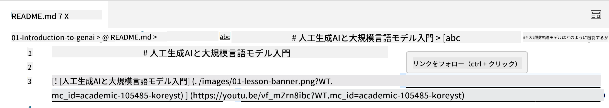
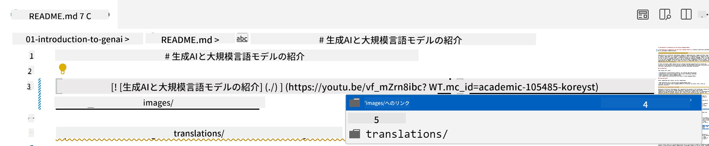
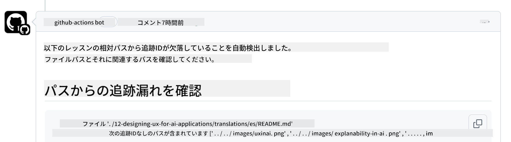
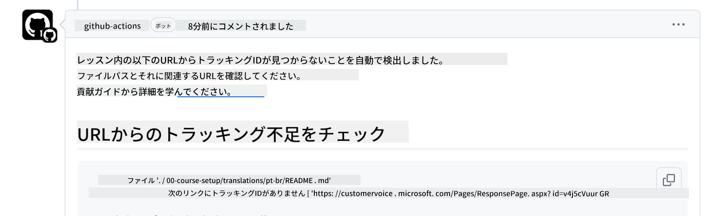
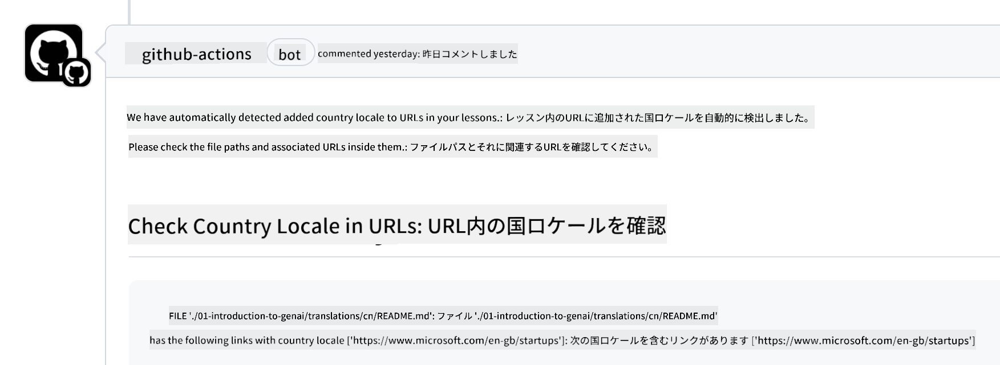

<!--
CO_OP_TRANSLATOR_METADATA:
{
  "original_hash": "57c41f2af71001a2cff9d8eb797cb843",
  "translation_date": "2025-06-25T07:04:08+00:00",
  "source_file": "CONTRIBUTING.md",
  "language_code": "ja"
}
-->
# 貢献について

このプロジェクトは貢献や提案を歓迎します。ほとんどの貢献には、貢献者ライセンス契約 (CLA) に同意し、貢献を使用する権利を私たちに与えることを宣言する必要があります。詳細は <https://cla.microsoft.com> をご覧ください。

> 重要: このリポジトリ内のテキストを翻訳する際は、機械翻訳を使用しないようにしてください。翻訳はコミュニティによって検証されますので、十分に精通している言語でのみ翻訳をボランティアしてください。

プルリクエストを提出すると、CLA-bot が自動的にCLAを提供する必要があるかどうかを判断し、適切にPRにラベルやコメントを付けます。ボットの指示に従うだけで、CLAを必要とするリポジトリ全体で一度だけ行えば済みます。

## 行動規範

このプロジェクトは [Microsoft オープンソース行動規範](https://opensource.microsoft.com/codeofconduct/?WT.mc_id=academic-105485-koreyst) を採用しています。詳細については、[行動規範 FAQ](https://opensource.microsoft.com/codeofconduct/faq/?WT.mc_id=academic-105485-koreyst) をお読みいただくか、追加の質問やコメントがある場合は [opencode@microsoft.com](mailto:opencode@microsoft.com) にお問い合わせください。

## 質問や問題がありますか？

一般的なサポート質問についてはGitHubの問題を開かないでください。GitHubのリストは機能リクエストやバグ報告に使用されるべきです。この方法でコードからの実際の問題やバグをより簡単に追跡でき、一般的な議論を実際のコードから分離できます。

## タイポ、問題、バグ、および貢献

Generative AI for Beginnersリポジトリに変更を提出する際は、以下の推奨事項に従ってください。

* 修正を行う前に常にリポジトリを自分のアカウントにフォークしてください
* 複数の変更を一つのプルリクエストにまとめないでください。例えば、バグ修正とドキュメント更新を別々のPRで提出してください
* プルリクエストにマージの競合が表示された場合、修正を行う前にローカルのmainをメインリポジトリの内容と一致させて更新してください
* 翻訳を提出する場合、すべての翻訳ファイルに対して一つのPRを作成してください。コンテンツの部分的な翻訳は受け付けません
* タイポやドキュメント修正を提出する場合、適切な場合は単一のPRに修正をまとめることができます

## 書き方の一般的な指導

- URLは必ず角括弧で囲み、後に括弧で囲んで余分なスペースを入れないようにしてください ``。
- 相対リンク（リポジトリ内の他のファイルやフォルダへのリンク）は、現在の作業ディレクトリにあるファイルやフォルダを指す `./` で始めるか、親作業ディレクトリにあるファイルやフォルダを指す `../` で始める必要があります。
- 相対リンク（リポジトリ内の他のファイルやフォルダへのリンク）には、末尾にトラッキングID（例：`?` または `&`、次に `wt.mc_id=` または `WT.mc_id=`）が必要です。
- 次のドメインのURL _github.com, microsoft.com, visualstudio.com, aka.ms, azure.com_ には、末尾にトラッキングID（例：`?` または `&`、次に `wt.mc_id=` または `WT.mc_id=`）が必要です。
- リンクに国別のロケールが含まれていないことを確認してください（例：`/en-us/` または `/en/`）。
- すべての画像は `./images` フォルダに保存してください。
- 画像には英字、数字、ダッシュを使用して説明的な名前を付けてください。

## GitHub ワークフロー

プルリクエストを提出すると、前述のルールを検証するために4つの異なるワークフローがトリガーされます。
ワークフローチェックを通過するために、ここに記載された指示に従ってください。

- [壊れた相対パスのチェック](../..)
- [パスにトラッキングがあるかのチェック](../..)
- [URLにトラッキングがあるかのチェック](../..)
- [URLにロケールがないかのチェック](../..)

### 壊れた相対パスのチェック

このワークフローは、ファイル内の相対パスが機能していることを確認します。
このリポジトリはGitHub Pagesにデプロイされているため、リンクが正しい場所に導くように注意深く入力する必要があります。

リンクが正しく機能していることを確認するために、VS Codeを使用してチェックしてください。

例えば、ファイル内のリンクにカーソルを合わせると、**ctrl + click** を押してリンクをたどるように促されます。

リンクをクリックしてもローカルで機能しない場合、ワークフローがトリガーされ、GitHubでも機能しません。

この問題を修正するには、VS Codeの助けを借りてリンクを入力してみてください。

`./` または `../` を入力すると、VS Codeが入力した内容に基づいて利用可能なオプションを選択するよう促します。

目的のファイルまたはフォルダをクリックしてパスをたどることで、パスが壊れていないことを確認できます。

正しい相対パスを追加したら、変更を保存してプッシュすると、ワークフローが再度トリガーされ、変更が確認されます。
チェックを通過したら、問題ありません。

### パスにトラッキングがあるかのチェック

このワークフローは、相対パスにトラッキングがあることを確認します。
このリポジトリはGitHub Pagesにデプロイされているため、異なるファイルやフォルダ間の移動を追跡する必要があります。

相対パスにトラッキングがあるかを確認するには、パスの末尾に `?wt.mc_id=` があるか確認してください。
これが相対パスに追加されていれば、このチェックを通過します。

そうでない場合、次のエラーが表示されるかもしれません。

この問題を修正するには、ワークフローが強調表示したファイルパスを開き、相対パスの末尾にトラッキングIDを追加してください。

トラッキングIDを追加したら、変更を保存してプッシュすると、ワークフローが再度トリガーされ、変更が確認されます。
チェックを通過したら、問題ありません。

### URLにトラッキングがあるかのチェック

このワークフローは、Web URLにトラッキングがあることを確認します。
このリポジトリはすべての人に公開されているため、アクセスを追跡してどこからトラフィックが来ているかを知る必要があります。

URLにトラッキングがあるかを確認するには、URLの末尾に `?wt.mc_id=` があるか確認してください。
これがURLに追加されていれば、このチェックを通過します。

そうでない場合、次のエラーが表示されるかもしれません。

この問題を修正するには、ワークフローが強調表示したファイルパスを開き、URLの末尾にトラッキングIDを追加してください。

トラッキングIDを追加したら、変更を保存してプッシュすると、ワークフローが再度トリガーされ、変更が確認されます。
チェックを通過したら、問題ありません。

### URLにロケールがないかのチェック

このワークフローは、Web URLに国別のロケールがないことを確認します。
このリポジトリは世界中の人々に公開されているため、URLに自国のロケールを含めないようにする必要があります。

URLに国のロケールがないかを確認するには、URLのどこかに `/en-us/` や `/en/`、または他の言語のロケールがないか確認してください。
これがURLに存在しなければ、このチェックを通過します。

そうでない場合、次のエラーが表示されるかもしれません。

この問題を修正するには、ワークフローが強調表示したファイルパスを開き、URLから国のロケールを削除してください。

国のロケールを削除したら、変更を保存してプッシュすると、ワークフローが再度トリガーされ、変更が確認されます。
チェックを通過したら、問題ありません。

おめでとうございます！貢献に関するフィードバックはできるだけ早くお知らせします。

**免責事項**:  
この文書はAI翻訳サービス[Co-op Translator](https://github.com/Azure/co-op-translator)を使用して翻訳されています。正確さを期していますが、自動翻訳には誤りや不正確さが含まれる場合がありますのでご注意ください。元の言語での原文を信頼できる情報源として考慮してください。重要な情報については、専門の人間による翻訳をお勧めします。この翻訳の使用に起因する誤解や誤解釈について、当社は責任を負いません。