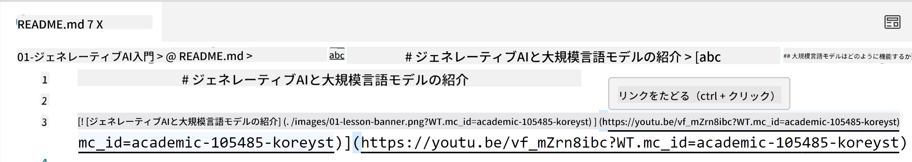
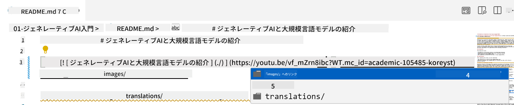
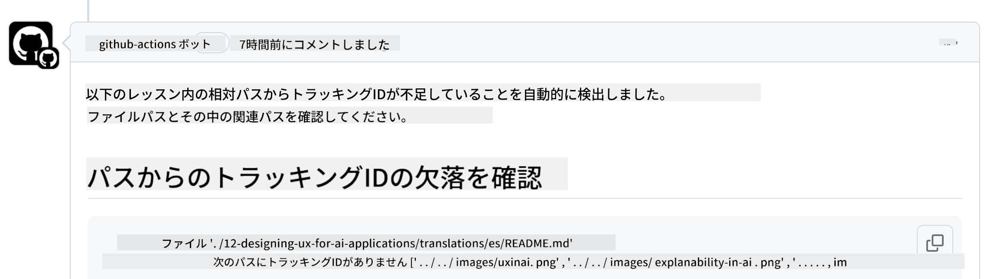
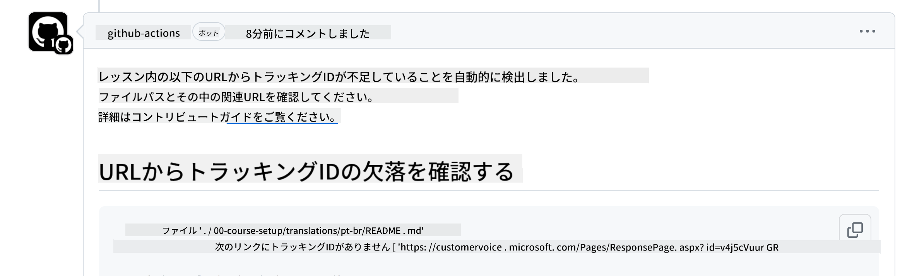
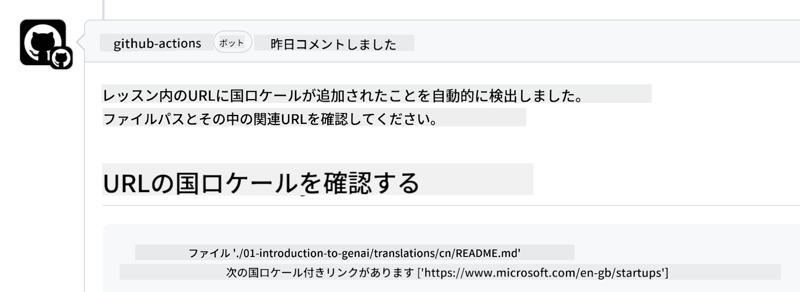

<!--
CO_OP_TRANSLATOR_METADATA:
{
  "original_hash": "57c41f2af71001a2cff9d8eb797cb843",
  "translation_date": "2025-07-09T05:50:44+00:00",
  "source_file": "CONTRIBUTING.md",
  "language_code": "ja"
}
-->
# 貢献について

このプロジェクトでは、貢献や提案を歓迎しています。ほとんどの貢献には、あなたが貢献物の使用権を持ち、実際にその権利を当方に付与することを宣言するContributor License Agreement（CLA）への同意が必要です。詳細は<https://cla.microsoft.com>をご覧ください。

> 重要: このリポジトリ内のテキストを翻訳する際は、機械翻訳を使用しないようにしてください。翻訳はコミュニティによって検証されるため、習熟している言語のみで翻訳ボランティアをお願いします。

プルリクエストを提出すると、CLAボットが自動的にCLAの提出が必要かどうかを判断し、適切にPRにラベルやコメントを付けます。ボットの指示に従ってください。CLAの提出は、当方のCLAを使用しているすべてのリポジトリで一度だけ行えば十分です。

## 行動規範

このプロジェクトは[Microsoft Open Source Code of Conduct](https://opensource.microsoft.com/codeofconduct/?WT.mc_id=academic-105485-koreyst)を採用しています。詳細は[行動規範FAQ](https://opensource.microsoft.com/codeofconduct/faq/?WT.mc_id=academic-105485-koreyst)をご覧いただくか、追加の質問やコメントがあれば[opencode@microsoft.com](mailto:opencode@microsoft.com)までご連絡ください。

## 質問や問題について

一般的なサポートの質問のためにGitHubのIssueを開かないでください。GitHubのIssueリストは機能リクエストやバグ報告に使用してください。こうすることで、実際の問題やバグをコードから追跡しやすくなり、一般的な議論とコードの問題を分けて管理できます。

## 誤字、問題、バグ、貢献について

Generative AI for Beginnersリポジトリに変更を提出する際は、以下の推奨事項に従ってください。

* 変更を加える前に必ずリポジトリを自分のアカウントにフォークしてください
* 複数の変更を1つのプルリクエストにまとめないでください。例えば、バグ修正とドキュメントの更新は別々のPRで提出してください
* プルリクエストにマージコンフリクトがある場合は、変更を加える前にローカルのmainブランチをメインリポジトリの内容と同期させてください
* 翻訳を提出する場合は、翻訳ファイルすべてを1つのPRにまとめてください。部分的な翻訳は受け付けていません
* 誤字やドキュメントの修正を提出する場合は、適切であれば複数の修正を1つのPRにまとめても構いません

## 執筆に関する一般的なガイドライン

- すべてのURLは、余分なスペースを含まず、角括弧の後に丸括弧で囲まれていることを確認してください ``。
- 相対リンク（リポジトリ内の他のファイルやフォルダーへのリンク）は、現在の作業ディレクトリ内のファイルやフォルダーを指す場合は`./`、親ディレクトリ内のファイルやフォルダーを指す場合は`../`で始まっていることを確認してください。
- 相対リンクの末尾にはトラッキングID（`?`または`&`の後に`wt.mc_id=`または`WT.mc_id=`）が付いていることを確認してください。
- _github.com, microsoft.com, visualstudio.com, aka.ms, azure.com_ のドメインからのURLには、トラッキングIDが末尾に付いていることを確認してください。
- リンクに国別のロケール（例：`/en-us/`や`/en/`）が含まれていないことを確認してください。
- すべての画像は`./images`フォルダーに保存してください。
- 画像の名前は英数字とハイフンを使い、説明的な名前にしてください。

## GitHubワークフロー

プルリクエストを提出すると、以下の4つのワークフローが起動し、前述のルールを検証します。  
ワークフローのチェックを通過するには、ここに記載された指示に従ってください。

- [壊れた相対パスのチェック](../..)
- [パスにトラッキングがあるかのチェック](../..)
- [URLにトラッキングがあるかのチェック](../..)
- [URLにロケールが含まれていないかのチェック](../..)

### 壊れた相対パスのチェック

このワークフローは、ファイル内の相対パスが正しく機能しているかを確認します。  
このリポジトリはGitHub Pagesにデプロイされているため、リンクが誤った場所に誘導しないように注意が必要です。

リンクが正しく機能しているか確認するには、VS Codeを使うのが簡単です。

例えば、ファイル内のリンクにカーソルを合わせると、**ctrl + クリック**でリンク先に移動できるプロンプトが表示されます。

リンクをクリックしてローカルで動作しない場合は、ワークフローも失敗し、GitHub上でも動作しません。

この問題を解決するには、VS Codeの補完機能を使ってリンクを入力してください。

`./`や`../`と入力すると、VS Codeが利用可能な候補を表示します。

目的のファイルやフォルダーをクリックしてパスを選択すれば、パスが壊れていないことが確実になります。

正しい相対パスを追加して保存し、変更をプッシュすると、ワークフローが再度起動して変更を検証します。  
チェックに合格すれば問題ありません。

### パスにトラッキングがあるかのチェック

このワークフローは、相対パスにトラッキング情報が含まれているかを確認します。  
GitHub Pagesにデプロイされているため、ファイルやフォルダー間の移動を追跡する必要があります。

相対パスの末尾に`?wt.mc_id=`が付いているか確認してください。  
付いていればこのチェックは合格です。

付いていない場合、以下のようなエラーが表示されることがあります。

この問題を修正するには、ワークフローが指摘したファイルパスを開き、相対パスの末尾にトラッキングIDを追加してください。

トラッキングIDを追加して保存し、変更をプッシュすると、ワークフローが再度起動して検証します。  
チェックに合格すれば問題ありません。

### URLにトラッキングがあるかのチェック

このワークフローは、ウェブURLにトラッキング情報が含まれているかを確認します。  
このリポジトリは誰でもアクセス可能なため、アクセス元を追跡する必要があります。

URLの末尾に`?wt.mc_id=`が付いているか確認してください。  
付いていればこのチェックは合格です。

付いていない場合、以下のようなエラーが表示されることがあります。

この問題を修正するには、ワークフローが指摘したファイルパスを開き、URLの末尾にトラッキングIDを追加してください。

トラッキングIDを追加して保存し、変更をプッシュすると、ワークフローが再度起動して検証します。  
チェックに合格すれば問題ありません。

### URLにロケールが含まれていないかのチェック

このワークフローは、ウェブURLに国別のロケールが含まれていないかを確認します。  
このリポジトリは世界中の誰でも利用できるため、自国のロケールをURLに含めないようにしてください。

URLに`/en-us/`や`/en/`、その他の言語ロケールが含まれていないか確認してください。  
含まれていなければこのチェックは合格です。

含まれている場合、以下のようなエラーが表示されることがあります。

この問題を修正するには、ワークフローが指摘したファイルパスを開き、URLから国別ロケールを削除してください。

ロケールを削除して保存し、変更をプッシュすると、ワークフローが再度起動して検証します。  
チェックに合格すれば問題ありません。

おめでとうございます！貢献に関するフィードバックをできるだけ早くお返しします。

**免責事項**：  
本書類はAI翻訳サービス「[Co-op Translator](https://github.com/Azure/co-op-translator)」を使用して翻訳されました。正確性の向上に努めておりますが、自動翻訳には誤りや不正確な部分が含まれる可能性があります。原文の言語によるオリジナル文書が正式な情報源とみなされます。重要な情報については、専門の人間による翻訳を推奨します。本翻訳の利用により生じたいかなる誤解や誤訳についても、当方は責任を負いかねます。