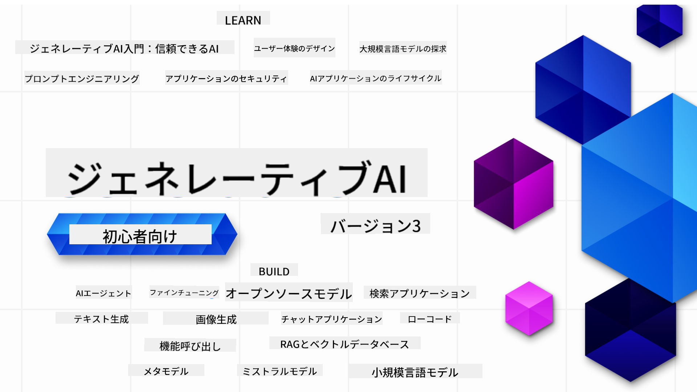

<!--
CO_OP_TRANSLATOR_METADATA:
{
  "original_hash": "c2ee25895ebbfa1a52868bb6eab686fc",
  "translation_date": "2025-05-19T10:55:57+00:00",
  "source_file": "README.md",
  "language_code": "ja"
}
-->

### 生成AIアプリケーションを構築するために必要なすべてを教える21のレッスン

### 🌐 多言語サポート

#### GitHub Actionによるサポート（自動化され常に最新）
[フランス語](../fr/README.md) | [スペイン語](../es/README.md) | [ドイツ語](../de/README.md) | [ロシア語](../ru/README.md) | [アラビア語](../ar/README.md) | [ペルシャ語 (ファルシー)](../fa/README.md) | [ウルドゥー語](../ur/README.md) | [中国語 (簡体字)](../zh/README.md) | [中国語 (繁体字、マカオ)](../mo/README.md) | [中国語 (繁体字、香港)](../hk/README.md) | [中国語 (繁体字、台湾)](../tw/README.md) | [日本語](./README.md) | [韓国語](../ko/README.md) | [ヒンディー語](../hi/README.md) | [ベンガル語](../bn/README.md) | [マラーティー語](../mr/README.md) | [ネパール語](../ne/README.md) | [パンジャブ語 (グルムキー)](../pa/README.md) | [ポルトガル語 (ポルトガル)](../pt/README.md) | [ポルトガル語 (ブラジル)](../br/README.md) | [イタリア語](../it/README.md) | [ポーランド語](../pl/README.md) | [トルコ語](../tr/README.md) | [ギリシャ語](../el/README.md) | [タイ語](../th/README.md) | [スウェーデン語](../sv/README.md) | [デンマーク語](../da/README.md) | [ノルウェー語](../no/README.md) | [フィンランド語](../fi/README.md) | [オランダ語](../nl/README.md) | [ヘブライ語](../he/README.md) | [ベトナム語](../vi/README.md) | [インドネシア語](../id/README.md) | [マレー語](../ms/README.md) | [タガログ語 (フィリピン語)](../tl/README.md) | [スワヒリ語](../sw/README.md) | [ハンガリー語](../hu/README.md) | [チェコ語](../cs/README.md) | [スロバキア語](../sk/README.md) | [ルーマニア語](../ro/README.md) | [ブルガリア語](../bg/README.md) | [セルビア語 (キリル)](../sr/README.md) | [クロアチア語](../hr/README.md) | [スロベニア語](../sl/README.md)
# 初心者向け生成AI（バージョン3） - コース

Microsoft Cloud Advocatesによる21レッスンの包括的なコースで、生成AIアプリケーションの構築の基本を学びましょう。

## 🌱 スタートガイド

このコースは21のレッスンで構成されています。各レッスンは独自のトピックをカバーしているので、お好きなところから始めてください！

レッスンは、生成AIの概念を説明する「Learn」レッスンか、概念とコード例を**Python**と**TypeScript**の両方で説明する「Build」レッスンとしてラベル付けされています。

.NET開発者の方は、[初心者向け生成AI（.NET版）](https://github.com/microsoft/Generative-AI-for-beginners-dotnet?WT.mc_id=academic-105485-koreyst)をチェックしてください！

各レッスンには、追加の学習ツールを含む「Keep Learning」セクションもあります。

## 必要なもの
### このコースのコードを実行するには、以下を使用できます：
 - [Azure OpenAI Service](https://aka.ms/genai-beginners/azure-open-ai?WT.mc_id=academic-105485-koreyst) - **レッスン:** "aoai-assignment"
 - [GitHub Marketplace Model Catalog](https://aka.ms/genai-beginners/gh-models?WT.mc_id=academic-105485-koreyst) - **レッスン:** "githubmodels"
 - [OpenAI API](https://aka.ms/genai-beginners/open-ai?WT.mc_id=academic-105485-koreyst) - **レッスン:** "oai-assignment" 

- PythonまたはTypeScriptの基本知識があると役立ちます - \*絶対初心者の方はこれらの[Python](https://aka.ms/genai-beginners/python?WT.mc_id=academic-105485-koreyst)と[TypeScript](https://aka.ms/genai-beginners/typescript?WT.mc_id=academic-105485-koreyst)コースをご覧ください
- 自分のGitHubアカウントに[このリポジトリ全体をフォークする](https://aka.ms/genai-beginners/github?WT.mc_id=academic-105485-koreyst)ためのGitHubアカウント

開発環境のセットアップを手助けするために、**[コースセットアップ](./00-course-setup/README.md?WT.mc_id=academic-105485-koreyst)**レッスンを作成しました。

このリポジトリを[スター（🌟）をつける](https://docs.github.com/en/get-started/exploring-projects-on-github/saving-repositories-with-stars?WT.mc_id=academic-105485-koreyst)ことを忘れずに、後で簡単に見つけられるようにしてください。

## 🧠 デプロイ準備完了？

より高度なコードサンプルを探している場合は、**Python**と**TypeScript**の両方での[生成AIコードサンプルのコレクション](https://aka.ms/genai-beg-code?WT.mc_id=academic-105485-koreyst)をチェックしてください。

## 🗣️ 他の学習者と出会い、サポートを得る

このコースを受講している他の学習者と出会い、ネットワークを築き、サポートを得るために[公式Azure AI Foundry Discordサーバー](https://aka.ms/genai-discord?WT.mc_id=academic-105485-koreyst)に参加してください。

質問をしたり、製品のフィードバックを共有するには、GitHubの[Azure AI Foundry Developer Forum](https://aka.ms/azureaifoundry/forum)をご利用ください。

## 🚀 スタートアップを構築していますか？

**無料のOpenAIクレジット**と**Azure OpenAI Servicesを通じてOpenAIモデルにアクセスするための最大$150kのAzureクレジット**を受け取るために、[Microsoft for Startups Founders Hub](https://aka.ms/genai-foundershub?WT.mc_id=academic-105485-koreyst)に登録してください。

## 🙏 助けたいですか？

提案がある、またはスペルやコードの誤りを見つけた場合は、[問題を提起](https://github.com/microsoft/generative-ai-for-beginners/issues?WT.mc_id=academic-105485-koreyst)したり、[プルリクエストを作成](https://github.com/microsoft/generative-ai-for-beginners/pulls?WT.mc_id=academic-105485-koreyst)してください。

## 📂 各レッスンには以下が含まれています：

- トピックの短いビデオ紹介
- READMEにある書面によるレッスン
- Azure OpenAIとOpenAI APIをサポートするPythonとTypeScriptのコードサンプル
- 学習を続けるための追加リソースへのリンク

## 🗃️ レッスン

| #   | **レッスンリンク**                                                                                                                              | **説明**                                                                                 | **ビデオ**                                                                   | **追加学習**                                                             |
| --- | -------------------------------------------------------------------------------------------------------------------------------------------- | ----------------------------------------------------------------------------------------------- | --------------------------------------------------------------------------- | ------------------------------------------------------------------------------ |
| 00  | [コースセットアップ](./00-course-setup/README.md?WT.mc_id=academic-105485-koreyst)                                                                 | **学ぶ:** 開発環境のセットアップ方法                                            | ビデオ近日公開                                                                 | [さらに学ぶ](https://aka.ms/genai-collection?WT.mc_id=academic-105485-koreyst) |
| 01  | [生成AIとLLMの紹介](./01-introduction-to-genai/README.md?WT.mc_id=academic-105485-koreyst)                              | **学ぶ:** 生成AIとは何か、そして大規模言語モデル（LLM）がどのように機能するかを理解する       | [ビデオ](https://aka.ms/gen-ai-lesson-1-gh?WT.mc_id=academic-105485-koreyst) | [さらに学ぶ](https://aka.ms/genai-collection?WT.mc_id=academic-105485-koreyst) |
| 02  | [異なるLLMの探索と比較](./02-exploring-and-comparing-different-llms/README.md?WT.mc_id=academic-105485-koreyst)             | **学ぶ:** ユースケースに適したモデルを選択する方法                                      | [ビデオ](https://aka.ms/gen-ai-lesson2-gh?WT.mc_id=academic-105485-koreyst)  | [さらに学ぶ](https://aka.ms/genai-collection?WT.mc_id=academic-105485-koreyst) |
| 03  | [生成AIを責任を持って使用する](./03-using-generative-ai-responsibly/README.md?WT.mc_id=academic-105485-koreyst)                           | **学ぶ:** 責任を持って生成AIアプリケーションを構築する方法                                  | [ビデオ](https://aka.ms/gen-ai-lesson3-gh?WT.mc_id=academic-105485-koreyst)  | [さらに学ぶ](https://aka.ms/genai-collection?WT.mc_id=academic-105485-koreyst) |
| 04  | [プロンプトエンジニアリングの基本を理解する](./04-prompt-engineering-fundamentals/README.md?WT.mc_id=academic-105485-koreyst)             | **学ぶ:** 実践的なプロンプトエンジニアリングのベストプラクティス                                           | [ビデオ](https://aka.ms/gen-ai-lesson4-gh?WT.mc_id=academic-105485-koreyst)  | [さらに学ぶ](https://aka.ms/genai-collection?WT.mc_id=academic-105485-koreyst) |
| 05  | [高度なプロンプトの作成](./05-advanced-prompts/README.md?WT.mc_id=academic-105485-koreyst)                                                | **学ぶ:** プロンプトの結果を改善するプロンプトエンジニアリング技術の適用方法。 | [ビデオ](https://aka.ms/gen-ai-lesson5-gh?WT.mc_id=academic-105485-koreyst)  | [詳細を学ぶ](https://aka.ms/genai-collection?WT.mc_id=academic-105485-koreyst) |
| 06  | [テキスト生成アプリケーションの構築](./06-text-generation-apps/README.md?WT.mc_id=academic-105485-koreyst)                                | **構築:** Azure OpenAI / OpenAI API を使用したテキスト生成アプリ                                | [ビデオ](https://aka.ms/gen-ai-lesson6-gh?WT.mc_id=academic-105485-koreyst)  | [詳細を学ぶ](https://aka.ms/genai-collection?WT.mc_id=academic-105485-koreyst) |
| 07  | [チャットアプリケーションの構築](./07-building-chat-applications/README.md?WT.mc_id=academic-105485-koreyst)                                     | **構築:** 効率的にチャットアプリケーションを構築し統合する技術。               | [ビデオ](https://aka.ms/gen-ai-lessons7-gh?WT.mc_id=academic-105485-koreyst) | [詳細を学ぶ](https://aka.ms/genai-collection?WT.mc_id=academic-105485-koreyst) |
| 08  | [検索アプリケーションの構築 ベクトルデータベース](./08-building-search-applications/README.md?WT.mc_id=academic-105485-koreyst)                        | **構築:** Embeddings を使用してデータを検索する検索アプリケーション。                        | [ビデオ](https://aka.ms/gen-ai-lesson8-gh?WT.mc_id=academic-105485-koreyst)  | [詳細を学ぶ](https://aka.ms/genai-collection?WT.mc_id=academic-105485-koreyst) |
| 09  | [画像生成アプリケーションの構築](./09-building-image-applications/README.md?WT.mc_id=academic-105485-koreyst)                        | **構築:** 画像生成アプリケーション                                                       | [ビデオ](https://aka.ms/gen-ai-lesson9-gh?WT.mc_id=academic-105485-koreyst)  | [詳細を学ぶ](https://aka.ms/genai-collection?WT.mc_id=academic-105485-koreyst) |
| 10  | [ローコードAIアプリケーションの構築](./10-building-low-code-ai-applications/README.md?WT.mc_id=academic-105485-koreyst)                       | **構築:** ローコードツールを使用した生成AIアプリケーション                                     | [ビデオ](https://aka.ms/gen-ai-lesson10-gh?WT.mc_id=academic-105485-koreyst) | [詳細を学ぶ](https://aka.ms/genai-collection?WT.mc_id=academic-105485-koreyst) |
| 11  | [外部アプリケーションと関数呼び出しの統合](./11-integrating-with-function-calling/README.md?WT.mc_id=academic-105485-koreyst) | **構築:** 関数呼び出しとは何か、アプリケーションでの使用例                          | [ビデオ](https://aka.ms/gen-ai-lesson11-gh?WT.mc_id=academic-105485-koreyst) | [詳細を学ぶ](https://aka.ms/genai-collection?WT.mc_id=academic-105485-koreyst) |
| 12  | [AIアプリケーションのUXデザイン](./12-designing-ux-for-ai-applications/README.md?WT.mc_id=academic-105485-koreyst)                         | **学ぶ:** 生成AIアプリケーションを開発する際のUXデザイン原則の適用方法         | [ビデオ](https://aka.ms/gen-ai-lesson12-gh?WT.mc_id=academic-105485-koreyst) | [詳細を学ぶ](https://aka.ms/genai-collection?WT.mc_id=academic-105485-koreyst) |
| 13  | [生成AIアプリケーションのセキュリティ確保](./13-securing-ai-applications/README.md?WT.mc_id=academic-105485-koreyst)                         | **学ぶ:** AIシステムへの脅威とリスク、およびこれらのシステムを保護する方法。             | [ビデオ](https://aka.ms/gen-ai-lesson13-gh?WT.mc_id=academic-105485-koreyst) | [詳細を学ぶ](https://aka.ms/genai-collection?WT.mc_id=academic-105485-koreyst) |
| 14  | [生成AIアプリケーションのライフサイクル](./14-the-generative-ai-application-lifecycle/README.md?WT.mc_id=academic-105485-koreyst)           | **学ぶ:** LLMライフサイクルとLLMOpsを管理するためのツールと指標                         | [ビデオ](https://aka.ms/gen-ai-lesson14-gh?WT.mc_id=academic-105485-koreyst) | [詳細を学ぶ](https://aka.ms/genai-collection?WT.mc_id=academic-105485-koreyst) |
| 15  | [検索強化生成（RAG）とベクターデータベース](./15-rag-and-vector-databases/README.md?WT.mc_id=academic-105485-koreyst)        | **構築:** ベクターデータベースから埋め込みを取得するためのRAGフレームワークを使用したアプリケーション  | [ビデオ](https://aka.ms/gen-ai-lesson15-gh?WT.mc_id=academic-105485-koreyst) | [詳細はこちら](https://aka.ms/genai-collection?WT.mc_id=academic-105485-koreyst) |
| 16  | [オープンソースモデルとHugging Face](./16-open-source-models/README.md?WT.mc_id=academic-105485-koreyst)                                    | **構築:** Hugging Faceで利用可能なオープンソースモデルを使用したアプリケーション                    | [ビデオ](https://aka.ms/gen-ai-lesson16-gh?WT.mc_id=academic-105485-koreyst) | [詳細はこちら](https://aka.ms/genai-collection?WT.mc_id=academic-105485-koreyst) |
| 17  | [AIエージェント](./17-ai-agents/README.md?WT.mc_id=academic-105485-koreyst)                                                                       | **構築:** AIエージェントフレームワークを使用したアプリケーション                                           | [ビデオ](https://aka.ms/gen-ai-lesson17-gh?WT.mc_id=academic-105485-koreyst) | [詳細はこちら](https://aka.ms/genai-collection?WT.mc_id=academic-105485-koreyst) |
| 18  | [LLMのファインチューニング](./18-fine-tuning/README.md?WT.mc_id=academic-105485-koreyst)                                                              | **学ぶ:** LLMのファインチューニングの概要、理由、方法                                            | [ビデオ](https://aka.ms/gen-ai-lesson18-gh?WT.mc_id=academic-105485-koreyst) | [詳細はこちら](https://aka.ms/genai-collection?WT.mc_id=academic-105485-koreyst) |
| 19  | [SLMでの構築](./19-slm/README.md?WT.mc_id=academic-105485-koreyst)                                                              | **学ぶ:** 小型言語モデルを使った構築の利点                                            | ビデオ近日公開 | [詳細はこちら](https://aka.ms/genai-collection?WT.mc_id=academic-105485-koreyst) |
| 20  | [Mistralモデルでの構築](./20-mistral/README.md?WT.mc_id=academic-105485-koreyst)                                                              | **学ぶ:** Mistralファミリーモデルの特徴と違い                                           | ビデオ近日公開 | [詳細はこちら](https://aka.ms/genai-collection?WT.mc_id=academic-105485-koreyst) |
| 21  | [Metaモデルでの構築](./21-meta/README.md?WT.mc_id=academic-105485-koreyst)                                                              | **学ぶ:** Metaファミリーモデルの特徴と違い                                           | ビデオ近日公開 | [詳細はこちら](https://aka.ms/genai-collection?WT.mc_id=academic-105485-koreyst) |

### 🌟 特別な感謝

GitHub Actionsとワークフローをすべて作成してくれた[**John Aziz**](https://www.linkedin.com/in/john0isaac/)に特別な感謝を。

学習者とコードの体験を向上させるために各レッスンに重要な貢献をしてくれた[**Bernhard Merkle**](https://www.linkedin.com/in/bernhard-merkle-738b73/)に感謝します。

## 🎒 その他のコース

私たちのチームは他のコースも制作しています！ぜひご覧ください：

- [**NEW** 初心者向けAIエージェント](https://github.com/microsoft/ai-agents-for-beginners?WT.mc_id=academic-105485-koreyst)
- [**NEW** .NETを使用した初心者向け生成AI](https://github.com/microsoft/Generative-AI-for-beginners-dotnet?WT.mc_id=academic-105485-koreyst)
- [**NEW** JavaScriptを使用した初心者向け生成AI](https://aka.ms/genai-js-course?WT.mc_id=academic-105485-koreyst)
- [初心者向けML](https://aka.ms/ml-beginners?WT.mc_id=academic-105485-koreyst)
- [初心者向けデータサイエンス](https://aka.ms/datascience-beginners?WT.mc_id=academic-105485-koreyst)
- [初心者向けAI](https://aka.ms/ai-beginners?WT.mc_id=academic-105485-koreyst)
- [初心者向けサイバーセキュリティ](https://github.com/microsoft/Security-101??WT.mc_id=academic-96948-sayoung)
- [初心者向けウェブ開発](https://aka.ms/webdev-beginners?WT.mc_id=academic-105485-koreyst)
- [初心者向けIoT](https://aka.ms/iot-beginners?WT.mc_id=academic-105485-koreyst)
- [初心者向けXR開発](https://github.com/microsoft/xr-development-for-beginners?WT.mc_id=academic-105485-koreyst)
- [AIペアプログラミングのためのGitHub Copilotマスター](https://aka.ms/GitHubCopilotAI?WT.mc_id=academic-105485-koreyst)
- [C#/.NET開発者のためのGitHub Copilotマスター](https://github.com/microsoft/mastering-github-copilot-for-dotnet-csharp-developers?WT.mc_id=academic-105485-koreyst)
- [あなた自身のCopilotアドベンチャーを選ぶ](https://github.com/microsoft/CopilotAdventures?WT.mc_id=academic-105485-koreyst)

**免責事項**：
この文書はAI翻訳サービス[Co-op Translator](https://github.com/Azure/co-op-translator)を使用して翻訳されています。正確さを追求していますが、自動翻訳には誤りや不正確さが含まれる可能性があることにご注意ください。元の言語で書かれた文書を信頼できる情報源として考慮してください。重要な情報については、専門の人間による翻訳をお勧めします。この翻訳の使用に起因する誤解や誤った解釈については責任を負いません。