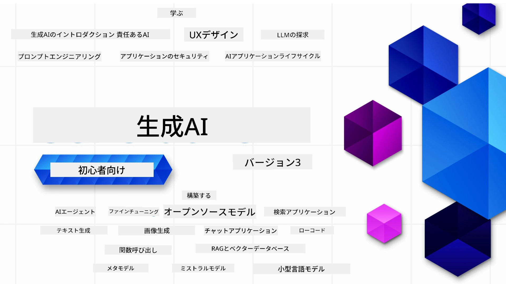

### ジェネレーティブAIアプリケーションを構築するために必要なすべてを教える21のレッスン

[](https://github.com/microsoft/Generative-AI-For-Beginners/blob/master/LICENSE?WT.mc_id=academic-105485-koreyst)
[](https://GitHub.com/microsoft/Generative-AI-For-Beginners/graphs/contributors/?WT.mc_id=academic-105485-koreyst)
[](https://GitHub.com/microsoft/Generative-AI-For-Beginners/issues/?WT.mc_id=academic-105485-koreyst)
[](https://GitHub.com/microsoft/Generative-AI-For-Beginners/pulls/?WT.mc_id=academic-105485-koreyst)
[](http://makeapullrequest.com?WT.mc_id=academic-105485-koreyst)

[](https://GitHub.com/microsoft/Generative-AI-For-Beginners/watchers/?WT.mc_id=academic-105485-koreyst)
[](https://GitHub.com/microsoft/Generative-AI-For-Beginners/network/?WT.mc_id=academic-105485-koreyst)
[](https://GitHub.com/microsoft/Generative-AI-For-Beginners/stargazers/?WT.mc_id=academic-105485-koreyst)

[](https://discord.gg/nTYy5BXMWG)

### 🌐 多言語サポート

#### GitHub Actions経由で対応（自動化＆常に最新）

<!-- CO-OP TRANSLATOR LANGUAGES TABLE START -->
[アラビア語](../ar/README.md) | [ベンガル語](../bn/README.md) | [ブルガリア語](../bg/README.md) | [ビルマ語（ミャンマー）](../my/README.md) | [中国語（簡体字）](../zh-CN/README.md) | [中国語（繁体字、香港）](../zh-HK/README.md) | [中国語（繁体字、マカオ）](../zh-MO/README.md) | [中国語（繁体字、台湾）](../zh-TW/README.md) | [クロアチア語](../hr/README.md) | [チェコ語](../cs/README.md) | [デンマーク語](../da/README.md) | [オランダ語](../nl/README.md) | [エストニア語](../et/README.md) | [フィンランド語](../fi/README.md) | [フランス語](../fr/README.md) | [ドイツ語](../de/README.md) | [ギリシャ語](../el/README.md) | [ヘブライ語](../he/README.md) | [ヒンディー語](../hi/README.md) | [ハンガリー語](../hu/README.md) | [インドネシア語](../id/README.md) | [イタリア語](../it/README.md) | [日本語](./README.md) | [カンナダ語](../kn/README.md) | [韓国語](../ko/README.md) | [リトアニア語](../lt/README.md) | [マレー語](../ms/README.md) | [マラヤーラム語](../ml/README.md) | [マラーティー語](../mr/README.md) | [ネパール語](../ne/README.md) | [ナイジェリア・ピジン語](../pcm/README.md) | [ノルウェー語](../no/README.md) | [ペルシャ語（ファルシー）](../fa/README.md) | [ポーランド語](../pl/README.md) | [ポルトガル語（ブラジル）](../pt-BR/README.md) | [ポルトガル語（ポルトガル）](../pt-PT/README.md) | [パンジャブ語（グルムキー）](../pa/README.md) | [ルーマニア語](../ro/README.md) | [ロシア語](../ru/README.md) | [セルビア語（キリル）](../sr/README.md) | [スロバキア語](../sk/README.md) | [スロベニア語](../sl/README.md) | [スペイン語](../es/README.md) | [スワヒリ語](../sw/README.md) | [スウェーデン語](../sv/README.md) | [タガログ語（フィリピン語）](../tl/README.md) | [タミル語](../ta/README.md) | [テルグ語](../te/README.md) | [タイ語](../th/README.md) | [トルコ語](../tr/README.md) | [ウクライナ語](../uk/README.md) | [ウルドゥー語](../ur/README.md) | [ベトナム語](../vi/README.md)

> **ローカルでクローンを好みますか？**
>
> このリポジトリには50以上の言語翻訳が含まれており、ダウンロードサイズが大幅に増加します。翻訳なしでクローンするには、スパースチェックアウトを使用してください：
>
> **Bash / macOS / Linux:**
> ```bash
> git clone --filter=blob:none --sparse https://github.com/microsoft/generative-ai-for-beginners.git
> cd generative-ai-for-beginners
> git sparse-checkout set --no-cone '/*' '!translations' '!translated_images'
> ```
>
> **CMD (Windows):**
> ```cmd
> git clone --filter=blob:none --sparse https://github.com/microsoft/generative-ai-for-beginners.git
> cd generative-ai-for-beginners
> git sparse-checkout set --no-cone "/*" "!translations" "!translated_images"
> ```
>
> これにより、コースを完了するのに必要なものをすべて、より高速にダウンロードできます。
<!-- CO-OP TRANSLATOR LANGUAGES TABLE END -->

# ジェネレーティブAI初心者向け（バージョン3） - コース

Microsoft Cloud Advocatesによる21レッスンの包括的なコースで、ジェネレーティブAIアプリケーション構築の基本を学びましょう。

## 🌱 はじめに

このコースは21のレッスンで構成されています。各レッスンは独自のトピックを扱っているので、好きなところから始めてください！

レッスンは、「Learn」レッスンとしてジェネレーティブAIの概念を説明するものと、「Build」レッスンとして概念と**Python**および**TypeScript**のコード例を可能な限り示すものに分かれています。

.NET開発者の方は[Generative AI for Beginners (.NET Edition)](https://github.com/microsoft/Generative-AI-for-beginners-dotnet?WT.mc_id=academic-105485-koreyst)もご覧ください！

各レッスンには「Keep Learning」セクションがあり、追加の学習ツールを提供しています。

## 必要なもの
### このコースのコードを実行するには、次のいずれかを利用できます： 
 - [Azure OpenAI Service](https://aka.ms/genai-beginners/azure-open-ai?WT.mc_id=academic-105485-koreyst) - **対象レッスン：** "aoai-assignment"
 - [GitHub Marketplace Model Catalog](https://aka.ms/genai-beginners/gh-models?WT.mc_id=academic-105485-koreyst) - **対象レッスン：** "githubmodels"
 - [OpenAI API](https://aka.ms/genai-beginners/open-ai?WT.mc_id=academic-105485-koreyst) - **対象レッスン：** "oai-assignment" 
   
- PythonまたはTypeScriptの基本知識があると役立ちます - *初心者向けにはこれらの[Python](https://aka.ms/genai-beginners/python?WT.mc_id=academic-105485-koreyst)と[TypeScript](https://aka.ms/genai-beginners/typescript?WT.mc_id=academic-105485-koreyst)コースをご覧ください。
- ご自身のGitHubアカウントに[このリポジトリをフォーク](https://aka.ms/genai-beginners/github?WT.mc_id=academic-105485-koreyst)してください。

開発環境のセットアップをサポートする**[コースセットアップ](./00-course-setup/README.md?WT.mc_id=academic-105485-koreyst)**レッスンも用意しています。

後で見つけやすくするために、このリポジトリに[スター（🌟）を付ける](https://docs.github.com/en/get-started/exploring-projects-on-github/saving-repositories-with-stars?WT.mc_id=academic-105485-koreyst)のもお忘れなく。

## 🧠 配備の準備はできましたか？

より高度なコードサンプルを探している場合は、**Python**および**TypeScript**での[ジェネレーティブAIコードサンプル集](https://aka.ms/genai-beg-code?WT.mc_id=academic-105485-koreyst)をご覧ください。

## 🗣️ 他の学習者と交流、サポートを得る

このコースを受講する他の学習者と交流しサポートを得るには、[公式Azure AI Foundry Discordサーバー](https://aka.ms/genai-discord?WT.mc_id=academic-105485-koreyst)に参加してください。

質問したり製品のフィードバックを共有したりするには、Githubの[Azure AI Foundry Developer Forum](https://aka.ms/azureaifoundry/forum)をご利用ください。

## 🚀 スタートアップ構築中ですか？

[Microsoft for Startups](https://www.microsoft.com/startups)をご覧になり、Azureクレジットでのビルド開始方法を確認しましょう。

## 🙏 ご支援いただけますか？

ご提案やスペル・コードの誤りを見つけたら、[Issueを投稿](https://github.com/microsoft/generative-ai-for-beginners/issues?WT.mc_id=academic-105485-koreyst)するか[プルリクエストを作成](https://github.com/microsoft/generative-ai-for-beginners/pulls?WT.mc_id=academic-105485-koreyst)してください。

## 📂 各レッスンには以下が含まれます：

- トピックの短いビデオ紹介
- README内の書面によるレッスン
- Azure OpenAIおよびOpenAI APIをサポートするPythonとTypeScriptのコードサンプル
- 継続的学習のための追加リソースへのリンク

## 🗃️ レッスン一覧

| #   | **レッスンリンク**                                                                                                                                 | **説明**                                                                                      | **動画**                                                                    | **追加学習**                                                                  |
| --- | ------------------------------------------------------------------------------------------------------------------------------------------------- | -------------------------------------------------------------------------------------------- | --------------------------------------------------------------------------- | ----------------------------------------------------------------------------- |
| 00  | [コースセットアップ](./00-course-setup/README.md?WT.mc_id=academic-105485-koreyst)                                                                | **学習:** 開発環境のセットアップ方法                                                       | ビデオ準備中                                                                     | [さらに学ぶ](https://aka.ms/genai-collection?WT.mc_id=academic-105485-koreyst)  |
| 01  | [ジェネレーティブAIと大規模言語モデル（LLM）の紹介](./01-introduction-to-genai/README.md?WT.mc_id=academic-105485-koreyst)                          | **学習:** ジェネレーティブAIとは何か、大規模言語モデル（LLM）がどう機能するかを理解する     | [ビデオ](https://aka.ms/gen-ai-lesson-1-gh?WT.mc_id=academic-105485-koreyst)  | [さらに学ぶ](https://aka.ms/genai-collection?WT.mc_id=academic-105485-koreyst)  |
| 02  | [さまざまなLLMの探索と比較](./02-exploring-and-comparing-different-llms/README.md?WT.mc_id=academic-105485-koreyst)                                | **学習:** ユースケースに最適なモデルの選び方                                               | [ビデオ](https://aka.ms/gen-ai-lesson2-gh?WT.mc_id=academic-105485-koreyst)   | [さらに学ぶ](https://aka.ms/genai-collection?WT.mc_id=academic-105485-koreyst)  |
| 03  | [ジェネレーティブAIを責任を持って使う](./03-using-generative-ai-responsibly/README.md?WT.mc_id=academic-105485-koreyst)                            | **学習:** ジェネレーティブAIアプリケーションを責任を持って構築する方法                     | [ビデオ](https://aka.ms/gen-ai-lesson3-gh?WT.mc_id=academic-105485-koreyst)   | [さらに学ぶ](https://aka.ms/genai-collection?WT.mc_id=academic-105485-koreyst)  |
| 04  | [プロンプトエンジニアリングの基本を理解する](./04-prompt-engineering-fundamentals/README.md?WT.mc_id=academic-105485-koreyst)             | **学ぶ:** 実践的なプロンプトエンジニアリングのベストプラクティス                                           | [動画](https://aka.ms/gen-ai-lesson4-gh?WT.mc_id=academic-105485-koreyst)  | [詳細はこちら](https://aka.ms/genai-collection?WT.mc_id=academic-105485-koreyst) |
| 05  | [高度なプロンプトの作成](./05-advanced-prompts/README.md?WT.mc_id=academic-105485-koreyst)                                                | **学ぶ:** プロンプトの結果を改善するためのプロンプトエンジニアリング手法の適用方法 | [動画](https://aka.ms/gen-ai-lesson5-gh?WT.mc_id=academic-105485-koreyst)  | [詳細はこちら](https://aka.ms/genai-collection?WT.mc_id=academic-105485-koreyst) |
| 06  | [テキスト生成アプリケーションの構築](./06-text-generation-apps/README.md?WT.mc_id=academic-105485-koreyst)                                | **構築:** Azure OpenAI / OpenAI API を使用したテキスト生成アプリ                                  | [動画](https://aka.ms/gen-ai-lesson6-gh?WT.mc_id=academic-105485-koreyst)  | [詳細はこちら](https://aka.ms/genai-collection?WT.mc_id=academic-105485-koreyst) |
| 07  | [チャットアプリケーションの構築](./07-building-chat-applications/README.md?WT.mc_id=academic-105485-koreyst)                                     | **構築:** 効率的にチャットアプリケーションを構築および統合する手法               | [動画](https://aka.ms/gen-ai-lessons7-gh?WT.mc_id=academic-105485-koreyst) | [詳細はこちら](https://aka.ms/genai-collection?WT.mc_id=academic-105485-koreyst) |
| 08  | [検索アプリケーションとベクトルデータベースの構築](./08-building-search-applications/README.md?WT.mc_id=academic-105485-koreyst)                        | **構築:** 埋め込みを使ってデータを検索する検索アプリケーション                        | [動画](https://aka.ms/gen-ai-lesson8-gh?WT.mc_id=academic-105485-koreyst)  | [詳細はこちら](https://aka.ms/genai-collection?WT.mc_id=academic-105485-koreyst) |
| 09  | [画像生成アプリケーションの構築](./09-building-image-applications/README.md?WT.mc_id=academic-105485-koreyst)                        | **構築:** 画像生成アプリケーション                                                       | [動画](https://aka.ms/gen-ai-lesson9-gh?WT.mc_id=academic-105485-koreyst)  | [詳細はこちら](https://aka.ms/genai-collection?WT.mc_id=academic-105485-koreyst) |
| 10  | [ローコードAIアプリケーションの構築](./10-building-low-code-ai-applications/README.md?WT.mc_id=academic-105485-koreyst)                       | **構築:** ローコードツールを使った生成AIアプリケーション                                     | [動画](https://aka.ms/gen-ai-lesson10-gh?WT.mc_id=academic-105485-koreyst) | [詳細はこちら](https://aka.ms/genai-collection?WT.mc_id=academic-105485-koreyst) |
| 11  | [関数呼び出しと外部アプリケーションの統合](./11-integrating-with-function-calling/README.md?WT.mc_id=academic-105485-koreyst) | **構築:** 関数呼び出しとは何か、アプリケーションでのユースケース                          | [動画](https://aka.ms/gen-ai-lesson11-gh?WT.mc_id=academic-105485-koreyst) | [詳細はこちら](https://aka.ms/genai-collection?WT.mc_id=academic-105485-koreyst) |
| 12  | [AIアプリケーションのUX設計](./12-designing-ux-for-ai-applications/README.md?WT.mc_id=academic-105485-koreyst)                         | **学ぶ:** 生成AIアプリケーション開発時に活用するUX設計の原則         | [動画](https://aka.ms/gen-ai-lesson12-gh?WT.mc_id=academic-105485-koreyst) | [詳細はこちら](https://aka.ms/genai-collection?WT.mc_id=academic-105485-koreyst) |
| 13  | [生成AIアプリケーションのセキュリティ](./13-securing-ai-applications/README.md?WT.mc_id=academic-105485-koreyst)                         | **学ぶ:** AIシステムに対する脅威とリスク、それらを保護する方法             | [動画](https://aka.ms/gen-ai-lesson13-gh?WT.mc_id=academic-105485-koreyst) | [詳細はこちら](https://aka.ms/genai-collection?WT.mc_id=academic-105485-koreyst) |
| 14  | [生成AIアプリケーションのライフサイクル](./14-the-generative-ai-application-lifecycle/README.md?WT.mc_id=academic-105485-koreyst)           | **学ぶ:** LLMのライフサイクル管理やLLMOpsに関するツールと指標                         | [動画](https://aka.ms/gen-ai-lesson14-gh?WT.mc_id=academic-105485-koreyst) | [詳細はこちら](https://aka.ms/genai-collection?WT.mc_id=academic-105485-koreyst) |
| 15  | [検索強化生成（RAG）とベクトルデータベース](./15-rag-and-vector-databases/README.md?WT.mc_id=academic-105485-koreyst)        | **構築:** RAGフレームワークを使用し、ベクトルデータベースから埋め込みを取得するアプリケーション  | [動画](https://aka.ms/gen-ai-lesson15-gh?WT.mc_id=academic-105485-koreyst) | [詳細はこちら](https://aka.ms/genai-collection?WT.mc_id=academic-105485-koreyst) |
| 16  | [オープンソースモデルとHugging Face](./16-open-source-models/README.md?WT.mc_id=academic-105485-koreyst)                                    | **構築:** Hugging Faceで利用可能なオープンソースモデルを使ったアプリケーション                    | [動画](https://aka.ms/gen-ai-lesson16-gh?WT.mc_id=academic-105485-koreyst) | [詳細はこちら](https://aka.ms/genai-collection?WT.mc_id=academic-105485-koreyst) |
| 17  | [AIエージェント](./17-ai-agents/README.md?WT.mc_id=academic-105485-koreyst)                                                                       | **構築:** AIエージェントフレームワークを活用したアプリケーション                                           | [動画](https://aka.ms/gen-ai-lesson17-gh?WT.mc_id=academic-105485-koreyst) | [詳細はこちら](https://aka.ms/genai-collection?WT.mc_id=academic-105485-koreyst) |
| 18  | [LLMのファインチューニング](./18-fine-tuning/README.md?WT.mc_id=academic-105485-koreyst)                                                              | **学ぶ:** LLMのファインチューニングの内容、理由と方法                                            | [動画](https://aka.ms/gen-ai-lesson18-gh?WT.mc_id=academic-105485-koreyst) | [詳細はこちら](https://aka.ms/genai-collection?WT.mc_id=academic-105485-koreyst) |
| 19  | [SLMでの構築](./19-slm/README.md?WT.mc_id=academic-105485-koreyst)                                                              | **学ぶ:** Small Language Modelsで構築するメリット                                            | 動画準備中 | [詳細はこちら](https://aka.ms/genai-collection?WT.mc_id=academic-105485-koreyst) |
| 20  | [Mistralモデルでの構築](./20-mistral/README.md?WT.mc_id=academic-105485-koreyst)                                                              | **学ぶ:** Mistralファミリーモデルの特徴と違い                                           | 動画準備中 | [詳細はこちら](https://aka.ms/genai-collection?WT.mc_id=academic-105485-koreyst) |
| 21  | [Metaモデルでの構築](./21-meta/README.md?WT.mc_id=academic-105485-koreyst)                                                              | **学ぶ:** Metaファミリーモデルの特徴と違い                                           | 動画準備中 | [詳細はこちら](https://aka.ms/genai-collection?WT.mc_id=academic-105485-koreyst) |

### 🌟 特別な感謝

すべてのGitHub Actionsとワークフローの作成にあたり、[**John Aziz**](https://www.linkedin.com/in/john0isaac/)に特別な感謝を。

各レッスンの学習者体験とコード体験を向上させる重要な貢献をしてくださった[**Bernhard Merkle**](https://www.linkedin.com/in/bernhard-merkle-738b73/)にも感謝いたします。

## 🎒 その他のコース

当チームでは他のコースも制作しています！ぜひご覧ください：

<!-- CO-OP TRANSLATOR OTHER COURSES START -->
### LangChain
[](https://aka.ms/langchain4j-for-beginners)
[](https://aka.ms/langchainjs-for-beginners?WT.mc_id=m365-94501-dwahlin)
[](https://github.com/microsoft/langchain-for-beginners?WT.mc_id=m365-94501-dwahlin)
---

### Azure / Edge / MCP / Agents
[](https://github.com/microsoft/AZD-for-beginners?WT.mc_id=academic-105485-koreyst)
[](https://github.com/microsoft/edgeai-for-beginners?WT.mc_id=academic-105485-koreyst)
[](https://github.com/microsoft/mcp-for-beginners?WT.mc_id=academic-105485-koreyst)
[](https://github.com/microsoft/ai-agents-for-beginners?WT.mc_id=academic-105485-koreyst)

---
 
### 生成AIシリーズ
[](https://github.com/microsoft/generative-ai-for-beginners?WT.mc_id=academic-105485-koreyst)
[-9333EA?style=for-the-badge&labelColor=E5E7EB&color=9333EA)](https://github.com/microsoft/Generative-AI-for-beginners-dotnet?WT.mc_id=academic-105485-koreyst)
[-C084FC?style=for-the-badge&labelColor=E5E7EB&color=C084FC)](https://github.com/microsoft/generative-ai-for-beginners-java?WT.mc_id=academic-105485-koreyst)
[-E879F9?style=for-the-badge&labelColor=E5E7EB&color=E879F9)](https://github.com/microsoft/generative-ai-with-javascript?WT.mc_id=academic-105485-koreyst)

---

### コア学習
[](https://aka.ms/ml-beginners?WT.mc_id=academic-105485-koreyst)
[](https://aka.ms/datascience-beginners?WT.mc_id=academic-105485-koreyst)
[](https://aka.ms/ai-beginners?WT.mc_id=academic-105485-koreyst)
[](https://github.com/microsoft/Security-101?WT.mc_id=academic-96948-sayoung)
[](https://aka.ms/webdev-beginners?WT.mc_id=academic-105485-koreyst)
[](https://aka.ms/iot-beginners?WT.mc_id=academic-105485-koreyst)
[](https://github.com/microsoft/xr-development-for-beginners?WT.mc_id=academic-105485-koreyst)

---

### コパイロットシリーズ
[](https://aka.ms/GitHubCopilotAI?WT.mc_id=academic-105485-koreyst)
[](https://github.com/microsoft/mastering-github-copilot-for-dotnet-csharp-developers?WT.mc_id=academic-105485-koreyst)
[](https://github.com/microsoft/CopilotAdventures?WT.mc_id=academic-105485-koreyst)
<!-- CO-OP TRANSLATOR OTHER COURSES END -->

## ヘルプを得る

AIアプリ構築で詰まったり質問がある場合は、他の学習者や経験豊富な開発者とMCPのディスカッションに参加してください。質問が歓迎されており、知識が自由に共有される支援的なコミュニティです。

[](https://discord.gg/nTYy5BXMWG)

製品のフィードバックや構築中のエラーがある場合は、以下をご利用ください：

[](https://aka.ms/foundry/forum)

---

<!-- CO-OP TRANSLATOR DISCLAIMER START -->
**免責事項**：  
本書類はAI翻訳サービス[Co-op Translator](https://github.com/Azure/co-op-translator)を使用して翻訳されました。正確性の向上に努めておりますが、自動翻訳には誤りや不正確な部分が含まれる可能性があることをご承知おきください。原文の言語による文書が正式な情報源とみなされます。重要な情報につきましては、専門の人間翻訳を推奨いたします。本翻訳の利用により生じた誤解や誤訳について、一切の責任を負いかねます。
<!-- CO-OP TRANSLATOR DISCLAIMER END -->