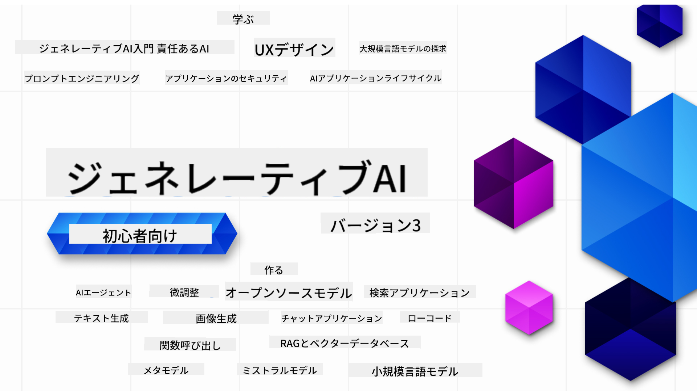

<!--
CO_OP_TRANSLATOR_METADATA:
{
  "original_hash": "6e3f4c8a4f323b8eab1cf11ded304b0f",
  "translation_date": "2025-06-25T07:42:55+00:00",
  "source_file": "README.md",
  "language_code": "ja"
}
-->

### ジェネレーティブAIアプリケーションの構築を始めるために必要なすべてを教える21のレッスン

### 🌐 多言語サポート

#### GitHub Actionを通じてサポート（自動化され常に最新）

# 初心者向け生成AI（バージョン3） - コース

Microsoft Cloud Advocatesによる21のレッスンで構成された包括的なコースで、生成AIアプリケーションの基礎を学びましょう。

## 🌱 はじめに

このコースは21のレッスンで構成されています。各レッスンはそれぞれのトピックを扱っているので、好きなところから始めてください！

レッスンは、「Learn」レッスンとして生成AIの概念を説明するものと、「Build」レッスンとして概念とコード例を**Python**と**TypeScript**で説明するものに分類されています。

.NET開発者の方は[初心者向け生成AI（.NET版）](https://github.com/microsoft/Generative-AI-for-beginners-dotnet?WT.mc_id=academic-105485-koreyst)をご覧ください！

各レッスンには追加の学習ツールを含む「Keep Learning」セクションもあります。

## 必要なもの
### このコースのコードを実行するには、以下のいずれかを使用できます：
 - [Azure OpenAI Service](https://aka.ms/genai-beginners/azure-open-ai?WT.mc_id=academic-105485-koreyst) - **レッスン:** "aoai-assignment"
 - [GitHub Marketplace Model Catalog](https://aka.ms/genai-beginners/gh-models?WT.mc_id=academic-105485-koreyst) - **レッスン:** "githubmodels"
 - [OpenAI API](https://aka.ms/genai-beginners/open-ai?WT.mc_id=academic-105485-koreyst) - **レッスン:** "oai-assignment" 

- PythonまたはTypeScriptの基本的な知識があると役立ちます - \*初心者の方はこれらの[Python](https://aka.ms/genai-beginners/python?WT.mc_id=academic-105485-koreyst)と[TypeScript](https://aka.ms/genai-beginners/typescript?WT.mc_id=academic-105485-koreyst)コースをご覧ください
- [このリポジトリ全体をフォークする](https://aka.ms/genai-beginners/github?WT.mc_id=academic-105485-koreyst)ためのGitHubアカウント

開発環境の設定を支援するために、**[Course Setup](./00-course-setup/README.md?WT.mc_id=academic-105485-koreyst)**レッスンを作成しました。

後で見つけやすくするために[このリポジトリをスター（🌟）する](https://docs.github.com/en/get-started/exploring-projects-on-github/saving-repositories-with-stars?WT.mc_id=academic-105485-koreyst)ことを忘れないでください。

## 🧠 デプロイ準備完了？

より高度なコードサンプルを探している場合は、**Python**と**TypeScript**の両方で提供されている[生成AIコードサンプルのコレクション](https://aka.ms/genai-beg-code?WT.mc_id=academic-105485-koreyst)をご覧ください。

## 🗣️ 他の学習者に会い、サポートを受ける

このコースを受講している他の学習者と出会い、ネットワークを築くために、[公式Azure AI Foundry Discordサーバー](https://aka.ms/genai-discord?WT.mc_id=academic-105485-koreyst)に参加してください。

質問をしたり、製品のフィードバックを共有するには、Githubの[Azure AI Foundry Developer Forum](https://aka.ms/azureaifoundry/forum)をご利用ください。

## 🚀 スタートアップを立ち上げる？

[Microsoft for Startups Founders Hub](https://aka.ms/genai-foundershub?WT.mc_id=academic-105485-koreyst)に登録して、**無料のOpenAIクレジット**と**Azure OpenAI Servicesを通じてOpenAIモデルにアクセスするためのAzureクレジット最大$150k**を受け取ることができます。

## 🙏 手伝いたいですか？

提案やスペルミス、コードエラーを見つけた場合は、[問題を報告する](https://github.com/microsoft/generative-ai-for-beginners/issues?WT.mc_id=academic-105485-koreyst)か、[プルリクエストを作成する](https://github.com/microsoft/generative-ai-for-beginners/pulls?WT.mc_id=academic-105485-koreyst)ことができます。

## 📂 各レッスンには以下が含まれています：

- トピックの短いビデオ紹介
- READMEに記載されたレッスン
- Azure OpenAIとOpenAI APIをサポートするPythonとTypeScriptのコードサンプル
- 学習を続けるための追加リソースへのリンク

## 🗃️ レッスン

| #   | **レッスンリンク**                                                                                                                              | **説明**                                                                                 | **ビデオ**                                                                   | **追加学習**                                                             |
| --- | -------------------------------------------------------------------------------------------------------------------------------------------- | ----------------------------------------------------------------------------------------------- | --------------------------------------------------------------------------- | ------------------------------------------------------------------------------ |
| 00  | [Course Setup](./00-course-setup/README.md?WT.mc_id=academic-105485-koreyst)                                                                 | **Learn:** 開発環境の設定方法                                            | ビデオ近日公開                                                                 | [Learn More](https://aka.ms/genai-collection?WT.mc_id=academic-105485-koreyst) |
| 01  | [Introduction to Generative AI and LLMs](./01-introduction-to-genai/README.md?WT.mc_id=academic-105485-koreyst)                              | **Learn:** 生成AIとは何か、大規模言語モデル（LLM）がどのように機能するかを理解する       | [ビデオ](https://aka.ms/gen-ai-lesson-1-gh?WT.mc_id=academic-105485-koreyst) | [Learn More](https://aka.ms/genai-collection?WT.mc_id=academic-105485-koreyst) |
| 02  | [Exploring and comparing different LLMs](./02-exploring-and-comparing-different-llms/README.md?WT.mc_id=academic-105485-koreyst)             | **Learn:** 使用例に適したモデルの選び方                                      | [ビデオ](https://aka.ms/gen-ai-lesson2-gh?WT.mc_id=academic-105485-koreyst)  | [Learn More](https://aka.ms/genai-collection?WT.mc_id=academic-105485-koreyst) |
| 03  | [Using Generative AI Responsibly](./03-using-generative-ai-responsibly/README.md?WT.mc_id=academic-105485-koreyst)                           | **Learn:** 生成AIアプリケーションを責任を持って構築する方法                                  | [ビデオ](https://aka.ms/gen-ai-lesson3-gh?WT.mc_id=academic-105485-koreyst)  | [Learn More](https://aka.ms/genai-collection?WT.mc_id=academic-105485-koreyst) |
| 04  | [Understanding Prompt Engineering Fundamentals](./04-prompt-engineering-fundamentals/README.md?WT.mc_id=academic-105485-koreyst)             | **Learn:** 実践的なプロンプトエンジニアリングのベストプラクティス                                           | [ビデオ](https://aka.ms/gen-ai-lesson4-gh?WT.mc_id=academic-105485-koreyst)  | [Learn More](https://aka.ms/genai-collection?WT.mc_id=academic-105485-koreyst) |
| 05  | [高度なプロンプトの作成](./05-advanced-prompts/README.md?WT.mc_id=academic-105485-koreyst)                                               | **学ぶ:** プロンプトの結果を改善するプロンプトエンジニアリング技術の適用方法 | [ビデオ](https://aka.ms/gen-ai-lesson5-gh?WT.mc_id=academic-105485-koreyst)  | [詳細はこちら](https://aka.ms/genai-collection?WT.mc_id=academic-105485-koreyst) |
| 06  | [テキスト生成アプリケーションの構築](./06-text-generation-apps/README.md?WT.mc_id=academic-105485-koreyst)                             | **構築:** Azure OpenAI / OpenAI APIを使用したテキスト生成アプリ                                | [ビデオ](https://aka.ms/gen-ai-lesson6-gh?WT.mc_id=academic-105485-koreyst)  | [詳細はこちら](https://aka.ms/genai-collection?WT.mc_id=academic-105485-koreyst) |
| 07  | [チャットアプリケーションの構築](./07-building-chat-applications/README.md?WT.mc_id=academic-105485-koreyst)                            | **構築:** 効率的にチャットアプリを構築し統合する技術                                         | [ビデオ](https://aka.ms/gen-ai-lessons7-gh?WT.mc_id=academic-105485-koreyst) | [詳細はこちら](https://aka.ms/genai-collection?WT.mc_id=academic-105485-koreyst) |
| 08  | [検索アプリとベクトルデータベースの構築](./08-building-search-applications/README.md?WT.mc_id=academic-105485-koreyst)                 | **構築:** 埋め込みを使用してデータを検索する検索アプリ                                       | [ビデオ](https://aka.ms/gen-ai-lesson8-gh?WT.mc_id=academic-105485-koreyst)  | [詳細はこちら](https://aka.ms/genai-collection?WT.mc_id=academic-105485-koreyst) |
| 09  | [画像生成アプリケーションの構築](./09-building-image-applications/README.md?WT.mc_id=academic-105485-koreyst)                           | **構築:** 画像生成アプリ                                                                       | [ビデオ](https://aka.ms/gen-ai-lesson9-gh?WT.mc_id=academic-105485-koreyst)  | [詳細はこちら](https://aka.ms/genai-collection?WT.mc_id=academic-105485-koreyst) |
| 10  | [ローコードAIアプリケーションの構築](./10-building-low-code-ai-applications/README.md?WT.mc_id=academic-105485-koreyst)                | **構築:** ローコードツールを使用した生成AIアプリケーション                                    | [ビデオ](https://aka.ms/gen-ai-lesson10-gh?WT.mc_id=academic-105485-koreyst) | [詳細はこちら](https://aka.ms/genai-collection?WT.mc_id=academic-105485-koreyst) |
| 11  | [関数呼び出しによる外部アプリケーションの統合](./11-integrating-with-function-calling/README.md?WT.mc_id=academic-105485-koreyst)       | **構築:** 関数呼び出しとは何か、アプリケーションでの使用例                                    | [ビデオ](https://aka.ms/gen-ai-lesson11-gh?WT.mc_id=academic-105485-koreyst) | [詳細はこちら](https://aka.ms/genai-collection?WT.mc_id=academic-105485-koreyst) |
| 12  | [AIアプリケーションのためのUX設計](./12-designing-ux-for-ai-applications/README.md?WT.mc_id=academic-105485-koreyst)                    | **学ぶ:** 生成AIアプリケーションを開発する際のUXデザイン原則の適用方法                        | [ビデオ](https://aka.ms/gen-ai-lesson12-gh?WT.mc_id=academic-105485-koreyst) | [詳細はこちら](https://aka.ms/genai-collection?WT.mc_id=academic-105485-koreyst) |
| 13  | [生成AIアプリケーションのセキュリティ確保](./13-securing-ai-applications/README.md?WT.mc_id=academic-105485-koreyst)                    | **学ぶ:** AIシステムへの脅威とリスク、およびこれらのシステムを保護する方法                    | [ビデオ](https://aka.ms/gen-ai-lesson13-gh?WT.mc_id=academic-105485-koreyst) | [詳細はこちら](https://aka.ms/genai-collection?WT.mc_id=academic-105485-koreyst) |
| 14  | [生成AIアプリケーションのライフサイクル](./14-the-generative-ai-application-lifecycle/README.md?WT.mc_id=academic-105485-koreyst)       | **学ぶ:** LLMライフサイクルとLLMOpsを管理するためのツールと指標                               | [ビデオ](https://aka.ms/gen-ai-lesson14-gh?WT.mc_id=academic-105485-koreyst) | [詳細はこちら](https://aka.ms/genai-collection?WT.mc_id=academic-105485-koreyst) |
| 15  | [Retrieval Augmented Generation (RAG)とベクターデータベース](./15-rag-and-vector-databases/README.md?WT.mc_id=academic-105485-koreyst)        | **構築:** ベクターデータベースから埋め込みを取得するためのRAGフレームワークを使用したアプリケーション  | [ビデオ](https://aka.ms/gen-ai-lesson15-gh?WT.mc_id=academic-105485-koreyst) | [詳細はこちら](https://aka.ms/genai-collection?WT.mc_id=academic-105485-koreyst) |
| 16  | [オープンソースモデルとHugging Face](./16-open-source-models/README.md?WT.mc_id=academic-105485-koreyst)                                    | **構築:** Hugging Faceで利用可能なオープンソースモデルを使用したアプリケーション                    | [ビデオ](https://aka.ms/gen-ai-lesson16-gh?WT.mc_id=academic-105485-koreyst) | [詳細はこちら](https://aka.ms/genai-collection?WT.mc_id=academic-105485-koreyst) |
| 17  | [AIエージェント](./17-ai-agents/README.md?WT.mc_id=academic-105485-koreyst)                                                                       | **構築:** AIエージェントフレームワークを使用したアプリケーション                                           | [ビデオ](https://aka.ms/gen-ai-lesson17-gh?WT.mc_id=academic-105485-koreyst) | [詳細はこちら](https://aka.ms/genai-collection?WT.mc_id=academic-105485-koreyst) |
| 18  | [LLMsのファインチューニング](./18-fine-tuning/README.md?WT.mc_id=academic-105485-koreyst)                                                              | **学習:** LLMsのファインチューニングの概要、理由、方法                                            | [ビデオ](https://aka.ms/gen-ai-lesson18-gh?WT.mc_id=academic-105485-koreyst) | [詳細はこちら](https://aka.ms/genai-collection?WT.mc_id=academic-105485-koreyst) |
| 19  | [SLMsを使った構築](./19-slm/README.md?WT.mc_id=academic-105485-koreyst)                                                              | **学習:** 小型言語モデルを使用した構築の利点                                            | ビデオ近日公開 | [詳細はこちら](https://aka.ms/genai-collection?WT.mc_id=academic-105485-koreyst) |
| 20  | [Mistralモデルを使った構築](./20-mistral/README.md?WT.mc_id=academic-105485-koreyst)                                                              | **学習:** Mistralファミリーモデルの特徴と違い                                           | ビデオ近日公開 | [詳細はこちら](https://aka.ms/genai-collection?WT.mc_id=academic-105485-koreyst) |
| 21  | [Metaモデルを使った構築](./21-meta/README.md?WT.mc_id=academic-105485-koreyst)                                                              | **学習:** Metaファミリーモデルの特徴と違い                                           | ビデオ近日公開 | [詳細はこちら](https://aka.ms/genai-collection?WT.mc_id=academic-105485-koreyst) |

### 🌟 特別な感謝

GitHub Actionsとワークフローを作成してくれた[**John Aziz**](https://www.linkedin.com/in/john0isaac/)に特別な感謝を。

学習者とコードの体験を向上させるために各レッスンに重要な貢献をしてくれた[**Bernhard Merkle**](https://www.linkedin.com/in/bernhard-merkle-738b73/)に感謝します。

## 🎒 他のコース

私たちのチームは他のコースも提供しています！ぜひご覧ください：

- [**NEW** 初心者向けモデルコンテキストプロトコル](https://github.com/microsoft/mcp-for-beginners?WT.mc_id=academic-105485-koreyst)
- [初心者向けAIエージェント](https://github.com/microsoft/ai-agents-for-beginners?WT.mc_id=academic-105485-koreyst)
- [.NETを使用した初心者向け生成AI](https://github.com/microsoft/Generative-AI-for-beginners-dotnet?WT.mc_id=academic-105485-koreyst)
- [JavaScriptを使用した初心者向け生成AI](https://aka.ms/genai-js-course?WT.mc_id=academic-105485-koreyst)
- [初心者向け機械学習](https://aka.ms/ml-beginners?WT.mc_id=academic-105485-koreyst)
- [初心者向けデータサイエンス](https://aka.ms/datascience-beginners?WT.mc_id=academic-105485-koreyst)
- [初心者向けAI](https://aka.ms/ai-beginners?WT.mc_id=academic-105485-koreyst)
- [初心者向けサイバーセキュリティ](https://github.com/microsoft/Security-101??WT.mc_id=academic-96948-sayoung)
- [初心者向けWeb開発](https://aka.ms/webdev-beginners?WT.mc_id=academic-105485-koreyst)
- [初心者向けIoT](https://aka.ms/iot-beginners?WT.mc_id=academic-105485-koreyst)
- [初心者向けXR開発](https://github.com/microsoft/xr-development-for-beginners?WT.mc_id=academic-105485-koreyst)
- [AIペアプログラミングのためのGitHub Copilot習得](https://aka.ms/GitHubCopilotAI?WT.mc_id=academic-105485-koreyst)
- [C#/.NET開発者向けGitHub Copilot習得](https://github.com/microsoft/mastering-github-copilot-for-dotnet-csharp-developers?WT.mc_id=academic-105485-koreyst)
- [自分で選ぶCopilotアドベンチャー](https://github.com/microsoft/CopilotAdventures?WT.mc_id=academic-105485-koreyst)

**免責事項**:
この文書はAI翻訳サービス[Co-op Translator](https://github.com/Azure/co-op-translator)を使用して翻訳されています。正確性を追求していますが、自動翻訳には誤りや不正確さが含まれる可能性があることにご注意ください。原文がその言語での正式な情報源と見なされるべきです。重要な情報については、専門の人間による翻訳をお勧めします。この翻訳の使用によって生じる誤解や誤訳に関して、当社は責任を負いません。